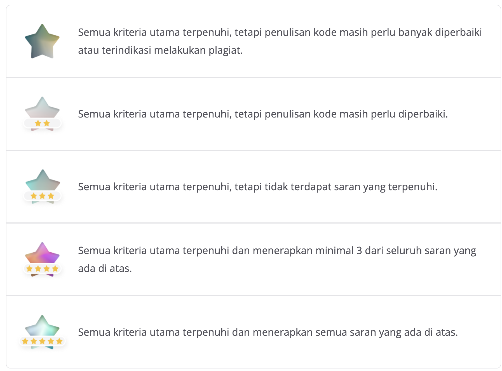

Submission Anda akan dinilai oleh reviewer dengan skala 1–5 berdasarkan dari parameter yang ada. Anda dapat menerapkan beberapa saran untuk mendapatkan nilai tinggi. Berikut sarannya.

Menggunakan algoritma deep learning.
Akurasi pada training set dan testing set di atas 92%. 
Dataset yang digunakan untuk melatih model minimal memiliki tiga kelas.
Memiliki jumlah data minimal 10.000 sampel data.
Melakukan 3 percobaan skema pelatihan yang berbeda. Skema ini dapat dibedakan dari variasi algoritma pelatihan, metode ekstraksi fitur, pelabelan, dan pembagian data dengan memilih minimal 2 kombinasi.
Catatan:
Jika Anda tidak menerapkan saran kedua, pastikan ketiga percobaan skema pelatihan yang dilakukan memiliki akurasi testing set minimal 85%. Lalu jika Anda mencoba lebih dari tiga skema pelatihan, pastikan setidaknya ketiga percobaan di antaranya memiliki akurasi testing set minimal 85%.
Jika Anda juga ingin menerapkan saran kedua, pastikan percobaan pelatihan yang dilakukan memiliki akurasi pada training set dan testing set di atas 92%. Lalu jika Anda mencoba lebih dari tiga skema pelatihan, pastikan setidaknya salah satu percobaan di antaranya memiliki akurasi pada training set dan testing set di atas 92% dan sisanya 85%.
Berikut contoh dari 3 percobaan skema pelatihan dengan adanya 2 kombinasi yang berbeda.
Pelatihan: SVM,    Ekstraksi Fitur: TF-IDF,    Pembagian Data: 80/20
Pelatihan: RF,    Ekstraksi Fitur: Word2Vec,    Pembagian Data: 80/20
Pelatihan: RF,    Ekstraksi Fitur: TF-IDF,    Pembagian Data: 70/30    
Melakukan inference atau testing dalam file .ipynb atau .py yang menghasilkan output berupa kelas kategorikal (contoh: negatif, netral, dan positif).
Pastikan menyertakan bukti inferensi baik itu dalam bentuk screenshot atau output pada notebook
Berikut adalah detail penilaian submission:

Catatan: Jika submission Anda ditolak, tidak ada penilaian. Kriteria penilaian bintang di atas hanya berlaku jika submission Anda lulus.