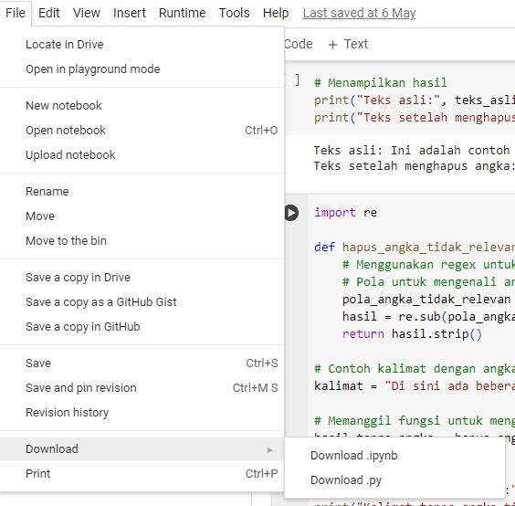

Tips
Untuk membuat file requirements.txt terdapat beberapa cara salah satunya menggunakan pip freeze atau pipreqs. Berikut cara penggunaan dan perbedaannya.
pip freeze
pip freeze menghasilkan daftar semua library Python yang diinstal di lingkungan saat ini beserta versinya.
 pip freeze requirements.txt
pipreqs
pipreqs menghasilkan file requirements.txt yang hanya mencantumkan library yang digunakan dalam proyek berdasarkan impor yang ada dalam file kode.
pipreqs /path/to/your/project
Tentunya kedua cara tersebut memiliki kelebihan dan kekurangan, untuk mengetahui lebih lengkap terkait freeze dan pipreqs Anda dapat membaca di tautan berikut: Ternyata Mengelola Dependensi Proyek Python Semudah Ini, lo!.
Untuk export project yang Anda kerjakan di Colaboratory sebagai berkas ipynb, klik tombol file yang berada di pojok kiri atas Colaboratory dan pilih download .ipynb serta download .py.

Resources
Untuk analisis sentimen, platform yang kaya dengan opini dan ulasan sangat ideal. Berikut adalah beberapa sumber platform yang dapat di-scraping untuk tujuan analisis sentimen.

Media Sosial

X/Twitter: Platform ini sangat kaya dengan opini pengguna yang sering diperbarui. Data tweet, retweet, dan hashtag dapat digunakan untuk menganalisis sentimen dalam berbagai topik.

Facebook: Komentar dan posting di halaman publik atau grup dapat memberikan wawasan tentang sentimen pengguna.

Instagram: Analisis sentimen dapat dilakukan melalui komentar pada posting dan caption pengguna.

Platform Ulasan Produk

Amazon: Ulasan produk memberikan banyak data yang berguna untuk analisis sentimen tentang berbagai produk.

Tokopedia: Ulasan dan rating produk dalam platform e-commerce Indonesia.

Shopee: Ulasan dan rating produk dari pengguna di Asia Tenggara.

Female Daily: Ulasan produk kecantikan dan perawatan kulit, serta diskusi di forum yang kaya dengan opini pengguna.

Google Play Store: Ulasan aplikasi dan game, memberikan data sentimen tentang performa, bug, dan fitur aplikasi.

Situs Ulasan dan Direktori

Yelp: Ulasan restoran, toko, dan layanan lokal yang memberikan banyak opini pengguna.

TripAdvisor: Ulasan tentang destinasi wisata, hotel, dan restoran.

Google Reviews: Ulasan dari berbagai layanan dan produk yang diposting oleh pengguna.

Portal Lowongan Kerja dan Ulasan Perusahaan

Glassdoor: Ulasan perusahaan, budaya kerja, dan gaji dari karyawan.

Indeed: Ulasan perusahaan dan pengalaman kerja dari karyawan.

Forum Online

Stack Overflow: Diskusi dan komentar mengenai berbagai topik pemrograman yang dapat memberikan pandangan sentimen tentang teknologi atau bahasa pemrograman tertentu.

Quora: Jawaban dan komentar tentang berbagai topik yang dapat dianalisis untuk sentimen.

Platform Konten Video

YouTube: Komentar pada video bisa memberikan data sentimen tentang berbagai topik yang dibahas dalam video tersebut.

Situs Berita dan Blog

BBC, CNN, Reuters, Kompas: Komentar pada artikel berita bisa digunakan untuk menganalisis sentimen publik terhadap berbagai peristiwa.

Medium: Komentar pada artikel blog untuk mengukur sentimen tentang topik yang dibahas.

Submission yang Tidak Sesuai Kriteria
Jika tidak sesuai dengan kriteria, submission Anda akan ditolak oleh reviewer. Berikut poin-poinnya.

Tidak melampirkan kode dan proses data scraping.
Akurasi dari model Anda di bawah 85%.
Tidak melampirkan 4 file kriteria utama yang tertera pada tab “Ketentuan Berkas Submission”.
Menggunakan data yang sudah tersedia pada open source.

Ketentuan Proses Review
Beberapa hal yang perlu Anda ketahui mengenai proses review.

Tim penilai akan mengulas submission Anda dalam waktu selambatnya 3 hari kerja, tidak termasuk hari Sabtu, Minggu, dan libur nasional.
Tidak disarankan untuk melakukan submit berkali-kali karena akan memperlama proses penilaian yang dilakukan tim penilai.
Anda akan mendapat notifikasi hasil pengumpulan submission via email atau dapat mengecek status submission pada akun Dicoding.