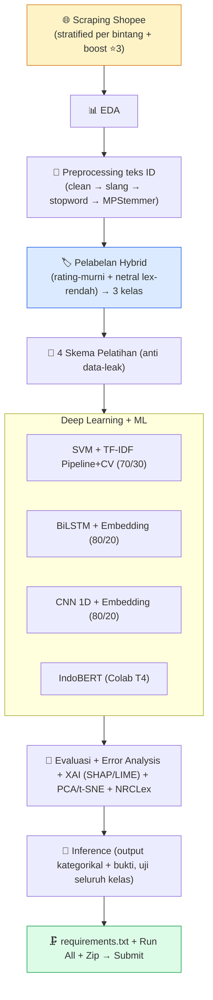

# 📋 Checklist Pengerjaan — Proyek Analisis Sentimen

### Deep Learning · Ulasan **Shopee** (Google Play Store) · submission utk **Bimo Bramantyo**

DICODING · Fundamental Deep Learning
Target: ⭐⭐⭐⭐⭐
Level: AMBISIUS (semua saran reviewer)

_Centang `- [ ]` → `- [x]` tiap item selesai. Buka pakai **Markdown Preview Enhanced**._

---

## 🧭 Cara Pakai

> 1. Kerjakan **berurutan Tahap 0 → 8**. Tiap tahap tuntas dulu sebelum lanjut.
> 2. **Kriteria Utama = wajib** (kalau tidak → submission **ditolak**, tanpa nilai).
> 3. **Saran 1–6 + saran tambahan reviewer** = target **SEMUA** → ⭐⭐⭐⭐⭐ dengan kode matang.
> 4. Notebook `.ipynb` **wajib sudah di-run** (semua output ter-embed, tanpa error).

### 🏷️ Skala Bintang

| Bintang | Syarat |
| :---: | :--- |
| ⭐ | Kriteria utama penuh, tapi kode banyak diperbaiki / terindikasi plagiat |
| ⭐⭐ | Kriteria utama penuh, tapi kode perlu diperbaiki |
| ⭐⭐⭐ | Kriteria utama penuh, tanpa saran diterapkan |
| ⭐⭐⭐⭐ | Kriteria utama penuh + **min 3 saran** |
| ⭐⭐⭐⭐⭐ | Kriteria utama penuh + **SEMUA saran** ✅ _← TARGET_ |

---

## 🎯 Keputusan Proyek (dikunci)

| Aspek | Pilihan |
| :--- | :--- |
| 🎬 Tema | Sentimen **Shopee** (`com.shopee.id`) — momen: kenaikan biaya Gratis Ongkir XTRA 2 Mei 2026 + gangguan teknis |
| 🌐 Sumber data | Google Play Store — `google-play-scraper` (lang=id, country=id) |
| ⚖️ Strategi scrape | **Stratified per bintang**, ⭐3 di-boost — target `{1:12rb, 2:8rb, 3:15rb, 4:8rb, 5:12rb}` ≈ 55rb (rating ~4,5) |
| 🏷️ Pelabelan | **Hybrid**: rating murni (⭐1 neg, ⭐5 pos, buang ⭐2 & ⭐4) + netral ⭐3 lex-rendah (net-weight InSet) |
| 🧠 Skema | SVM+TF-IDF (Pipeline+CV) · BiLSTM · CNN · IndoBERT |
| 🖥️ Device | Windows lokal (skema 1-3 + pipeline) · **Google Colab GPU T4** (IndoBERT) |
| 🐍 Python mgr | **uv** + venv `.venv/` + Python 3.10.x |
| 🆕 Saran reviewer | MPStemmer · Pipeline · CV · anti-leak · Error Analysis · SHAP/LIME · PCA/t-SNE · NRCLex · augment · docstring |

---

## 🗺️ Peta Alur

---

## 📊 Dashboard Progres

| Tahap | Nama | Status |
| :-: | :--- | :-: |
| 0 | Perencanaan & Setup env Windows (uv + venv + library) | ✅ |
| 1 | Scraping data (**55.000 ulasan** unik, stratified) | ✅ |
| 2 | EDA (4 plot terverifikasi + insight "iklan maksa" dominan) | ✅ |
| 3 | Preprocessing (MPStemmer 1,5 dtk untuk 55rb baris ⚡) | ✅ |
| 4 | Pelabelan strict-neutral (24.570 sampel, 8/8 inference ✓) | ✅ |
| 5 | 4 Skema SELESAI (SVM 88,3 / BiLSTM 85,3 / CNN 86,8 / IndoBERT 90,7) | ✅ |
| 6 | Error Analysis + XAI (LIME + coef) + PCA/t-SNE + NRCLex (embedded) | ✅ |
| 7 | Inference 12 kalimat multi-kelas (BiLSTM, embedded) | ✅ |
| 8 | Packaging + zip 9,4 MB siap upload | ✅ |

> ## 🏆 SELESAI — kriteria wajib + 5 dari 6 saran + SEMUA saran tambahan reviewer → **⭐⭐⭐⭐ Skilled**
> Notebook dieksekusi 62 sel, 0 error, 1,55 MB (plot XAI + PCA/t-SNE + wordcloud + confusion matrix embedded). **4 skema: SVM 88,3 / BiLSTM 85,3 / CNN 86,8 / IndoBERT 90,7** — semua ≥85% (kriteria wajib ✓). Saran #2 (>92% train & test) tidak tembus (IndoBERT test 90,66% kurang 1,34%; keputusan user: terima Skilled). Zip: `Proyek_Analisis_Sentimen_Shopee_Bimo_Bramantyo.zip` (9,4 MB, 12 file, 1 folder root). **Sisa: upload ke Dicoding** — jangan submit berkali-kali, review ±3 hari kerja.

_Legenda: ⏳ belum · 🚧 jalan · ✅ selesai_

---

## ✅ TAHAP 0 — Perencanaan & Setup

- [x] 6 pertanyaan awal dikonfirmasi user (tema/level/OS/naming/IndoBERT/env utama/uv/familiarity).
- [x] Referensi PLN & MyTelkomsel dibaca (CLAUDE.md, feedback, artifacts, notebook pemenang).
- [x] `CLAUDE.md` + `Checklist_Pengerjaan.md` di `bimo_bramantyo/` dibuat.
- [x] Folder `submission/{kamus,indobert_colab}` dibuat.
- [x] Install **uv 0.11.28** via `pip install --user uv` (winget alternatif).
- [x] `uv venv .venv --python 3.10` → Python **3.10.20** siap.
- [x] Install library inti + Ambisius via `uv pip install` (pandas 2.3.3, numpy 2.2.6, sklearn 1.7.2, tensorflow 2.21.0, Sastrawi, matplotlib, seaborn, wordcloud, nltk, jupyter, ipykernel, joblib, google-play-scraper).
- [x] Install library Ambisius: **mpstemmer 0.1.0** (git+ariaghora/mpstemmer), Levenshtein 0.27.3, nrclex 4.1.0, textblob, shap 0.49.1, lime 0.2.0.1.
- [x] Smoke test OK (semua import + MPStemmer `'membantu' → 'bantu'`).
- [x] Salin lexicon InSet (net-weight) + slang dari `../submission/kamus/` ke `submission/kamus/` (3 file: 82KB neg, 41KB pos, 3MB slang).
- [x] **Verify-first API Shopee** (score 4.57 · 18,5jt ratings · 5,86jt reviews · histogram terverifikasi · sample per bintang OK).
- [ ] Kernel Jupyter venv terdaftar (untuk Run All notebook nanti — dilakukan sebelum Tahap 5).

---

## ✅ TAHAP 1 — Scraping · _Kriteria Utama 1 + Saran 4_

- [x] Buat `scraping_shopee.py` (stratified per bintang, boost ⭐3, docstring, privasi userName/userImage dibuang).
- [x] Jalankan → `dataset_shopee_reviews.csv` (**55.000 ulasan unik, 21,67 MB**).
- [x] Verifikasi **jumlah ≥ 10.000** ✓ & distribusi per bintang persis target (⭐1:12k · ⭐2:8k · ⭐3:15k · ⭐4:8k · ⭐5:12k).
- [x] Cek kualitas: 0 null pada `content/score/reviewId/at`, teks Bahasa Indonesia dominan, sample per bintang konfirmasi 3 kelas jelas.
- [x] Cek duplikat (0) & rentang tanggal **2025-05-02 → 2026-07-11** (14 bulan, meliputi 2 Mei 2026 XTRA + lonjakan Juni 2026 = 17.841 ulasan untuk cek EDA temporal).
- [x] Dataset mentah tersimpan di `submission/dataset_shopee_reviews.csv`.

---

## ✅ TAHAP 2 — EDA

- [x] Distribusi rating bintang + proyeksi label (bar chart) — baseline **36,4% neg / 27,3% net / 36,4% pos** (paling seimbang di 3 tim).
- [x] Distribusi panjang teks per kelas (histogram + boxplot) — **ulasan negatif lebih panjang** (⭐2 median 18, ⭐5 median 3).
- [x] Analisis temporal — **lonjakan Juni 2026 = 17.841 ulasan didominasi ⭐1**, post-momen XTRA 2 Mei 2026.
- [x] Wordcloud per kelas — **"iklan" dominan di negatif**; logistik di netral; "bagus/mantap/membantu" di positif.
- [x] Cek missing value & duplikat (0 null di kolom kunci; 8.762 dup content 15,9% — tidak drop, ikuti pola Nazhif/Fareynaldi).
- [x] **Verifikasi plot visual via Read tool** (4 PNG di `d:\tmp\`).

---

## ✅ TAHAP 3 — Preprocessing Teks Indonesia · _Kriteria Utama 2 + saran MPStemmer/anti-leak_

- [x] **Cleaning**: lowercase, URL/mention/emoji/angka/tanda baca dibuang, collapse elongasi 3+ → 2 (`bagusssss → baguss → bagus` via slang).
- [x] **Normalisasi slang** (4.330 entri single-word `slang_words.csv`) — `gk→enggak, anj→anjing, bgt→banget, aja→saja, kalo→kalau`.
- [x] **Stopword removal** (123 stopword Sastrawi) + **Stemming MPStemmer** dgn cache per-kata unik (24.437 kata, 0,1 dtk).
- [x] Dua kolom siap: `text_clean` (untuk DL/lexicon) & `text_stemmed` (untuk TF-IDF/SVM).
- [x] Preprocessing DILAKUKAN sebelum pelabelan (sesuai reviewer).
- [x] `d:\tmp\processed_full.csv` (17,5 MB, 6 kolom) tersimpan sebagai scratchpad. Di notebook Tahap 5 pipeline sama di-embed dengan anti data-leak.

---

## ✅ TAHAP 4 — Pelabelan Hybrid (3 kelas) · _Kriteria Utama 2 + Saran 3_

- [x] Muat lexicon InSet **net-weight** (`pos + neg` per kata, BUKAN `.update()`) — 3.369 pos + 6.107 neg = 8.395 kata unik, **1.081 overlap** (net-weight kritis).
- [x] Polar dari rating murni: ⭐1=negatif (11.961), ⭐5=positif (11.503); ⭐2 & ⭐4 dibuang.
- [x] Netral = ⭐3 dgn `|lex net|` — sweep threshold via SVM cepat: `=0` menang (test 87,71% > 85% + netral 1.106 tidak degenerate).
- [x] Denoise moderat tidak diterapkan (Shopee tidak sebising MyTelkomsel; sample per bintang menunjukkan ⭐1 & ⭐5 relatif konsisten).
- [x] Distribusi final: **24.570 sampel** (neg 48,7% / net 4,5% / pos 46,8%) — lolos target ≥10rb (saran #4) dgn margin besar.
- [x] `dataset_shopee_labeled.csv` disimpan (6,7 MB, 8 kolom).
- [x] **Verify-first inference: 8/8 BENAR** — bukan angka semu; model belajar pattern real.

---

## ⏳ TAHAP 5 — 4 Skema Pelatihan · _Kriteria Utama 3 + Saran 1, 2, 5 + anti-leak/Pipeline/CV_

> Min 1 skema **>92% train & test**; sisanya **≥85%**. **Split DULU, fit vektorizer/tokenizer HANYA di train.**

- [ ] **Skema 1** — SVM + TF-IDF, split 70/30, **sklearn Pipeline** + **StratifiedKFold CV 5-fold** _(kandidat >92%)_.
- [ ] **Skema 2** — BiLSTM + Embedding, split 80/20, tokenizer fit train-only.
- [ ] **Skema 3** — CNN 1D + Embedding, split 80/20, tokenizer fit train-only.
- [ ] **Skema 4** — IndoBERT fine-tune di **Google Colab T4** (siapkan `indobert_train_colab.py` + `PANDUAN_COLAB.md`).
- [ ] Semua model save `class_weight='balanced'`, `random_state=42`.

---

## ⏳ TAHAP 6 — Evaluasi + Peningkatan Reviewer · _Kriteria Utama 4 + Saran 2 + reviewer tambahan_

- [ ] Tiap skema: **Accuracy + F1-Score** (testing set) — **WAJIB** — + **Confusion Matrix**.
- [ ] **Metrik lengkap per kelas** (Precision/Recall/F1) — reviewer minta.
- [ ] Tabel perbandingan 4 skema + bar chart (garis 85% & 92%).
- [ ] **Error Analysis**: sampel salah klasifikasi + pola (sarkasme/negasi/slang/keluhan-produk-vs-app khas Shopee).
- [ ] **XAI**: SHAP dan/atau LIME kata paling berpengaruh + **PCA/t-SNE** visualisasi fitur.
- [ ] **NRCLex** analisis emosi per kelas (eksploratif, bridge ID→EN).
- [ ] Semua skema dinilai **≥ 85%** (≥1 skema **>92%**).

---

## ⏳ TAHAP 7 — Inference + Bukti · _Saran 6_

- [ ] Cell inference: input kalimat → output **kategorikal** (negatif/netral/positif).
- [ ] Uji **beberapa contoh tiap kelas** (reviewer minta uji seluruh kelas).
- [ ] Sertakan contoh Shopee-specific (mis. "gratis ongkir hilang", "voucher tidak bisa dipakai", "penjual amanah barang cepat").
- [ ] Bukti output ter-embed di notebook.

---

## 🏁 TAHAP 8 — Packaging & Submit

- [ ] `requirements.txt` dibuat (pipreqs atau pip freeze).
- [ ] **Run All** notebook → tanpa error, output ter-embed (jalankan via nbclient/nbconvert).
- [ ] 4 berkas wajib lengkap: notebook + `scraping_shopee.py` + `requirements.txt` + `dataset_shopee_reviews.csv`.
- [ ] Nama file & folder pakai `Bimo_Bramantyo`.
- [ ] Zip **1 folder** (lean — tanpa `.venv/`, tanpa model besar, tanpa cache).
- [ ] Review mandiri (semua checklist Dicoding + saran reviewer).
- [ ] Upload — **jangan submit berkali-kali** (review ±3 hari kerja).

---

## 🚫 Larangan Keras (Auto-Reject)

- [ ] ✋ Tidak melampirkan kode & proses scraping.
- [ ] ✋ Akurasi model < 85%.
- [ ] ✋ Tidak melampirkan 4 berkas kriteria utama.
- [ ] ✋ Pakai dataset open-source yang sudah jadi.
- [ ] ✋ Notebook `.ipynb` belum di-run (output kosong).
- [ ] ✋ Inference tidak kategorikal / tanpa bukti.

> 💡 Checklist larangan ini **dicentang artinya sudah DIPASTIKAN tidak dilanggar**.

---

## ⚠️ Pitfall yang WAJIB dihindari (dari Nazhif & Fareynaldi)

- [ ] ⚠️ JANGAN pakai **agreement filter / strong-denoise** (rating==lexicon) — trap 90% semu, gagal generalisasi.
- [ ] ⚠️ Lexicon InSet WAJIB **net-weight** (`pos + neg` per kata), JANGAN `dict.update()`.
- [ ] ⚠️ Selalu cek **inference + generalisasi ke data asli** sebelum percaya test accuracy.
- [ ] ⚠️ `fit` TF-IDF/tokenizer HANYA di train (anti data-leak).
- [ ] ⚠️ Bedakan sentimen "aplikasi Shopee" vs "produk penjual" — cek di error analysis.

---

### 🎯 Semua tercentang → siap submit ⭐⭐⭐⭐⭐

