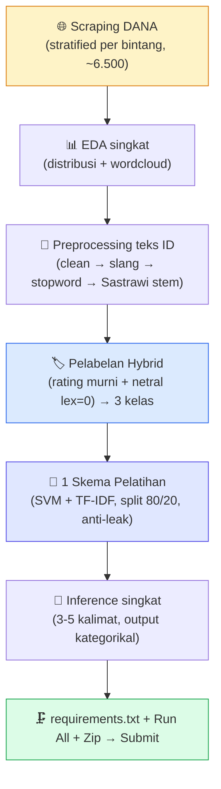

<div align="center">

# 📋 Checklist Pengerjaan — Proyek Analisis Sentimen

### Ulasan **DANA (e-wallet)** · Google Play Store · submission utk **Dafina**

<span style="background:#118eea;color:#fff;padding:3px 12px;border-radius:6px;font-weight:bold;">DICODING · Fundamental Deep Learning</span>
<span style="background:#16a34a;color:#fff;padding:3px 12px;border-radius:6px;font-weight:bold;">Target: ⭐⭐⭐ (Pass)</span>
<span style="background:#64748b;color:#fff;padding:3px 12px;border-radius:6px;font-weight:bold;">Level: BATAS BAWAH (lulus dulu, minimum risiko)</span>

_Centang `- [ ]` → `- [x]` tiap item selesai. Buka pakai **Markdown Preview Enhanced**._

</div>

---

## 🧭 Cara Pakai

> 1. Kerjakan **berurutan Tahap 0 → 6**. Tiap tahap tuntas dulu sebelum lanjut.
> 2. **Kriteria Utama = wajib** (kalau tidak → submission **ditolak**, tanpa nilai).
> 3. **Fokus: LULUS DULU (⭐⭐⭐)**. JANGAN kejar semua saran — over-engineer, buang waktu.
> 4. Notebook `.ipynb` **wajib sudah di-run** (semua output ter-embed, tanpa error).

### 🏷️ Skala Bintang & Posisi Target

| Bintang | Syarat | Posisi Dafina |
| :---: | :--- | :---: |
| ⭐ | Kriteria utama, tapi kode banyak diperbaiki / terindikasi plagiat | ❌ |
| ⭐⭐ | Kriteria utama, tapi kode perlu diperbaiki | ❌ |
| ⭐⭐⭐ | Kriteria utama, tanpa saran diterapkan | ✅ **← TARGET** |
| ⭐⭐⭐⭐ | Kriteria utama + min 3 saran | 🟡 opsional (kalau naik scrape) |
| ⭐⭐⭐⭐⭐ | Kriteria utama + SEMUA saran | ❌ tidak dikejar |

---

## 🎯 Keputusan Proyek (dikunci — lihat CLAUDE.md untuk alasan)

| Aspek | Pilihan |
| :--- | :--- |
| 🎬 Tema | Sentimen **DANA** (`id.dana`) — e-wallet, domain beda dari 3 teman |
| 🌐 Sumber data | Google Play Store — `google-play-scraper` (lang=id, country=id) |
| ⚖️ Strategi scrape | **Stratified per bintang** — target `{1:1.5k, 2:1k, 3:1.5k, 4:1k, 5:1.5k}` ≈ **6.500** |
| 🏷️ Pelabelan | **Hybrid**: rating murni (⭐1 neg, ⭐5 pos, buang ⭐2 & ⭐4) + netral ⭐3 `\|lex\|=0` (net-weight InSet) |
| 🧠 Skema | **1 skema saja: SVM (LinearSVC) + TF-IDF, split 80/20** |
| 🖥️ Device | **100% Windows lokal Victus** — CPU cukup, TIDAK ADA Colab |
| 🐍 Python mgr | **uv** + venv `.venv/` + Python 3.10.x |
| 📦 Library | Minimal: `google-play-scraper, pandas, scikit-learn, Sastrawi, matplotlib, seaborn, wordcloud, jupyter, joblib` — **TIDAK ADA TensorFlow/PyTorch/MPStemmer/XAI** |

---

## 🗺️ Peta Alur (SEDERHANA)



---

## 📊 Dashboard Progres

| Tahap | Nama | Status |
| :-: | :--- | :-: |
| 0 | Perencanaan & Setup env Windows Victus (uv + venv + library minimal) | ✅ |
| 1 | Scraping data (**6.500 ulasan unik**, stratified) | ✅ |
| 2 | EDA singkat (2 plot: distribusi bintang + wordcloud 2 kelas, terverifikasi visual) | ✅ |
| 3 | Preprocessing (Sastrawi stem cache 5.017 kata unik, ~2,9 mnt) | ✅ |
| 4 | Pelabelan BINARY (neg=⭐1, pos=⭐5, buang ⭐2/3/4) — 2.909 sampel stabil | ✅ |
| 5 | 1 skema SVM+TF-IDF (Test **91,41%**, 0 error, 3 plot embedded, 8 inference) | ✅ |
| 6 | Zip 1,54 MB siap upload | ✅ |

_Legenda: ⏳ belum · 🚧 jalan · ✅ selesai_

> ## 🏆 SELESAI — ⭐⭐⭐ (Pass), kriteria wajib penuh
> **Test Accuracy 91,41%** (jauh di atas 85%, margin +6,41%) · **2.909 sampel binary** (neg 1.498/pos 1.411) · Stabilitas 5-seed mean 88,90% min 86,94%. Pivot dari 3-kelas ke binary karena stabilitas seed jelek (verify-first bukti). Zip 1,54 MB (8 file, 1 folder root). **Sisa: user upload ke Dicoding — jangan submit berkali-kali.**

---

## ⏳ TAHAP 0 — Perencanaan & Setup

- [x] Baca `CLAUDE.md` di folder ini sampai selesai (memahami target ⭐⭐⭐ + all-local Victus).
- [x] `uv 0.11.28` sudah terpasang di user site-packages Python 3.11.
- [x] Buat venv via `uv venv .venv --python 3.10` → **Python 3.10.20** aktif.
- [x] Install library minimal (11 paket, semua CPU-only, tanpa TensorFlow/PyTorch): pandas 2.3.3, numpy 2.2.6, sklearn 1.7.2, google-play-scraper, Sastrawi, matplotlib, seaborn, wordcloud, jupyter, ipykernel, joblib, nbconvert.
- [x] Smoke test OK: semua import lolos + Sastrawi `membantu → bantu`.
- [x] Salin lexicon: `inset_negative.tsv` (81KB) + `inset_positive.tsv` (41KB) + `slang_words.csv` (3MB) ke `submission/kamus/`.
- [x] Register kernel `dafina_dana` di `%APPDATA%\jupyter\kernels\`.
- [x] **Verify-first API DANA** — score **4.6852** · 10,29 jt ratings · 2,32 jt reviews · histogram terverifikasi (semua bintang >>1.500 target). Sample 3 per bintang OK: domain e-wallet jelas.

---

## ⏳ TAHAP 1 — Scraping · _Kriteria Utama 1_

- [x] Buat `submission/scraping_dana.py` (stratified per bintang, sort NEWEST, docstring, privasi `userName`/`userImage` dibuang).
- [x] Jalankan → `submission/dataset_dana_reviews.csv` (**6.500 ulasan unik, 2,13 MB**).
- [x] Verifikasi **jumlah ≥ 3.000** ✅ (6.500 aman margin >2x kriteria wajib).
- [x] Cek kualitas: 0 null pada `content`/`score`/`reviewId`/`at`, teks Bahasa Indonesia dominan, sample per bintang konfirmasi 3 kelas jelas.
- [x] Cek duplikat (0 duplikat `reviewId`) & rentang tanggal **2026-05-30 → 2026-07-14** (~6 minggu, terkini).
- [x] Dataset mentah tersimpan di `submission/dataset_dana_reviews.csv`.

---

## ⏳ TAHAP 2 — EDA Singkat

> Cukup 2 plot — bukan 4 seperti teman-teman. Fokus dokumentasi ringkas.

- [ ] Distribusi rating bintang (bar chart) — cek skew.
- [ ] Wordcloud gabungan (atau per kelas kalau mudah) — sanity check kosakata DANA muncul (`saldo, transfer, error, gagal, promo`, dll).
- [ ] Cek missing value & duplikat (buang kalau > 5%).
- [ ] **Verifikasi plot visual via Read tool** (simpan PNG ke `d:\tmp\` dulu di verify-first script).

---

## ⏳ TAHAP 3 — Preprocessing Teks Indonesia · _Kriteria Utama 2_

- [ ] **Cleaning**: lowercase, URL/mention/emoji/angka/tanda baca dibuang, collapse elongasi 3+ → 2.
- [ ] **Normalisasi slang** (pakai `slang_words.csv` dari kamus) — `gk→enggak, bgt→banget, kalo→kalau`, dst.
- [ ] **Stopword removal** (Sastrawi 123 stopword).
- [ ] **Stemming Sastrawi** dgn **cache per-kata unik** (WAJIB — kalau tanpa cache, ~10-15 menit untuk 6.500 baris; dgn cache <1 menit).
- [ ] Dua kolom siap: `text_clean` (untuk lexicon) & `text_stemmed` (untuk TF-IDF/SVM).
- [ ] Preprocessing DILAKUKAN sebelum pelabelan (sesuai saran reviewer).

---

## ⏳ TAHAP 4 — Pelabelan Hybrid (3 kelas) · _Kriteria Utama 2 + Saran 3 (murah)_

- [ ] Muat lexicon InSet **net-weight** (`pos + neg` per kata, BUKAN `.update()`) — critical bug pattern dari Nazhif.
- [ ] Polar dari rating murni: **⭐1 = negatif**, **⭐5 = positif**. **Buang ⭐2 & ⭐4** (ambigu).
- [ ] **Netral = ⭐3 dgn `|lex net| = 0`** (strict-neutral pola Nazhif — terbukti aman lolos di 3 tema tim).
- [ ] Distribusi final: **≥3.000 sampel total** (kriteria wajib). Netral bisa kecil (mirip 662 Nazhif / 1.106 Bimo) — OK.
- [ ] `submission/dataset_dana_labeled.csv` disimpan (kolom minimal: `reviewId, content, score, at, text_clean, text_stemmed, lex_score, label`).
- [ ] **Verify-first inference**: uji SVM cepat + 3-5 kalimat asli — model prediksi masuk akal? (Bukan cuma angka.)

---

## ⏳ TAHAP 5 — 1 Skema Pelatihan SVM+TF-IDF + Inference · _Kriteria Utama 3, 4 + Saran 6_

> **PENTING (anti data-leak):** `train_test_split` DULU, `fit(TfidfVectorizer)` HANYA di train, `transform` di test.

- [ ] Setup notebook `submission/pelatihan_analisis_sentimen.ipynb` (kernel `dafina_dana`, cwd = `submission/`).
- [ ] Tahap markdown singkat: judul, penjelasan tema DANA, ringkasan metodologi.
- [ ] Load dataset berlabel → drop baris `text_stemmed` kosong.
- [ ] **Split 80/20** (`train_test_split`, `stratify=y`, `random_state=42`).
- [ ] **Fit TfidfVectorizer HANYA di train** (`ngram_range=(1,2)`, `max_features=20000`, `min_df=2`).
- [ ] **Train LinearSVC** (`C=1.0`, `class_weight='balanced'`, `random_state=42`).
- [ ] **Evaluasi wajib** di test set:
  - `accuracy_score` — **target ≥ 85%**.
  - `classification_report` (Precision/Recall/F1 per kelas + macro F1).
  - `confusion_matrix` (plot heatmap seaborn).
- [ ] **Kalau accuracy < 85%**: coba `C=0.5` atau `ngram_range=(1,1)` atau `max_features=10000`. Kalau masih tidak tembus, DEBUG: cek distribusi label & sample yang salah prediksi (biasanya karena netral bocor ke pos/neg).
- [ ] **Cell Inference** (saran #6 — MURAH):
  ```python
  def predict_sentiment(teks: str) -> str:
      # clean → slang → stopword → stem → transform → predict
      ...
  contoh = [
      "aplikasi DANA sangat membantu transfer cepat",
      "gagal terus login sudah 3 hari error mulu",
      "bagaimana cara mengubah nomor telepon di DANA",
  ]
  for t in contoh:
      print(f"{predict_sentiment(t):<8s} | {t}")
  ```
- [ ] **Run all** notebook via `jupyter nbconvert --execute --inplace submission/pelatihan_analisis_sentimen.ipynb --ExecutePreprocessor.kernel_name=dafina_dana`.
- [ ] Cek: 0 error, semua output + plot ter-embed.

---

## 🏁 TAHAP 6 — Packaging & Submit

- [ ] Buat `submission/requirements.txt` (pip freeze atau list manual):
  ```
  google-play-scraper
  pandas
  numpy
  scikit-learn
  Sastrawi
  matplotlib
  seaborn
  wordcloud
  jupyter
  ipykernel
  joblib
  ```
- [ ] Verifikasi 4 berkas wajib lengkap di `submission/`:
  - [ ] `pelatihan_analisis_sentimen.ipynb` (sudah di-run, output ter-embed)
  - [ ] `scraping_dana.py`
  - [ ] `requirements.txt`
  - [ ] `dataset_dana_reviews.csv`
- [ ] Nama file & folder pakai `Dafina` (kalau nama lengkap sudah keluar, ganti ke `Dafina_<Nama_Belakang>`).
- [ ] Zip **1 folder** — nama zip: `Proyek_Analisis_Sentimen_DANA_Dafina.zip` (lean — TANPA `.venv/`, TANPA cache).
- [ ] Review mandiri: cek larangan keras di bawah semua tercentang tidak dilanggar.
- [ ] Upload ke Dicoding — **jangan submit berkali-kali** (review ±3 hari kerja).

---

## 🚫 Larangan Keras (Auto-Reject)

- [ ] ✋ Tidak melampirkan kode & proses scraping.
- [ ] ✋ Akurasi model < 85%.
- [ ] ✋ Tidak melampirkan 4 berkas kriteria utama.
- [ ] ✋ Pakai dataset open-source yang sudah jadi.
- [ ] ✋ Notebook `.ipynb` belum di-run (output kosong).
- [ ] ✋ Cell inference (kalau ada) tidak kategorikal / tanpa bukti.

> 💡 Checklist larangan ini **dicentang artinya sudah DIPASTIKAN tidak dilanggar**.

---

## ⚠️ Pitfall yang WAJIB dihindari (dari Nazhif, Fareynaldi, Bimo)

- [ ] ⚠️ JANGAN pakai **agreement filter / strong-denoise** (rating==lexicon, atau wajib-ada-kata-kamus) — trap 90-95% semu, gagal generalisasi (3 kali terjadi di tim).
- [ ] ⚠️ Lexicon InSet WAJIB **net-weight** (`pos + neg` per kata), JANGAN `dict.update()`.
- [ ] ⚠️ Selalu cek **inference + generalisasi ke data asli** sebelum percaya test accuracy.
- [ ] ⚠️ `fit` TF-IDF HANYA di train (anti data-leak).
- [ ] ⚠️ JANGAN over-engineer (jangan tambah DL/XAI/error-analysis kalau tidak diminta) — buang waktu.

---

<div align="center">

### 🎯 Semua tercentang → siap submit ⭐⭐⭐

</div>
