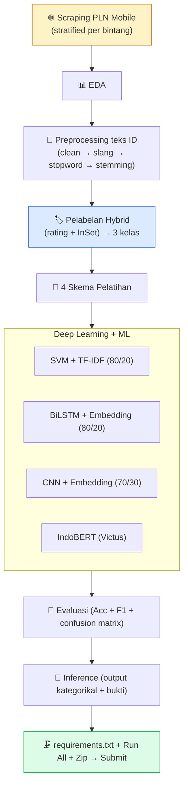

# 📋 Checklist Pengerjaan — Proyek Analisis Sentimen

### Deep Learning · Ulasan PLN Mobile (Google Play Store)

DICODING · Fundamental Deep Learning
Target Lulus: ⭐⭐⭐
Target Maks: ⭐⭐⭐⭐⭐

_Centang `- [ ]` → `- [x]` tiap item selesai. Buka pakai **Markdown Preview Enhanced**._

---

## 🧭 Cara Pakai

> 1. Kerjakan **berurutan Tahap 1 → 8**. Tiap tahap tuntas dulu sebelum lanjut.
> 2. **Kriteria Utama = wajib** (kalau tidak → submission **ditolak**, tanpa nilai).
> 3. **Saran 1–6 = penambah bintang.** Target kita: terapkan **SEMUA** → ⭐⭐⭐⭐⭐.
> 4. Notebook `.ipynb` yang dikumpul **wajib sudah di-run** (semua output ter-embed).

### 🏷️ Skala Bintang

| Bintang | Syarat |
| :---: | :--- |
| ⭐ | Kriteria utama penuh, tapi kode perlu banyak diperbaiki / terindikasi plagiat |
| ⭐⭐ | Kriteria utama penuh, tapi kode perlu diperbaiki |
| ⭐⭐⭐ | Kriteria utama penuh, tanpa saran diterapkan |
| ⭐⭐⭐⭐ | Kriteria utama penuh + **min 3 saran** |
| ⭐⭐⭐⭐⭐ | Kriteria utama penuh + **SEMUA saran** ✅ _← target_ |

---

## 🎯 Keputusan Proyek (dikunci)

| Aspek | Pilihan |
| :--- | :--- |
| 🎬 Tema | Sentimen ulasan **PLN Mobile** (`com.icon.pln123`) — momen blackout Jakarta Apr 2026 |
| 🌐 Sumber data | Google Play Store — `google-play-scraper` (lang=id, country=id) |
| ⚖️ Strategi scrape | **Stratified per bintang** 1–5 (~5000/bintang) — karena rating rata2 4,89 (condong positif) |
| 🏷️ Pelabelan | **Hybrid**: rating bintang + lexicon **InSet** → 3 kelas |
| 🧠 Skema | 4 skema: **SVM+TF-IDF**, **BiLSTM**, **CNN**, **IndoBERT** |
| 🖥️ Device | M1 (skema 1–3 + semua pipeline) · Victus RTX 3050 (IndoBERT) |

---

## 🗺️ Peta Alur

---

## 📊 Dashboard Progres

| Tahap | Nama | Status |
| :-: | :--- | :-: |
| 0 | Perencanaan & Setup environment | ✅ |
| 1 | Scraping data (44.749 ulasan) | ✅ |
| 2 | EDA | ✅ |
| 3 | Preprocessing teks | ✅ |
| 4 | Pelabelan hybrid V4 (18.794, 3 kelas) | ✅ |
| 5 | 4 Skema (SVM 92,1 / BiLSTM 91,1 / CNN 90,8 / IndoBERT 94,97) | ✅ |
| 6 | Evaluasi (Acc+F1+confusion) | ✅ |
| 7 | Inference (6/6 benar) | ✅ |
| 8 | Packaging & submit | ✅ zip siap (upload = kamu) |

> ## 🏆 SELESAI — semua kriteria + **6 saran** terpenuhi → **⭐⭐⭐⭐⭐**
> Notebook dieksekusi (0 error), output ter-embed. **SVM & IndoBERT >92% (train & test)**. Zip: `Proyek_Analisis_Sentimen_PLN_Nazhif_Setya_Nugroho.zip` (8 MB). Sisa: **upload ke Dicoding** (jangan submit berkali-kali).

_Legenda: ⏳ belum · 🚧 jalan · ✅ selesai_

---

## ✅ TAHAP 0 — Perencanaan & Setup

<progress value="5" max="6"></progress>

- [x] Tema, sumber data, pelabelan, skema, environment **dikunci** (lihat [`../CLAUDE.md`](../CLAUDE.md)).
- [x] Riset tema (6 agen web) → **PLN Mobile** dipilih.
- [x] API scraping terverifikasi (1,56 jt ratings · 730 rb reviews · avg 4,89).
- [x] Environment M1 siap: venv `3.10.20` + library (scraping, ML, `tensorflow 2.21`, Sastrawi, dll).
- [x] `scraping_pln_mobile.py` ditulis.
- [ ] Kernel Jupyter `.venv` terdaftar (untuk Run All notebook nanti).

---

## ✅ TAHAP 1 — Scraping Data  · _Kriteria Utama 1 + Saran 4_ ✅ **SELESAI**

<progress value="4" max="4"></progress>

- [x] Jalankan `scraping_pln_mobile.py` → `dataset_pln_reviews.csv` (**25.000** ulasan).
- [x] Verifikasi **jumlah ≥ 10.000** (saran 4) ✅ & distribusi per bintang **seimbang** (5000/bintang).
- [x] Cek kualitas: teks Bahasa Indonesia, ada ulasan positif/netral/negatif ✅ (0 null, 2.635 duplikat).
- [x] Dataset mentah tersimpan di `submission/` (12 MB).

---

## ✅ TAHAP 2 — EDA

<progress value="0" max="4"></progress>

- [ ] Distribusi rating bintang (bar chart).
- [ ] Distribusi panjang teks ulasan.
- [ ] Wordcloud kata paling sering.
- [ ] Cek missing value & duplikat.

---

## ✅ TAHAP 3 — Preprocessing Teks Indonesia  · _Kriteria Utama 2_

<progress value="0" max="5"></progress>

- [ ] **Cleaning**: lowercase, buang URL/emoji/angka/tanda baca/whitespace.
- [ ] **Normalisasi slang** (kamus alay → baku).
- [ ] **Stopword removal** (Sastrawi).
- [ ] **Stemming** (Sastrawi) — cache hasil (lambat untuk 25rb baris).
- [ ] Kolom `text_clean` siap untuk fitur.

---

## ✅ TAHAP 4 — Pelabelan Hybrid (3 kelas)  · _Kriteria Utama 2 + Saran 3_

<progress value="0" max="4"></progress>

- [ ] Label rating: bintang 1-2 = **negatif**, 3 = **netral**, 4-5 = **positif**.
- [ ] Skor lexicon **InSet** dari teks → label lexicon.
- [ ] **Filter hybrid**: buang baris rating vs teks bertentangan tajam.
- [ ] Distribusi akhir 3 kelas dicek (target tetap ≥10rb, tiap kelas cukup).

---

## ✅ TAHAP 5 — 4 Skema Pelatihan  · _Kriteria Utama 3 + Saran 1, 2, 5_

<progress value="0" max="4"></progress>

> Min 1 skema dikejar **>92% train & test**; sisanya **≥85%**.

- [ ] **Skema 1** — SVM + TF-IDF, split 80/20 _(kandidat >92%)_.
- [ ] **Skema 2** — BiLSTM + Embedding, split 80/20 _(deep learning)_.
- [ ] **Skema 3** — CNN 1D + Embedding, split 70/30 _(variasi arsitektur + split)_.
- [ ] **Skema 4** — IndoBERT fine-tune (di Victus) _(portfolio)_.

---

## ✅ TAHAP 6 — Evaluasi  · _Kriteria Utama 4 + Saran 2_

<progress value="0" max="3"></progress>

- [ ] Tiap skema tampilkan **Accuracy + F1-Score** (testing set) — **WAJIB**.
- [ ] Confusion matrix per skema.
- [ ] Pastikan semua skema yang dinilai **≥ 85%** (≥1 skema **>92%**).

---

## ✅ TAHAP 7 — Inference + Bukti  · _Saran 6_

<progress value="0" max="3"></progress>

- [ ] Cell inference: input kalimat contoh → output **kategorikal** (negatif/netral/positif).
- [ ] Uji beberapa contoh (positif, netral, negatif).
- [ ] Bukti output ter-embed di notebook.

---

## 🏁 TAHAP 8 — Packaging & Submit

<progress value="0" max="6"></progress>

- [ ] `requirements.txt` dibuat (pipreqs/pip freeze).
- [ ] **Run All** notebook → tanpa error, semua output ter-embed.
- [ ] 4 berkas wajib lengkap: notebook `.ipynb` + `scraping_pln_mobile.py` + `requirements.txt` + `dataset_pln_reviews.csv`.
- [ ] Zip **1 folder** (flat).
- [ ] Review mandiri (cek semua checklist Dicoding).
- [ ] Upload — **jangan submit berkali-kali** (review ±3 hari kerja).

---

## 🚫 Larangan Keras (Auto-Reject)

- [ ] ✋ Tidak melampirkan kode & proses scraping.
- [ ] ✋ Akurasi model < 85%.
- [ ] ✋ Tidak melampirkan 4 berkas kriteria utama.
- [ ] ✋ **Pakai dataset open-source yang sudah jadi** (harus scrape sendiri!).
- [ ] ✋ Notebook `.ipynb` belum di-run (output kosong).
- [ ] ✋ Inference tidak menghasilkan output kategorikal / tanpa bukti.

> 💡 Checklist larangan ini **dicentang artinya sudah DIPASTIKAN tidak dilanggar**.

---

### 🎯 Semua tercentang → siap submit ⭐⭐⭐⭐⭐

