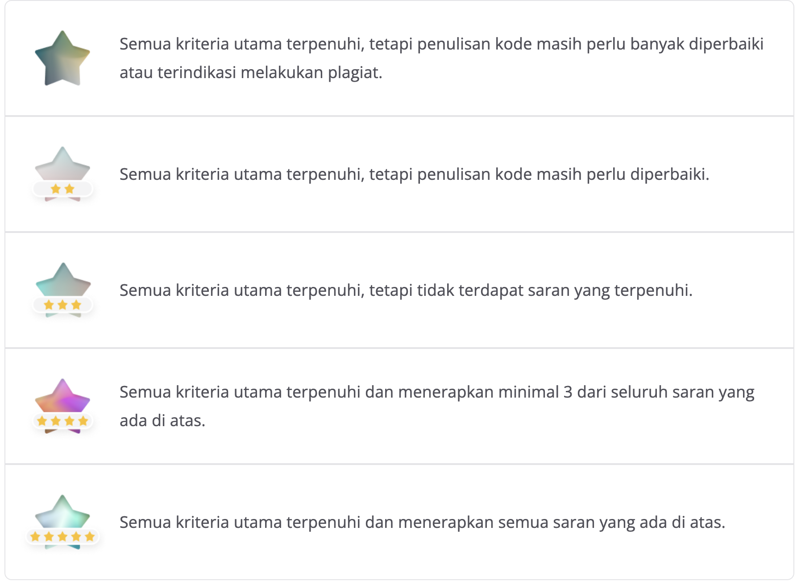

Submission Anda akan dinilai oleh reviewer dengan skala 1-5 berdasarkan dari parameter yang ada.

Anda dapat menerapkan beberapa saran untuk mendapatkan nilai tinggi, berikut sarannya:

Mengimplementasikan Callback
Gambar-gambar pada dataset asli memiliki resolusi yang tidak seragam (Tanpa preprocessing)
Dataset yang digunakan berisi minimal 10000 gambar.
Akurasi pada training set dan testing set minimal 95%.
Memiliki 3 buah kelas atau lebih.
Melakukan inference menggunakan salah satu model (TF-Lite, TFJS atau savedmodel).
Pastikan menyertakan bukti inferensi baik itu dalam bentuk screenshot atau output pada notebook
Detail penilaian submission:
