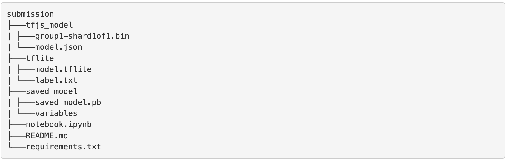

Beberapa poin yang perlu diperhatikan ketika mengirimkan berkas submission:

Menggunakan bahasa pemrograman Python.
Mengumpulkan file berikut.
Notebook pekerjaan Anda dengan format .ipynb.
Model disimpan dalam format savedmodel, TFJS, dan TF-Lite.
File requirements.txt.
Berikut merupakan struktur direktori submission yang kami sarankan.

Pastikan terdapat file yang dibutuhkan pada submission yang dikirimkan.
File ipynb yang dikirim telah dijalankan terlebih dahulu sehingga output telah ada tanpa reviewer perlu menjalankan ulang notebook.
Mengirimkan pekerjaan Anda dalam 1 folder yang telah di-zip.