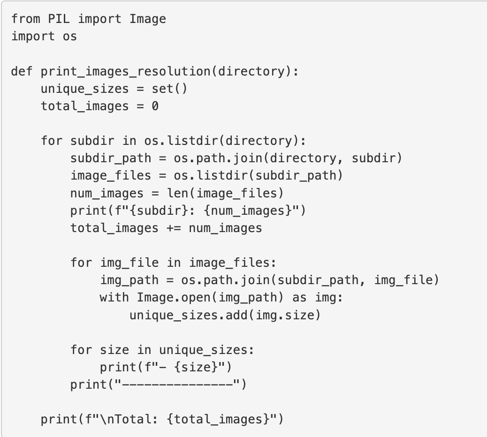
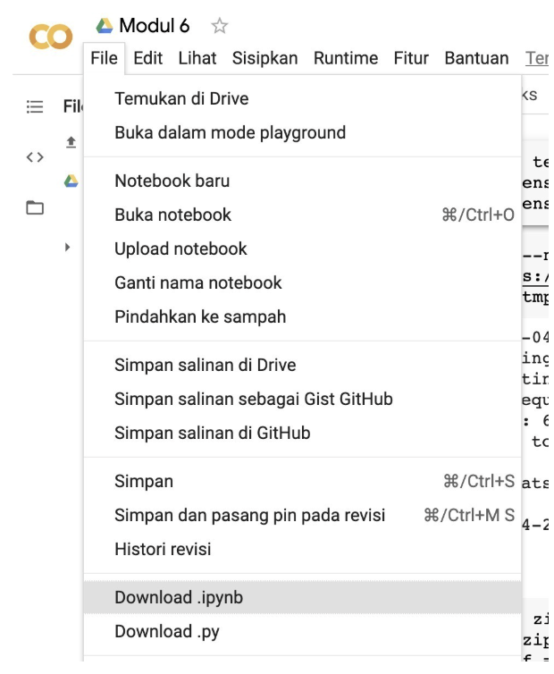

Tips and Trick
Ketika mengerjakan submission, mungkin Anda mengalami kendala. Oleh karena itu, kami mengumpulkan beberapa kendala yang sering ditemui siswa-siswa lain. Agar kendala tersebut tidak terulang kepada Anda, kami telah mengumpulkan tips untuk menanggulanginya.

Berikut adalah beberapa tips yang dapat Anda gunakan dalam pembuatan submission.

Pada submission ini, Anda disarankan membuat model menggunakan templat proyek yang telah disediakan. Tujuannya supaya proyek yang dibuat terdokumentasi dengan rapi. Templat yang dimaksud dapat diakses pada tautan berikut: Template Proyek.

Coba selalu mulai dengan melakukan eksplorasi terhadap data terlebih dahulu untuk mendapatkan ide mengenai preprocessing dan metode data augmentation yang cocok dengan data tersebut.

Coba gunakan Google Colab dengan T4 GPU atau TPU agar proses pelatihan menjadi lebih cepat.

Pastikan hanya melakukan data augmentation pada data training saja sehingga dapat menjaga konsistensi terhadap data testing yang digunakan sebagai referensi.

Anda dapat melihat jumlah citra dan ukuran resolusi menggunakan kode berikut.

Untuk membuat file requirements.txt terdapat beberapa cara salah satunya menggunakan pip freeze atau pipreqs. Berikut cara penggunaan dan perbedaannya.

pip freeze
pip freeze menghasilkan daftar semua library Python yang diinstal di lingkungan saat ini beserta versinya.
pip freeze requirements.txt
pipreqs
pipreqs menghasilkan file requirements.txt yang hanya mencantumkan library yang digunakan dalam proyek berdasarkan impor yang ada dalam file kode.
pipreqs /path/to/your/project
Tentunya kedua cara tersebut memiliki kelebihan dan kekurangan, untuk mengetahui lebih lengkap terkait freeze dan pipreqs Anda dapat membaca di tautan berikut: Ternyata Mengelola Dependensi Proyek Python Semudah Ini, lo!.
Untuk export project yang Anda kerjakan di Colaboratory sebagai berkas ipynb, klik tombol file yang berada di pojok kiri atas Colaboratory dan pilih download .ipynb serta download .py.

Untuk melakukan training pada Colab dari data yang ada pada Drive, dapat Anda lihat caranya pada tautan berikut:
https://www.youtube.com/watch?v=Gvwuyx_F-28&t=384s

Resources
Dataset yang dipakai dapat dicari pada:
Kaggle
datasetsearch.research.google.com/
UCI Machine Learning
Penggunaan TensorFlow dapat dilihat di modul klasifikasi gambar atau https://www.tensorflow.org/

Submission yang Tidak Sesuai Kriteria
Jika submission Anda tidak sesuai dengan kriteria, maka akan ditolak oleh reviewer, berikut poin-poinnya:

Akurasi pada training dan testing set di bawah 85%.
Tidak melampirkan kedua file .py dan .ipynb.
Tidak menyimpan model dalam format savedmodel, TFJS, dan TF-Lite.
File Jupyter Notebook belum dijalankan.
Tidak menerapkan seluruh kriteria wajib.
File submission tidak bisa di-load oleh platform Dicoding.
Tidak melampirkan submission dengan bentuk archive .zip atau .rar.
Menambahkan file requirements.txt
