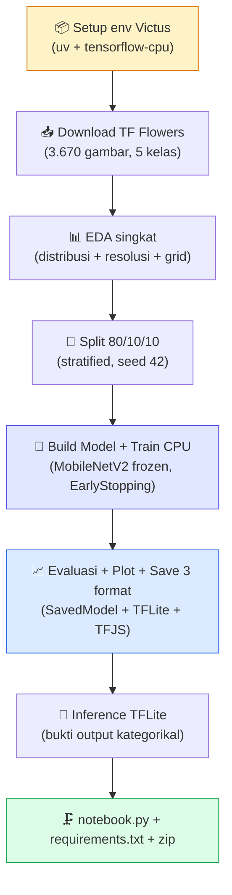

# 📋 Checklist Pengerjaan — Proyek Akhir Klasifikasi Gambar

### **TF Flowers** (5 kelas bunga) · submission utk **Dafina**

DICODING · Fundamental Deep Learning
Target: ⭐⭐⭐ (Pass)
Level: BATAS BAWAH · 100% Victus CPU

_Centang `- [ ]` → `- [x]` tiap item selesai._

---

## 🧭 Cara Pakai

> 1. Kerjakan **berurutan Tahap 0 → 7**. Tiap tahap tuntas dulu sebelum lanjut.
> 2. **Kriteria Utama = wajib** (kalau tidak → submission **ditolak**, tanpa nilai).
> 3. **Fokus: LULUS DULU (⭐⭐⭐)**. JANGAN kejar semua saran.
> 4. Notebook `.ipynb` **wajib sudah di-run** (semua output ter-embed, tanpa error).

### 🏷️ Skala Bintang

| Bintang | Syarat | Posisi Dafina |
| :---: | :--- | :---: |
| ⭐⭐⭐ | Kriteria utama, tanpa saran | ✅ **← TARGET** |
| ⭐⭐⭐⭐ | Kriteria utama + min 3 saran | 🟡 kemungkinan (4 saran gratis dari desain) |
| ⭐⭐⭐⭐⭐ | Kriteria utama + SEMUA saran | ❌ tidak dikejar (butuh ≥95% + ≥10rb gambar) |

---

## 🎯 Keputusan Proyek (dikunci — lihat CLAUDE.md untuk alasan)

| Aspek | Pilihan |
| :--- | :--- |
| 🎬 Dataset | **TF Flowers** (`http://download.tensorflow.org/example_images/flower_photos.tgz`) — 3.670 gambar, 5 kelas, public URL |
| 🖥️ Device | **100% Windows lokal Victus (CPU-only)** — TensorFlow-CPU, TIDAK ADA Colab |
| 🐍 Python mgr | **uv** + venv `.venv/` + Python 3.10.x |
| 🧠 Arsitektur | Sequential[Rescaling → MobileNetV2 frozen → Conv2D(32) → MaxPool → GAP → Dropout → Dense(5)] |
| ⚖️ Split | 80% train / 10% val / 10% test (stratified, seed 42) |
| 🏃 Training | 1 fase, base frozen, lr=1e-3, batch 32, max 10 epoch + EarlyStopping |
| 🎯 Target | Test accuracy ≥85% (kriteria wajib) |

---

## 🗺️ Peta Alur

---

## 📊 Dashboard Progres

| Tahap | Nama | Status |
| :-: | :--- | :-: |
| 0 | Setup env Victus (venv + tensorflow-cpu 2.21 + .venv-tfjs patched) | ✅ |
| 1 | TF Flowers **3.670 gambar / 5 kelas / 318 ukuran unik / 0 korup** | ✅ |
| 2 | EDA singkat (3 plot terverifikasi visual) | ✅ |
| 3 | Split 80/10/10 stratified (train 2.934 / val 367 / test 369) | ✅ |
| 4 | Build model Sequential + training EarlyStopping (5 menit CPU) | ✅ |
| 5 | Evaluasi + plot + save 3 format (SavedModel 25 MB + TFLite 11,6 MB + TFJS 11,4 MB) | ✅ |
| 6 | Inference TFLite 9/9 correct (grid 3×3 kategorikal + confidence) | ✅ |
| 7 | Zip **45,38 MB** (15 file, 1 folder root) siap upload | ✅ |

_Legenda: ⏳ belum · 🚧 jalan · ✅ selesai_

> ## 🏆 SELESAI — ⭐⭐⭐ (Pass), kriteria wajib penuh
> **Train 93,93% / Val 88,01% / Test 86,72%** (margin +1,72% dari 85% wajib). Zip 45,38 MB berisi 15 file lengkap. Bonus saran gratis dari desain: #1 (Callback ES), #2 (resolusi non-seragam 318 ukuran unik), #5 (5 kelas), #6 (inference 9/9). **Sisa: user upload ke Dicoding — jangan submit berkali-kali.**

---

## ⏳ TAHAP 0 — Setup env Victus

- [ ] Cek uv sudah terpasang: `uv --version` (harusnya sudah dari proyek DANA).
- [ ] Buat venv: `uv venv .venv --python 3.10` → `.venv\Scripts\python.exe --version` harus 3.10.x.
- [ ] Install library inti (CPU only): `uv pip install tensorflow-cpu pillow numpy matplotlib seaborn scikit-learn jupyter ipykernel nbconvert`.
- [ ] Smoke test: `python -c "import tensorflow as tf; print(tf.__version__); print(tf.config.list_physical_devices())"` — CPU, tanpa GPU.
- [ ] Register kernel `dafina_flowers`.

---

## ⏳ TAHAP 1 — Dataset TF Flowers

- [ ] Download via `tf.keras.utils.get_file(origin='http://download.tensorflow.org/example_images/flower_photos.tgz', extract=True)` — auto-cache di `~/.keras/datasets/`.
- [ ] Verifikasi: **≥1.000 gambar** wajib · **5 kelas** (daisy/dandelion/roses/sunflowers/tulips) · **resolusi non-uniform** (bukti saran #2).
- [ ] Scan integritas file (0 korup) via `tf.io.decode_image`.
- [ ] Print distribusi kelas + beberapa ukuran unik.

---

## ⏳ TAHAP 2 — EDA Singkat

- [ ] Plot distribusi jumlah gambar per kelas (bar chart).
- [ ] Bukti resolusi non-uniform (scatter w×h atau print daftar ukuran unik).
- [ ] Grid 5×3 contoh gambar (3 per kelas).
- [ ] Verifikasi plot visual via Read tool.

---

## ⏳ TAHAP 3 — Split train/val/test 80/10/10

- [ ] Stratified split per kelas, seed 42.
- [ ] Salin file ke `d:\tmp\flowers_split\{train,val,test}\<class>\`.
- [ ] Verifikasi jumlah per split cocok.

---

## ⏳ TAHAP 4 — Build Model + Training CPU

- [ ] Load 3 dataset via `tf.keras.utils.image_dataset_from_directory` (160×160, batch 32).
- [ ] Augmentasi **HANYA di train** via `ds.map()` (RandomFlip + RandomRotation) — **DI LUAR model** (pelajaran Fareynaldi).
- [ ] Model Sequential: `Rescaling(1/127.5, offset=-1) → MobileNetV2(frozen, include_top=False) → Conv2D(32) → MaxPool → GAP → Dropout(0.3) → Dense(5, softmax)`.
- [ ] Compile: Adam(lr=1e-3), SparseCategoricalCrossentropy, `metrics=['accuracy']`.
- [ ] Fit: max 10 epoch + **EarlyStopping** (patience=3, monitor='val_accuracy').

---

## ⏳ TAHAP 5 — Evaluasi + Save 3 Format

- [ ] Evaluasi train / val / test (target ≥85%).
- [ ] Plot akurasi + loss (2 subplot).
- [ ] `model.export('saved_model/')` → SavedModel.
- [ ] `tf.lite.TFLiteConverter.from_saved_model('saved_model/')` → `tflite/model.tflite` + `tflite/label.txt`.
- [ ] `tensorflowjs_converter --input_format=tf_saved_model saved_model tfjs_model` → TFJS. **INSTALL tensorflowjs PALING AKHIR.**

---

## ⏳ TAHAP 6 — Inference TFLite

- [ ] Load `tflite/model.tflite` via `tf.lite.Interpreter`.
- [ ] Ambil 9 gambar random dari test set.
- [ ] Grid 3×3 dengan prediksi vs label asli + confidence.
- [ ] Output kategorikal (`daisy`/`dandelion`/...) ter-embed.

---

## 🏁 TAHAP 7 — Packaging & Submit

- [ ] Run all notebook via `jupyter nbconvert --execute --inplace --kernel dafina_flowers`.
- [ ] Export `.py`: `jupyter nbconvert --to python notebook.ipynb`.
- [ ] `requirements.txt` (yang dipakai saja).
- [ ] `README.md` singkat.
- [ ] Verifikasi 4 file wajib + 3 folder model.
- [ ] Zip 1 folder root: `Proyek_Akhir_Flowers_Dafina.zip`.
- [ ] Upload ke Dicoding — **jangan submit berkali-kali**.

---

## 🚫 Larangan Keras (Auto-Reject)

- [ ] ✋ Akurasi train atau test < 85%.
- [ ] ✋ Tidak melampirkan `.py` DAN `.ipynb`.
- [ ] ✋ Kurang salah satu format (SavedModel / TFLite / TFJS).
- [ ] ✋ Notebook belum dijalankan (output kosong).
- [ ] ✋ Dataset < 1.000 gambar atau pakai RPS/X-Ray.
- [ ] ✋ Tidak ada `requirements.txt`.

---

## ⚠️ Pitfall yang WAJIB dihindari (dari Nazhif & Fareynaldi)

- [ ] ⚠️ JANGAN augmentasi DI DALAM model — TFLite crash (Fareynaldi kejadian).
- [ ] ⚠️ Install `tensorflowjs` PALING AKHIR — sering bentrok dep.
- [ ] ⚠️ Augmentasi HANYA di train (test set murni).
- [ ] ⚠️ Ukur akurasi train dgn dataset TANPA augmentasi/shuffle (angka jujur).

---

### 🎯 Semua tercentang → siap submit ⭐⭐⭐

