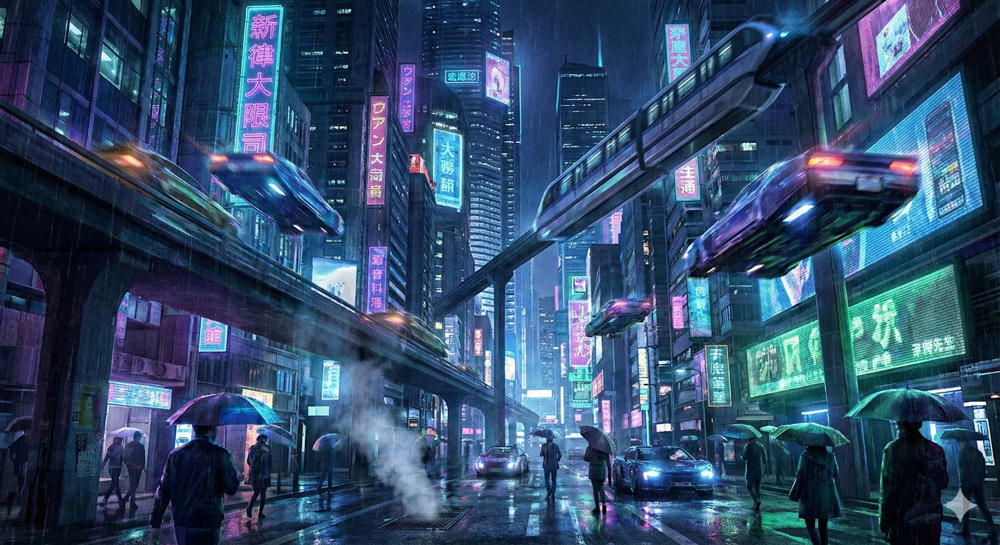

Perjalanan Anda dalam kelas Belajar Fundamental Generative AI kini telah sampai pada salah satu tahap paling krusial. Submission ini menjadi salah satu langkah terakhir sebelum Anda menuntaskan kelas ini. Pada modul-modul sebelumnya, Anda telah mempelajari dasar-dasar Generative AI dan melihat bagaimana sebuah model bisa menghasilkan teks, audio, hingga visual. Pada submission ini, fokus kita dipersempit ke satu area yang cukup menjadi buah bibir dalam dunia Generative AI, yaitu gambar yang sudah Anda pelajari pada modul Generative AI untuk gambar.

Selama ini, Generative AI untuk gambar mungkin terlihat sangat mudah dari sisi pengguna. Ketika menggunakan layanan seperti Gemini atau DALL·E, Anda cukup menuliskan prompt, lalu dalam hitungan detik sebuah gambar muncul, contohnya adalah ilustrasi di bawah ini yang dibuat oleh Nano Banana Pro dengan prompt “A futuristic cyberpunk city at night, neon lights, flying cars, ultra detailed”.

Prosesnya terlihat sederhana dan nyaris instan. Namun, dalam konteks pembelajaran di kelas ini, peran Anda tidak berhenti sebagai pengguna. Anda diajak untuk masuk lebih dalam dan memahami cara kerjanya di balik layar.

Alih-alih menggunakan model siap pakai berskala besar, submission ini mengajak Anda menggunakan pendekatan yang lebih engineering-oriented. Anda akan bekerja langsung dengan model difusi, khususnya Stable Diffusion 1.5, dan memahami pipeline generasi gambar dengan berbagai konfigurasi serta usecase-nya.

Di sini, Anda akan berhadapan dengan berbagai aspek teknis penting, seperti pengaturan seed agar hasil gambar bisa diulang, komparasi beberapa konfigurasi parameter, serta manipulasi kanvas dan masker untuk mendukung fitur inpainting dan outpainting.

Akan sangat disayangkan jika kemampuan sebesar ini hanya berakhir sebagai kode statis yang berjalan di dalam notebook tentunya. Potensi Generative AI justru terasa ketika teknologi ini dikemas menjadi aplikasi yang interaktif dan bisa digunakan oleh orang lain. Oleh karena itu, submission ini dirancang sebagai jembatan antara pemahaman konsep pada modul Generative AI untuk Gambar dan penerapannya dalam bentuk aplikasi nyata.

Dalam proyek ini, Anda akan membangun sebuah aplikasi sederhana yang kita sebut Generative Image Suite, meskipun Anda bebas menamainya apa pun. Aplikasi ini bersifat end to end dan mampu melakukan text to image generation, sekaligus manipulasi gambar melalui inpainting dan outpainting dalam satu antarmuka. Seluruh fitur tersebut akan dibungkus dalam aplikasi web sederhana menggunakan Streamlit.

Submission ini memberi gambaran bagaimana tools kreatif berbasis Generative AI dibangun di dunia nyata. Dengan menyelesaikannya, Anda akan menunjukkan pemahaman dalam merancang solusi Generative AI secara end-to-end.

Selamat berkreasi, Coders!