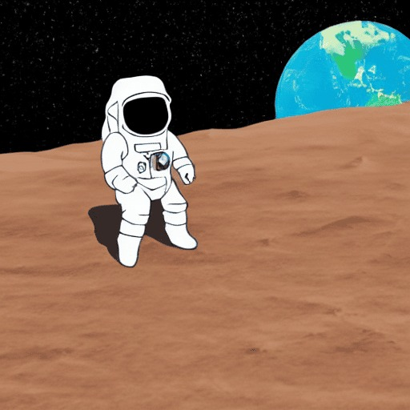
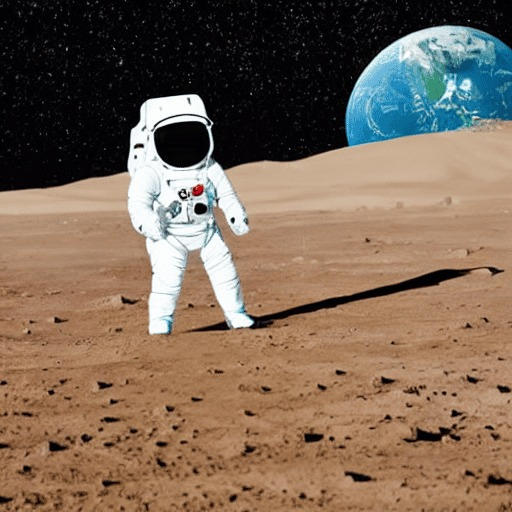

Submission ini mengharuskan Anda untuk melalui dua tahapan, yaitu eksperimen dan pembuatan interface. Oleh karena itu, penting untuk memperhatikan beberapa hal berikut ini sebelum memulai pengerjaan proyek.

Pastikan notebook dapat dijalankan sepenuhnya tanpa error sebelum dikirimkan, agar seluruh proses berjalan dengan baik dan hasil dapat diverifikasi.
Penuhi terlebih dahulu kriteria Basic submission sebelum melanjutkan ke level Skilled dan Advanced.
Jika mengalami keterbatasan komputasi, Anda sangat dianjurkan untuk memanfaatkan GPU free tier yang tersedia di Google Colab atau Kaggle.
Anda bebas menggunakan prompt apa pun selama tidak mengandung unsur SARA atau hal-hal negatif. Namun, untuk keperluan perbandingan, sangat disarankan menggunakan prompt yang sama.

Kriteria 1: Melakukan Image Generation dari Teks (Text-to-Image)
Membuat fungsi generate_simple_image() standar menggunakan Stable Diffusion Pipeline dari library Diffuser menggunakan model runwayml/stable-diffusion-v1-5dan berisi parameter dasar berikut.
Prompt
Negative_prompt
Seed
Membuat fungsi generate_advanced_image() dengan tetap menggunakan Stable Diffusion Pipeline dan model yang sama, serta berisi beberapa parameter tambahan berikut.
Prompt
Negative_prompt
Seed
Guidance_scale
num_inference_step
Melakukan proses image generation untuk menghasilkan gambar yang semirip mungkin dengan gambar berikut yang juga telah disediakan di template Notebook menggunakan kedua fungsi yang telah dibuat. Gunakan Seed bernilai 222 dan negative prompt "photorealistic, realistic, photograph, 3d render, messy, blurry, low quality, bad art, ugly, sketch, grainy, unfinished, chromatic aberration”.
Gambar untuk fungsi generate_simple_image()

Gambar untuk fungsi generate_advanced_image()

Pastikan prompt yang digunakan pada kedua fungsi sama, sehingga hasilnya dapat dibandingkan secara objektif.

Reject (0 pts)

Tidak membuat fungsi generate_simple_image() standar menggunakan Stable Diffusion Pipeline dari library Diffuser atau justru menggunakan library dan model lain.
Tidak membuat fungsi generate_advanced_image() dengan tetap menggunakan Stable Diffusion Pipeline, tanpa menambahkan parameter selain prompt.
Tidak melakukan proses image generation menggunakan kedua fungsi yang telah dibuat atau gambar yang dihasilkan sama sekali tidak mendekati gambar contoh yang diberikan. Selain itu, menggunakan prompt yang berbeda pada kedua fungsi yang dibuat.

Basic (2 pts)

Membuat fungsi generate_simple_image() standar menggunakan Stable Diffusion Pipeline dari library Diffuser menggunakan model runwayml/stable-diffusion-v1-5dan berisi parameter dasar berikut.
Prompt
Negative_prompt
Seed
Membuat fungsi generate_advanced_image() dengan tetap menggunakan Stable Diffusion Pipeline dan model yang sama, serta berisi beberapa parameter tambahan berikut.
Prompt
Negative_prompt
Seed
Guidance_scale
num_inference_step
Melakukan proses image generation untuk menghasilkan gambar yang semirip mungkin dengan gambar berikut yang juga telah disediakan di template Notebook menggunakan kedua fungsi yang telah dibuat Gunakan Seed bernilai 222 dan negative prompt "photorealistic, realistic, photograph, 3d render, messy, blurry, low quality, bad art, ugly, sketch, grainy, unfinished, chromatic aberration”.
Gambar untuk fungsi generate_simple_image()

Gambar untuk fungsi generate_advanced_image()

Pastikan prompt yang digunakan pada kedua fungsi sama, sehingga hasilnya dapat dibandingkan secara objektif.

Skilled (3 pts)

Semua ketentuan Basic terpenuhi.
Melakukan eksperimen dengan beberapa nilai Guidance Scale atau CFG scale yang berbeda untuk melihat pengaruhnya terhadap tingkat kesesuaian gambar dengan prompt.
Melakukan eksperimen pada jumlah inference steps dengan membandingkan hasil dari step rendah (5–15) dan step tinggi (30–50).
Menuliskan hasil perbandingan dari masing-masing eksperimen tersebut secara jelas pada bagian notebook yang telah disediakan, disertai dengan observasi terhadap perubahan visual yang terlihat.
Guidance Scale
Gambar dengan "Scale" Rendah:"
Jelaskan karakteristik gambar yang dihasilkan, seperti tingkat detail, kesesuaian dengan prompt, dan variasi visual yang terlihat."
Gambar dengan "Scale" Tinggi:
"Jelaskan perbedaan yang terlihat dibandingkan guidance scale rendah, terutama pada detail gambar dan kedekatannya dengan prompt."
Jumlah Inference Step
Gambar dengan "Step" Rendah:
"Jelaskan karakteristik gambar yang dihasilkan, seperti tingkat detail, ketajaman, serta kemungkinan munculnya noise atau artefak.

Gambar dengan "Step" Tinggi:
"Jelaskan perbedaan yang terlihat dibandingkan step rendah, terutama pada detail gambar, kehalusan hasil, dan stabilitas visual."

Advanced (4 pts)

Semua ketentuan Skilled terpenuhi.
Melakukan batch inference untuk menghasilkan empat gambar sekaligus, kemudian menampilkannya dalam bentuk grid 2×2 agar hasilnya mudah dibandingkan.
Mengimplementasikan fungsi load_scheduler(pipe, scheduler_name) yang memungkinkan pergantian algoritma sampling secara fleksibel tanpa perlu memuat ulang model. Berikut beberapa algoritma sampling yang perlu disertakan.
Euler A
DPM++
DDIM
Menuliskan hasil perbandingan gambar yang dihasilkan oleh 3 Scheduler yang berbeda tersebut pada bagian yang telah disediakan pada notebook.
Jumlah Inference Step
Gambar dengan "Euler A Scheduler":
"Jelaskan karakteristik gambar yang dihasilkan."
Gambar dengan "DPM++ Scheduler":
"Jelaskan karakteristik gambar yang dihasilkan."
Gambar dengan "DDIM Scheduler":
"Jelaskan karakteristik gambar yang dihasilkan."

Kriteria 2: Menyempurnakan Gambar Melalui Image-to-Image
Membuat fungsi inpaint_engine() yang menerima input berupa image, mask, dan prompt, serta wajib menggunakan model khusus Stable Diffusion Inpainting, yaitu runwayml/stable-diffusion-inpainting.
Melakukan proses masking secara manual dengan menentukan area yang akan di-mask secara hardcode melalui pendekatan trial and error.
Hasil Inpainting yang Anda lakukan perlu dibuat semirip mungkin atau setidaknya menambahkan broken satelite seperti pada Gambar yang ditetapkan berikut ini. (Gunakan Seed bernilai 9)
Gambar yang Diharapkan

Reject (0 pts)

Tidak membuat fungsi inpaint_engine() yang menerima input berupa image, mask, dan prompt, atau tidak menggunakan model yang berbeda dengan yang diberitahukan.
Tidak melakukan proses masking secara manual dengan menentukan area yang akan di-mask secara hardcode melalui pendekatan trial and error.
Hasil Inpainting yang dilakukan berbeda jauh (tidak mirip) dengan Gambar yang ditetapkan.
Basic (2 pts)

Membuat fungsi inpaint_engine() yang menerima input berupa image, mask, dan prompt, serta wajib menggunakan model khusus Stable Diffusion Inpainting, yaitu runwayml/stable-diffusion-inpainting.
Melakukan proses masking secara manual dengan menentukan area yang akan di-mask secara hardcode melalui pendekatan trial and error.
Hasil Inpainting yang Anda lakukan perlu dibuat semirip mungkin atau setidaknya menambahkan broken satelite seperti pada Gambar yang ditetapkan berikut ini. (Gunakan Seed bernilai 9)
Gambar yang Diharapkan

Skilled (3 pts)

Semua ketentuan Basic terpenuhi.
Menerapkan masking menggunakan model segmentation untuk menghasilkan area mask secara otomatis.
Membuat fungsi prepare_outpainting() yang mampu memperluas kanvas ke satu arah tertentu (kiri, kanan, atas, atau bawah).
Melakukan proses outpainting pada satu sisi saja menggunakan gambar hasil inpainting sebagai input.
Advanced (4 pts)

Semua ketentuan Skilled terpenuhi.
Mengembangkan logika outpainting lebih lanjut untuk mendukung fitur “Zoom Out”, sehingga gambar dapat diperluas secara bertahap ke berbagai arah.
Menerapkan Refiner Pattern Logic dengan menggunakan teknik Two-Stage Generation (Base + Refiner).
Stage 1: Menghasilkan latent awal menggunakan pipeline Base dengan parameter denoising_end=0.8.
Stage 2: Melanjutkan proses dengan mengoper latent tersebut ke pipelineImg2Img untuk penyempurnaan hasil menggunakan parameter denoising_start=0.8.

Kriteria 3: Membuat Interface dengan Streamlit
Melengkapi logic generate gambar dan menggunakan interface yang memanfaatkan Streamlit yang telah disediakan di template notebook. 
Interfacewajib memiliki beberapa komponen berikut:
Text input untuk memasukkan prompt dan negative prompt.
Slideruntuk mengatur hyperparameter, yaitu:
guidance_scale
num_inference_steps
Tombol Generate untuk memulai proses pembuatan gambar.
Gambar hasil generation harus ditampilkan langsung pada layar setelah proses selesai.
Screen record hasil interface yang terbentuk dengan menampilkan tampilan interface-nya cukup 1-5 menit dan simpan videonya dalam format .mp4
Reject (0 pts)

Tidak melengkapi logic generate gambar dan menggunakan interface yang memanfaatkan Streamlit yang telah disediakan di template notebook. 
Interfacetidak memiliki beberapa komponen berikut:
Text input untuk memasukkan prompt dan negative prompt.
Slideruntuk mengatur hyperparameter, yaitu:
guidance_scale
num_inference_steps
Tombol Generate untuk memulai proses pembuatan gambar.
Gambar hasil generation tidak ditampilkan langsung pada layar setelah proses selesai.
Tidak melakukan screen record hasil interface yang terbentuk dengan menampilkan tampilan interface-nya dan tidak menyimpan videonya dalam format .mp4
Basic (2 pts)

Melengkapi logic generate gambar dan menggunakan interface yang memanfaatkan Streamlit yang telah disediakan di template notebook. 
Interfacewajib memiliki beberapa komponen berikut:
Text input untuk memasukkan prompt dan negative prompt.
Slideruntuk mengatur hyperparameter, yaitu:
guidance_scale
num_inference_steps
Tombol Generate untuk memulai proses pembuatan gambar.
Gambar hasil generation harus ditampilkan langsung pada layar setelah proses selesai.
Screen record hasil interface yang terbentuk dengan menampilkan tampilan interface-nya cukup 1-5 menit dan simpan videonya dalam format .mp4
Skilled (3 pts)

Semua ketentuan Basic terpenuhi.
Menambahkan input num_images untuk menghasilkan beberapa gambar dalam satu kali proses, kemudian menampilkan hasil batch generation (misalnya 4 gambar) dalam format Grid 2×2.
Mengintegrasikan Dropdown (Selectbox) yang memungkinkan pengguna memilih di antara Scheduler berikut.
Euler A
DPM++
DDIM
Menambahkan tombol “Clear Memory” pada interface pengguna yang berfungsi untuk memanggil gc.collect() dan torch.cuda.empty_cache(), untuk membantu manajemen memori dan VRAM GPU secara manual.
Advanced (4 pts)

Semua ketentuan  Skilled terpenuhi.
Menambahkan tab baru pada interface aplikasi yang secara khusus digunakan untuk melakukan proses Inpainting dan outpainting (zoom-out) terhadap gambar yang telah di-generate sebelumnya.
Mengintegrasikan library streamlit-drawable-canvas ke dalam aplikasi, sehingga pengguna dapat mencoret atau menggambar langsung pada gambar hasil generasi di browser untuk membentuk mask, yang kemudian dikirimkan ke fungsi Inpainting.