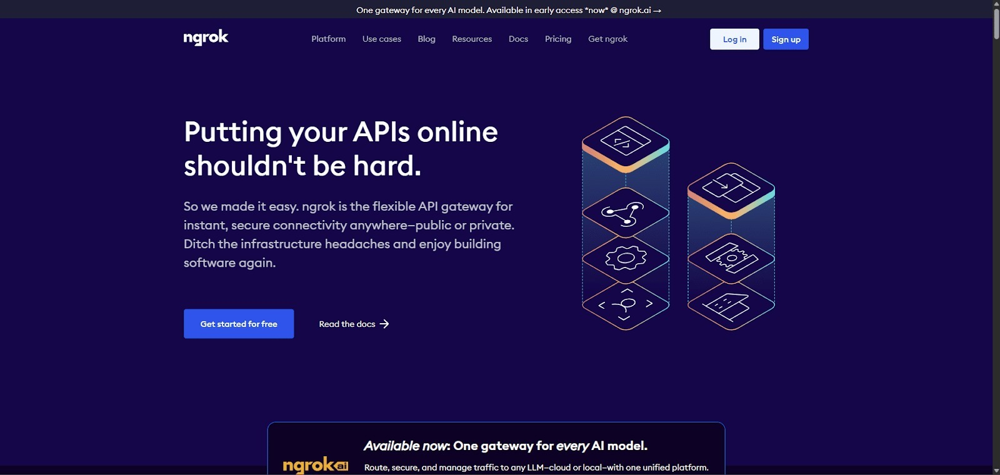
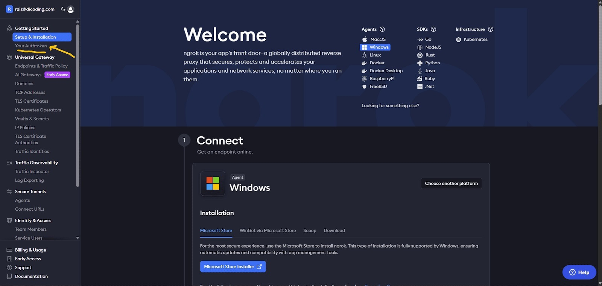
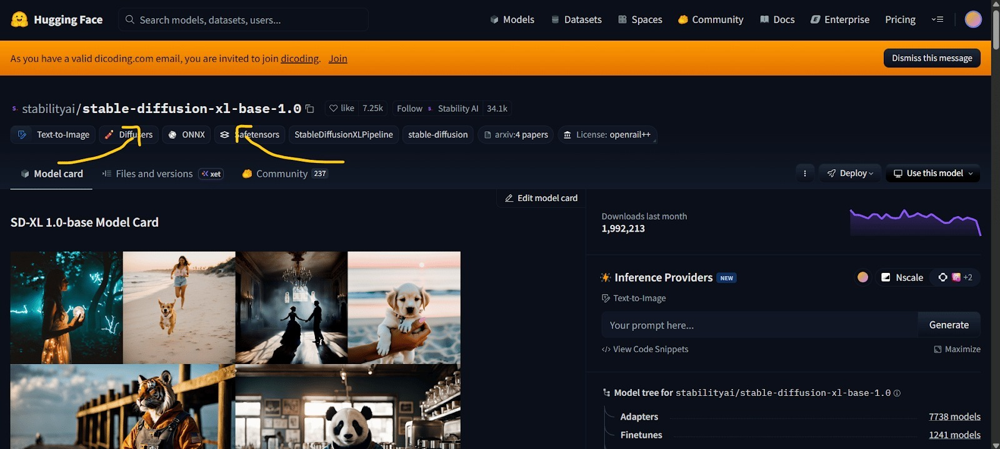

1. Bagi yang belum mengetahui cara mendapatkan Authentication Token Ngrok milik sendiri, Anda dapat mengikuti langkah-langkah berikut ini.
Kunjungi laman web Ngrok melalui tautan berikut ini: ngrok.com

Setelah itu, lakukan sign up atau sign in dengan akun Google milik Anda
Anda kemudian akan diarahkan ke homepage Ngrok dan segera akses bagian “Your Authtoken” seperti yang ditunjukan pada gambar di bawah ini.

Setelah itu, Anda dapat langsung meng-copy authentication token yang tersedia pada tampilan tersebut dan kembali ke notebook proyek.

2. Hindari penggunaan Stable Diffusion XL (SDXL) untuk kebutuhan aplikasi ini, terutama pada lingkungan dengan kapasitas VRAM terbatas. Model SDXL memiliki ukuran parameter dan kebutuhan memori yang jauh lebih besar, sehingga rawan menyebabkan Out-of-Memory (OoM), khususnya saat Anda memuat lebih dari satu model. Cara paling sederhana untuk mengenali model SDXL adalah melalui nama model atau repository-nya.

Model SDXL hampir selalu mengandung kata kunci berikut pada nama repositorinya.
qsdxl
stable-diffusion-xl
sd-xl

Contoh:
stabilityai/stable-diffusion-xl-base-1.0
stabilityai/stable-diffusion-xl-refiner-1.0

3. Hindari memuat ulang model berulang kali untuk setiap task yang berbeda. Jika beberapa usecase atau task memungkinkan untuk menggunakan arsitektur dan checkpoint model yang sama, sebaiknya gunakan instance model yang sama. Hal ini dapat memberikan Anda keuntungan.
Mengurangi waktu yang dibutuhkan untuk loading banyak model baru
Mengefisiensi penggunaan VRAM dan Disk atau penyimpanan

Selama perbedaannya hanya pada parameter atau treatment dengan fungsi tambahan, tidak diperlukan inisialisasi model baru.

4. Untuk membuat file requirements.txt terdapat beberapa cara salah satunya menggunakan pip freeze atau pipreqs. Berikut cara penggunaan dan perbedaannya.
pip freeze
pip freeze menghasilkan daftar semua library Python yang diinstal di lingkungan saat ini beserta versinya.
pip freeze requirements.txt
pipreqs
pipreqs menghasilkan file requirements.txt yang hanya mencantumkan library yang digunakan dalam proyek berdasarkan impor yang ada dalam file kode.
pipreqs /path/to/your/project
Tentunya kedua cara tersebut memiliki kelebihan dan kekurangan. Untuk mengetahui lebih lengkap terkait freeze dan pipreqs, Anda dapat membaca di tautan berikut: Ternyata Mengelola Dependensi Proyek Python Semudah Ini, lo!.

5. Untuk export project yang Anda kerjakan di Colaboratory sebagai berkas ipynb, klik tombol file yang berada di pojok kiri atas Colaboratory dan pilih download .ipynb.

