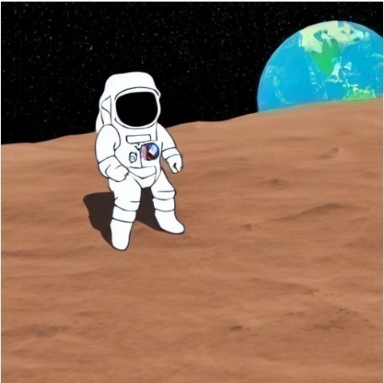
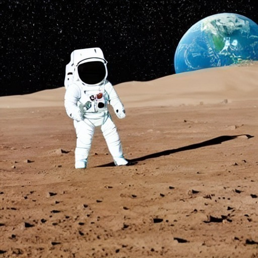
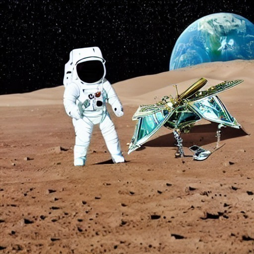

Catatan dari Reviewer

Halo nazhif_setyaf0tp,

Terima kasih telah meluangkan waktu dan usaha Anda dalam mengerjakan serta mengirimkan tugas Proyek Image Generation. Kami sangat menghargai dedikasi Anda dalam mengikuti seluruh rangkaian pembelajaran di kelas ini.

Setelah kami melakukan peninjauan secara menyeluruh terhadap proyek yang Anda kirimkan, kami menemukan bahwa masih terdapat beberapa kriteria wajib yang belum sepenuhnya terpenuhi. Oleh karena itu, submission ini belum dapat kami nyatakan lulus pada tahap ini.

Kami berharap umpan balik berikut dapat membantu Anda melakukan perbaikan dan meningkatkan kualitas proyek Anda.

Kriteria 1: Melakukan Image Generation (Text-to-Image)

Hasil Gambar fungsi generate_simple_image() dan generate_advanced_image() belum memiliki kemiripan dengan instruksi submission , dalam hal kesesuaian hasil yang diharapkan menuju ke semi realistis dengan penegasan detail dan kontur.
Gunakan prompt yang lebih sederhana dengan menekankan gaya ilustrasi agar tidak jatuh ke hasil realistis, misalnya: "an astronaut standing on moon surface, earth visible in background, cartoon style" dan padukan dengan negative prompt yang sudah ditentukan (“photorealistic, realistic, photograph, 3d render, messy, blurry, low quality, bad art, ugly, sketch, grainy, unfinished, chromatic aberration”); cukup gunakan seed tetap agar hasil konsisten dan tetap terlihat sederhana (flat/2D) tanpa detail berlebihan. Untuk mendapatkan gaya visual 3D pada generate_advanced_image kamu dapat menggunakan guidance scale bernilai rendah agar model tidak terlalu patuh pada gaya visual pada prompt.
Gambar yang diharapkan untuk fungsi generate_simple_image()

Gambar yang diharapkan untuk fungsi generate_advanced_image()

Kriteria 2: Menyempurnakan Gambar Melalui Image-to-Image

Hasil generate fungsi inpainting belum menampilkan object broken satelit secara jelas yang diharapkan sesuai contoh gambar pada instruksi.
Cobalah untuk memperbaiki prompt dengan menambahkan detail seperti besar atau kecilnya object dan sebagainya, kemudian lakukan tuning config scale dan step dari kecil hingga besar,
Saran Prompt:
"a damaged broken satellite crashed on the moon surface, lunar surface with craters, metallic debris, broken panels, exposed mechanical parts, multi-legged landing gear, crashed on Mars surface, highly detailed mechanical structure, sharp focus, realistic scale, photorealistic, cinematic lighting" 

Pada model inpainting berbasis diffusion (misalnya Stable Diffusion), dua parameter utama yang sangat berpengaruh adalah:
CFG Scale (Guidance Scale)
Sampling Steps
Kalau keduanya terlalu kecil, hasil inpainting sering:
Tidak muncul sama sekali
Perubahannya sangat halus
Mask terabaikan
Output terlihat seperti gambar asli tanpa modifikasi
Inpainting : Gambar yang diharapkan

Kami mendorong Anda untuk memperbaiki proyek ini dengan mengacu pada catatan di atas, lalu melakukan submit ulang setelah seluruh kriteria terpenuhi. Jangan berkecil hati, setiap proses revisi adalah bagian penting dalam membangun pemahaman yang lebih kuat tentang bagaimana Generative AI dirancang dan diimplementasikan secara end-to-end.

Jika Anda memiliki pertanyaan, silakan kunjungi forum diskusi. Dengan senang hati kami akan membantu Anda.

Tetap semangat dan terus eksplorasi dunia Generative AI!