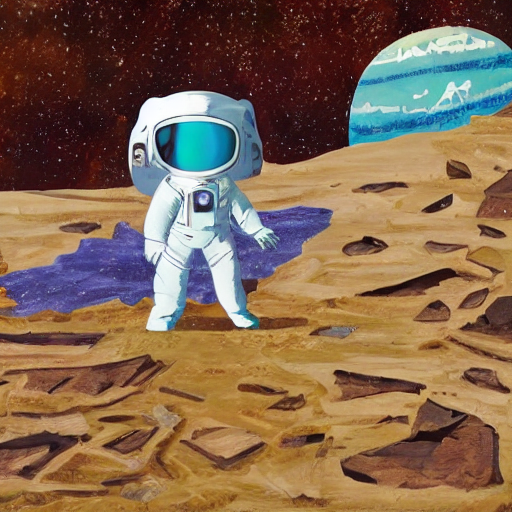
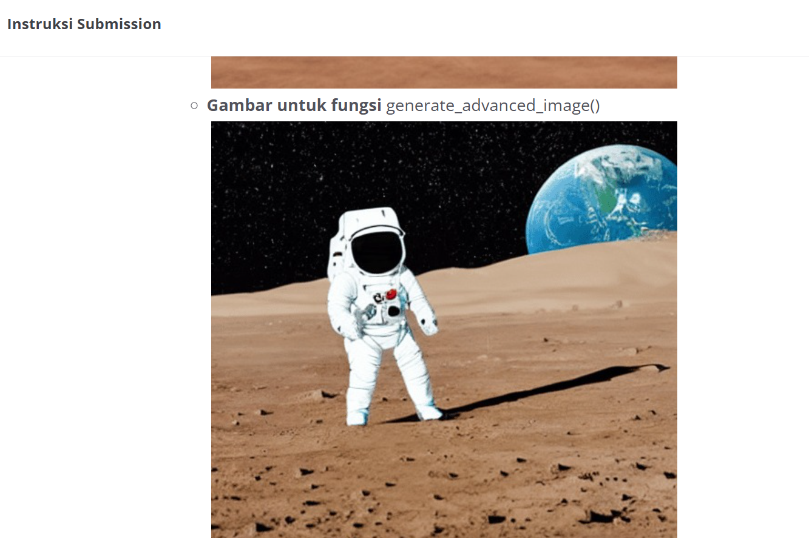

Catatan dari Reviewer

Halo kak nazhif_setyaf0tp. Terima kasih telah meluangkan waktu dan usaha kakak dalam mengerjakan serta mengirimkan tugas Proyek Image Generation. Kami sangat menghargai dedikasi kakak dalam mengikuti seluruh rangkaian pembelajaran di kelas ini. Setelah kami melakukan peninjauan secara menyeluruh terhadap proyek yang kakak kirimkan, kami menemukan bahwa masih terdapat beberapa kriteria wajib yang belum sepenuhnya terpenuhi. Oleh karena itu, submission ini belum dapat kami nyatakan lulus pada tahap ini. Kami berharap umpan balik berikut dapat membantu kakak melakukan perbaikan.

Kriteria 1: Melakukan Image Generation (Text-to-Image)

Hasil image generation yang kakak buat menggunakan fungsi generate_advanced_image() masih belum mendekati gambar contoh yang diberikan. Gambar yang Kakak hasilkan saat ini memiliki gaya visual yang terlihat seperti lukisan (painting), padahal gambar target seharusnya tampak lebih realistis. Silakan periksa kembali penulisan prompt, negative prompt, atau kombinasi parameternya agar gambar yang dihasilkan lebih objektif dan menyerupai contoh yang diminta.

Gambar advance_image kakak:

Yang dibutuhkan submission:

Kami mendorong kakak untuk memperbaiki proyek ini dengan mengacu pada catatan di atas. Seluruh fondasi kode kakak sudah sangat solid. Jangan berkecil hati, setiap proses revisi adalah bagian penting dalam membangun pemahaman yang lebih kuat tentang bagaimana Generative AI dirancang dan diimplementasikan secara end-to-end. Jika kakak memiliki pertanyaan, silakan kunjungi forum diskusi. Dengan senang hati kami akan membantu kakak. Tetap semangat dan terus eksplorasi dunia Generative AI!

Dicoding Reviewer