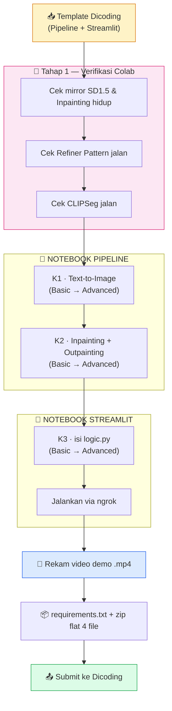

# 📋 Checklist Pengerjaan — Proyek Generative Image Suite (BFGAI)

### Text-to-Image + Inpainting/Outpainting + Streamlit UI · Stable Diffusion 1.5

DICODING · BFGAI
Target Lulus: ⭐⭐⭐
Target Maks: ⭐⭐⭐⭐⭐

_Centang `- [ ]` → `- [x]` tiap item selesai. Buka pakai **Markdown Preview Enhanced**._

---

## 📑 Daftar Isi

[TOC]

---

## 🧭 Cara Pakai Checklist Ini

> 💡 **Baca dulu sebelum mulai:**
> 1. Kerjakan **VERTICAL per-kriteria**: K1 (Basic→Skilled→Advanced) → K2 → K3. Bukan Basic K1+K2+K3 → Skilled dst.
> 2. Tiap kriteria bertingkat: **🟢 Basic → 🔵 Skilled → 🟣 Advanced**. Level atas WAJIB menyelesaikan level di bawahnya dulu.
> 3. Setiap sel yang harusnya keluar output → **wajib ada output-nya**. Cell kosong = dianggap belum selesai.
> 4. Verifikasi visual: script scratchpad → save PNG → `Read` tool untuk lihat gambarnya.

### 🏷️ Arti Badge Level

| Badge | Level | Poin | Efek ke nilai |
| :---: | :--- | :---: | :--- |
| 🟢 | BASIC | **2 pts** | Wajib. Kunci kelulusan (⭐⭐⭐) |
| 🔵 | SKILLED | **3 pts** | Naikin ke ⭐⭐⭐⭐ |
| 🟣 | ADVANCED | **4 pts** | Target sempurna ⭐⭐⭐⭐⭐ |

---

## 🎯 Pilih Target Nilai Kamu

- [ ] 🟢 **Target AMAN** — semua 3 kriteria Basic → nilai **2.0** → ⭐⭐⭐ (Lulus / C)
- [ ] 🔵 **Target MAHIR** — semua Skilled → nilai **3.0** → ⭐⭐⭐⭐ (B)
- [x] 🟣 **Target SEMPURNA** — semua Advanced → nilai **4.0** → ⭐⭐⭐⭐⭐ (A) ✅ _← dipilih_

> 📐 **Rumus nilai:** `Nilai Akhir = Total Poin ÷ 3 kriteria`
> ⚠️ Kalau **1 kriteria kena Reject (0 poin)**, rata-rata anjlok & bisa GAGAL. Jangan ada yang nol.

---

## 🗺️ Peta Alur Proyek

---

## 📊 Dashboard Progres

| # | Kriteria | Notebook | 🟢 Basic | 🔵 Skilled | 🟣 Advanced |
| :-: | :--- | :--- | :-: | :-: | :-: |
| 1 | Text-to-Image | 📘 Pipeline | ✅ kode+run+narasi | ✅ kode+run+narasi | ✅ kode+run+narasi |
| 2 | Inpainting + Outpainting | 📘 Pipeline | ✅ kode+run | ✅ kode+run | ✅ kode+run |
| 3 | Streamlit UI | 📗 Streamlit | ✅ kode+run+video | ✅ kode+run+video | ✅ kode+run+video |

---

## ✅ TAHAP 0 — Persiapan

<progress value="6" max="6"></progress> ✅ **SELESAI (2026-07-09)**

- [x] 📖 Baca semua artifacts Dicoding (6 md + 13 png di [`artifacts/`](../artifacts/))
- [x] 📥 Template Dicoding siap di [`template/`](../template/): `[Template]_Pipeline_...` + `[Template]_Streamlit_...`
- [x] 🎯 Target dikunci: ⭐⭐⭐⭐⭐ (semua 3 kriteria Advanced)
- [x] 💻 Environment dikunci: **Google Colab GPU T4** untuk semua eksekusi berat; Windows lokal hanya untuk edit notebook + packaging
- [x] 📁 Folder disiapkan: `panduan/`, `submission/`, `scratchpad/` + `.gitignore`
- [x] 📓 2 template disalin ke [`submission/`](../submission/) dengan nama final: `Pipeline_submission_BFGAI_Nazhif_Setya_Nugroho.ipynb` + `Streamlit_submission_BFGAI_Nazhif_Setya_Nugroho.ipynb`

---

## 🔬 TAHAP 1 — Verifikasi Kritis (SEBELUM isi apa pun)

<progress value="4" max="4"></progress> ✅ **SELESAI (2026-07-09, rute B: WebFetch)**

> _Hasil verifikasi sebelum kerja substansi. Detail lengkap di [CLAUDE.md §Catatan Teknis Penting](../CLAUDE.md#-catatan-teknis-penting)._

- [x] ✅ **Mirror SD 1.5 HIDUP** — `stable-diffusion-v1-5/stable-diffusion-v1-5` (1.7M dl/bulan, mirror bit-perfect resmi runwayml). Pakai ini.
- [x] ✅ **Mirror Inpainting HIDUP** — `stable-diffusion-v1-5/stable-diffusion-inpainting` (184K dl/bulan). Pakai ini. Backup: `sd-legacy/stable-diffusion-inpainting` dgn `revision="fp16"`.
- [x] ❌ **Refiner Pattern (`denoising_end`) TIDAK NATIVE** di SD1.5 pipeline diffusers v0.39.0 (SDXL-only). **Workaround dipakai:** 2-stage Base+Refiner via `output_type="latent"` + `StableDiffusionImg2ImgPipeline` dengan `strength=0.2` (share UNet weights).
- [x] ✅ **CLIPSeg HIDUP** — `CIDAS/clipseg-rd64-refined` (0.2B params, 1M dl/bulan). Pakai `CLIPSegForImageSegmentation` + `AutoProcessor`.

---

# 📘 NOTEBOOK PIPELINE

> Isi: eksperimen K1 (text-to-image) + K2 (inpainting/outpainting).
> Style: **blank-slate** — 47 sel dengan markdown ada tapi sel kode kosong total.

---

## 1️⃣ Kriteria 1 — Text-to-Image

<progress value="8" max="10"></progress> 🔄 **Kode diisi — menunggu Colab Run untuk verifikasi visual + isi narasi**

> _Fungsi text-to-image + eksperimen hyperparameter + batch + scheduler switcher._

### 🟢 BASIC (2 pts) · [artifacts/2.kriteria.md §K1 Basic](../artifacts/2.kriteria.md)

- [x] ✅ Load base pipeline `stable-diffusion-v1-5/stable-diffusion-v1-5` (mirror bit-perfect runwayml), fp16, safety_checker=None _(sel 4)_
- [x] ✅ Fungsi **`generate_simple_image(prompt, negative_prompt, seed)`** _(sel 6)_
- [x] ✅ Fungsi **`generate_advanced_image(prompt, negative_prompt, seed, guidance_scale, num_inference_steps)`** _(sel 8)_
- [ ] ⏳ **Colab Run All**: hasil match image-3 (simple) & image-4 (advanced) astronaut di bulan illustration style — tuning prompt kalau perlu
- [x] ✅ Prompt SAMA di kedua fungsi (didefinisikan sekali di sel 6, direuse di sel 8+)

### 🔵 SKILLED (3 pts)

- [x] ✅ Eksperimen **guidance_scale**: low 2.5 vs high 15.0 (steps=30 fixed) — grid 1×2 _(sel 10)_
- [x] ✅ Eksperimen **num_inference_steps**: low 10 vs high 40 (gcs=7.5 fixed) — grid 1×2 _(sel 13)_
- [ ] ⏳ Isi **narasi observasi** di 2 sel markdown (11, 14) — SETELAH lihat hasil aktual dari Colab run

### 🟣 ADVANCED (4 pts)

- [x] ✅ **Batch inference** `num_images_per_prompt=4` → grid **2×2** _(sel 16)_
- [x] ✅ Fungsi **`load_scheduler(pipe, scheduler_name)`** — switch TANPA reload model _(sel 18)_:
  - `Euler A` → `EulerAncestralDiscreteScheduler.from_config(pipe.scheduler.config)`
  - `DPM++` → `DPMSolverMultistepScheduler.from_config(pipe.scheduler.config)`
  - `DDIM` → `DDIMScheduler.from_config(pipe.scheduler.config)`
- [x] ✅ Generate 1 gambar per scheduler + tampil side-by-side _(sel 18)_
- [ ] ⏳ Isi **narasi observasi** di sel Scheduler Comparation (19) — SETELAH lihat hasil aktual

---

## 2️⃣ Kriteria 2 — Image-to-Image (Inpainting + Outpainting)

<progress value="11" max="12"></progress> 🔄 **11 sel kode terisi — menunggu Colab Run untuk verifikasi visual**

> _Inpainting manual → auto-mask → outpainting 1 arah → Zoom Out multi-arah + Refiner._

### 🟢 BASIC (2 pts) · [artifacts/2.kriteria.md §K2 Basic](../artifacts/2.kriteria.md)

- [x] ✅ Load `pipe_inpaint` = `stable-diffusion-v1-5/stable-diffusion-inpainting` fp16 + safety_checker=None _(sel 25)_
- [x] ✅ Manual mask hardcode via `PIL.Image.new("L", ...)` + `ImageDraw.rectangle` — box `(w//2+20, h*2//3-40, w-20, h-30)` di kanan bawah _(sel 27)_
- [x] ✅ Fungsi **`inpaint_engine(image, mask, prompt)`** dengan seed=9 fixed _(sel 29)_
- [x] ✅ Prompt "broken damaged metallic satellite... on the moon surface" — panggil dengan mask manual _(sel 29)_
- [ ] ⏳ Verifikasi visual di Colab: hasil match image-5/image-6 (satelit rusak muncul di area masking)

### 🔵 SKILLED (3 pts)

- [x] ✅ Load **CLIPSeg** `CIDAS/clipseg-rd64-refined` + processor + model.eval() _(sel 32)_
- [x] ✅ Auto-mask: segment "astronaut" → invert (255-mask) → restrict kanan bawah → threshold >100 → binary _(sel 34)_
- [x] ✅ Re-inpaint dengan mask auto + comparison side-by-side vs mask manual _(sel 36)_
- [x] ✅ Fungsi **`prepare_outpainting(image, direction, expand_pixels=128)`** — 4 arah + safety kelipatan 8 + blur bg _(sel 39)_
- [x] ✅ Outpaint 1 sisi (kanan, +128 px) pakai hasil inpainting_auto sebagai input _(sel 41)_

### 🟣 ADVANCED (4 pts)

- [x] ✅ **Zoom Out**: `prepare_zoom_out()` perluas semua sisi + generate bertahap 3 iterasi (grid 4 panel: Mulai + Zoom 1/2/3) _(sel 44, 46)_
- [x] ✅ **Refiner Pattern** — implementasi 2-stage ekuivalen (denoising_end/start SDXL-only, jadi workaround untuk SD1.5): _(sel 22)_
  - Stage 1: `pipe(..., num_inference_steps=40)` = 80% dari 50 step
  - Stage 2: `pipe_refiner = StableDiffusionImg2ImgPipeline(**pipe.components)` + `strength=0.2` = sisa 20% denoising
  - Kedua pipeline SHARE komponen (VAE/UNet/text encoder) → hemat VRAM

---

> ## 🎉 NOTEBOOK PIPELINE — SELESAI 100% (K1 + K2 Advanced)

---

# 📗 NOTEBOOK STREAMLIT

> Isi: `logic.py` (via `%%writefile`) yang dipanggil `app.py` (JANGAN DISENTUH).
> Style: **blank-fill** (`________`) — ikut aturan template Streamlit Dicoding.

---

## 3️⃣ Kriteria 3 — Streamlit Interface

<progress value="4" max="9"></progress> 🔄 **logic.py terisi — menunggu Colab Run + video demo**

> _Interface web + tunneling via ngrok + video demo._

### 🟢 BASIC (2 pts) · [artifacts/2.kriteria.md §K3 Basic](../artifacts/2.kriteria.md)

Isi `logic.py` bagian **Basic** (sel 6 & 7 di template Streamlit):

- [x] ✅ `load_models_cached()` — model ID di-ganti `runwayml/*` → `stable-diffusion-v1-5/*` + `safety_checker = None` di kedua pipeline _(sel 6)_
- [x] ✅ `generate_image(pipe, prompt, neg_prompt, seed, steps, cfg, num_images=1, scheduler_name)`:
  - `generator = torch.Generator(device=pipe.device).manual_seed(seed)`
  - `image = pipe(prompt, negative_prompt, num_inference_steps, guidance_scale, generator).images[0]`
  - return `[image]` _(sel 7)_
- [x] ✅ UI di `app.py` (sudah ada bawaan): text input prompt & negative_prompt + slider steps & cfg + button Generate + tampil gambar
- [ ] ⏳ **Rekam video demo `.mp4`** (1-5 menit) — screen record setelah Streamlit jalan

### 🔵 SKILLED (3 pts)

Isi `logic.py` bagian **Skilled** (sel 9 di template Streamlit):

- [x] ✅ `flush_memory()`: `gc.collect()` + `torch.cuda.empty_cache()` _(sel 9)_
- [x] ✅ `set_scheduler(pipe, scheduler_name)` — 3 branch Euler A / DPM++ / DDIM `.from_config(pipe.scheduler.config)` _(sel 9)_
- [x] ✅ Redefine `generate_image()` — `pipe = set_scheduler(pipe, scheduler_name)` + `num_images_per_prompt=num_images` + return list of images langsung _(sel 9)_
- [x] ✅ UI `app.py` (sudah ada bawaan): input `num_images` + dropdown scheduler + button Clear Memory

### 🟣 ADVANCED (4 pts)

Isi `logic.py` bagian **Advanced** (sel 11 di template Streamlit):

- [x] ✅ `run_inpainting(pipe, image, mask, prompt, strength)`:
  - `pipe(prompt, image, mask_image, strength).images[0]` _(sel 11)_
- [x] ✅ `prepare_outpainting(image, expand_pixels=128)` — center-paste (zoom-out style, extend semua sisi 2×expand_pixels): _(sel 11)_
  - `w, h = image.size` / `new_w = w + 2*expand_pixels` / `new_h = h + 2*expand_pixels`
  - Safety kelipatan 8: `new_w -= new_w % 8` / `new_h -= new_h % 8`
  - `mask.paste(inner_box, (paste_x, paste_y))`
- [x] ✅ UI `app.py` (sudah ada bawaan): tab Inpaint/Outpaint + `streamlit_drawable_canvas`

### Jalankan & tunnel (sel 16, 18, 21 template Streamlit)

- [ ] ⏳ Set ngrok auth token pribadi di sel 16 (dari [ngrok.com](https://ngrok.com) → Your Authtoken)
- [ ] ⏳ Run sel 16-18 → `subprocess.Popen(["streamlit", "run", "app.py"])` + `ngrok.connect(8501).public_url` → print URL
- [ ] ⏳ Verifikasi URL bisa dibuka. **Opsional:** minta Claude buka URL via MCP CDP untuk screenshot + test flow otomatis.

---

## 🎥 Video Demo

<progress value="0" max="2"></progress>

- [ ] Rekam layar 1-5 menit menampilkan interface (klik generate, ganti scheduler, gambar mask di canvas, generate inpaint/outpaint)
- [ ] Simpan format **`.mp4`** → letakkan di `submission/video_demo_aplikasi_BFGAI.mp4`

---

# 🏁 FASE AKHIR — Finalisasi & Submit

<progress value="7" max="8"></progress> ✅ **HAMPIR SELESAI — TINGGAL UPLOAD**

### 🔍 Review Mandiri

- [x] ✅ **Run All** Notebook Pipeline di Colab → 19/19 cell dgn output, 0 error, 15 gambar embedded, 12.75 MB
- [x] ✅ **Run All** Notebook Streamlit di Colab → 11/12 cell dgn output (cell 3 pure import), 0 error, 40 KB
- [x] ✅ Download `.ipynb` yang sudah ada output → taruh di `submission/`
- [x] ✅ Video demo `.mp4` direkam (5:51 dur) & compressed (222 MB → 10 MB via ffmpeg)

### 📦 Packaging

- [x] ✅ `requirements.txt` dibuat (pipreqs-style dgn pin `streamlit==1.29.0` + `streamlit-drawable-canvas==0.9.3` untuk compatibility)
- [x] ✅ Video demo `.mp4` sudah di `submission/`
- [x] ✅ Zip **flat 4 file**: 2 `.ipynb` + `.mp4` + `requirements.txt` → **`BFGAI_Nazhif_Setya_Nugroho.zip` (18.79 MB)** di root project
- [x] ✅ Audit final: HR1-HR4 + K1-K3 semua kriteria PASS

### 📤 Submit

- [ ] ⏳ Upload zip ke Dicoding (satu-satunya langkah tersisa)
- [ ] **Jangan submit berkali-kali** (bikin antrian review lama — review ±3 hari kerja)

---

## 🚫 Larangan Keras (Auto-Reject Kalau Dilanggar)

- [ ] ✋ Tidak melampirkan file yang diminta di ketentuan berkas submission
- [ ] ✋ Tidak menggunakan atau mengubah struktur template yang disediakan
- [ ] ✋ Menambah kode/fitur di luar instruksi yang diberikan
- [ ] ✋ Notebook tidak dijalankan → output sel kode tidak terekam
- [ ] ✋ Tidak menampilkan hasil generate gambar di antarmuka Streamlit
- [ ] ✋ Tidak mengimplementasikan fitur wajib sesuai level (mulai Basic, lalu Skilled, lalu Advanced)
- [ ] ✋ Pakai model/pipeline di luar yang dianjurkan (mis. SDXL, GAN, model lain)

> 💡 Checklist larangan ini dicentang artinya kamu sudah PASTIKAN tidak melanggarnya.

---

### 🎉 Kalau semua tercentang → siap submit!

_Tabel nilai: ⭐⭐⭐ (2.0/Basic, Lulus) · ⭐⭐⭐⭐ (3.0/Skilled) · ⭐⭐⭐⭐⭐ (4.0/Advanced)_

