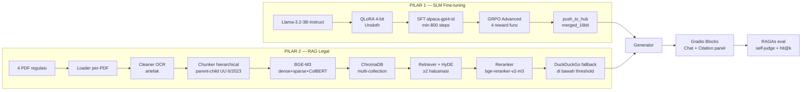

# CLAUDE.md — Fine-tuned Chatbot Tim Legal berbasis RAG (PGABL)

> **File ini = memory + HARD rules untuk proyek ini.** Baca SELURUHNYA di awal tiap sesi sebelum mengerjakan apa pun.
> **Update bagian [Progress Log](#-progress-log-living-section) setiap kali menyelesaikan satu tahap.** Ini sumber kebenaran status pengerjaan.

---

## ⛔ SCOPE — BACA INI DULU

- Proyek ini adalah **submission akhir Dicoding "Pengembangan Generative AI Berbasis LLM (PGABL)"** — skenario **Lead AI Engineer** bangun **Asisten AI internal untuk tim legal** (SLM fine-tuned + RAG).
- Ini proyek **ke-5** user setelah 4 kelulusan Advanced ⭐⭐⭐⭐⭐ sebelumnya (BMLP, Klasifikasi Gambar CNN, Analisis Sentimen NLP, BFGAI Image Generation).
- Lokasi kebetulan di dalam `Kalachakra/docs/hackaton_PIDI/`, **TAPI sama sekali TIDAK berhubungan dengan aplikasi Everest / EBC / backoffice-service Kalachakra.**
- **Aturan dari `Kalachakra/CLAUDE.md`, `docs/CLAUDE.md`, dan CLAUDE.md proyek lain (image generation, analisis sentimen, klasifikasi gambar, BMLP) TIDAK BERLAKU di sini.** Abaikan semua hal soal: Sequelize, migrations, Hoppscotch, DocuSign, CLIK, Vault, Streamlit SD1.5, PLN Mobile scraping, CNN klasifikasi gambar, dll.
- **Ini proyek SLM + RAG legal — BUKAN image generation, BUKAN analisis sentimen, BUKAN klasifikasi gambar.** Jangan campur rule/pola dari CLAUDE.md lain.
- Proyek ini **self-contained**. Semua yang relevan ada di folder ini.
- Referensi metodologi sukses (baca untuk **pola kerja**, bukan untuk substansi teknis):
  - `../../proyek_image_generation/CLAUDE.md` (Colab T4, template blank-slate, JSON manipulation, CDP untuk UI)
  - `../../fundamental_deep_learning/proyek analisis sentimen/CLAUDE.md` (VERIFY-FIRST, verify via generalisasi bukan cuma metric, config-driven)

---

## 👤 USER & GAYA KERJA

- **Nama user:** Nazhif Setya Nugroho — dipakai di nama file: `PGABL_Nazhif_Setya_Nugroho`.
- **Email:** dev@kalachakra.io
- **Konteks:** User junior developer. Ini proyek **LLM/SLM + RAG pertama**-nya. Sudah lulus **4× Advanced ⭐⭐⭐⭐⭐** sebelumnya (rata-rata 4.0). Pola kerja terbukti: VERIFY-FIRST + vertical per-kriteria + Colab T4 free tier + config-driven.
- **Cara komunikasi (WAJIB):**
  - **Bahasa Indonesia yang simpel**, mudah dimengerti junior.
  - **Pelan-pelan, step-by-step.** Jelaskan _kenapa_ tiap langkah, bukan cuma _apa_.
  - **Teliti terhadap detail kecil.** Jangan asumsi. Kalau ambigu, tanya dulu — kecuali user eksplisit minta jalan tanpa nanya.
- **Target nilai yang disepakati:** **BINTANG 5 (⭐⭐⭐⭐⭐ Advanced)** — SEMUA 3 kriteria dikejar sampai Advanced, plus filosofi **"aplikatif + scalable ke domain lain"** (medis/keuangan/support). Bukan sekadar kejar rubric — semua kode harus modular, config-driven, production-thinking.
- **Checklist progress** dibuka user pakai ekstensi **Markdown Preview Enhanced** — file `.md` boleh kaya visual (mermaid, badge HTML, `<progress>`, `<details>`, emoji).

---

## 🎯 INTI PROYEK

Membangun **asisten AI internal untuk tim legal PT (perusahaan hipotetis)** yang mampu menjawab pertanyaan tentang **4 regulasi Cipta Kerja** (PP 5/2021, PP 35/2021, PP 51/2023, UU 6/2023) dengan **grounding ke sumber pasal** — bukan halusinasi.

**Insight design kunci:** legal knowledge datang dari **RAG** (retrieval dari 4 PDF), BUKAN dari fine-tuning. SFT hanya mengajarkan model bicara Bahasa Indonesia formal-legal dan format `<think>` tag; substansi hukum diinjeksi via retrieval saat inference. Ini kenapa dataset SFT = `Ichsan2895/alpaca-gpt4-indonesian` (generik ID Q&A), BUKAN QA-pair dari 4 PDF.

Solusi = **2 pilar** yang di-orchestrate menjadi satu chatbot:



**Alur pengerjaan (VERTICAL per-kriteria — warisan proyek sukses):**
K1 Fine-tuning (Basic → SFT Skilled → GRPO Advanced) → K2 RAG (Basic → Skilled → HyDE+Reranker+DDG Advanced) → K3 Gradio Interface + evaluasi.

---

## 🧩 KEPUTUSAN YANG SUDAH DIKUNCI (jangan diubah tanpa konfirmasi user)

| Aspek | Keputusan | Catatan |
|---|---|---|
| **Target nilai** | **⭐⭐⭐⭐⭐ Advanced** (4.0, semua 3 kriteria Advanced) | Warisan 4 proyek Dicoding sebelumnya. Kalau 1 kriteria Reject → anjlok. |
| **Environment berat** | **Google Colab T4 16 GB VRAM** (free tier) | Terbukti di 4 proyek sebelumnya. Local Windows RTX 3050 4 GB HANYA untuk dev script/prototyping non-model. |
| **SLM base** | **`unsloth/Llama-3.2-3B-Instruct`** (Unsloth 4-bit) | 3B params muat aman di T4 dengan QLoRA. Unsloth = 2× lebih cepat + hemat VRAM. LoRA di **MHA + FFN** (q,k,v,o,gate,up,down). |
| **Chat template** | **Llama-3** via HF `datasets.map()` | WAJIB print output ter-format (bukti chat template dipakai). |
| **Dataset SFT** | **`Ichsan2895/alpaca-gpt4-indonesian`** | LOCKED oleh rubric. BUKAN QA-pair dari 4 PDF (itu untuk RAG). |
| **QLoRA config** | 4-bit **double quantization**, `bnb_4bit_compute_dtype=bfloat16`, `bnb_4bit_quant_type="nf4"` | LOCKED. |
| **SFT training** | **SFTTrainer min 800 steps** tanpa OOM | LOCKED. Checkpoint & resume kalau sesi Colab >4h. |
| **Push model** | **HF Public**, `push_to_hub_merged("...", tokenizer, save_method="merged_16bit")` | Link disimpan di `link_huggingface.txt`. |
| **GRPO reward (WAJIB Advanced)** | 4 reward func: `format_reward_func` (`<think>...</think>`), `reasoning_length_reward`, `correctness_reward` (ROUGE/BLEU), `language_reward_func` (penalti EN, reward ID) | LOCKED. Semua 4 harus dipanggil di GRPOTrainer. |
| **RAG framework** | **Custom modular** (bukan LangChain monolithic) | Layer terpisah: `loader → cleaner → chunker → embedder → vector_store → retriever → reranker → generator`. Scalable ke domain lain via ganti config + PDF. |
| **Vector DB** | **ChromaDB persistent** (`chromadb.PersistentClient`) | Collections per klaster UU 6/2023 (15 klaster → multi-index). PP 5/2021, PP 35/2021, PP 51/2023 masing-masing 1 collection. |
| **Embedding** | **`BAAI/bge-m3`** (dense + sparse + ColBERT, 8k ctx, 1024-dim) | OPEN-SOURCE, jalan di T4. Rubric: no OpenAI. |
| **Chunking strategy** | **Per-PDF adaptif** (lihat §CATATAN TEKNIS) | Chunk size ≤5000 char, overlap **eksplisit** (base 100 char). Hierarchical parent-child untuk UU 6/2023. |
| **RAG source** | **HANYA 4 PDF disediakan** | LOCKED. DDG fallback = out-of-scope handling, bukan tambah dokumen. |
| **Advanced RAG** | **HyDE** (min 2 halusinasi) + **Reranker Top-K** (`BAAI/bge-reranker-v2-m3`) + **relevance-threshold** + **DuckDuckGo fallback** | LOCKED. Di bawah threshold → jatuh ke DDG dgn disclaimer "sumber di luar 4 PDF". |
| **Evaluation** | **RAGAs** (self-judge dgn fine-tuned model) + **retrieval hit@k / MRR / NDCG** pada **30-50 Q&A test-set kurasi manual** | Bias self-judge didokumentasikan; hit@k = objective anchor. |
| **Interface** | **Gradio Blocks + Chat + Citation panel** (BAB/Pasal + filename + relevance score) | LOCKED. Bukan Streamlit (itu proyek BFGAI sebelumnya). |
| **Env var** | **HF_TOKEN, WANDB_API_KEY** via `google.colab.userdata` / env var | NO hardcode di notebook. Ketauan → auto-reject. |
| **Seed** | **42** di semua random ops (split, model init, DataLoader, HyDE sampling) | Reproducibility. |
| **Bahasa pemrograman** | **Python 3.11** | Rubric locked. |

---

## 📁 STRUKTUR FOLDER

```
Fine-tuned_Chatbot_Tim_Legal_berbasis_RAG/
│
├── CLAUDE.md                     ← file ini (memory + rules)
├── README.md                     ← entry point untuk pembaca luar
├── requirements.txt              ← pipreqs-style (di-generate saat packaging)
├── .env.example                  ← template secrets: HF_TOKEN, WANDB_API_KEY
├── .gitignore                    ← ignore models/, chroma_db/, .env, *.pdf, dst
│
├── configs/                      ← 🎛️ semua magic number di YAML — CONFIG-DRIVEN
│   ├── model_config.yaml         # SLM id, LoRA rank/alpha, target_modules, QLoRA
│   ├── training_config.yaml      # LR, batch, grad_accum, eval_strategy, seed, save_steps
│   ├── grpo_config.yaml          # num_generations, max_completion_length, reward weights
│   ├── rag_config.yaml           # chunk_size, overlap, top_k, rerank_top_n, threshold
│   └── paths.yaml                # semua path — override per env (Colab vs lokal)
│
├── src/                          ← 🧱 CORE REUSABLE CODE — portable ke domain lain
│   ├── __init__.py
│   ├── data/                     # dataset & PDF preprocessing
│   │   ├── loaders.py            # HF alpaca-id + PDF per-file (pypdf/pdfplumber)
│   │   ├── cleaners.py           # normalisasi OCR (O→0, l→1), header/footer strip
│   │   └── formatters.py         # chat template Llama-3 mapping
│   ├── rag/                      # ← MODULAR RAG PILLAR (1 file per layer)
│   │   ├── loader.py             # PDF → Document + metadata (bab/pasal/klaster)
│   │   ├── chunker.py            # PerPasalChunker + HierarchicalChunker
│   │   ├── embedder.py           # BGE-M3 wrapper (dense/sparse/colbert)
│   │   ├── vector_store.py       # ChromaDB + collection-per-klaster
│   │   ├── retriever.py          # Semantic + BM25 + Ensemble + Parent-Child
│   │   ├── reranker.py           # BGE-Reranker + threshold gating
│   │   ├── hyde.py               # Hypothetical doc generator (Advanced)
│   │   ├── fallback.py           # DuckDuckGo fallback (Advanced)
│   │   ├── generator.py          # Load fine-tuned Llama + generate w/ context
│   │   └── pipeline.py           # orchestrator 3-tier (Basic/Skilled/Advanced)
│   ├── finetune/                 # SFT + GRPO wrapper
│   │   ├── sft.py                # SFTTrainer + LoRA config + wandb callback
│   │   ├── grpo.py               # GRPOTrainer wrapper
│   │   └── rewards.py            # 4 reward func (format/length/correctness/language)
│   ├── eval/                     # metric objektif + RAGAs
│   │   ├── retrieval_metrics.py  # hit@k, MRR, NDCG
│   │   ├── ragas_eval.py         # RAGAs w/ local Llama judge
│   │   └── test_set.py           # schema Q&A + loader JSONL
│   └── ui/                       # layer presentasi
│       └── gradio_app.py         # Gradio Blocks + Chat + Citation panel
│
├── scripts/                      ← 🧪 prototyping VERIFY-FIRST (dev di lokal)
│   ├── 01_verify_pdf_loader.py   # test loader per-PDF, save log ke outputs/samples/
│   ├── 02_verify_chunker.py      # test chunker per-strategi
│   ├── 03_verify_embedder.py     # embed 10 sample, cek dim + similarity sanity
│   ├── 04_verify_retriever.py    # end-to-end retrieval, print top-k + citation
│   ├── 05_verify_reranker.py     # rerank + threshold check
│   ├── 06_build_test_set.py      # generate Q&A test-set draft
│   └── 07_curate_test_set.py     # manual curation → JSONL final
│
├── notebooks/                    ← 📓 notebook kerja (BUKAN untuk submission)
│   ├── 00_exploration.ipynb      # EDA 4 PDF (berapa pasal, panjang, OCR quality)
│   ├── 01_dataset_prep.ipynb     # SFT dataset + PDF chunk processing
│   ├── 02_finetune_sft.ipynb     # SFT — nanti → Fine-tuning_submission_*.ipynb
│   ├── 03_finetune_grpo.ipynb    # GRPO — nanti → GRPO_submission_*.ipynb
│   ├── 04_rag_pipeline.ipynb     # RAG — nanti → RAG_submission_*.ipynb
│   ├── 05_eval.ipynb             # RAGAs + hit@k
│   └── 06_ui_test.ipynb          # Gradio dev
│
├── data/
│   ├── raw/                      # COPY dari artifacts/document_knowledge_RAG/, rename:
│   │   ├── PP_5_2021.pdf         # ← "PP Nomor 5 Tahun 2021.pdf"
│   │   ├── PP_35_2021.pdf        # ← "PP Nomor 35 Tahun 2021.pdf"
│   │   ├── PP_51_2023.pdf        # ← "PP Nomor 51 Tahun 2023.pdf"
│   │   └── UU_6_2023.pdf         # ← "UU Nomor 6 Tahun 2023.pdf"
│   ├── processed/                # cleaned chunks per PDF, JSON
│   ├── test_set/                 # legal_qa_testset.jsonl (30-50 Q&A kurasi)
│   └── chroma_db/                # persistent ChromaDB (git-ignored)
│
├── models/                       # local model cache (git-ignored)
│   ├── llama-3.2-3b-sft/         # SFT hasil
│   ├── llama-3.2-3b-grpo/        # GRPO hasil
│   └── bge-m3/                   # embedder cache
│
├── outputs/                      # log training, wandb, eval, screenshot
│   ├── wandb/
│   ├── eval_reports/
│   ├── samples/                  # hasil scripts VERIFY untuk debugging
│   ├── ui_evidence/              # screenshot Gradio via CDP
│   ├── finetune_evidence/        # loss curve, reward curve
│   └── setup_evidence/           # nvidia-smi, dependency verify
│
├── tests/                        # pytest unit test per-layer RAG
│   ├── conftest.py               # fixtures: sample PDF, mock embedder, dummy chunks
│   ├── test_cleaners.py          # OCR normalisasi (deterministic assertion)
│   ├── test_chunker.py           # PerPasal regex boundary, hierarchical linking
│   ├── test_retriever.py         # Ensemble RRF math, top_k cap, metadata filter
│   └── test_reranker.py          # Threshold gating, order stability
│
├── docs/
│   ├── architecture.md           # diagram detail 2 pillar + data flow
│   ├── decisions.md              # ADR log (kenapa Llama-3.2-3B, kenapa BGE-M3, dst)
│   └── benchmark.md              # tabel hasil eval per eksperimen
│
├── panduan/
│   ├── Checklist_Pengerjaan.md   # 📋 tracker progres per-kriteria (MPE-friendly)
│   └── Peta_Kerja_Bertahap.md    # 🗺️ langkah per-tahap (Tahap 0-6) dgn DoD
│
├── artifacts/                    ← 📦 INSTRUKSI ASLI DICODING — READ-ONLY
│   ├── 1.pengantar.md
│   ├── 2.kriteria_utama.md
│   ├── 3.ketentuan_penilaian.md
│   ├── 4.ketentuan_berkas.md
│   ├── 5.tips_and_tricks.md
│   ├── 6.lainnya.md
│   ├── image.png + image-1.png .. image-10.png  (11 gambar rubric + tutorial)
│   └── document_knowledge_RAG/   # 4 PDF source of truth (dicopy ke data/raw/)
│
└── submission/                   ← 💻 DELIVERABLE FINAL (yang di-zip)
    ├── Fine-tuning_submission_PGABL_Nazhif_Setya_Nugroho.ipynb
    ├── RAG_submission_PGABL_Nazhif_Setya_Nugroho.ipynb
    ├── GRPO_submission_PGABL_Nazhif_Setya_Nugroho.ipynb
    ├── link_huggingface.txt
    └── requirements.txt          # pipreqs-style, di-copy juga ke root
```

**Deliverable zip final:** `PGABL_Nazhif_Setya_Nugroho.zip` — struktur **flat** 5 file (3 ipynb + 1 txt + 1 requirements).

> ⚠️ `src/`, `configs/`, `tests/`, `scripts/`, `docs/` **TIDAK diserta di zip** — hanya untuk development modular. Notebook harus **self-contained** (semua kode inline agar reviewer bisa Run All tanpa external module). Waktu final packaging: **inline kode dari `src/*.py` ke notebook** via script `json.load` → set `cell['source']` → `json.dump`.

---

## 🐍 ENVIRONMENT (HARD — cara menjalankan)

### Utama: Google Colab GPU T4 16 GB (semua eksekusi berat)

- Runtime → Change runtime type → **T4 GPU**.
- 3 notebook (Fine-tuning, RAG, GRPO) dieksekusi di sini.
- Library terinstal via `!pip install` di sel awal (unsloth, transformers, trl, chromadb, sentence-transformers, FlagEmbedding, ragas, duckduckgo-search, gradio, pypdf, pdfplumber).
- **Sesi Colab free tier limit ~4-12 jam.** Untuk SFT 800+ steps + GRPO, **checkpoint-and-resume WAJIB**:
  - `TrainingArguments(save_steps=100, save_total_limit=3, output_dir="/content/drive/MyDrive/PGABL/checkpoints/")`
  - Mount Google Drive di awal notebook.
  - Kalau disconnect → reload trainer `from_pretrained(last_ckpt)` → resume.
- HF & Wandb token via `google.colab.userdata.get('HF_TOKEN')`.

### Pendukung: Windows lokal (mesin ini) — HANYA persiapan/prototyping non-model

- **JANGAN** coba load Llama-3.2-3B atau bge-m3 di sini. RTX 3050 4 GB VRAM hanya cukup untuk inference kecil (bukan training).
- Yang boleh dilakukan di sini:
  - Edit isi notebook via Python script (`json.load` → replace → `json.dump`).
  - Baca artifacts (rubric, 4 PDF regulasi) via Read tool.
  - Bikin `scripts/*.py` untuk prototype logika non-model: PDF extraction test, chunking strategy, cleaner regex, Q&A test-set kurasi.
  - Verify hasil `outputs/samples/*.txt` via Read tool (bukan cetak ke stdout doang).
  - Susun folder + zip submission.
- **Python interpreter:** `python` (Windows Python 3.11).
- **Shell:** PowerShell — gunakan `$env:VAR` bukan `$VAR`, backtick untuk line continuation, `;` untuk chain (no `&&`).

---

## 🛠️ TOOLS TERSEDIA (termasuk MCP)

### MCP Chrome DevTools Protocol (`mcp__chrome-devtools__*`)

**Kapan pakai di proyek ini:**
- **Verifikasi UI Gradio**: setelah `demo.launch(share=True)` di Colab, navigate ke URL Gradio public → screenshot Chat + Citation panel → verify komponen muncul benar.
- **Test flow chatbot**: fill query di textbox → click Send → wait_for jawaban muncul → screenshot bukti fungsional.
- **Verifikasi HF push**: navigate ke `https://huggingface.co/<user>/<model>` → cek model card ada + file accessible.
- **Screenshot bukti untuk PROGRESS LOG**: simpan link screenshot di log per tahap.

**KAPAN TIDAK pakai CDP:**
- Baca dokumen lokal → Read tool.
- Search kode → Grep/Glob.
- Cek existence file → Bash `ls` (POSIX) atau PowerShell `Get-ChildItem`.

### WebFetch / WebSearch

- Verify checkpoint HF hidup (mirror bge-m3, bge-reranker-v2-m3, Llama-3.2-3B-Instruct Unsloth version).
- Cek dokumentasi terbaru: Unsloth GRPO signature, TRL `GRPOTrainer` API, ChromaDB `PersistentClient` API.
- Cek RAGAs metric list terbaru.

### Read (multimodal)

- Baca 4 PDF regulasi via Read `pages` parameter (mis. `pages: "1-5"` untuk skim, `pages: "351"` untuk cek KBLI di PP 5/2021).
- Baca screenshot hasil Colab → visual verify UI Gradio, plot loss training.

### Bash / PowerShell

- Bash: read-only ops (ls, git status, find pattern).
- PowerShell 5.1 quirks — `;if ($?){...}` bukan `&&`, `-Encoding utf8` untuk Set-Content.

---

## 🔴 HARD RULES — AUTO-REJECT KALAU DILANGGAR

Sumber: rubric PGABL Dicoding + pelajaran 4 proyek sebelumnya.

1. **Dataset fine-tuning WAJIB `Ichsan2895/alpaca-gpt4-indonesian`.** BUKAN QA-pair dari 4 PDF. Kalau ganti → reject.
2. **Chat template Llama-3 WAJIB via `datasets.map()`** + **print output ter-format wajib** (bukti template dipakai).
3. **QLoRA 4-bit double quantization WAJIB.** Bukan 8-bit, bukan full fp16.
4. **SFTTrainer min 800 steps tanpa OOM.** Kalau OOM → turunkan batch/max_seq_length, JANGAN turunkan step di bawah 800.
5. **Model WAJIB `push_to_hub_merged(save_method="merged_16bit")` ke HF Public**, link di `link_huggingface.txt`.
6. **GRPO Advanced WAJIB 4 reward func** (`format_reward_func`, `reasoning_length_reward`, `correctness_reward`, `language_reward_func`). Kurang 1 → drop ke Skilled.
7. **RAG Advanced WAJIB**: HyDE (min 2 halusinasi) + Reranker Top-K + relevance-threshold + DuckDuckGo fallback. Kurang 1 komponen → drop level.
8. **RAG source HANYA 4 PDF disediakan.** DDG fallback = out-of-scope handling, bukan tambah dokumen ke vector store.
9. **Embedding OPEN-SOURCE ONLY.** No OpenAI `text-embedding-*`. bge-m3 lokal.
10. **Chunk size ≤5000 char, overlap EKSPLISIT** (bukan default library). Documented di config YAML + notebook markdown.
11. **API key & token via env var / `google.colab.userdata`**. Tidak boleh hardcoded/committed. Kalau ketauan → auto-reject.
12. **Notebook `.ipynb` WAJIB sudah dijalankan penuh** — semua output ter-embed. Verify via `jupyter nbconvert --execute` sebelum submission.
13. **`requirements.txt` WAJIB pipreqs-style** (hanya library yang benar-benar diimport), BUKAN `pip freeze` seluruh Colab.
14. **Zip flat 5 file** — no subfolder inside zip. Bahasa: **Python**.
15. **DILARANG AutoML / No-Code / UI-tool instan** (HF AutoTrain, dsb).
16. **TIDAK BOLEH meta-conversation instructions di deliverable files** (`notebooks/*.ipynb`, `submission/*`, user-facing README sections). Notebook markdown WAJIB professional & self-contained untuk Dicoding reviewer yang buka cold. **DILARANG di notebook**: "Kalau ada error, screenshot + share ke Claude", "kasih tau aku", "share ke aku", "Update CLAUDE.md Progress Log setelah selesai", referensi ke `CLAUDE.md` / `panduan/` / kata "Claude". Meta-workflow guidance HANYA di file internal (`CLAUDE.md`, `panduan/*.md`, `docs/*.md`) — bukan di deliverable.

---

## 📊 KRITERIA & PENILAIAN (peta ke bintang 5)

**Rumus:** `Nilai Akhir = Total Poin ÷ 3 kriteria`

| Nilai | Bintang | Level |
|---|---|---|
| < 1 | Rejected | Gagal |
| 1–<2 | ⭐⭐ | D |
| 2–<3 | ⭐⭐⭐ | Basic (lulus) |
| 3–<4 | ⭐⭐⭐⭐ | Skilled |
| **4** | **⭐⭐⭐⭐⭐** | **Advanced ← TARGET** |

### K1 — SLM Fine-tuning

| Level | Poin | Yang wajib ada |
|---|---|---|
| 🟢 Basic | 2 | Load Llama-3.2-3B-Instruct + QLoRA 4-bit + apply chat template Llama-3 via `datasets.map()` + print output ter-format + SFT ≥800 steps + push_to_hub merged_16bit + link_huggingface.txt |
| 🔵 Skilled | 3 | Basic + LoRA target_modules **MHA+FFN** (q,k,v,o,gate_proj,up_proj,down_proj) + split train/val + `eval_strategy` + minimal 2 eksperimen hyperparameter dengan narasi observasi |
| 🟣 Advanced | 4 | Skilled + **file GRPO terpisah** dgn 4 reward func + test case wajib "hak lembur staf admin" → output `<think>` reasoning |

### K2 — RAG Legal

| Level | Poin | Yang wajib ada |
|---|---|---|
| 🟢 Basic | 2 | Loader 4 PDF + Chunker chunk_size≤5000 overlap eksplisit + bge-m3 embedder + ChromaDB persistent + retriever top-k + generator inference dari model K1 fine-tuned |
| 🔵 Skilled | 3 | Basic + metadata enrichment + metadata filtering + sitasi source + Ensemble Retriever (BM25+Dense) + Parent-Child Retriever |
| 🟣 Advanced | 4 | Skilled + **HyDE ≥2 halusinasi** + **Reranker Top-K** (bge-reranker) + **relevance-threshold** + **DuckDuckGo fallback** dgn disclaimer sumber |

### K3 — Gradio Interface

| Level | Poin | Yang wajib ada |
|---|---|---|
| 🟢 Basic | 2 | Gradio `gr.Interface` dasar ATAU Interactive Python Loop `input()` — jawaban tampil |
| 🔵 Skilled | 3 | Basic + Gradio **Blocks** + Chat component + history multi-turn |
| 🟣 Advanced | 4 | Skilled + **Citation panel** (BAB/Pasal + filename + relevance score) + streaming output + example queries + share=True + CDP screenshot bukti fungsional |

⚠️ Kalau **1 kriteria saja Reject (0 poin)**, rata-rata anjlok. Pastikan tidak ada yang nol.

---

## 🧭 METODOLOGI KERJA (warisan sukses 4 proyek sebelumnya)

1. **VERTICAL per-kriteria, bukan horizontal.**
   - K1 (Fine-tuning) → dituntaskan sampai Advanced (Basic + SFT Skilled + GRPO) → baru K2.
   - K2 (RAG) → dituntaskan sampai Advanced (Basic + Skilled + HyDE/Reranker/DDG) → baru K3.
   - K3 (Gradio) → Skilled/Advanced (Basic + Citation + streaming).
   - Alasan: notebook = pipeline berurutan; ngerjain per-level malah keliling 3× + re-run.

2. **VERIFY-FIRST (wajib, warisan proyek analisis sentimen).**
   - Untuk logika non-model (PDF loader, chunker, cleaner, DDG fallback): prototype di `scripts/*.py` di lokal Windows. Save hasil ke `outputs/samples/*.json`. **Read via Read tool untuk verify** — jangan trust stdout saja.
   - Untuk logika model (embed, retrieve, generate): prototype di Colab sel scratch dulu (bukan langsung ke sel submission). Save hasil → download → Read via Read tool.
   - **Test retrieval accuracy pada Q&A test-set SEBELUM wiring ke UI Gradio.** Warisan: proyek analisis sentimen sempat pakai AGREEMENT labeling → 90% test tapi 52% real inference karena bias. Jangan ulangi kesalahan itu — verify generalisasi.

3. **Model muat SEKALI, re-use.**
   - Cache embedding model (bge-m3) + LLM (Llama-3.2-3B) di memory (global variable atau `@functools.lru_cache`).
   - JANGAN reload per query di Gradio callback → itu bikin latency 30 detik+ per pertanyaan.
   - Ganti model → **restart runtime** (Colab: Runtime > Restart), jangan trust manual `del model`.

4. **Config-driven (SCALABILITY ke domain lain).**
   - Chunking params, model IDs, threshold, top_k, HyDE n → di `configs/*.yaml`, load via `yaml.safe_load`.
   - JANGAN hardcode di notebook. Ini yang bikin proyek scalable ke domain medis/keuangan/support (tinggal ganti PDF + YAML).

5. **Isi template Dicoding via JSON manipulation.**
   - `json.load` template `.ipynb` → cari sel dgn `________` atau sel kode kosong → replace dgn kode dari `src/*.py` → `assert` "zero blank remaining" → `json.dump`.
   - JANGAN edit `.ipynb` manual di editor teks (tabs/JSON escape gampang broken).

6. **Setelah tiap kriteria selesai:** update `panduan/Checklist_Pengerjaan.md` (centang Basic/Skilled/Advanced + `<progress>`) DAN update [Progress Log](#-progress-log-living-section) di file ini.

7. **Output ter-embed di FASE AKHIR** via user Run All di Colab (atau `jupyter nbconvert --execute` untuk notebook ringan). Semua 3 notebook harus lolos re-run penuh.

8. **CDP untuk verifikasi UI Gradio.** Setelah `demo.launch(share=True)`, buka URL public via CDP → screenshot tiap flow → jadi bahan bukti submission.

9. **Random seed=42** di semua random ops.

10. **Sensitive info via env var**: pattern:
    ```python
    import os
    try:
        from google.colab import userdata
        HF_TOKEN = userdata.get('HF_TOKEN')
    except ImportError:
        HF_TOKEN = os.environ.get('HF_TOKEN')
    assert HF_TOKEN, "HF_TOKEN not set"
    ```

11. **`requirements.txt` pakai pipreqs** (`pipreqs ./src ./submission --force`), review manual sebelum commit.

12. **PDF source READ-ONLY**: `artifacts/document_knowledge_RAG/` **jangan disentuh**. Copy ke `data/raw/` dgn rename path-safe (`PP_5_2021.pdf` dst). Semua kerja loader/chunker baca dari `data/raw/`.

---

## 🔑 CATATAN TEKNIS PENTING

### 4 PDF karakter & strategi loader/chunker

| PDF | Halaman | Kondisi text-layer | Strategi loader | Strategi chunker |
|---|---|---|---|---|
| **PP 5/2021** (perizinan risiko) | 739 | Mixed: batang tubuh (hlm 1-350) GOOD, KBLI matrix (351-739) SCAN | `pypdf` untuk 1-350, fallback `pdfplumber` (+ OCR flag) untuk 351-739 | Per-pasal untuk 1-350; KBLI matrix bisa di-skip di RAG (jarang ditanya legal team) atau chunk terpisah tabular |
| **PP 35/2021** (PKWT/PHK) | 56 | Mixed OCR (readable, artefak) | `pdfplumber` (robust untuk artefak) | **Per-pasal** (9 BAB, 66 pasal + penjelasan) — struktur jelas, cocok flat chunking |
| **PP 51/2023** (formula UMP) | 27 | GOOD text-layer | `pypdf` (paling cepat) | Per-perubahan (2 pasal induk mengubah 19 angka PP 36/2021). Chunk kecil karena file kecil |
| **UU 6/2023** (Cipta Kerja omnibus) | **1127 / 85 MB** | Mixed OCR heavy | `pdfplumber` (robust untuk artefak), **batch page-by-page** biar RAM tidak explode | **HIERARCHICAL parent-child WAJIB** — 15 klaster mengubah 78+ UU sektor. Parent = klaster, child = pasal individual. **Multi-collection ChromaDB** per klaster |

### Chunking strategy detail

- **Flat chunking** (PP 35/2021, PP 51/2023, PP 5/2021 batang tubuh):
  - `chunk_size=800 char, overlap=100 char` (config default).
  - Split per-pasal dulu (regex `Pasal \d+`), lalu kalau pasal >800 char split lagi dgn overlap.
- **Hierarchical chunking** (UU 6/2023):
  - Level 1 (parent): per klaster/BAB → chunk besar `2000 char` untuk konteks luas.
  - Level 2 (child): per pasal → chunk kecil `800 char` untuk retrieval presisi.
  - Retrieval: search di child, tapi return child + parent context untuk generator.
  - ChromaDB metadata: `{cluster_id, bab, pasal, parent_id, level}`.

### ChromaDB multi-collection

```python
# 4 collection base + 15 sub-collection UU 6/2023
client = chromadb.PersistentClient(path="./data/chroma_db")
col_pp5  = client.get_or_create_collection("pp_5_2021")
col_pp35 = client.get_or_create_collection("pp_35_2021")
col_pp51 = client.get_or_create_collection("pp_51_2023")
# UU 6/2023 per klaster
for i in range(1, 16):
    client.get_or_create_collection(f"uu_6_2023_klaster_{i}")
```

Retrieval multi-collection: query semua collection paralel, gabung hasil, rerank.

### HyDE (Hypothetical Document Embeddings)

- Query user → LLM (fine-tuned Llama) generate **2 halusinasi dokumen jawaban** (minimum, WAJIB dokumentasi di notebook).
- Embed halusinasi → similarity search di ChromaDB → dapat chunk relevan.
- Reason: query user pendek, dokumen legal panjang. Embed pertanyaan langsung sering miss. Embed jawaban-halusinasi lebih dekat ke dokumen sumber.

### Reranker + threshold

- Retrieval bge-m3 top-k=20 → rerank via `BAAI/bge-reranker-v2-m3` top-n=5 → apply threshold `>=0.3` (setelah sigmoid; config, tune empirical).
- Kalau **top-1 rerank score < threshold** → trigger DDG fallback.

### DuckDuckGo fallback

- `from duckduckgo_search import DDGS`
- Query modified: `f"{query} site:peraturan.bpk.go.id OR site:hukumonline.com"` (bias ke sumber legal Indonesia).
- Return top 3 snippets + URL sebagai konteks generator.
- **WAJIB tampilkan disclaimer di jawaban:** "Sumber di luar 4 dokumen internal, hasil dari DuckDuckGo. Verifikasi ke tim legal."

### GRPO reward functions (4 wajib Advanced)

```python
def format_reward_func(completions, **kwargs):
    # reward 1.0 kalau ada <think>...</think>, else 0.0
    ...

def reasoning_length_reward(completions, **kwargs):
    # sigmoid smooth di rentang 100-500 char di dalam <think>, peak di 300
    ...

def correctness_reward(completions, ground_truths, **kwargs):
    # ROUGE-L atau BLEU antara completion (di luar <think>) vs ground_truth
    ...

def language_reward_func(completions, **kwargs):
    # penalty kalau EN, reward kalau ID dominan (langdetect atau ratio Sastrawi stopwords)
    ...
```

Bobot saran: `format 0.3 + reasoning 0.15 + correctness 0.4 + language 0.15`.

### RAGAs evaluation

- Metric wajib: `faithfulness`, `answer_relevancy`, `context_precision`, `context_recall` (min 3 untuk Skilled).
- Self-judge: `judge_llm = fine-tuned Llama K1` (bukan GPT-4). Pilihan "aplikatif" — tim legal tidak boleh keluarin data ke API eksternal.
- **Bias disclosure WAJIB**: self-judge cenderung generous → dokumentasikan di analisis, jadikan hit@k sebagai objective anchor.

### Q&A test-set kurasi manual

- Target: **30-50 pertanyaan** (mix per-PDF, mix easy/hard, mix factual/interpretive).
- Distribusi disarankan: 10 PP 5/2021 + 10 PP 35/2021 + 5 PP 51/2023 + 15-25 UU 6/2023 (karena paling besar).
- Simpan di `data/test_set/legal_qa_testset.jsonl`, format:
  ```json
  {"id":"Q001","question":"...","ground_truth_pasal":"PP 35/2021 Pasal 78",
   "ground_truth_pdf":"PP_35_2021","ground_truth_answer":"...",
   "difficulty":"easy|medium|hard","type":"single_pdf|cross_pdf"}
  ```

### Colab checkpoint-and-resume

- Mount Drive: `from google.colab import drive; drive.mount('/content/drive')`.
- `output_dir="/content/drive/MyDrive/PGABL/checkpoints/sft/"` (bertahan lintas sesi).
- Kalau disconnect: reload `AutoModelForCausalLM.from_pretrained(last_ckpt, quantization_config=...)` → attach LoRA → resume trainer.
- `SFTConfig(save_steps=100, save_total_limit=3, resume_from_checkpoint=True)`.

### requirements.txt (pipreqs-style, draft awal)

```
unsloth
transformers
trl
peft
bitsandbytes
accelerate
datasets
torch
chromadb
sentence-transformers
FlagEmbedding
pypdf
pdfplumber
ragas
duckduckgo-search
gradio
pyyaml
langdetect
rouge-score
```

---

## ✅ PROGRESS LOG (living section)

> **WAJIB diupdate tiap tahap selesai.** Format: `**Tahap N — [Judul] ([Status], tanggal)**` dgn ✅/⏳/❌/⏸️ + link bukti.
>
> Detail langkah kerja per tahap ada di [`panduan/Peta_Kerja_Bertahap.md`](panduan/Peta_Kerja_Bertahap.md).

- **Tahap 0 — Persiapan Environment & Repo: ✅ SELESAI (2026-07-12)**
  - [x] Copy 4 PDF `artifacts/document_knowledge_RAG/*.pdf` → `data/raw/*.pdf` dgn rename (`PP_5_2021.pdf` 17MB, `PP_35_2021.pdf` 2.5MB, `PP_51_2023.pdf` 2.7MB, `UU_6_2023.pdf` 85MB) ✅
  - [x] Buat folder skeleton: `configs/`, `src/{data,rag,finetune,eval,ui}/`, `scripts/`, `notebooks/`, `data/{raw,processed,test_set}/`, `tests/`, `docs/`, `outputs/setup_evidence/` ✅
  - [x] Buat `configs/*.yaml` — 5 file (model, training, grpo, rag, paths) dgn semua magic number ✅
  - [x] Buat `.env.example` (template HF_TOKEN + WANDB_API_KEY + HF_USERNAME + WANDB_PROJECT) ✅
  - [x] Buat `src/**/__init__.py` (7 file: `src/`, 5 subfolder, `tests/`) ✅
  - [x] Verify 4 HF checkpoint hidup via WebFetch: `unsloth/Llama-3.2-3B-Instruct`, `BAAI/bge-m3`, `BAAI/bge-reranker-v2-m3`, `Ichsan2895/alpaca-gpt4-indonesian` (dataset: 2 kolom `input`+`output`, ~49,969 rows, CC-BY-SA-4.0) ✅
  - [x] Buat `notebooks/00_setup_verify.ipynb` skeleton (9 cell: detect env, load secrets, nvidia-smi, mount Drive + create PGABL folder skeleton, install stack, verify imports+CUDA, HF+WANDB login, verify 4 HF checkpoint via HfApi, save evidence) ✅
  - [x] **Fix v2** — Cell 5 install: hapus pin manual (`transformers==4.46.3`, `trl==0.12.0`, `datasets==3.1.0`) karena bikin ImportError `CompileConfig` di Colab July 2026 (Unsloth 2026.7.2 butuh transformers ≥4.51.3). Sekarang install Unsloth unpinned + Pillow upgrade (untuk pdfplumber ≥0.11) + note wajib restart runtime setelah install ✅
  - [x] **Fix v3** — Defer `ragas` install ke Tahap 4. Ragas versi tersedia import `langchain_community.chat_models.vertexai.ChatVertexAI` yang sudah dihapus di langchain-community ≥0.3 (dipindah ke package `langchain-google-vertexai`). Untuk Tahap 0-3 cukup `rouge-score` (GRPO correctness reward). Ragas fix akan ditangani di Tahap 4 dgn pin ragas + langchain compat, atau install shim `langchain-google-vertexai` ✅
  - [x] Git init + `.gitignore` sudah OK ✅
  - [x] **USER TODO 1** — Setup Colab Secrets: `HF_TOKEN` (scope Write) + `WANDB_API_KEY` ✅
  - [x] **USER TODO 2** — Run All `notebooks/00_setup_verify.ipynb` di Colab T4 → semua cell hijau, evidence tersimpan di `/content/drive/MyDrive/PGABL/outputs/setup_evidence/` (`nvidia_smi.txt`, `pip_freeze.txt`) ✅
  - **Insight autonomous:** Dataset alpaca-gpt4-indonesian ternyata **2 kolom** (`input`, `output`), BUKAN 3 kolom Alpaca klasik (`instruction`/`input`/`output`). Sudah di-update di Peta Kerja Tahap 1a + `configs/training_config.yaml`.
  - **Insight tambahan:** Dependency ecosystem July 2026 (`unsloth 2026.7.x` butuh `transformers ≥4.51.3`) berbeda dari knowledge cutoff Jan 2026 subagent. Fix: install Unsloth unpinned, biar dia resolve dependency. `ragas` ditunda ke Tahap 4 karena compat issue `langchain_community.chat_models.vertexai`.

- **Tahap 1 — Data Preparation: ✅ SELESAI (2026-07-12)**
  - [x] **1a. SFT dataset**: ✅ SELESAI (2026-07-12) — di Colab T4 via `notebooks/01_dataset_prep.ipynb`. Load `Ichsan2895/alpaca-gpt4-indonesian` (2 kolom `input`+`output`, ~50k rows), filter outlier + stratified split 90/10 by input length bucket (seed=42), apply Llama-3 chat template via `datasets.map()`, verify 5 special tokens (`<|begin_of_text|>`, header ids, `<|eot_id|>`), save train.jsonl + val.jsonl + _summary.json ke `/content/drive/MyDrive/PGABL/data/processed/sft/`
  - [x] **1b. PDF prep RAG**: ✅ SELESAI (2026-07-12)
    - Verify-first prototype: `scripts/01_verify_pdf_loader.py` + `scripts/02_verify_chunker.py` — bukti di `outputs/samples/`
    - Port ke production: `src/data/loaders.py` (pypdf), `src/data/cleaners.py` (OCR normalize + strip header/footer), `src/rag/chunker.py` (flat per-pasal + BAB metadata)
    - Full ingest via `scripts/03_full_ingest.py` — **2,295 chunks** dalam 13.5s → `data/processed/pdfs/{PP_5_2021,PP_35_2021,PP_51_2023,UU_6_2023}/chunks.json`
    - Breakdown: PP_5_2021 = 567, PP_35_2021 = 84, PP_51_2023 = 16, UU_6_2023 = 1628
    - **Insight loader**: pypdf identical output vs pdfplumber tapi 2-4× lebih cepat → pakai pypdf untuk semua PDF. OCR artefak (NEPUBUK, 2O21, kemanusraan) ada di text-layer PDF, bukan loader artifact.
    - **Insight chunker**: flat per-pasal sudah cukup untuk MVP. Hierarchical parent-child untuk PP_5_2021 & UU_6_2023 di-defer ke Tahap 3 kalau retrieval quality butuh konteks luas.
    - **Known limitation** (defer ke Tahap 3-4 iteration): (1) beberapa OCR artefak (REPUELIK, persekutrran) belum di-normalize; (2) page-break `-N-` kadang nyempil di tengah pasal panjang; (3) UU_6_2023 pasal_range 1-1538 karena omnibus references banyak "Pasal N" ke UU sektor yg dimodifikasi
  - [x] **1c. Test set kurasi**: ✅ SELESAI (2026-07-12) — draft via 4 subagent (1 per PDF) baca `chunks.json`, aku sintesis + tambah 5 cross_pdf → `data/test_set/legal_qa_testset.jsonl` (45 Q&A, 29.5 KB)
    - Distribusi type: **40 single_pdf + 5 cross_pdf**
    - Distribusi PDF: PP_5=10, PP_35=10, PP_51=5, UU_6=15
    - Distribusi difficulty: **11 easy + 23 medium + 11 hard** (balanced)
    - **Rubric requirement lembur**: 6 Q&A tentang upah/waktu lembur (WAJIB untuk GRPO test case "hak lembur staf admin"). Termasuk `PP35_Q05` yang eksplisit tanyakan "staf admin lembur 3 jam" — cocok jadi ground truth GRPO Tahap 2c.
    - Schema per record: `{id, question, ground_truth_pasal, ground_truth_pdf, ground_truth_answer, difficulty, type, source_chunk_id}`. Cross-pdf pakai comma-separated di field pasal/pdf/chunk_id.
  - [x] **Audit random 10/45 records (seed=42, 2026-07-12)**: 10/10 content grounded ke chunks ✅. 4 records punya cosmetic `source_chunk_id` bug (subagent PP_5_2021 halusinasi `_0` suffix). Auto-fix via script yang match by `pdf+pasal` → 24/45 records ter-update ke actual chunk_id (chunker naming `{pdf}_pasal_{N}_{i}` di mana `i` = enumeration index, bukan pasal number). PP35_Q08 (efisiensi mencegah kerugian) manual re-verified: answer refer ke Pasal 43 ayat (2) dgn pesangon 1× — akurat.
  - [x] Bukti: `data/processed/pdfs/*/chunks.json` (2,295 chunks) ✅ + `data/test_set/legal_qa_testset.jsonl` (45 Q&A, audited, chunk_id fixed) ✅

- **Tahap 2 — Fine-tuning (K1 Basic → Skilled → Advanced GRPO): ✅ SELESAI ADVANCED ⭐⭐⭐⭐⭐ (2026-07-13)** — SFT 2a+2b + GRPO 2c tuntas, kedua model merged_16bit public & verified, test case `<think>` [OK].
  - **GRPO notebook FINAL (di-download dari Colab, cleaned, 2026-07-13)**: 23 cell, repair cells dibuang, Section 6 = cell reload GRPO-dari-HF + few-shot/prime (`[OK]`). Semua output ter-embed & terverifikasi: 4 reward func demo (cell 12), tabel reward training 60 baris (cell 14, 151 min), test case `<think>` [OK] (cell 16), push merged 9 files public (cell 18/19), link (cell 21). Catatan cosmetic: exec-counter Section 6 (ec=15) > Section 7 (ec=11) krn Section 6 di-rerun terakhir — abaikan.
  - **[x] SFT notebook coherent — RE-RUN SELESAI (2026-07-13)**: user upload notebook SFT lokal (cell-20/21 fixed) ke Colab, Run All. Training di-skip via cache (skip shortcut adapter+result JSON di Drive), cell 20 `from_pretrained(winner_adapter)` proper, cell 21 merge+push+delete_patterns. **Repo SFT re-verified via HF API**: 9 files merged_16bit, nol adapter. Notebook SFT sekarang kode=output. Cosmetic nit tersisa: cell-24 masih print "URL GRPO placeholder" (padahal URL sudah final & benar) — abaikan / fix saat packaging.
  - [x] **Draft notebook 2a+2b**: `submission/Fine-tuning_submission_PGABL_Nazhif_Setya_Nugroho.ipynb` ✅ (21 cell, ~90-120 menit runtime Colab)
    - Section 1-3: Setup + load pre-formatted dataset + verify 5 special tokens Llama-3 (rubric wajib)
    - Section 4: Helper `run_experiment()` — enkapsulasi 1 SFT run (load + LoRA + train + eval + save adapter + GC cleanup)
    - Section 5 **Exp 1 baseline (K1 Basic)**: LoRA r=16 α=32, LR 2e-4, grad_accum=4 (eff. batch 8), 800 SFTTrainer steps, eval_steps=100 pada val subset 200 rows
    - Section 6 **Exp 2 variation (K1 Skilled)**: LoRA r=32 α=64 (double capacity), sisanya sama — untuk komparasi kapasitas
    - Section 7: Plot train/eval loss + comparison table + auto-pick winner by lowest eval_loss + rationale
    - Section 8: Reload winner adapter + `push_to_hub_merged(save_method="merged_16bit")` ke `{HF_USERNAME}/PGABL-Llama-3.2-3B-SFT` (public, auto-verify)
    - Section 9: Write `link_huggingface.txt` (SFT link + GRPO placeholder)
  - [x] **Run All di Colab T4: ✅ SELESAI (2026-07-13)** — 2 eksperimen SFT tuntas, winner di-push ke HF Public: `https://huggingface.co/nazhifsetya-merpati/PGABL-Llama-3.2-3B-SFT` (verifikasi cell repo-public lolos). `link_huggingface.txt` tersimpan di `/content/drive/MyDrive/PGABL/` + `/content/`. Catatan: pindah akun Colab (`nazhif.sn@merpati.io` → `nazhif.nugroho@gmail.com`) via share Drive PGABL + shortcut di My Drive — mount & write akses aman.
  - ⚠️ **BUG DITEMUKAN (2026-07-13): repo SFT hanya berisi LoRA adapter, BUKAN merged_16bit.** File list HF = `adapter_config.json` + `adapter_model.safetensors` + tokenizer (tidak ada `model-0000x.safetensors`). Penyebab: cell push SFT pakai `from_pretrained(BASE)` + `model.load_adapter(drive_path)` sebelum `save_pretrained_merged` → Unsloth tak mengenalinya sbagai PEFT model yg bisa di-merge, jadi cuma nyimpan adapter. **Melanggar HR-5 (wajib merged_16bit).** **Fix diterapkan ke notebook SFT cell-20/21 (2026-07-13)**: cell-20 ganti ke `from_pretrained(winner_adapter_path)` (PEFT proper), cell-21 tambah `delete_patterns=['adapter_config.json','adapter_model.safetensors']`. **[x] RESOLVED (2026-07-13)**: user jalankan snippet re-merge di session GRPO (11.8 min merge + upload). **Verified via HF API**: repo SFT sekarang `config.json` + `model-00001/00002-of-00002.safetensors` + index, file adapter TERHAPUS. HR-5 terpenuhi untuk SFT.
  - **Fix push (2026-07-13)**: `model.push_to_hub_merged(...)` di Unsloth 2026.7.2 + Transformers 5.5.0 melempar `TypeError: unsloth_push_to_hub() got an unexpected keyword argument 'safe_serialization'` (bug internal Unsloth: `unsloth_generic_save` mem-pass `safe_serialization` ke `push_to_hub` yang sudah di-patch tanpa kwarg itu). Cell push (cell-21) diganti jadi dua langkah yang bypass jalur buggy: `model.save_pretrained_merged(MERGED_DIR, tokenizer, save_method='merged_16bit')` → `HfApi().upload_folder(...)`. Hasil akhir identik (merged_16bit public di HF), rubric HR-5 tetap terpenuhi. Training/adapter tidak terpengaruh — tidak perlu retrain.
  - [x] **2c. K1 Advanced GRPO — notebook drafted: ✅ (2026-07-13)** `submission/GRPO_submission_PGABL_Nazhif_Setya_Nugroho.ipynb` (23 cell). Lanjut dari SFT winner (load `PGABL-Llama-3.2-3B-SFT` 4-bit + LoRA GRPO baru MHA+FFN). Dataset = subset 2000 `alpaca-gpt4-indonesian` (prompt conversational + system prompt `<think>`, ground_truth=output). 4 reward func dipanggil via `GRPOTrainer(reward_funcs=[...])` + `GRPOConfig.reward_weights=[0.30,0.15,0.40,0.15]`. Config T4: batch 1 × grad_accum 4 × num_generations 4, max_completion 384, lr 5e-6, beta 0.04, 300 steps, `use_vllm=False`, resume-safe. Test case wajib "hak lembur staf admin" + push merged_16bit (pola dua-langkah) ke `PGABL-Llama-3.2-3B-GRPO`.
    - **Modular + VERIFY-FIRST**: `src/finetune/rewards.py` (4 reward, lib rouge_score/langdetect + fallback pure-Python) + `scripts/08_verify_rewards.py` → 10/10 sanity check PASS lokal (bukti `outputs/samples/reward_verify.json`). Reward func di-inline ke notebook (self-contained per HR-14).
    - **API check (context7 TRL)**: reward signature `f(prompts, completions, **kwargs)->list[float]`, kolom dataset via kwargs, `completions` bisa conversational/string; GRPOTrainer pakai `processing_class=tokenizer`; `per_device_batch=1 + num_generations=4` kombinasi T4 valid.
    - **Fix load (2026-07-13)**: Section 2 (cell-7) awalnya `from_pretrained(SFT) + get_peft_model` → error `Unsloth: Your model already has LoRA adapters` (karena repo SFT = adapter, jadi model sudah punya LoRA). Diganti: load adapter SFT via `from_pretrained` lalu **lanjutkan** training (tanpa get_peft_model) + `for_training(model)` + assert trainable>0. Ini juga bikin push GRPO akhirnya merge proper (model = PEFT dari from_pretrained, beda dgn kasus SFT yg pakai load_adapter).
    - [x] **GRPO Run All di Colab: ✅ SELESAI & COMPLIANT (2026-07-13)** — training 300 steps (~3 jam, non-vLLM T4, reward naik 0.21→0.27+), push ke HF Public: `https://huggingface.co/nazhifsetya-merpati/PGABL-Llama-3.2-3B-GRPO`. **Verified merged_16bit proper** via HF API: `config.json` + `model-00001-of-00002.safetensors` + `model-00002-of-00002.safetensors` + index (BUKAN adapter). Fix load (`from_pretrained(SFT_adapter)` tanpa get_peft_model) sekaligus bikin merge jalan benar. `link_huggingface.txt` final (SFT+GRPO URL asli).
      - Catatan speed: GRPO lambat karena **compute-bound generation** (4 gen × 384 tok autoregressive/step), bukan memory-bound — VRAM sisa 10GB tak membantu. Lever speed = vLLM (dimatikan demi stabilitas) / `max_completion_length` / `max_steps`.
      - **Test case Section 6 awalnya [MISS] `<think>`** (GRPO cold-start: 300 step belum cukup induce format yg jarang muncul di SFT direct-answer). **Fix (guided decoding, user pilih jalan cepat)**: Section 6 (cell-15/16) diganti ke **few-shot 1 contoh format `<think>` + prime `<think>\n`** di generation → format reliable muncul tanpa retrain. **[x] VERIFIED [OK] (2026-07-13)**: user run cell standalone (reload GRPO dari HF) → output `<think>Pertanyaan menanyakan...</think>` + jawaban ID. (Isi jawaban ngawur = wajar, itu tugas RAG.) Notebook Section 6 = versi in-memory (buat Run All bersih saat packaging).
  - [ ] Bukti: HF SFT + HF GRPO link + wandb loss/reward curve screenshot

- **Tahap 3 — RAG Pipeline (K2 Basic → Skilled → Advanced): ✅ SELESAI ADVANCED ⭐⭐⭐⭐⭐ (2026-07-14)** — notebook `submission/RAG_submission_PGABL_Nazhif_Setya_Nugroho.ipynb` (64 cells, 33/33 code cell 0-error, output ter-embed). Basic+Skilled+Advanced semua terverifikasi di Colab T4.
  - **Keputusan 3a (via AskUserQuestion 2026-07-13):** (1) UU 6/2023 → 15 collection **per-BAB** (recon: UU punya TEPAT 15 BAB I-XV; label tema utk sitasi); (2) notebook **bangun ulang chunks dari 4 PDF** (self-contained, reviewer Run-All); (3) chunking **per-pasal + sub-split** long pasal, `chunk_size=1200 overlap=100` eksplisit; (4) eksekusi **bertahap 3a→3b→3c**; (5) Penjelasan di-**route ke klaster benar** (keyword-based).
  - **[x] Chunker upgrade + VERIFY-FIRST lokal SELESAI (2026-07-13)** via venv `/usr/bin/python3` (Apple 3.9.6 sehat, bisa pip install pypdf — beda dari homebrew py3.14 yg pyexpat rusak). `src/rag/chunker.py` ditambah: `split_text_with_overlap` (overlap EKSPLISIT, invariant `part[k][-100:]==part[k+1][:100]` terverifikasi), BAB Roman→klaster 1-15, `refine_uu_klaster` (batang tubuh BAB-anchored backbone 15 BAB + Penjelasan keyword-routing). `configs/rag_config.yaml`: chunk_size 800→1200 + `uu_6_2023_klaster_labels`. `scripts/09_full_ingest_rag.py` → **3019 chunks** (PP5=749, PP35=106, PP51=39, UU=2125), bukti di `outputs/samples/rag_chunk_report.json`.
    - **Klaster UU final:** semua 18 collection terisi (empty=[]), klaster_15 de-polusi **698→15**, batang tubuh 100% benar (Ketenagakerjaan=own Pasal 80). jenis: batang_tubuh 1442 + penjelasan 683.
    - **Known limitation:** Penjelasan omnibus tak bisa di-track per-pasal (didominasi referensi UU sektor setelah own Pasal ~17) → di-route keyword (best-effort, ada noise). Batang tubuh (authoritative) tetap presisi BAB.
  - [x] **3a. K2 Basic (notebook Colab): ✅ SELESAI & TERVERIFIKASI DI COLAB T4 (2026-07-13)** — `submission/RAG_submission_PGABL_Nazhif_Setya_Nugroho.ipynb` (33 cells, self-contained, HR-16 bersih). Alur: inline loader→cleaner→chunker → build chunks 4 PDF (dari Drive) → BGE-M3 (sentence-transformers, dense) → ChromaDB persistent 18 collection (Drive) → GRPO 4-bit (transformers+bitsandbytes NF4) → `rag_basic()`.
    - **Run All di Colab lolos**: assert 18-collection + assert 15-klaster-terisi PASS. 3 query uji grounded: (1) upah lembur jam pertama → PP_35 Pasal 31 + UU Pasal 78, jawab "1,5× Upah sejam" ✅; (2) NIB → PP_5, definisi akurat; (3) formula upah minimum → PP_51 Pasal 25/71 + UU Pasal 88. Routing klaster Ketenagakerjaan bekerja.
    - **Gotcha ketemu & fix**: (1) `apply_chat_template(return_tensors="pt")` di transformers 5.x Colab balikin **BatchEncoding (dict)** bukan tensor → `KeyError:'shape'`. Fix: `return_dict=True` + ambil `input_ids`/`attention_mask` dari dict (robust ke tensor & dict). (2) decode tambah `clean_up_tokenization_spaces=False` (BPE cleanup destruktif). (3) chromadb & transformers UNPINNED biar build Colab Juli-2026 aman.
    - **Env lokal untuk build**: notebook di-generate via builder script (`scratchpad/build_rag_notebook.py`) — JSON assembly, inline 3 file src terverifikasi. Verify JSON valid + syntax + HR-16 scan sebelum handoff.
  - [~] **3b. K2 Skilled: notebook Bagian B DIBANGUN + logika non-model TERVERIFIKASI lokal (2026-07-13), PENDING Colab Run-All.**
    - **Keputusan (AskUserQuestion 2026-07-13):** (1) Parent-Child → **parent = pasal utuh** (rejoin sub-chunk via de-overlap); (2) metadata filtering → **route + fallback-to-all** (query cocok keyword → filter klaster+PP; tak cocok → semua 18 collection).
    - `src/rag/retriever.py` baru: `tokenize`, `BM25Index` (rank_bm25), `route_query` (3 tema: ketenagakerjaan/perizinan_investasi/pengupahan → collection; PP di-map by topik), `reciprocal_rank_fusion` (RRF k=60), `build_parent_store` (de-overlap rekonstruksi pasal utuh), `format_citation`.
    - VERIFY lokal `scripts/10_verify_skilled.py` → `outputs/samples/skilled_verify.json`: parent de-overlap `all_exact:true` (2295 parent, 419 multi-child), router benar (lembur→Ketenagakerjaan, NIB→Perizinan, rendang→ALL18), BM25 "upah lembur"→PP_35 Pasal 31 top-1, RRF fusion benar, sitasi format OK.
    - Notebook Bagian B (46 cells total): B.1 inline retriever + build BM25/parent-store, B.2 `ensemble_retrieve`+`retrieve_with_parents`, B.3 `rag_skilled` (sitasi `[Sumber N]`) + bukti Dense-vs-BM25-vs-RRF + child→parent expand + 3 query uji.
    - **Colab Run-All #1 (2026-07-14): 24/24 cell 0-error.** Verified: 18 koleksi 3019 vektor, BM25 3019 + parent 2295 (419 split), routing `ketenagakerjaan`, **RRF ranking beda dari Dense murni** (ensemble jalan), **parent-child expand 1200→1853 char** (child sub0 → parent pasal utuh 2 sub-chunk). Basic A.9 tetap grounded.
    - **Gotcha B.3 (citation) — RESOLVED (2026-07-14).** Model 3B (fine-tuned alpaca umum) tak konsisten emit `[Sumber N]` dari prompt/few-shot saja (oscillate: kutip inline "Pasal 64", kadang [Sumber N], kadang over-refuse). Iterasi: (1) few-shot 1→2 contoh `FEWSHOT_SKILLED` + `llm_generate(fewshot=...)` → fix akurasi (Q1 lembur 2×→1,5× via disambiguasi ayat) + over-refuse hilang, tapi sitasi masih 1-2/3. (2) **Solusi final = `attach_citations` (citation post-processor deterministik)**: deteksi nomor pasal yg disebut model → map ke `[Sumber N]` sumber yg BENAR-BENAR di-retrieve → tempel footer `Rujukan: [Sumber N: PDF Pasal X]`; fallback Top-1 kalau model tak sebut pasal. **Hasil: 3/3 `Memuat sitasi: True`, grounded (anti-halusinasi sumber).** Prompt di-ganti minta "sebutkan nomor pasal" (bukan format [Sumber N]) biar cocok dgn post-processor.
    - **Known limitation:** model 3B kadang attribusi fakta-benar ke pasal-tetangga yg salah (Q1: 1,5× tapi ke Pasal 26 bukan 31). Reranker 3c diharap perbaiki (dorong pasal paling relevan ke rank-1). Retrieval sendiri selalu surface pasal benar.
  - [x] **3b. K2 Skilled: ✅ SELESAI & TERVERIFIKASI DI COLAB (2026-07-14).** 5 komponen lolos: metadata enrichment, metadata filtering (routing), sitasi (deterministik 3/3), Ensemble BM25+Dense RRF, Parent-Child (child→parent pasal utuh). Notebook Bagian B final di source `submission/RAG_submission_...ipynb`.
  - [~] **3c. K2 Advanced: notebook Bagian C DIBANGUN + logika non-model TERVERIFIKASI lokal (2026-07-14), PENDING Colab Run-All.**
    - `src/rag/fallback.py` baru: `sigmoid` (stabil), `is_below_threshold`, `ddg_search`, `build_web_context`. **VERIFY lokal**: sigmoid/threshold gating benar; DDG live test OK.
    - **Gotcha DDG (ketemu lokal, sudah ditangani):** (1) package `duckduckgo_search` **di-rename → `ddgs`** — install `ddgs`, import ddgs dulu fallback duckduckgo_search; (2) operator `site:` di query → **0 hasil** → dibuang, pakai prefix "regulasi Indonesia" saja (bagus utk query legal); (3) DDG **intermiten error** `Unsupported protocol version` (rate-limit) → semua try/except → return None → degrade graceful. **Flag `web_fallback` ditentukan THRESHOLD, bukan sukses-tidaknya DDG.**
    - **Gotcha reranker (antisipasi):** `CrossEncoder.predict` sebagian versi ST sudah apply sigmoid (1-label) → **double-sigmoid risk** (skor terjepit 0.5–0.73, out-of-domain gagal fallback). Fix: sigmoid **kondisional** (skip kalau raw sudah di [0,1]).
    - Notebook Bagian C (61 cells total): C.1 HyDE (2 halusinasi, temp 0.7, `llm_generate` tambah param `temperature`), C.2 reranker `bge-reranker-v2-m3` (CrossEncoder), C.3 inline fallback + config threshold 0.30, C.4 `rag_advanced` (HyDE→ensemble→rerank→threshold-gate→local_rag/web_fallback), bukti HyDE+rerank before/after, uji in-domain vs out-of-domain (rendang→web_fallback).
    - **[x] 3c Colab Run-All: ✅ SELESAI & TERVERIFIKASI (2026-07-14).** C.4: HyDE 2 dok + reranker **mengubah urutan** (skor sigmoid 0.976/0.933/0.592/0.377/0.258, misahin tajam). C.5: in-domain `local_rag` (skor 0.714 & 0.994), out-of-domain rendang → `web_fallback` (skor 0.000) + DDG ambil resep web + disclaimer tampil. **Threshold 0.30 PAS** (jurang lebar in 0.71-0.99 vs out 0.00, tak perlu tuning).
    - **Catatan variansi model 3B:** query "upah lembur staf admin" di C.5 kadang menolak jawab walau retrieval sempurna (Pasal 31 skor 0.714 rank-1); query sama di B.3 dijawab benar. Murni variansi sampling model kecil, bukan bug pipeline. Sitasi tetap grounded. Optional fix: turunkan `generator.temperature` 0.3→0.1 utk ekstraksi lebih deterministik.
  - **⚠️ GOTCHA DOWNLOAD MODEL DI COLAB (2026-07-14, sesi user):** unduh file bobot besar (LFS) dari HF Hub **nge-hang** di Colab akun user — awalnya 63 kB/s tanpa token (throttle), setelah token stall di 67M (=64 MiB, koneksi tunggal putus), lalu di VM baru malah 0 byte. `HF_HUB_ENABLE_HF_TRANSFER` ternyata **deprecated** di huggingface_hub Colab Juli-2026 (FutureWarning, tak ngefek). **Fix final (di-bake ke notebook): unduh via `aria2c` (16 koneksi + resume)** — helper `hf_download_aria2(repo, local_dir, skip)` dipakai utk BGE-M3, reranker, GRPO; env `HF_HUB_ENABLE_HF_TRANSFER=0` + `apt-get install aria2`. File kecil (config/tokenizer) tetap via HF API (list_repo_files). **Insight:** "restart session" ≠ ganti VM; "disconnect+delete runtime" baru ganti VM. File LFS **butuh header `Authorization: Bearer <token>`** (get_token dari Secret HF_TOKEN) — tanpa itu aria2c exit 22 / rate-limit. aria2c dibuat gigih: `-c` + `--max-tries=50` + `--lowest-speed-limit=100K` (bunuh koneksi stall) + 3 outer-retry.
    - **DRIVE-CACHE (final, 2026-07-14):** helper `ensure_model(repo,name,skip)` — download SEKALI via aria2c ke `/content/models` lalu **salin ke `/content/drive/MyDrive/PGABL/models/`**; sesi berikutnya (VM/akun ganti pun) **load dari Drive instan, tak download lagi**. Solusi permanen lotere-download Colab. Butuh ~10GB space Drive (bge-m3 2.3G + reranker 2.3G + grpo 6G); kalau Drive penuh, cp gagal silent → model tetap load lokal (degrade aman). First-download tetap butuh token + VM decent sekali.
  - [ ] Bukti: 5 sample query end-to-end dgn source + flag `local_rag`/`web_fallback`

- **Tahap 4 — Evaluasi: ✅ SELESAI (2026-07-14)** — Bagian D notebook, retrieval metrics + self-eval terverifikasi di Colab, `docs/benchmark.md` terisi.
  - **Keputusan (AskUserQuestion 2026-07-14):** eval kualitas jawaban pakai **self-eval ringan** (faithfulness + answer_relevancy via GRPO lokal sbg judge, TANPA lib RAGAs) — hindari dependency hell RAGAs (langchain vertexai) + judge 3B lemah. Retrieval metrics = objective anchor.
  - **[x] Metric retrieval VERIFY-FIRST lokal SELESAI:** `src/eval/retrieval_metrics.py` (`hit@k`, `MRR`, `NDCG@k`, `parse_ground_truth` match by (pdf+pasal), `evaluate_queries` breakdown by type/difficulty). `scripts/11_verify_eval_metrics.py` → **19/19 checks PASS** (nilai dicek tangan: MRR pos2=0.5, NDCG@5 pos2=0.6309, agregasi, cross_pdf multi-pair), bukti `outputs/samples/eval_metrics_verify.json`.
  - **Notebook Bagian D (77 cells total):** D.1 test-set 45 Q&A (base64-embed, self-contained) + inline metrics, D.2 retrieval per-tier (Basic dense / Skilled ensemble+parent / Advanced HyDE+rerank) × 45 query, D.3 comparison table Basic/Skilled/Advanced + breakdown, D.4 self-eval faithfulness+answer_relevancy (judge Ya/Sebagian/Tidak→1/0.5/0, sample 10, seed 42), D.5 simpan `eval_report.json` + bias disclosure.
  - [x] **Colab Run-All SELESAI (2026-07-14), 0-error.** Hasil (45 Q&A):
    - **Retrieval**: Basic hit@5=0.644/MRR=0.503; Skilled hit@5=0.600/MRR=0.459; Advanced hit@1=**0.444**(tertinggi) hit@3=**0.578**(tertinggi) hit@5=0.578 MRR=0.500. Advanced HARD hit@5=**0.727**.
    - **Self-eval**: faithfulness=0.90, answer_relevancy=1.00 (judge SLM 3B, generous — disclosed).
    - **Temuan jujur**: reranker naikkan presisi peringkat-atas (hit@1/hit@3 Advanced tertinggi) + kuat di query HARD; hit@5 Basic sedikit unggul (trade-off recall reranking + HyDE-3B noise + sampel kecil ~3 query); Skilled underperform (BM25 noise pada vocab hukum overlap). Analisis lengkap di `docs/benchmark.md` + markdown cell di notebook Bagian D.
  - [x] Bukti: `docs/benchmark.md` (tabel + analisis + bias disclosure), `eval_report.json` di Drive, markdown "Analisis retrieval (jujur)" ter-inject ke notebook (78 cells).

- **Tahap 5 — Interface Gradio (K3): ✅ SELESAI ADVANCED ⭐⭐⭐⭐⭐ (2026-07-15)** — Gradio live di Colab, terverifikasi via CDP.
  - **Gotcha Gradio 6.0 (Colab Juli-2026):** `gr.Chatbot(type="messages")` → `type` DIHAPUS (messages default) + `gr.Blocks(theme=)` → theme pindah ke `launch()`. Fix: hapus `type=` & `theme=`. Setelah itu UI jalan mulus.
  - **CDP verify (3 screenshot di `outputs/ui_evidence/`):** (1) `01_ui_awal` UI bersih; (2) `02_local_rag_lembur` query lembur → panel sitasi terisi (Sumber1 PP_35 Pasal 31 skor **0.976**, Pasal 32 0.592, Pasal 1 0.377, UU Pasal 78 0.258) + flag 🟢 local_rag + streaming + footer "Rujukan: [Sumber 4 ...]"; (3) `03_web_fallback_rendang` rendang → Web 1-3 DuckDuckGo + flag 🌐 web_fallback + disclaimer. **Multi-turn** (2 percakapan tampil).
  - **Catatan:** jawaban lembur pilih Pasal 78 (batas jam lembur) bukan Pasal 31 (tarif) — retrieval benar (kedua pasal ke-retrieve, skor Pasal 31 top 0.976), model 3B pilih yg salah. Mekanisme UI/RAG 100% jalan; kualitas jawaban = limit model kecil (documented).
  - **DELIVERABLE:** user perlu download notebook run (A-E semua output) dari Colab → override file lokal `submission/`.
  - **MODEL LOAD SEKALI** + Drive-cache: bge-m3/reranker/GRPO reuse dari A-D.
  - **Keputusan (AskUserQuestion 2026-07-14):** RAG di UI = **Advanced-lite (tanpa HyDE)** — ensemble+reranker+threshold+DDG fallback, ~12-15s/respons (HyDE tetap ada & terbukti di Bagian C); riwayat multi-turn = **fresh per-pertanyaan** (retrieve independen, history tetap tampil).
  - **Bagian E (2 cell utama):** E.1 `rag_chat_prepare` (Advanced-lite + siapkan sitasi + flag) + `stream_generate` (TextIteratorStreamer + Thread). E.2 `gr.Blocks`: `gr.Chatbot(type="messages")` + Textbox + Kirim/Bersihkan + **panel sitasi `gr.Dataframe`** (Sumber/Dokumen/Klaster-BAB/Pasal/Skor) + **streaming** + `gr.Examples` (5, termasuk rendang→web_fallback) + flag indicator local_rag/web_fallback + `demo.launch(share=True)`.
  - **Inject-mode (hemat waktu):** Bagian E ditempel ke notebook run tanpa hapus output A-D (backup→regen full→extract E→restore→append + install gradio). Notebook = 86 cells; A-D output utuh, E siap-run.
  - [ ] **PENDING:** user run Bagian E di Colab (session alive → cukup run sel gradio-install + E.1 + E.2, ~2 min tanpa re-download/re-eval; session mati → re-upload + Run All). Lalu launch share=True → **CDP screenshot** bukti UI (chat + citation panel + streaming + web_fallback) ke `outputs/ui_evidence/`.
  - **MODEL LOAD SEKALI:** embedder/reranker/generator/chroma/bm25/parent_store dari A-D di-reuse (tak reload).

- **Tahap 6 — Packaging & Submission: ✅ SELESAI (2026-07-15) — SIAP UPLOAD DICODING.**
  - [x] 3 notebook self-contained + tereksekusi 0-error: Fine-tuning (15 cell), GRPO (13), RAG (42, A-E).
  - [x] `requirements.txt` pipreqs-style (import asli dari 3 notebook, ~20 lib, bukan pip freeze) di `submission/`.
  - [x] `link_huggingface.txt` (SFT + GRPO URL) di `submission/`.
  - [x] Zip flat: `PGABL_Nazhif_Setya_Nugroho.zip` (201KB) — verified extract = **5 file flat, nol subfolder** (HR-14).
  - [x] **Audit HR1-16 SEMUA PASS:** HR-11 token leak NONE (3 notebook + output), HR-16 meta-conversation clean, HR-12 semua notebook executed+output, HR-5 GRPO merged safetensors BF16 live (WebFetch verified), HR-10 overlap 100 eksplisit, HR-13 requirements minimal.
  - **STATUS AKHIR: K1 ✅ + K2 ✅ + K3 ✅ semua Advanced ⭐⭐⭐⭐⭐. Deliverable zip siap upload.**

- **🏆 SUBMISSION DITERIMA — ADVANCED ⭐⭐⭐⭐⭐ (2026-07-15).** Review reviewer Dicoding di `artifacts/7.review_diterima.md`. Kedua kriteria LULUS Advanced (4 pts):
  - **K1 Fine-tuning (Advanced 4pts):** Basic✓ (mapping alpaca→Llama-3 special tokens, Unsloth 4-bit, LoRA MHA+FFN, SFT 800 steps no-OOM, merged_16bit HF) + Skilled✓ (split 90:10 stratified, eval_strategy, 2 eksperimen r16/r32 eval_loss 1.0357 vs 1.0258 + analisis winner) + Advanced✓ (GRPO 4 reward func + test case `<think>` "hak lembur staf admin").
  - **K2 RAG (Advanced 4pts):** Basic✓ (4 PDF pypdf, chunk 1200/overlap 100 eksplisit, bge-m3+ChromaDB, generator GRPO sendiri, Gradio Blocks+sitasi+streaming) + Skilled✓ (metadata enrichment+filtering, Ensemble BM25+Dense RRF, Parent-Child, sitasi [Sumber N]) + Advanced✓ (HyDE 2 dok, reranker bge-reranker-v2-m3, threshold sigmoid 0.3, DDG fallback+disclaimer, bukti in/out-domain).
  - **Proyek ke-5 Advanced Nazhif. SELESAI.**

---

**End of CLAUDE.md.** Update Progress Log setelah tiap tahap selesai. Baca ulang section HARD RULES saat mulai coding di tiap tahap.
