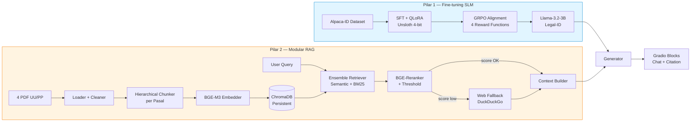

# Fine-tuned Chatbot Tim Legal berbasis RAG

[](./artifacts/3.ketentuan_penilaian.md)
[](https://www.python.org/)
[](https://colab.research.google.com/)
[](https://huggingface.co/unsloth/Llama-3.2-3B-Instruct)
[](https://huggingface.co/BAAI/bge-m3)
[](https://www.trychroma.com/)

> Chatbot legal berbahasa Indonesia yang menjawab pertanyaan seputar UU Cipta Kerja & turunannya (PP 5/2021, PP 35/2021, PP 51/2023, UU 6/2023) dengan grounding pada dokumen resmi dan sitasi pasal yang tepat.

---

## Overview

Proyek ini membangun **asisten AI internal untuk tim legal** — sistem yang mampu menjawab pertanyaan hukum secara cepat, akurat, dan **dapat dipertanggungjawabkan** (dengan sitasi pasal). Tidak boleh mengandalkan AI publik karena (a) kerahasiaan dokumen internal, (b) LLM publik tidak paham nuansa regulasi Indonesia dan cenderung berhalusinasi.

Solusi = **2 pilar** yang di-orchestrate menjadi satu chatbot:

1. **Fine-tuning SLM** (Llama-3.2-3B-Instruct via Unsloth + QLoRA) — mengajarkan model berperilaku seperti asisten hukum berbahasa Indonesia yang formal dan runtut.
2. **Retrieval-Augmented Generation (RAG)** — pipeline modular yang meng-index 4 PDF regulasi dan menyuntikkan konteks pasal terkait ke setiap query, sehingga jawaban selalu grounded ke sumber resmi.

Arsitektur dirancang **portable**: dengan mengganti satu file konfigurasi dan drop PDF baru ke `data/raw/`, sistem yang sama bisa dipakai ulang untuk domain medis (SOP rumah sakit), keuangan (regulasi OJK), atau customer support (KB internal). Lihat bagian [Portable ke Domain Lain](#portable-ke-domain-lain).

---

## Architecture



Detail arsitektur per komponen: [`docs/architecture.md`](./docs/architecture.md) *(akan diisi di Tahap 1)*.

---

## Quickstart

### Local (Windows 11 / PowerShell) — dev & prototyping

```powershell
# 1. Clone / masuk ke folder proyek
cd "d:\Kalachakra\docs\hackaton_PIDI\Pengembangan Generative AI berbasis_LLM\Fine-tuned_Chatbot_Tim_Legal_berbasis_RAG"

# 2. Setup venv (Python 3.11)
python -m venv .venv
.\.venv\Scripts\Activate.ps1
pip install -r requirements.txt

# 3. Set secrets
Copy-Item .env.example .env
# edit .env → isi HF_TOKEN, WANDB_API_KEY

# 4. Copy 4 PDF regulasi ke data/raw/
New-Item -ItemType Directory -Force data\raw | Out-Null
Copy-Item "artifacts\document_knowledge_RAG\PP Nomor 5 Tahun 2021.pdf"  data\raw\PP_5_2021.pdf
Copy-Item "artifacts\document_knowledge_RAG\PP Nomor 35 Tahun 2021.pdf" data\raw\PP_35_2021.pdf
Copy-Item "artifacts\document_knowledge_RAG\PP Nomor 51 Tahun 2023.pdf" data\raw\PP_51_2023.pdf
Copy-Item "artifacts\document_knowledge_RAG\UU Nomor 6 Tahun 2023.pdf"  data\raw\UU_6_2023.pdf

# 5. Prototype VERIFY-FIRST (Tahap 1)
python scripts\01_verify_pdf_loader.py
python scripts\02_verify_chunker.py

# 6. Buka notebook kerja
jupyter lab notebooks\
```

### Colab (untuk training berat + inference)

Buka `notebooks/02_finetune_sft.ipynb` di [Google Colab](https://colab.research.google.com/) dengan runtime **T4 GPU 16 GB**. Setup secrets `HF_TOKEN` & `WANDB_API_KEY` via **Colab Secrets** (menu kunci di kiri).

Semua notebook di `submission/` sudah siap dijalankan di Colab T4 — upload zip, extract, Run All.

---

## Configuration

Seluruh parameter tunable ada di `configs/`. **Jangan hardcode di code** — selalu load dari YAML.

| File | Isi |
|---|---|
| `configs/model_config.yaml` | SLM ID, LoRA rank/alpha/dropout, QLoRA 4-bit params, target_modules, tokenizer chat_template |
| `configs/rag_config.yaml` | `chunk_size`, `chunk_overlap`, `top_k`, `rerank_top_n`, threshold reranker, toggle HyDE & web_fallback |
| `configs/training_config.yaml` | `learning_rate`, `batch_size`, `grad_accum`, `num_epochs`, `eval_strategy`, `warmup_ratio`, `seed`=42, `save_steps` |
| `configs/grpo_config.yaml` | `num_generations`, `max_completion_length`, reward_weights (format/length/correctness/language), `beta` KL |
| `configs/paths.yaml` | Semua path (data, models, chroma, outputs) — override per environment (Colab vs lokal) |

Contoh load:

```python
import yaml
with open("configs/rag_config.yaml") as f:
    cfg = yaml.safe_load(f)
chunker = PerPasalChunker(size=cfg["chunk_size"], overlap=cfg["chunk_overlap"])
```

---

## Portable ke Domain Lain

Arsitektur ini **domain-agnostic**. Untuk memakai ulang di domain lain (misal SOP medis, regulasi OJK, KB customer support):

1. **Drop PDF baru** ke `data/raw/` (ganti 4 PDF legal).
2. **Edit `configs/rag_config.yaml`**:
   - Ubah `chunk_strategy` (`per_pasal` → `per_section` / `per_paragraph` sesuai struktur dokumen).
   - Sesuaikan `metadata_schema` (mis. `bab/pasal` → `chapter/sop_id`).
3. **Edit `configs/model_config.yaml`** kalau ingin fine-tune ulang dgn dataset domain baru — kalau tidak, base SLM cukup general untuk RAG-only setup.
4. **Rebuild index**: `python scripts/04_verify_retriever.py`.
5. **UI dan generator TIDAK perlu diubah** — mereka hanya membaca config.

Tidak ada satu baris kode di `src/rag/*.py` yang menyebut kata "pasal" atau "UU" — semua string domain-spesifik berada di config dan data. Inilah yang membuat pipeline benar-benar reusable.

---

## Evaluation Results

*(Akan diisi setelah eksperimen selesai — Tahap 4. Format tabel adalah placeholder.)*

### Retrieval-only (hit@k, MRR, NDCG)

| Setup | hit@1 | hit@3 | hit@5 | MRR | NDCG@5 |
|---|---:|---:|---:|---:|---:|
| Baseline (semantic BGE-M3) | _TBA_ | _TBA_ | _TBA_ | _TBA_ | _TBA_ |
| + BM25 Ensemble (RRF) | _TBA_ | _TBA_ | _TBA_ | _TBA_ | _TBA_ |
| + Reranker BGE-v2-m3 | _TBA_ | _TBA_ | _TBA_ | _TBA_ | _TBA_ |
| + HyDE | _TBA_ | _TBA_ | _TBA_ | _TBA_ | _TBA_ |

### End-to-end (RAGAs)

| Setup | Faithfulness | Answer Relevancy | Context Precision | Context Recall |
|---|---:|---:|---:|---:|
| Base Llama-3.2-3B + RAG | _TBA_ | _TBA_ | _TBA_ | _TBA_ |
| + SFT (Alpaca-ID) | _TBA_ | _TBA_ | _TBA_ | _TBA_ |
| + SFT + GRPO | _TBA_ | _TBA_ | _TBA_ | _TBA_ |

Detail eksperimen: [`docs/benchmark.md`](./docs/benchmark.md).

---

## Project Structure

```
Fine-tuned_Chatbot_Tim_Legal_berbasis_RAG/
├── CLAUDE.md              ← memory + hard rules (baca ini dulu tiap sesi)
├── README.md              ← file ini
├── requirements.txt       ← pipreqs-style (bukan pip freeze)
├── .env.example           ← template secrets
├── configs/               ← YAML config (semua magic number di sini)
├── src/                   ← core reusable code (data / rag / finetune / eval / ui)
├── scripts/               ← prototyping VERIFY-FIRST
├── notebooks/             ← notebook kerja (bukan submission)
├── data/                  ← raw / processed / test_set / chroma_db
├── models/                ← local model cache (git-ignored)
├── outputs/               ← log training, eval reports, screenshots
├── tests/                 ← pytest unit test per-layer RAG
├── docs/                  ← architecture, decisions, benchmark
├── panduan/               ← Checklist_Pengerjaan.md + Peta_Kerja_Bertahap.md
├── artifacts/             ← instruksi Dicoding + PDF source (READ-ONLY)
└── submission/            ← hasil final zip
```

Detail lengkap + rationale per folder ada di [`CLAUDE.md`](./CLAUDE.md) section **STRUKTUR FOLDER**.

---

## License & Credits

- **Author**: Nazhif Setya Nugroho — dev@kalachakra.io
- **Program**: Dicoding — Pengembangan Generative AI berbasis LLM (Advanced Track)
- **Base Model**: [`unsloth/Llama-3.2-3B-Instruct`](https://huggingface.co/unsloth/Llama-3.2-3B-Instruct)
- **Embedder**: [`BAAI/bge-m3`](https://huggingface.co/BAAI/bge-m3)
- **Reranker**: [`BAAI/bge-reranker-v2-m3`](https://huggingface.co/BAAI/bge-reranker-v2-m3)
- **Dataset SFT**: [`Ichsan2895/alpaca-gpt4-indonesian`](https://huggingface.co/datasets/Ichsan2895/alpaca-gpt4-indonesian)
- **Source dokumen**: JDIH Kementerian Sekretariat Negara RI (PP 5/2021, PP 35/2021, PP 51/2023, UU 6/2023)
