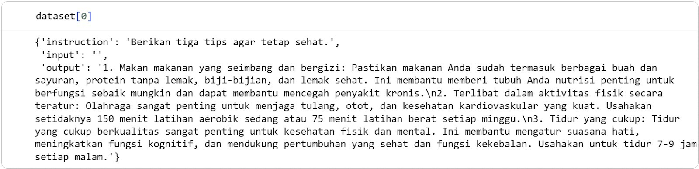
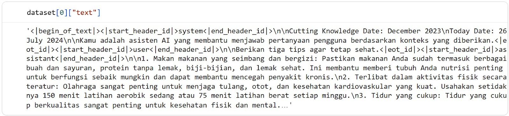

Submission ini mengharuskan Anda untuk melalui tiga tahapan pengembangan aplikasi generative AI berbasis LLM sederhana, yaitu fine-tuning, membangun sistem RAG, dan pembuatan interface. Oleh karena itu, penting untuk memperhatikan beberapa hal berikut ini sebelum memulai pengerjaan proyek.

Pastikan notebook dapat dijalankan sepenuhnya tanpa error sebelum dikirimkan, agar seluruh proses berjalan dengan baik dan hasil dapat diverifikasi.
Penuhi terlebih dahulu kriteria Basic Submission sebelum melanjutkan ke level Skilled dan Advanced.
Jika mengalami keterbatasan komputasi, Anda sangat dianjurkan untuk memanfaatkan GPU free tier yang tersedia di Google Colab atau Kaggle.
Dataset yang digunakan untuk proses fine-tuning dan GRPO (jika Anda melakukannya) WAJIB berupa dataset instruction (tanya–jawab) dalam format Alpaca berbahasa Indonesia. Dataset tersebut dapat diunduh melalui tautan yang telah disediakan di Hugging Face berikut ini.

[Ichsan2895/alpaca-gpt4-indonesian](https://huggingface.co/datasets/Ichsan2895/alpaca-gpt4-indonesian)

Dokumen yang digunakan merupakan empat file PDF berisi Undang-Undang (UU) yang WAJIB digunakan seluruhnya oleh model untuk menjawab pertanyaan dari Legal Team. Anda dapat mengunduh dokumennya melalui tautan Google Drive berikut ini.
[text](<document_knowledge_RAG/PP Nomor 5 Tahun 2021.pdf>)
[text](<document_knowledge_RAG/PP Nomor 35 Tahun 2021.pdf>)
[text](<document_knowledge_RAG/PP Nomor 51 Tahun 2023.pdf>)
[text](<document_knowledge_RAG/UU Nomor 6 Tahun 2023.pdf>)

Model awal (pre-trained model) yang digunakan harus dipastikan dirancang untuk task Text Generation. Tujuan dari task ini adalah menguji kemampuan Anda dalam menyusun pipeline pelatihan.
Arsitektur model yang dipilih harus dipastikan didukung oleh Unsloth, seperti keluarga Llama, Mistral, Qwen, Gemma, atau Phi.
Model yang digunakan wajib dari penyedia terpercaya (contoh: Meta Llama, Qwen, Mistral) atau versi kuantisasi/optimasi resmi (contoh: model dari Unsloth).
Model hasil dari fine-tuning dan GRPO (jika melakukan) yang di-push ke repositori Hugging Face wajib disertakan tautannya pada sebuah file .txt (link_huggingface.txt). 

Kriteria 1: Fine-tuning LLM Anda Sendiri
Menggunakan fungsi mapping dari Hugging Face datasets untuk mengubah dataset mentah mereka ke dalam standar Chat Template yang didukung Unsloth. Misalnya, menggunakan format Llama-3 atau ChatML. Pastikan Anda menampilkan output print dari satu baris dataset yang sudah terformat lengkap dengan token spesial. 
Contoh dataset yang BELUM di-mapping.

Contoh dataset yang SUDAH di-mapping.

Memanfaatkan teknik QLoRA saat memuat model dengan mengaktifkan double quantization dalam format 4-bit. Siswa wajib mendefinisikan Adapter LoRA pada setidaknya salah satu komponen komputasi utama model.
Multi-Head Attention
Feed Forward Network
Menjalankan SFTTrainer pada model text generation, minimal selama 800 steps hingga selesai tanpa terjadi error VRAM (OOM).
Mengunggah model hasil Fine-tuning Anda ke repositori Hugging Face agar dapat dipanggil kembali pada tahap inferensi RAG. Gunakan perintah model.push_to_hub dengan metode merged_16bit.

Reject (0 pts)
Tidak melakukan mapping pada dataset menggunakan Hugging Face datasets.
Tidak menggunakan teknik QLoRA untuk mengefisiensi proses fine-tuning dan justru melakukan full fine-tuning. Selain itu, tidak menempatkan LoRA pada setidaknya keseluruhan satu komponen komutasi utama.  
Tidak menjalankan SFTTrainer atau SFTTrainer dijalankan kurang dari 800 steps atau terjadi eror VRAM (OOM)
Tidak mengunggah model yang telah dilatih sebelumnya ke repositori Hugging Face.

Basic (2 pts)

Menggunakan fungsi mapping dari Hugging Face datasets untuk mengubah dataset mentah mereka ke dalam standar Chat Template yang didukung Unsloth. Misalnya menggunakan format Llama-3 atau ChatML. Pastikan Anda menampilkan output print dari satu baris dataset yang sudah terformat lengkap dengan token spesial. 
Contoh dataset yang BELUM di-mapping.

Contoh dataset yang SUDAH di-mapping.

Memanfaatkan teknik QLoRA saat memuat model dengan mengaktifkan double quantization dalam format 4-bit. Siswa wajib mendefinisikan Adapter LoRA pada setidaknya salah satu komponen komputasi utama model.
Multi-Head Attention
Feed Forward Network
Menjalankan SFTTrainer pada model text generation, minimal selama 800 steps hingga selesai tanpa terjadi error VRAM (OOM).
Mengunggah model hasil Fine-tuning Anda ke repositori Hugging Face agar dapat dipanggil kembali pada tahap inferensi RAG. Gunakan perintah model.push_to_hub dengan metode merged_16bit.

Skilled (3 pts)
Semua ketentuan Basic terpenuhi.
Membagi dataset menjadi train dan validation dan memodifikasi TrainingArguments pada Unsloth untuk memasukkan eval_dataset, mengaktifkan evaluation_strategy = "steps", dan mengatur logging.
Melakukan setidaknya dua kali percobaan atau eksperimen training dengan kombinasi hyperparameter yang berbeda untuk mencari tahu kombinasi hyperparameter yang menghasilkan kurva loss terbaik tanpa overfitting.

Advanced (4 pts)

Semua ketentuan Skilled terpenuhi.
Anda akan melakukan GRPO menggunakan GRPOTrainer dari TRL dan Unsloth pada model yang telah di fine-tuning sebelumnya. Oleh karena itu, Anda perlu memuat kembali model instruct buatan versi Anda.
Saat melakukan GRPO, Anda haru membuat beberapa Reward Model dengan deskripsi berikut.
format_reward_func: Menggunakan strategi Reward Shaping untuk memberikan poin bertahap (maksimal +1.0) guna memudahkan model belajar format yang benar.
Jika model berhasil membuka responsnya dengan tag <think>: Poin +0.2
Jika model berhasil menutup pemikirannya dengan tag </think>: Poin +0.3
Jika formatnya sempurna (berada di awal kalimat, ditutup dengan benar, dan diikuti oleh jawaban akhir): Poin +1.0
Penalti: Memberi pengurangan Poin -0.5 jika model berhalusinasi dengan memunculkan tag <think> atau </think> lebih dari satu kali.
reasoning_length_reward: Anda wajib membuat fungsi yang memberikan poin proporsional berdasarkan jumlah karakter teks yang berada di dalam tag <think> ... </think>. Ini bertujuan memaksa model untuk benar-benar menjabarkan proses berpikirnya, bukan sekadar menulis tag kosong. Fungsi ini juga harus toleran jika proses berpikir model terpotong oleh batas maksimal token. Berikut ketentuan Poinnya:
Jika TIDAK ada tag <think>, atau tag ada tetapi isinya kosong/hanya spasi: Poin +0.0
Jika panjang isi teks <think> kurang dari 50 karakter (terlalu singkat): Poin +0.2
Jika panjang isi teks <think> antara 50 hingga 199 karakter: Poin +0.5
Jika panjang isi teks <think>200 karakter ataulebih (penalaran detail): Poin +1.0
correctness_reward: Memberi poin +1.0 jika output akhir model (setelah proses berpikir) mengandung ground truth dari dataset Anda, atau memiliki tingkat kemiripan teks (misalnya menggunakan metrik ROUGE/BLEU) dengan jawaban pada kolom Output.
language_reward_func: Memberi penalti (poin -0.5) jika model tiba-tiba menjawab menggunakan bahasa Inggris, dan memberi poin +1.0 jika output akhirnya murni menggunakan tata bahasa Indonesia.
Anda sangat diarahkan untuk mengatur parameter seperti num_generations dan max_completion_length untuk memitigasi terjadinya Out of Memory (OOM).
Menguji model hasil GRPO ke dalam pipeline RAG. Model harus menunjukkan proses berpikirnya sebelum memberikan jawaban final berdasarkan dokumen yang diambil. Test Case Wajib:
Prompt: "Saya staf admin, kemarin lembur 3 jam untuk beresin laporan. Apakah saya berhak dapat uang lembur?"
Output model harus menampilkan proses reasoning yang ditandai dengan token spesial <think> . Contohnya: “<think> User adalah staf admin (pekerja non-manajerial). Berdasarkan PP 35/2021, pekerja yang bekerja melebihi waktu kerja standar wajib dibayar upah lembur. 3 jam lembur harus dibayar.</think> Ya, Anda berhak. Berdasarkan PP No. 35 Tahun 2021, perusahaan wajib membayar upah lembur untuk staf admin yang bekerja melebihi waktu kerja normal (8 jam sehari).”

Kriteria 2: Membangun Sistem RAG
Memuat dokumen PDF dan melakukan pemotongan teks menggunakan text splitter dengan ukuran chunk dan overlap yang ditentukan secara eksplisit.
Menggunakan model embedding open-source untuk mengubah chunk teks menjadi vektor, dan menyimpannya ke dalam Vector Database lokal (ChromaDB atau FAISS).
Memuat model hasil fine-tuning, merangkai prompt yang berisi {context} dan {question}, lalu melakukan inference atau generation.
Membungkus pipeline RAG mereka ke dalam sebuah interface sederhana. Anda bisa memilih salah satu dari dua cara termudah berikut ini.
Menggunakan Interactive Python Loop dengan fungsi input() dan mencetak hasilnya menggunakan IPython.display.Markdown agar rapi.
Menggunakan Gradio gr.Interface dasar (hanya satu kotak teks input dan satu kotak teks output).

Reject (0 pts)

Tidak memuat dokumen PDF dan menggunakan ukuran chunk yang sangat besar (>5000) tanpa overlap yang ditentukan secara eksplisit.
Menggunakan model embedding proprietary misal dari OpenAI untuk mengubah chunk teks menjadi vektor dan menyimpannya ke dalam Vector Database lokal (ChromaDB atau FAISS).
Memuat model baru dari Hugging Face atau menggunakan model Proprietary (bukan model hasil dari kriteria 1) untuk melakukan inference atau generation.

Basic (2 pts)

Memuat dokumen PDF dan melakukan pemotongan teks menggunakan text splitter dengan ukuran chunk dan overlap yang ditentukan secara eksplisit.
Menggunakan model embedding open-source untuk mengubah chunk teks menjadi vektor, dan menyimpannya ke dalam Vector Database lokal (ChromaDB atau FAISS).
Memuat model hasil fine-tuning, merangkai prompt yang berisi {context} dan {question}, lalu melakukan inference atau generation.
membungkus pipeline RAG mereka ke dalam sebuah antarmuka sederhana. Anda bisa memilih salah satu dari dua cara termudah berikut ini.
Menggunakan Interactive Python Loop dengan fungsi input() dan mencetak hasilnya menggunakan IPython.display.Markdown agar rapi.
Menggunakan Gradio gr.Interface dasar (hanya satu kotak teks input dan satu kotak teks output).

Skilled (3 pts)

Semua ketentuan Basic terpenuhi.
Menambahkan metadata enrichment terhadap dokumen yang digunakan.
Membuat metadata filtering serta memberikan sitasi terhadap jawaban yang dihasilkan oleh AI.
Membangun Ensemble Retriever yang menggabungkan pencarian berbasis keyword (BM25) dengan pencarian semantik (FAISS/ChromaDB). Anda juga perlu menentukan bobot untuk setiap retriever yang ingin digabungkan. Ambil atau retrieve setidaknya 5 document untuk tahap selanjutnya.
Membangun Parent-Child Retriever dengan memisahkan dokumen menjadi Child Chunks (potongan kecil untuk pencarian vektor) dan Parent Chunks (potongan besar/halaman utuh untuk konteks LLM).

Advanced (4 pts)

Semua ketentuan Skilled terpenuhi.
Mengimplementasikan HyDE (Hypothetical Document Embeddings) untuk melakukan transformasi pada Query dengan jawaban-jawaban halusinasi awal yang dibuat oleh LLM. Pastikan untuk menghasilkan setidaknya 2 output jawaban halusinasi.
Menggunakan model Reranker untuk mengurutkan ulang dan hanya mengambil Top-K (misal 3 chunk) yang paling relevan.
Mengekstrak Relevance Score dari hasil output model Cross-Encoder (Reranker) pada dokumen urutan pertama (Top-1). Siswa kemudian membuat aturan kondisional (if-else). Jika skor Reranker Top-1 berada di bawah threshold yang ditentukan, sistem mengabaikan dokumen lokal dan beralih memanggil fungsi DuckDuckGo Search untuk mencari informasi dari internet.