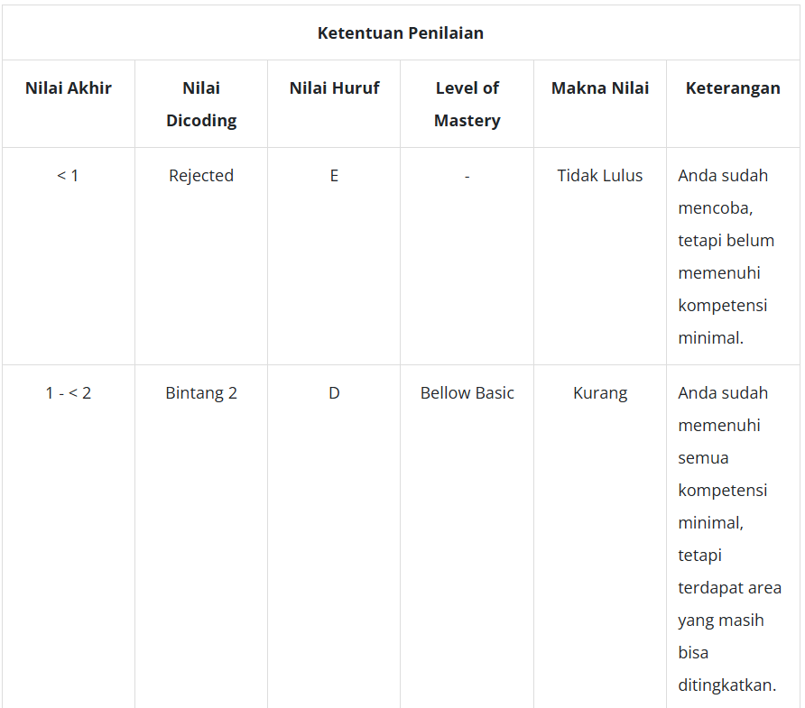
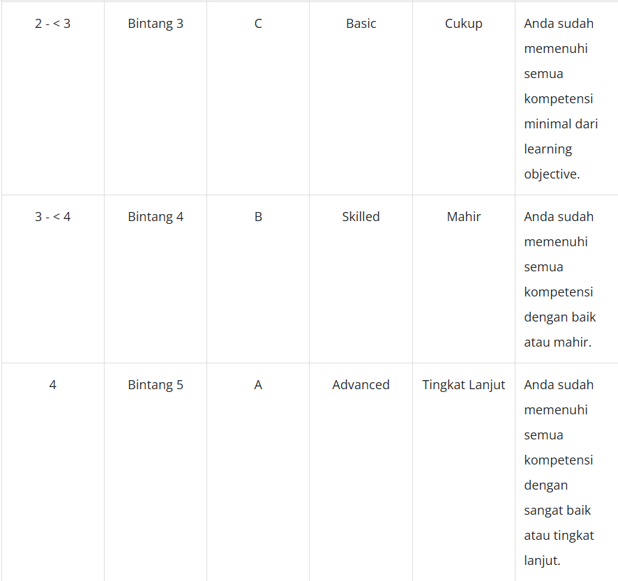

Perhitungan Nilai

Nilai akhir yang Anda dapatkan diperoleh melalui perhitungan formula berikut.
Nilai Akhir = Total Points / Jumlah Kriteria
Catatan:
Perhitungan nilai akhir di atas digunakan apabila setiap kriteria mendapatkan nilai 2 pts atau tidak ada kriteria yang ditolak.

Tabel Penilaian: 
Adapun untuk penilaian submission dapat dilihat pada tabel berikut.

