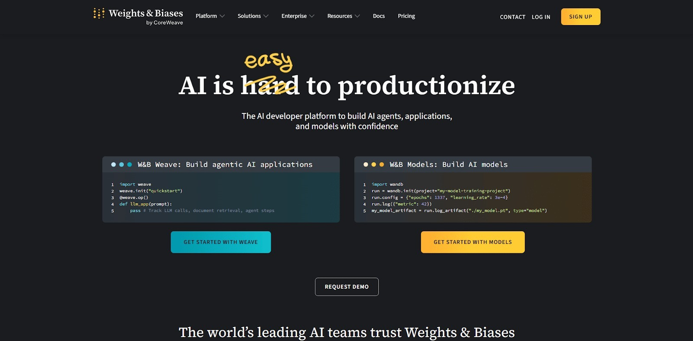
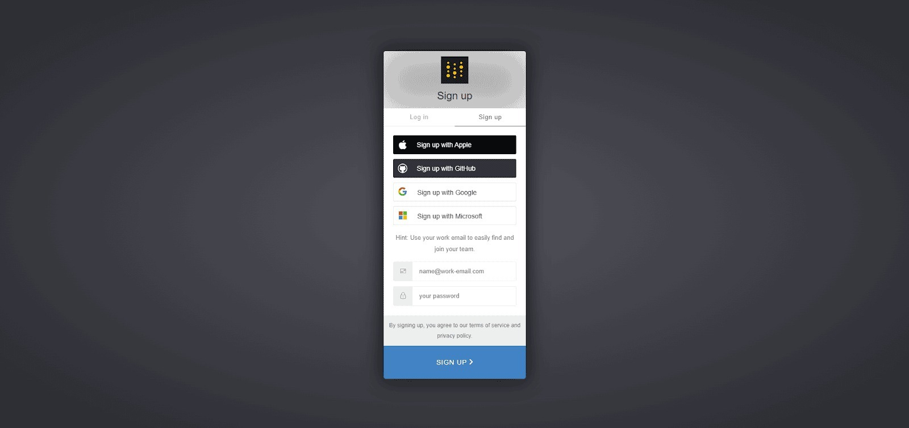
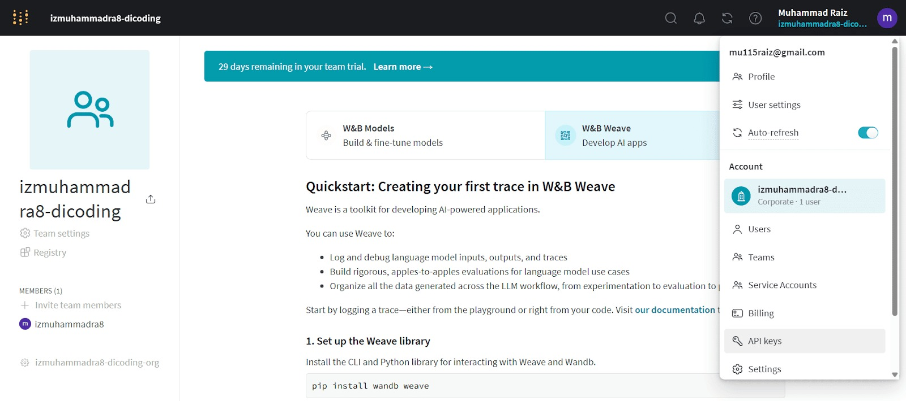
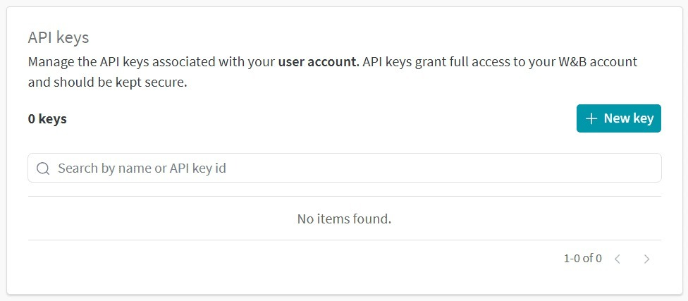
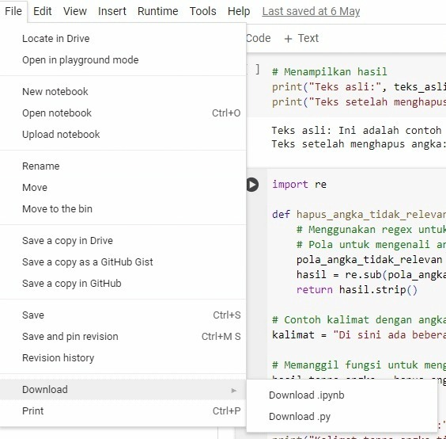

1. Bagi yang belum mengetahui cara mendapatkan token WandB untuk proses logger
Kunjungi tautan Weight & Biases.

Setelah itu, lakukan sign up atau sign in dengan akun Google milik Anda atau dengan akun lainnya sesuai dengan preferensi.

Setelah semua tahapan pendaftaran selesai, Anda tinggal pergi ke menu API Keys seperti berikut ini.

Nah, setelah masuk, Anda akan diarahkan ke tampilan berikut ini.

Di sana, Anda dapat membuat token atau API keys sendiri.

2. Hindari memuat ulang model berulang kali saat melakukan eksperimen pada satu Notebook yang sama. Jika terpaksa untuk mengganti model bahasa yang digunakan, sangat disarankan untuk me-restart runtime agar memory tidak terbuang sia-sia karena menyimpan model yang lalu.

3. Hindari memuat ulang model berulang kali saat melakukan eksperimen pada satu Notebook yang sama. Jika terpaksa untuk mengganti model bahasa yang digunakan, sangat disarankan untuk me-restart runtime agar memory tidak terbuang sia-sia karena menyimpan model yang lalu.
pip freeze requirements.txt
pipreqs
pipreqs menghasilkan file requirements.txt yang hanya mencantumkan library yang digunakan dalam proyek berdasarkan impor yang ada dalam file kode.
pipreqs /path/to/your/project

Tentunya kedua cara tersebut memiliki kelebihan dan kekurangan. Untuk mengetahui lebih lengkap terkait freeze dan pipreqs, Anda dapat membaca di tautan berikut: 
https://www.dicoding.com/blog/ternyata-mengelola-dependensi-proyek-python-semudah-ini-lo/

5. Untuk export project yang Anda kerjakan di Colaboratory sebagai berkas ipynb, klik tombol file yang berada di pojok kiri atas Colaboratory dan pilih download .ipynb.
