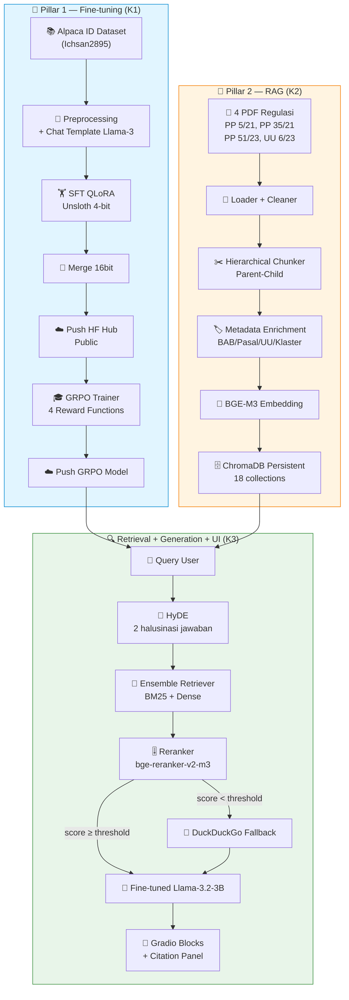
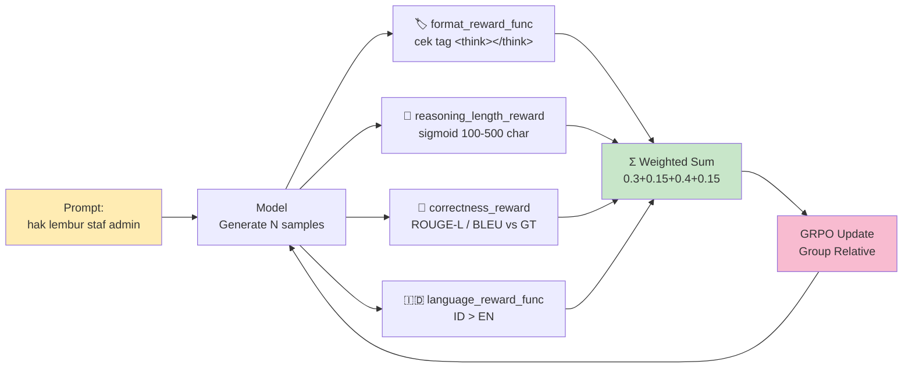

# Checklist Pengerjaan — Fine-tuned Chatbot Tim Legal berbasis RAG


> **Peserta**: Nazhif Setya Nugroho · **Target**: Advanced ⭐⭐⭐⭐⭐ (K1=4pt, K2=4pt, K3=4pt)
> **Deadline internal**: sesuai [Peta Kerja Bertahap](Peta_Kerja_Bertahap.md) · **Editor**: VSCode + Markdown Preview Enhanced

---

## 📊 Overall Progress

<progress value="0" max="100">0%</progress> **0% (0/3 Kriteria selesai)**

| Kriteria | Target | Status | Progress |
|---|---|---|---|
| K1 — Fine-tuning (SFT + GRPO) | Advanced 4pt | ⏳ | <progress value="0" max="100"></progress> 0% |
| K2 — RAG (HyDE + Reranker + DDG) | Advanced 4pt | ⏳ | <progress value="0" max="100"></progress> 0% |
| K3 — Interface (Gradio Blocks + Citation) | Advanced 4pt | ⏳ | <progress value="0" max="100"></progress> 0% |

**Legend Status**: ✅ selesai · 🔄 in-progress · ⏳ pending · ⚠️ blocked · ❌ gagal / perlu rework

---

## 🗺️ Big Picture Pipeline



### Detail: 4 Reward Functions GRPO



---

## K1 — Fine-tuning ⏳ 0%

<progress value="0" max="100">0%</progress>

> **Notebook**: `Fine-tuning_submission_PGABL_Nazhif_Setya_Nugroho.ipynb` + `GRPO_submission_PGABL_Nazhif_Setya_Nugroho.ipynb`

### 🟢 Basic (target: 2pt)

- [ ] **Load Llama-3.2-3B-Instruct via Unsloth 4-bit QLoRA**
  _Kenapa: Unsloth wajib (rubric), 3B fit T4 16GB, 4-bit hemat VRAM ~4GB._
- [ ] **Chat template Llama-3 via HF `datasets.map()`**
  _Kenapa: Llama-3 pakai `<|start_header_id|>...<|end_header_id|>` — salah template = model bingung role._
- [ ] **Print output dataset ter-format (verifikasi special tokens)**
  _Kenapa: rubric eksplisit minta bukti visual — cek `<|begin_of_text|>` muncul, `<|eot_id|>` di akhir tiap turn._
- [ ] **Definisi LoRA adapter di MHA + FFN**
  Config saran: `r=16, alpha=32, dropout=0.05, target_modules=["q_proj","k_proj","v_proj","o_proj","gate_proj","up_proj","down_proj"]`
  _Kenapa: MHA saja tidak cukup — rubric minta MHA + FFN untuk Skilled._
- [ ] **Training SFTTrainer ≥800 steps tanpa OOM**
  _Kenapa: <800 = auto Basic gagal. Pakai `gradient_checkpointing="unsloth"` + `fp16=True` (T4 tidak support bf16 native)._
- [ ] **`push_to_hub_merged(save_method="merged_16bit")` ke HF Public**
  _Kenapa: rubric wajib `merged_16bit` (bukan adapter saja), dan HARUS Public — Private = auto reject._

### 🟡 Skilled (target: 3pt, di ATAS Basic)

- [ ] **Split train/val (90/10 stratified)** (seed=42)
  _Kenapa: stratified biar distribusi panjang instruksi/kategori ter-preserve di val set._
- [ ] **`eval_strategy="steps"` + `eval_steps=100` di `TrainingArguments`**
  _Kenapa: rubric eksplisit minta `eval_strategy` diset — default `"no"` = auto downgrade._
- [ ] **Eksperimen 1: baseline** (`lr=2e-4, batch=2, grad_accum=4, r=16`)
- [ ] **Eksperimen 2: variasi** (pilih salah satu: `lr=5e-5` ATAU `r=32` ATAU scheduler `cosine` vs `linear`)
- [ ] **Tabel perbandingan train_loss + eval_loss + kualitatif output**
  _Kenapa: 2 eksperimen TANPA justifikasi tabular = skilled tidak dikasih._

### 🔴 Advanced (target: 4pt, WAJIB untuk ⭐⭐⭐⭐⭐)

- [ ] **File terpisah `GRPO_submission_PGABL_Nazhif_Setya_Nugroho.ipynb`**
  _Kenapa: Dicoding minta file GRPO terpisah dari SFT._
- [ ] **`GRPOTrainer` dari TRL + Unsloth patch**
  _Kenapa: Unsloth punya patch khusus GRPO agar muat di T4 — vanilla TRL biasanya OOM._
- [ ] **`format_reward_func`**: regex `r"<think>.*?</think>"` — penalti -1 kalau tidak ada, reward +1 kalau ada
- [ ] **`reasoning_length_reward`**: sigmoid smooth di rentang 100-500 char di dalam `<think>` (peak di ~300 char)
  _Kenapa: reward binary (ada/tidak) bikin model spam tag pendek — sigmoid mendorong reasoning substantif._
- [ ] **`correctness_reward`**: ROUGE-L score vs ground truth (bisa juga BLEU-4)
  _Kenapa: ROUGE-L cocok untuk QA legal karena tolerir paraphrase._
- [ ] **`language_reward_func`**: reward Indonesian
  Opsi: (a) `langdetect` prob ID · (b) ratio Indonesian stopwords (`Sastrawi`)
  _Kenapa: Llama-3.2-3B default cenderung code-switch ke English — reward ini yang bikin output bahasa Indonesia konsisten._
- [ ] **Test case wajib**: prompt "berapa hak lembur staf admin"
  Output HARUS punya:
  - Tag `<think>...</think>` dgn reasoning multi-step
  - Jawaban final di luar tag `<think>`
  - Sitasi pasal (mis. Pasal 78 PP 35/2021)
  _Kenapa: ini test case eksplisit dari brief — reviewer akan cek persis prompt ini._
- [ ] **Push GRPO model ke HF Public**
  _Kenapa: konsisten dgn K1 Basic — link HF wajib valid & public._

---

## K2 — RAG ⏳ 0%

<progress value="0" max="100">0%</progress>

> **Notebook**: `RAG_submission_PGABL_Nazhif_Setya_Nugroho.ipynb`
> **Arsitektur**: modular — `loader → cleaner → chunker → embedder → vector_store → retriever → reranker → generator`

### 🟢 Basic (target: 2pt)

- [ ] **Load 4 PDF regulasi** (dari `data/raw/`)
  - [ ] `PP_5_2021.pdf` (739 hlm, mixed text-layer) — `pdfplumber` untuk batang tubuh; skip/OCR terpisah untuk KBLI matrix
  - [ ] `PP_35_2021.pdf` (56 hlm, mixed OCR) — `pdfplumber` (robust untuk artefak)
  - [ ] `PP_51_2023.pdf` (27 hlm, GOOD text-layer) — `pypdf` cukup
  - [ ] `UU_6_2023.pdf` (1127 hlm, 85 MB, heavy OCR, 15 klaster) — WAJIB parser eksternal + hierarchical
  _Kenapa: UU 6/2023 kalau flat chunking = konteks legal antar-klaster nyampur = jawaban ngaco._
- [ ] **Text splitter dgn chunk size + overlap EKSPLISIT**
  Saran: `chunk_size=800, chunk_overlap=100` untuk flat; `parent=2000, child=800, overlap=100` untuk hierarchical.
  _Kenapa: rubric minta eksplisit — nilai default RecursiveCharacterTextSplitter tanpa parameter = downgrade._
- [ ] **Embedding open-source: `BAAI/bge-m3`**
  _Kenapa: multilingual (ID+EN), 8k context, mendukung dense+sparse+colbert dalam 1 model._
- [ ] **ChromaDB persistent** (`chromadb.PersistentClient(path="./data/chroma_db")`)
  _Kenapa: rubric minta persistent — in-memory = auto downgrade._
- [ ] **Load fine-tuned Llama-3.2-3B untuk generation** (dari HF hub K1)
- [ ] **Pipeline sederhana end-to-end** (`query → retrieve → generate → jawaban`)

### 🟡 Skilled (target: 3pt, di ATAS Basic)

- [ ] **Metadata enrichment**: setiap chunk carry
  ```python
  {"pdf_source": "UU_6_2023",
   "bab": "IV", "bagian": "Kedua", "pasal": "88",
   "klaster": "ketenagakerjaan",
   "uu_sektor_asal": "UU 13/2003",
   "jenis": "batang_tubuh",  # atau "penjelasan"
   "parent_id": "UU_6_2023_pasal_88_parent"}
  ```
  _Kenapa: tanpa metadata, sitasi jawaban tidak bisa spesifik "Pasal berapa"._
- [ ] **Metadata filtering di retrieval** (mis. user tanya soal ketenagakerjaan → filter `klaster="ketenagakerjaan"`)
- [ ] **Sitasi source di jawaban** (format: `[Sumber 1: UU 6/2023, BAB IV, Pasal 88]`)
- [ ] **Ensemble Retriever = BM25 (keyword) + Dense (semantic bge-m3)**
  Bobot saran: `0.4 * BM25 + 0.6 * Dense` (tuning) atau RRF (Reciprocal Rank Fusion)
  _Kenapa: BM25 tangkap istilah legal spesifik ("PPh 21"), Dense tangkap parafrase — komplementer._
- [ ] **Parent-Child Retriever** (small chunk ~800 token untuk retrieval; parent chunk ~2000 token untuk generation)
  _Kenapa: retrieval precision naik (chunk kecil = sinyal tajam), generation context kaya (parent = konteks penuh)._

### 🔴 Advanced (target: 4pt, WAJIB untuk ⭐⭐⭐⭐⭐)

- [ ] **HyDE — Hypothetical Document Embeddings**
  - [ ] Generate **minimal 2 halusinasi jawaban** dari query (pakai fine-tuned Llama)
  - [ ] Embed masing-masing halusinasi
  - [ ] Retrieve pakai embedding halusinasi (bukan query asli) → merge Top-K
  _Kenapa: query legal user sering pendek/vague ("lembur gaji"), halusinasi menghasilkan "vector target" mirip dokumen legal formal._
- [ ] **Reranker model `BAAI/bge-reranker-v2-m3`**
  - [ ] Re-rank Top-K (biasanya K=20 → Top-N=5) hasil ensemble+HyDE
  - [ ] **Extract relevance score** eksplisit ke variable (untuk citation panel)
- [ ] **Threshold-based fallback ke DuckDuckGo Search**
  ```python
  if max(rerank_scores) < 0.3:
      fallback_to_ddg(query)
  ```
  Library: `duckduckgo-search` (bukan API key)
  _Kenapa: kalau 4 PDF tidak cover pertanyaan user, DDG jaring info umum — hindari halusinasi model murni._
- [ ] **Tampilkan flag di jawaban** kalau pakai DDG (mis. "⚠️ Jawaban dari sumber eksternal (DuckDuckGo), bukan regulasi resmi. Verifikasi ke tim legal.")
  _Kenapa: transparansi ke tim legal — mereka HARUS tahu kalau sumber bukan regulasi._

---

## K3 — Interface ⏳ 0%

<progress value="0" max="100">0%</progress>

> **Advanced target**: Gradio Blocks + Chat + Citation panel + streaming

### 🟢 Basic (target: 2pt)

- [ ] **Pilih salah satu**:
  - Interactive Python Loop dgn `input()` di notebook (loop `while True` + exit)
  - ATAU Gradio `gr.Interface(fn=chat_fn, inputs="text", outputs="text")` dasar
  _Kenapa: rubric Basic minimal begini, tapi target kita Advanced — skip langsung ke Skilled+._

### 🟡 Skilled (target: 3pt)

- [ ] **Gradio Blocks layout** (`with gr.Blocks() as demo:`)
- [ ] **`gr.Chatbot` component** dgn history multi-turn (`type="messages"`)
- [ ] **`gr.Textbox` input + `gr.Button` submit**
- [ ] **Tombol clear history + retry**

### 🔴 Advanced (target: 4pt, WAJIB untuk ⭐⭐⭐⭐⭐)

- [ ] **Citation panel** (`gr.Dataframe` atau `gr.Accordion`) untuk setiap jawaban:
  - Rank (1-5)
  - Nama file PDF sumber
  - BAB & Pasal
  - Relevance score dari reranker (0-1)
  - Snippet chunk (200-300 char)
- [ ] **Streaming output** (`gr.Chatbot` + generator function dgn `yield` via `TextIteratorStreamer`)
  _Kenapa: UX jauh lebih baik untuk jawaban legal panjang._
- [ ] **Example queries pre-loaded** (`gr.Examples`) — mis. "berapa hak lembur staf admin", "aturan PHK 2023", "cuti melahirkan"
- [ ] **Source-type flag** — tampilkan `local_rag` vs `web_fallback` jelas
- [ ] **Handle empty query + error** (try/except → tampilkan pesan ramah)
- [ ] **`demo.launch(share=True)` di Colab + CDP screenshot bukti fungsional**
  _Kenapa: bukti ini yang jadi jaminan reviewer bahwa UI benar-benar interaktif._
- [ ] **Screenshot UI final** disimpan di `outputs/ui_evidence/gradio_ui.png`

---

## 🗓️ Milestone / Tahap Overview

Detail per-tahap ada di [`Peta_Kerja_Bertahap.md`](Peta_Kerja_Bertahap.md).

| Tahap | Fokus | Status | Deliverable | Est. |
|---|---|---|---|---|
| **0** | Persiapan env & credentials | ⏳ | Colab T4 + HF token + WANDB + configs/ + src/ skeleton | ~2h |
| **1** | Data prep (SFT dataset + 4 PDF + test-set) | ⏳ | `data/processed/` + `data/test_set/legal_qa_testset.jsonl` | ~4–6h |
| **2** | Fine-tuning K1 (SFT Basic → Skilled → GRPO Advanced) | ⏳ | 2 model HF public + 2 notebook (`Fine-tuning_*.ipynb`, `GRPO_*.ipynb`) | ~6–10h + wait |
| **3** | RAG K2 (Basic → Skilled → HyDE/Reranker/DDG Advanced) | ⏳ | ChromaDB persistent (18 collection) + `RAG_*.ipynb` | ~8–12h |
| **4** | Evaluasi (RAGAs + hit@k pada 3 tier) | ⏳ | `outputs/eval_reports/eval_YYYYMMDD.json` + `docs/benchmark.md` | ~3–5h |
| **5** | Interface K3 (Gradio Blocks + Citation + streaming) | ⏳ | UI final di RAG notebook + CDP screenshot | ~3–4h |
| **6** | Packaging & Submission | ⏳ | `PGABL_Nazhif_Setya_Nugroho.zip` (5 file flat) | ~2h |

**Total aktif**: ~28–43 jam. Kalau kerja 4h/hari fokus → **9–13 hari kalender**. Buffer 20% untuk gotchas → **11–16 hari**.

---

## 🚫 Hard Rules — Auto-Reject

| # | Rule | Kenapa fatal |
|---|---|---|
| ❌1 | AutoML / No-Code / UI-tool instan | Rubric wajib kode manual — Unsloth/TRL/ChromaDB di Python |
| ❌2 | Notebook tanpa output tersimpan | Reviewer tidak bisa verifikasi hasil training/retrieval |
| ❌3 | Model HF **Private** atau link salah | Reviewer tidak bisa akses = anggap tidak ada |
| ❌4 | Dokumen/dataset di luar yang disediakan | Skop: 4 PDF + Alpaca-ID |
| ❌5 | Chunk size >5000 atau overlap tidak eksplisit | Melanggar rubric + retrieval jadi ngaco |
| ❌6 | API key hardcoded di notebook | Security violation — pakai `google.colab.userdata` / `os.environ` |
| ❌7 | Embedding proprietary (OpenAI ada-002 dsb) | Rubric wajib open-source embedding (bge-m3 ✅) |
| ❌8 | Fine-tuning tanpa Unsloth | Rubric eksplisit Unsloth-supported |
| ❌9 | GRPO tidak ada padahal target Advanced | K1 auto turun ke Skilled = tidak dapat ⭐⭐⭐⭐⭐ |
| ❌10 | Model instruct/chat hasil fine-tune orang lain | Rubric eksplisit: wajib model hasil sendiri |

---

## ✅ Verifikasi Pre-Submission Checklist

### 📓 Notebooks

- [ ] `Fine-tuning_submission_PGABL_Nazhif_Setya_Nugroho.ipynb` di-run penuh, semua sel ada output
- [ ] `GRPO_submission_PGABL_Nazhif_Setya_Nugroho.ipynb` di-run penuh, test case "hak lembur staf admin" show `<think>` reasoning
- [ ] `RAG_submission_PGABL_Nazhif_Setya_Nugroho.ipynb` di-run penuh, minimal 3 contoh query + jawaban + citation
- [ ] Verifikasi via CLI:
  ```powershell
  jupyter nbconvert --execute --to notebook --inplace <nama>.ipynb
  ```
- [ ] Tidak ada cell error / traceback merah
- [ ] Semua `print()` verifikasi (chat template, dataset preview, retrieval result) tersimpan

### ☁️ HuggingFace

- [ ] Model SFT `merged_16bit` public — link valid, model card ada
- [ ] Model GRPO public — link valid
- [ ] `link_huggingface.txt` isi 2 URL (SFT + GRPO), satu per baris
- [ ] Buka link di incognito → pastikan accessible tanpa login

### 📦 Requirements

- [ ] `requirements.txt` di-generate pakai **`pipreqs`** (bukan `pip freeze`)
  ```powershell
  pip install pipreqs
  pipreqs .\src .\submission --force --savepath submission\requirements.txt
  ```
  _Kenapa: `pip freeze` bawa ratusan package Colab yang tidak dipakai — reviewer install jadi lama & konflik._
- [ ] Versi ter-pin (mis. `unsloth==2024.x`, `trl==0.12.x`, `chromadb==0.5.x`)

### 🗜️ Zip

- [ ] Naming persis: `PGABL_Nazhif_Setya_Nugroho.zip`
- [ ] Struktur **flat** (bukan `PGABL_.../PGABL_.../...`):
  ```
  PGABL_Nazhif_Setya_Nugroho.zip
  ├── Fine-tuning_submission_PGABL_Nazhif_Setya_Nugroho.ipynb
  ├── RAG_submission_PGABL_Nazhif_Setya_Nugroho.ipynb
  ├── GRPO_submission_PGABL_Nazhif_Setya_Nugroho.ipynb
  ├── link_huggingface.txt
  └── requirements.txt
  ```
- [ ] Buka zip lalu extract di folder lain → cek struktur benar
- [ ] Ukuran zip wajar (<20MB — kalau lebih, ada notebook yg embed model checkpoint = keluarkan)

### 🎯 Cross-check Advanced

- [ ] K1: Ada file GRPO + 4 reward functions ter-implementasi + test case "hak lembur staf admin"
- [ ] K2: Ada HyDE (min 2 halusinasi) + Reranker + threshold fallback DuckDuckGo
- [ ] K3: Gradio Blocks + Chat + Citation panel dgn source PDF + BAB/Pasal + relevance score + streaming

---

## 📎 Referensi Internal

- [`Peta_Kerja_Bertahap.md`](Peta_Kerja_Bertahap.md) — detail langkah per tahap (0-6)
- [`../CLAUDE.md`](../CLAUDE.md) — memory + hard rules + progress log
- [`../artifacts/2.kriteria_utama.md`](../artifacts/2.kriteria_utama.md) — rubric lengkap Dicoding
- [`../docs/benchmark.md`](../docs/benchmark.md) — hasil eval per eksperimen (akan diisi Tahap 4)

---

> 💡 **Tips MPE**: buka file ini dgn `Ctrl+Shift+V` (Markdown Preview Enhanced) di VSCode untuk render mermaid + progress bar. Update `<progress value="X">` manual per hari untuk tracking visual.

> 🎯 **Target akhir**: Advanced ⭐⭐⭐⭐⭐ — jangan puas di Skilled. Selisih effort GRPO vs SFT itu ~4 jam, tapi selisih rating bintangnya besar.
