## Rangkuman Kelas

*Teruntuk tangan yang senantiasa mengetik.*

*Teruntuk mata yang selalu menatap.*

*Kami ucapkan selamat untuk Anda yang telah mencapai ujung perjuangan.*

*Semoga kelak, keluh yang didapat menciptakan memoar indah yang akan terus Anda ingat!*

Selamat! Anda telah mencapai penghujung kelas Belajar Penerapan Machine Learning dengan Google Cloud. Mari rangkum secara saksama seluruh materi yang telah Anda pelajar.

## Rangkuman Mengelola Model TensorFlow di Lingkungan Produksi

Kita sudah berada pada penghujung materi Mengelola Model TensorFlow di Lingkungan Produksi. Sampai sini, Anda telah memiliki pengetahuan mengenai TensorFlow beserta ekosistemnya yang beragam.

Bisa disimpulkan bahwa TensorFlow dapat diterapkan pada berbagai lingkungan produksi yang berbeda. Mulai dari TensorFlow Lite untuk perangkat lokal atau on-device; TensorFlow.js untuk web browser, baik itu client-side maupun server-side; hingga terakhir ada TensorFlow Extended (TFX) yang digunakan pada lingkungan server untuk mengelola machine learning pipeline.

Mari kita rangkum secara saksama modul ini.

### Ekosistem TensorFlow

#### Pengenalan TensorFlow

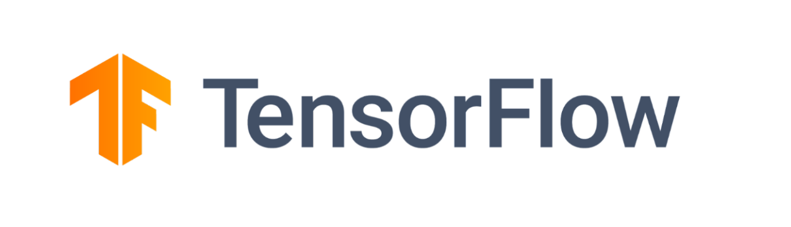

TensorFlow adalah end-to-end open source platform yang pertama kali dirilis pada akhir tahun 2015 dengan versi stabilnya mulai digunakan pada tahun 2017. Dikembangkan oleh Google Brain, awalnya TensorFlow digunakan untuk menjalankan komputasi numerik kompleks pada riset AI dan machine learning dalam lingkup internal Google.

Selama perkembangannya, TensorFlow menjadi tools efektif dan *powerful* untuk menyelesaikan permasalahan deep learning sampai akhirnya bisa diakses secara luas oleh publik. Alasan di balik populernya TensorFlow tidak luput dari kelebihan ekosistem tools yang dimilikinya. Tak hanya itu, sumber daya komunitas yang komprehensif dan fleksibel memungkinkan para peneliti serta developer dapat membangun dan menerapkan (deployment) aplikasi machine learning dengan mudah.

Pada dasarnya, TensorFlow adalah high-performance library untuk **komputasi numerik** yang memang tidak berfokus pada permasalahan machine learning saja.

Saat Anda menjalankan operasi TensorFlow dengan mengimplementasikan CPU dan GPU, TensorFlow secara *default* akan memprioritaskan perangkat GPU jika tersedia. Hal ini karena GPU memiliki tenaga komputasi yang lebih unggul dibanding tenaga CPU.

Di sisi lain, jika mesin yang Anda miliki hanya mempunyai CPU sebagai tenaga komputasinya, TensorFlow akan menggunakannya secara default. Terkecuali, Anda menentukan secara eksplisit perangkat yang akan digunakan dengan fungsi [tf.device](https://www.tensorflow.org/api_docs/python/tf/device).

Cara TensorFlow bekerja adalah dengan membuat directed acyclic graph (DAG) sebagai representasi dari komputasi yang akan Anda lakukan. Graph*,*sebenarnya adalah **struktur data**, terdiri dari objek [tf.Operation](https://www.tensorflow.org/api_docs/python/tf/Operation) sebagai representasi unit komputasi dan objek [tf.Tensor](https://www.tensorflow.org/api_docs/python/tf/Tensor) sebagai representasi unit data (berupa array). Graph mengalir (flow) dari satu operasi ke operasi yang lainnya.

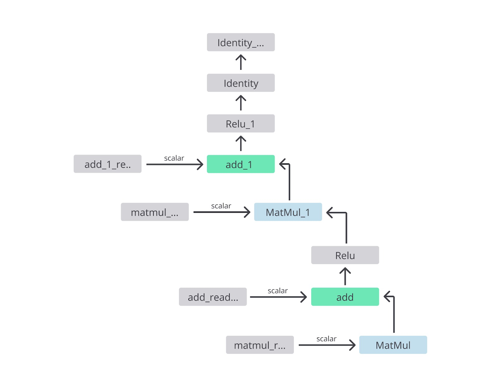

Graf merupakan struktur data. Hal ini menyebabkan kita dapat menyimpan, menjalankan, dan memulihkan (restore) graf tersebut tanpa kode orisinil Python.

Konsep eksekusi komputasi TensorFlow sebagai graf disebut dengan graph execution. Pada TensorFlow versi 1.x, graph execution menjadi prioritas utama karena kecepatan, efisien, dan fleksibilitas yang lebih unggul. Namun, pada TensorFlow 2.x hal tersebut tidak lagi dijadikan prioritas.

Setiap data yang digunakan dalam TensorFlow disebut sebagai **tensor**. Tensor adalah data array yang memiliki dimensi (*n-dimensional array*) dan mewakili operasi matematika dalam berbagai algoritma machine learning. Setiap dimensi array menentukan ranking dari tensor tersebut.

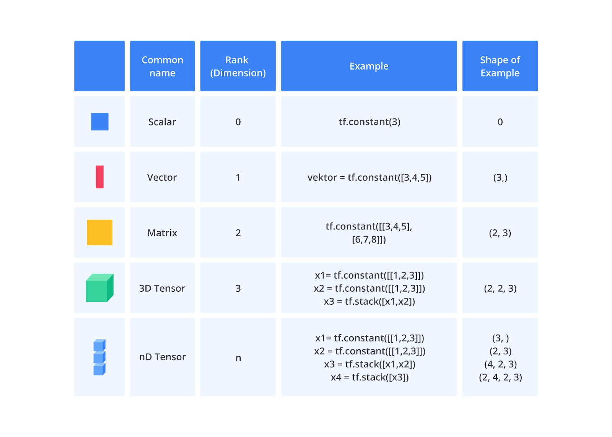

Tensor sebenarnya adalah array dan rank-nya menunjukkan dimensi array tersebut. Tensor dengan rank 0 adalah array dengan nol dimensi, begitu pun seterusnya.

Untuk membuat tensor menggunakan TensorFlow Python, Anda dapat menggunakan [tf.constant](https://www.tensorflow.org/api_docs/python/tf/constant) dan [tf.Variable](https://www.tensorflow.org/api_docs/python/tf/Variable).

Berikut adalah kode untuk membuat scalar menggunakan tf.constant.

```
scalar = tf.constant(3)

"""
Output:
3
"""
```

Berikut adalah kode untuk membuat vektor menggunakan tf.constant.

```
vektor = tf.constant([3,4,5])

"""
Output:
[3,4,5]
"""
```

Berikut adalah kode untuk membuat matriks menggunakan tf.constant.

```
matriks = tf.constant([[3,4,5],[6,7,8]]);

"""
Output:
[[3 4 5]
 [6 7 8]]
"""
```

Berikut adalah kode untuk membuat 3D tensor menggunakan tf.constant dan tf.stack.

```
x1= tf.constant([[1,2,3]])
x2 = tf.constant([[1,2,3]])
x3 = tf.stack([x1,x2])

"""
Output:
[[[1 2 3]]
 [[1 2 3]]]
"""
```

Lantas, bagaimana cara membuat kode di atas dan menjalankannya sebagai graf (graph execution)?

Dalam TensorFlow Python, Anda bisa membuat dan menjalankan graf menggunakan **tf.function**. Anda bisa menggunakannya sebagai decorator atau dipanggil secara langsung.

Berikut adalah contoh TensorFlow Python untuk melakukan operasi kuadrat vektor dan menjalankannya dengan graph execution.

```
def squareRoot(vektor):
    result = vektor ** 2
    print(result)
    return result

vektor = tf.constant([1.0, 2.0, 3.0, 4.0])
graph_function = tf.function(squareRoot)
graph_function(vektor)

"""
Output:
[1., 4., 9., 16.]
"""
```

Mengapa harus graf sebagai representasi proses komputasi? Jawabannya adalah portabilitas. Directed acyclic graph (DAG) adalah representasi komputasi yang Anda lakukan dalam model TensorFlow dan bersifat *independent-language*, artinya tidak bergantung dengan bahasa pemrograman tertentu.

Anda bisa saja membuat DAG menggunakan bahasa pemrograman Python, lalu menyimpan modelnya dan dipulihkan (restore) menggunakan program C++ untuk mengurangi latensi prediksi.

Bahkan, Anda bisa menggunakan kode Python yang sama untuk menjalankan model tersebut menggunakan GPU ataupun CPU. Lebih kerennya lagi, Anda bisa menjalankan aplikasi TensorFlow pada hampir seluruh platform, seperti lokal mesin, klaster cloud, iOS, Android, dan sebagainya.

Alasan di balik portabilitas itu karena graf yang Anda buat akan dijalankan menggunakan **TensorFlow execution engine**.

TensorFlow execution engine mengacu pada komponen TensorFlow dengan tanggung jawab untuk mengeksekusi komputasi yang didefinisikan dalam model machine learning termasuk graf.

Anda sebagai developer dapat membuat model menggunakan high-level language, seperti Python atau JavaScript. Ketika model tersebut dijalankan pada platform yang berbeda, model tersebut akan dijalankan oleh TensorFlow execution engine. Inilah alasan bahwa TensorFlow graf sangat portabel pada berbagai perangkat.

Proses prediksi secara *offline* memiliki keterbatasan yang bergantung pada kemampuan pemrosesan perangkat. Jika dibandingkan dengan cloud, kita bisa memilih tenaga komputasi yang tinggi untuk melakukan proses training. Hal ini akan berbeda dengan tenaga komputasi pada perangkat Android yang bisa dibilang cukup terbatas dan lebih lemah dibandingkan dalam cloud.

#### Hierarki TensorFlow API

Saat Anda menjalankan kode atau sintaks TensorFlow, sebenarnya di balik layar terjadi interaksi dengan TensorFlow API.

TensorFlow API adalah interface pemrograman yang disediakan oleh TensorFlow untuk memungkinkan developer dapat melakukan pembangunan, pelatihan, dan menggunakan model machine learning.

TensorFlow API memiliki hierarki berikut.

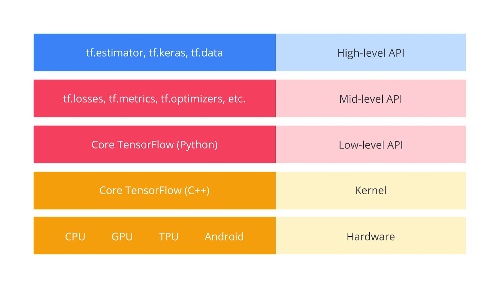

Lapisan paling bawah atau abstraksi tingkat rendah TensorFlow API adalah lapisan yang mengimplementasikan kode dengan berbagai platform. Seorang developer jarang menyentuh lapisan ini, kecuali seorang teknisi dari produsen perangkat keras dan memungkinkan untuk mengakselerasi perangkat keras tersebut supaya optimal bagi TensorFlow.

Lapisan kedua dari bawah adalah TensorFlow C++ API. Umumnya, lapisan ini digunakan untuk membuat operasi TensorFlow secara custom. Anda bisa membuat operasi khusus dalam C++, lalu mendaftarkannya sebagai operasi TensorFlow.

Lapisan ketiga adalah Python API. Pada lapisan ketiga ini, Anda dapat melakukan operasi numerik menggunakan kode-kode yang telah tersedia dalam bahasa pemrograman Python. Beberapa operasi yang dapat digunakan adalah penjumlahan (add), pengurangan (substract), perkalian matriks, mengubah dimensi array, membuat variabel, tensor, dan sebagainya.

Selain Python API yang secara spesifik digunakan untuk komputasi numerik, ada juga lapisan keempat, yaitu TensorFlow API. Ini digunakan untuk melakukan aktivitas pembuatan model machine learning, seperti model **artificial neural networks**(jaringan saraf tiruan).

Lapisan keempat ini umumnya digunakan untuk pemrosesan deep learning. Misalnya, Anda ingin melakukan evaluasi model menggunakan *root means squared error* (RMSE) maka tf.metrics bisa digunakan.

Lapisan terakhir adalah *high-level*API yang membantu Anda untuk melakukan distributed training, data processing, model definition, compilation, dan training.

Salah satu contoh *high-level* TensorFlow API adalah tf.estimator yang mampu mengenkapsulasi proses training, evaluation, prediction, dan export untuk melakukan serving model.

Sederhananya, tingkat ini memberikan kemudahan untuk Anda menjalankan model hanya menggunakan beberapa baris kode saja.

#### Ekosistem

TensorFlow memiliki ekosistem yang berguna untuk meningkatkan kinerja dan performa pada masing-masing perangkat. Inilah ekosistem tersebut.

1. TensorFlow,
2. TensorFlow.js,
3. TensorFlow Lite, dan
4. TensorFlow Extended (TFX).

### TensorFlow

Ekosistem pertama tentunya *the original* TensorFlow yang menggunakan Python API untuk mengontrol semua pembuatan, pemrosesan, hingga evaluasi machine learning.

Secara umum, ketika orang berbicara tentang “TensorFlow” tanpa spesifikasi tambahan, mereka merujuk pada TensorFlow yang dirancang untuk Python.

Materi pengenalan TensorFlow di awal, mulai dari sintaks untuk membuat tensor, seperti **tf.constant**, **tf.Variable**, dan **tf.stack**, hingga mengenai hierarki TensorFlow API, merujuk pada ekosistem TensorFlow Python ini.

Saat ini, TensorFlow berada pada versi 2.x dengan berbagai fitur utama yang menarik. Salah satu fiturnya adalah eager execution.

Eager execution adalah konsep yang merujuk pada proses eksekusi secara dinamis, mirip seperti cara Python biasa beroperasi.

Berikut adalah kode untuk melakukan operasi kuadrat vektor menggunakan TensorFlow Python versi 2.x dengan eager execution.

```
def squareRoot(vektor):
    result = vektor ** 2
    print(result)
    return result

vektor = tf.constant([1.0, 2.0, 3.0, 4.0])
squareRoot(vektor)

"""
Output:
[1., 4., 9., 16.]
"""
```

### TensorFlow Lite

TensorFlow Lite adalah serangkaian tools TensorFlow yang dirancang untuk memungkinkan pemrosesan machine learning pada perangkat lokal secara langsung (*on-device machine learning)*.

Perangkat-perangkat lokal tersebut sebagai berikut.

1. Perangkat seluler (mobile).
2. Perangkat tertanam (*embedded*) seperti mikrokontroler dan mikrokomputer.
3. Perangkat tepi (*edge devices*), seperti perangkat IoT dan *smartwatch*.

TensorFlow Lite berhasil mengurangi latensi ketika melakukan pemrosesan model. Hal ini karena model TensorFlow Lite akan ditanamkan ke perangkat secara langsung sehingga saat pemrosesannya tidak perlu melakukan *round-trip*menuju server.

Keuntungan lainnya adalah model TensorFlow Lite berbeda dengan model TensorFlow yang umumnya dibangun menggunakan Python. Ukuran model TensorFlow Lite bisa dikatakan lebih kecil dan efisien jika dibandingkan dengan model TensorFlow Python.

Hal ini karena format ekstensi model TensorFlow Lite, yakni **.tflite**termasuk ekstensi yang menggunakan [FlatBuffers](https://google.github.io/flatbuffers/). FlatBuffers adalah format serialisasi data untuk bekerja pada berbagai platform atau lingkungan komputasi yang berbeda (*cross-platform serialization*).

Untuk menjalankan model TensorFlow Lite, ada beberapa cara.

1. Anda menjalankan model TensorFlow Lite yang telah tersedia sebelumnya.
2. Membuat model TensorFlow Lite sendiri.
3. Mengubah model TensorFlow menjadi TensorFlow Lite dengan mengonversi ekstensinya menjadi .**tf lite**.

### TensorFlow Extended (TFX)

TensorFlow Extended adalah ekosistem TensorFlow yang digunakan untuk membangun end-to-end machine learning pipeline.

Machine learning pipeline biasanya diawali dengan proses pengolahan data dan diakhiri dengan proses monitoring serta pengumpulan feedbackterhadap performa model. Pipeline ini juga mencakup beberapa proses lain, seperti data preprocessing, model training, model analysis, dan model deployment.

Berikut adalah gambaran machine learning pipeline secara lengkap.

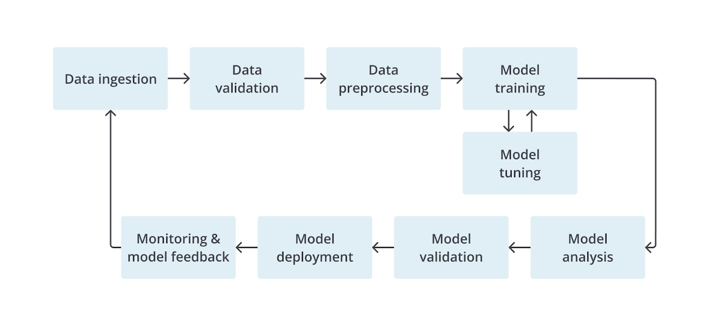

Keseluruhan siklus machine learning pipeline tersebut terjadi secara berulang sehingga kita bisa mengotomasikannya. Apa manfaatnya jika diotomasikan?

1. Penerapan otomatisasi dalam machine learning pipeline memungkinkan kita untuk fokus pada pengembangan model baru.
2. Mengurangi terjadinya *human error* karena kurangnya intervensi manusia.
3. Dapat membantu dalam membuat dokumentasi pipeline, seperti versi model, performa, dataset, dan sebagainya.
4. Membantu menstandardisasi keseluruhan proses pada *machine learning life-cycle*.

TensorFlow Extended (TFX) adalah platform machine learning (ML) dengan skala produksi dari Google yang didasarkan pada framework atau library TensorFlow. TFX juga memberikan konfigurasi serta kerangka kerja dan library yang diperlukan untuk mengintegrasikan pengembangan, pelaksanaan, dan pemantauan (monitoring) sistem machine learning.

TFX menyediakan beberapa tools yang dapat membantu Anda melakukan otomatisasi machine learning pipeline sebagai platform yang ditujukan untuk membangun dan manajemen machine learning pipeline di lingkungan produksi. Inilah tools tersebut.

- [TFX pipelines](https://www.tensorflow.org/tfx/guide/understanding_tfx_pipelines), sebuah alat atau toolkituntuk membangun ML pipeline. TFX pipeline membantu Anda dalam mengatur machine learning pipeline pada berbagai platform, seperti Apache Airflow, Apache Beam, dan Kubeflow Pipelines. **Catatan:** Machine learning pipeline (ML pipeline) merujuk pada serangkaian tahapan untuk training dan deployment model machine learning. Setiap tahapannya merujuk pada spesifik tugas, seperti pengumpulan data, pembersihan data, training model, dan sebagainya.
- [TFX standard components](https://www.tensorflow.org/tfx/guide#tfx_standard_components), sekumpulan komponen yang dapat digunakan untuk membangun machine learning pipeline. Setiap komponen TFX memiliki fungsi khusus, seperti ExampleGen untuk melakukan proses data ingestion dan Transform untuk melakukan data preprocessing. Berikut adalah gambar yang menjelaskan komponen-komponen TFX dan hubungannya dengan ML pipeline secara umum. 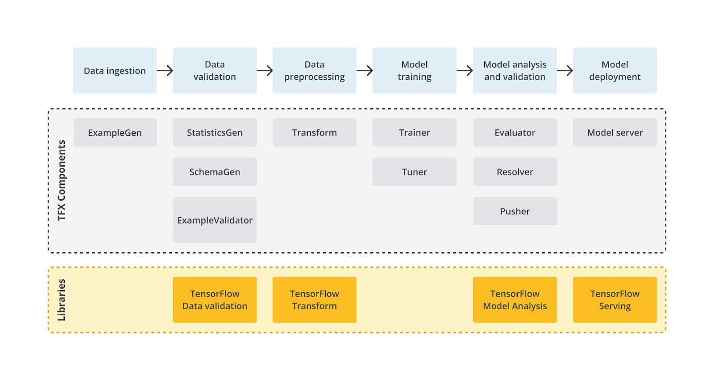
- [TFX Libraries](https://www.tensorflow.org/tfx/guide#tfx_libraries), seperti yang sudah disebutkan sebelumnya, mengharuskan kita untuk melakukan import terlebih dahulu. TFX Libraries menyediakan fungsi dasar atau inti yang digunakan oleh banyak komponen standar TFX. Anda bisa menggunakan TFX libraries ini untuk menambah fungsionalitas TFX komponen atau juga secara terpisah.

### TensorFlow.js

TensorFlow.js adalah sebuah *open-source web* *ML library* yang dapat dijalankan di mana pun selama JavaScript dapat melakukannya. Anda dapat menggunakan TensorFlow pada *client-side*ataupun *server-side*.

TensorFlow.js dibangun berdasarkan TensorFlow Python, artinya banyak fungsionalitas yang ada pada TensorFlow Python dapat digunakan di lingkungan TensorFlow.js. Perbedaan utama antara TensorFlow.js dan TensorFlow Python adalah bahasa pemrograman yang digunakan, yakni JavaScript, serta Node.js sebagai environment runtime pada server-side.

TensorFlow.js pertama kali dirilis pada tahun 2018 sebagai tanggapan terhadap ramainya permintaan untuk machine learning dapat diterapkan di lingkungan produksi dengan menggunakan JavaScript. Namun, itu seiringan dengan permintaan bahwa inti dari machine learning tetap tidak berubah, selayaknya TensorFlow Python.

Hadirnya TensorFlow.js mampu membuat developer tidak hanya menjalankan machine learning dari server-side, tetapi juga client-side. Dengan tujuan tersebut, Anda bisa membangun aplikasi berbasis web yang di dalamnya terdapat implementasi machine learning yang diterapkan secara langsung. Ini mirip seperti TensorFlow Lite, tetapi berada di lingkungan aplikasi web.

TensorFlow.js memiliki hierarki API berikut.

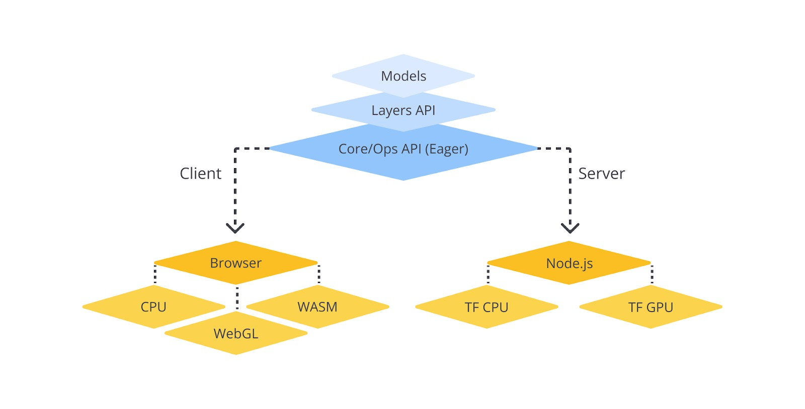

Lapisan teratas tentu **model atau premade model**. Premade model merupakan model-model yang sebelumnya dilatih untuk tujuan tertentu. Anda bisa menggunakan model-model yang telah dilatih oleh TensorFlow pada laman [ini](https://www.tensorflow.org/js/models).

Lapisan kedua, yakni **Layers API**,adalah high-levelAPI yang membantu developer dalam membuat custom model tanpa perlu melibatkan teknik matematis dalam machine learning.

Hal ini serupa dengan Keras API atau Python API pada hierarki arsitektur API dalam TensorFlow Python.

Untuk membuat model menggunakan Layers API, ada dua cara berikut.

1. **Sequential model** Sequential model adalah model yang dibangun berdasarkan lapisan-lapisan yang disusun secara linear. 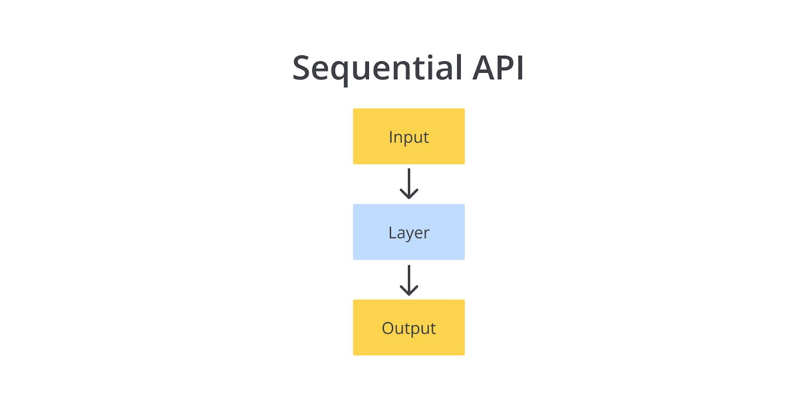

1. **Functional model** Selanjutnya adalah functional model. Untuk membuat functional model, Anda dapat menggunakan fungsi tf.model(). Perbedaan antara tf.model() dan tf.sequential() adalah kemampuan tf.model() dalam membuat lapisan arbitrary graph. Artinya, Anda dapat membuat struktur lapisan-lapisan yang berbeda dan menghubungkannya kembali. 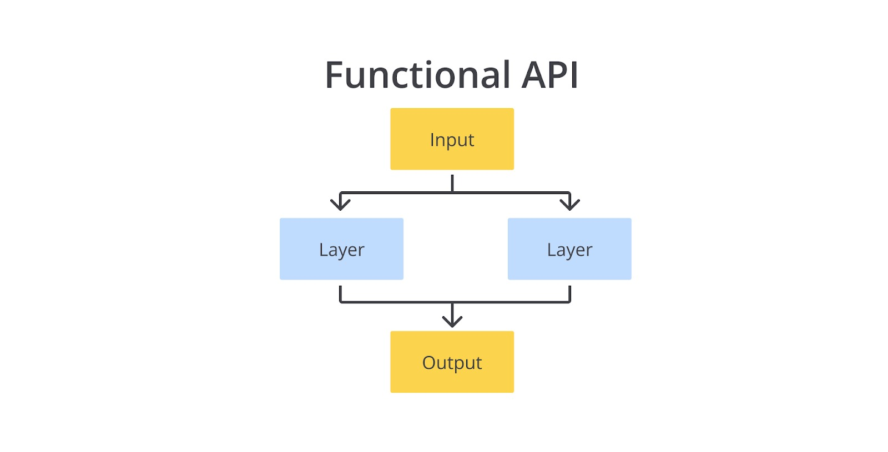

Lapisan ketiga adalah **Core/Ops API** yang termasuk low-level API. Ops API membuat developer dapat bekerja untuk menerapkan konsep matematis secara langsung, seperti aljabar linear.

Umumnya, para developer akan menggunakan Layers API terlebih dahulu untuk membuat model. Namun, jika teknik matematika sangat diperlukan, misalnya kebutuhan penelitian oleh para peneliti, kita dapat menggunakan API ini untuk memaksimalkan fleksibilitas dan kontrol.

Lapisan terakhir dalam visualisasi TensorFlow.js APIs adalah client dan server.

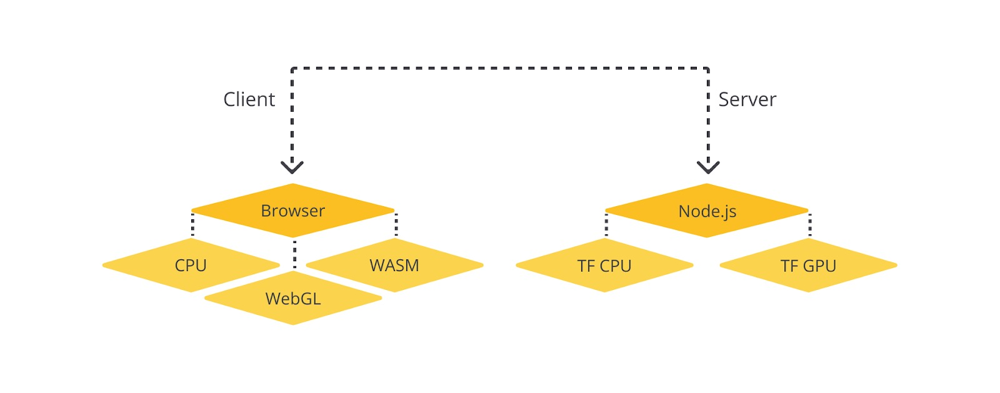

Gambar tersebut merepresentasikan bahwa API TensorFlow.js dapat dijalankan pada lingkungan client (browser) ataupun server (Node.js).

Pada lingkungan client atau browser, TensorFlow.js mendukung penggunaan CPU, WebGL, dan WASM sebagai infrastruktur back-end yang digunakan. Sementara itu, pada server-side, TensorFlow.js mendukung penggunaan TensorFlow CPU dan TensorFlow GPU yang sama seperti dalam TensorFlow Python.

---

## Rangkuman Machine Learning pada Google Cloud

Kita sudah berada pada penghujung materi Machine Learning pada Google Cloud. Saat ini, Anda diharapkan sudah memiliki pemahaman terkait penerapan machine learning dengan Google Cloud.

Mari kita rangkum secara saksama.

### gcloud CLI

Pada dasarnya, terdapat tiga tools untuk bisa berinteraksi dengan Google Cloud.

1. Google Cloud Console.
2. *Command-line interface*(CLI).
3. Cloud Client Libraries.

Ketiga alat tersebut memiliki kelebihan dan kekurangannya masing-masing bergantung pada peruntukannya.

#### Google Cloud Console

Kelebihan dari Google Cloud Console adalah antarmukanya yang *powerful*. Anda bisa berinteraksi dengan berbagai layanan Google Cloud hanya melalui antarmuka berbasis web (web-based interface). Kelebihan ini menjadi sangat menguntungkan karena tidak memerlukan pengetahuan teknis yang mendalam sehingga Anda bisa mengakses berbagai layanan dengan mudah.

#### Command-line Interface (CLI)

Google Cloud memiliki tools khusus yang memungkinkan Anda untuk bisa berinteraksi dengan API Google Cloud via command-line interface (CLI). Tools tersebut adalah gcloud CLI yang merupakan bagian dari Cloud SDK.

Cloud SDK atau Cloud Software Development Kit adalah serangkaian tools yang digunakan untuk mengelola berbagai layanan atau sumber daya, serta aplikasi Google Cloud melalui *command-line interface*(antarmuka berbasis perintah).

Cloud SDK mencakup beberapa tools lain, berikut di antaranya.

- **gcloud:**Tools berbasis *command-line interface*(CLI) yang digunakan untuk membuat dan mengelola sumber daya Google Cloud.
- **gsutil**: Tools yang digunakan untuk mengelola layanan Google Cloud Storage.
- **bq**: Tools yang digunakan untuk mengelola layanan BigQuery.
- **cbt**: Tools yang digunakan untuk mengelola Cloud Bigtable.

gcloud CLI umumnya digunakan untuk melakukan beberapa task yang umum, seperti membuat Compute Engine virtual machine instances, Cloud Storage buckets, ataupun Google Kubernetes Engine clusters.

Perintah-perintah yang tersedia pada gcloud CLI memiliki tiga tingkatan. Tingkatan tersebut mengindikasikan tingkat rilisnya (release levels).

- General Availability: Perintah-perintah yang telah stabil dan tersedia untuk digunakan dalam skala produksi.
- [Beta](https://cloud.google.com/sdk/gcloud/reference/beta): Perintah-perintah yang secara fungsional selesai, tetapi masih memiliki beberapa issues.
- [Alpha](https://cloud.google.com/sdk/gcloud/reference/alpha): Perintah-perintah yang baru dirilis dan bisa saja berubah tanpa ada pemberitahuan apa pun.

#### Cloud Client Libraries

Cloud client libraries adalah client libraries yang disediakan oleh Google Cloud untuk memanggil Google Cloud APIs.

Sederhananya, jika Google Cloud Console berbasis web, gcloud CLI berbasis command-line, client libraries berbasis library bahasa pemrograman yang disediakan untuk memudahkan pengalaman developer dalam berinteraksi dengan layanan atau sumber daya Google Cloud.

Cloud client libraries bekerja sangat efektif karena dapat menyederhanakan penggunaan kode yang biasanya digunakan secara berulang untuk berinteraksi dengan Google Cloud.

Cloud Client Libraries memiliki keunggulan berikut.

- Menyediakan kode yang *idiomatic* dalam bahasa pemrograman tertentu untuk menyederhanakan penggunaan Cloud APIs menjadi lebih mudah dan intuitif. *Idiomatic* merujuk pada penulisan kode dalam bahasa pemrograman yang mengikuti aturan, gaya, dan konvensi suatu komunitas pemrograman.
- Menyediakan style yang konsisten pada semua client libraries untuk menyederhanakan penggunaan multiple layanan cloud.
- Menangani komunikasi low-level dengan server, termasuk autentikasi dengan Google.
- Dapat diinstal menggunakan package manager yang umum, seperti **npm** atau **pip**.

Saat ini, berikut adalah bahasa pemrograman yang didukung oleh Cloud Client Libraries.

- [Go](https://cloud.google.com/go/docs/reference)
- [Java](https://cloud.google.com/java/docs/reference)
- [Node.js](https://cloud.google.com/nodejs/docs/reference)
- [Python](https://cloud.google.com/python/docs/reference)
- [Ruby](https://cloud.google.com/ruby/docs/reference)
- [PHP](https://cloud.google.com/php/docs/reference)
- [C#](https://cloud.google.com/dotnet/docs/reference)
- [C++](https://cloud.google.com/cpp/docs/reference)

### Layanan Komputasi pada Google Cloud

Komputasi sangat berperan penting terhadap pengembangan aplikasi, termasuk aplikasi machine learning. Tidak hanya pada proses penerapannya dalam aplikasi, trainingmodel machine learning pun sering kali membutuhkan sumber daya yang tinggi.

#### Virtual Machine (VM)

Virtual machine (VM) atau mesin virtual adalah sebuah lingkungan virtual yang berfungsi sebagai sistem komputer dan terdiri dari banyak komponen; mulai dari CPU, memori, *network interface*, hingga storage yang dibuat di atas sistem perangkat keras fisik.

Ingat, mesin virtual bekerja di atas infrastruktur mesin komputasi fisik yang disebut juga sebagai host. Ini dilengkapi dengan hypervisor untuk memungkinkan Anda bisa menjalankan beberapa VM dengan berbagi sumber dayanya secara virtual.

#### Compute Engine

Compute Engine adalah layanan dari Google Cloud. Ini memungkinkan Anda untuk membuat Virtual Machine yang berjalan di atas data center Google dan terhubung melalui jaringan fiber di seluruh dunia.

Compute Engine adalah layanan yang cocok untuk Anda jika memerlukan kontrol penuh atas infrastruktur dan akses langsung ke hardware, seperti GPU dan SSD. Beberapa fitur Compute Engine sebagai berikut.

- Virtual machine dengan kinerja pemrosesan dan penyimpanan yang tinggi.
- Akses langsung ke GPU untuk mempercepat kinerja, seperti kebutuhan kinerja machine learning.
- Mendukung berbagai sistem operasi, seperti Windows, Linux, dan sebagainya.

Dalam Compute Engine, ada beberapa terminologi yang harus Anda pahami terlebih dahulu.

- **Machine family**: Sekumpulan processor dan hardware yang telah dipilih secara khusus dari Google Cloud berdasarkan workloads (beban kerja) tertentu dengan tujuan untuk mengoptimalkan alur kerja tersebut. Machine family dalam Google Cloud adalah general-purpose workloads, compute-optimized workloads, memory-optimized workloads, dan GPUs.
- **Machine series**: Sekumpulan mesin yang dikelompokkan berdasarkan seri dan generasi dari hardware dan processor. Setiap machine families dikelompokkan kembali berdasarkan series dan generasi mesinnya. Saat ini ada beberapa seri mesin yang tersedia dari Compute Engine, seperti N1 series pada machine family general-purpose dan GPUs. Perlu Anda ingat, semakin tinggi generasi dan series menandakan hardware dan processor-nya menggunakan teknologi terbaru. Contohnya, seri M3 merupakan generasi terbaru dari M2.
- **Machine type**: Tipe mesin yang mendefinisikan konfigurasi VM, terdiri dari jumlah CPU, memori, dan penyimpanan atau storage. Dalam Google Cloud, ada dua tipe machine type, yakni custom machine type danpredefined machine type. Predefined machine type adalah spesifikasi konfigurasi VM yang sebelumnya ditentukan oleh Google Cloud. Contohnya, n1-standard-1, e2-small, dan sebagainya. Selain predefined, Anda juga dapat memilih konfigurasi tersebut secara custom. Anda dapat memilih jumlah CPU dan memori berdasarkan kebutuhan yang spesifik.

Per bulan November 2023, Google memberikan panduan terkait rekomendasi machine family dan series berdasarkan alur kerjanya.

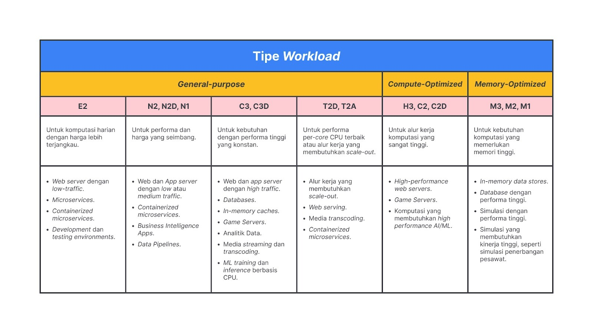

Secara default, layanan Compute Engine menggunakan tenaga komputasi CPU sebagai processor-nya. Artinya, seluruh tabel di atas sebenarnya pilihan tipe mesin menggunakan tenaga CPU.

#### CPU

CPU adalah komponen yang bekerja layaknya otak bagi sebuah komputer. Ia akan bertanggung jawab untuk memproses data yang telah diubah menjadi sinyal digital. CPU berperan untuk menjalankan program aplikasi, manajemen file, hingga melakukan kalkulasi terhadap sinyal digital yang diterima.

Dalam machine learning atau deep learning, kemampuan CPU sangat diperlukan, terutama dalam fase training model. Semakin tinggi kualitas CPU akan sangat membantu mempercepat proses training model.

#### GPU

GPU atau graphical processing unitadalah unit prosesor dengan memori yang ditujukan khusus untuk melakukan operasi floating point. Ini diperlukan untuk me-render sebuah grafik.

GPU memiliki kemampuan khusus, yakni prosesor ini dapat menjalankan banyak operasi dalam satu waktu. Hal inilah yang dimanfaatkan machine learning atau deep learning.

Perbedaan utama antara CPU dan GPU adalah penggunaan alokasi transistor sebagai komponen dasar. GPU memberikan proporsi transistor yang lebih besar dibanding CPU, khususnya untuk unit logika aritmetika. Transistor GPU pun tidak difokuskan untuk cache dan flow control, ini berbanding terbalik dengan CPU.

#### TPU

TPU atau tensor processing unitsadalah unit pemrosesan khusus dirancang untuk menangani komputasi tensor yang umumnya terjadi pada machine learning atau artificial intelligence (AI).

TPU secara umum memiliki kemampuan mirip seperti CPU, yang mengutamakan memori untuk memproses data. Namun, TPU memiliki kemampuan memori berkali-kali lipat karena kemampuan on-chip high-bandwidth memory(HBM).

Dalam arsitekturnya, TPU memiliki unit processor khusus untuk melakukan operasi matriks bernama matrix multiplication unit (MXU). Untuk melakukan operasi matriks, TPU akan memuat **parameter** dari HBM ke MXU tersebut.

Kesimpulannya, TPU dapat digunakan untuk beberapa kasus berikut.

- Model yang dominan oleh komputasi matriks.
- Model yang tidak menggunakan custom operasi TensorFlow/PyTorch/JAX dalam training loop utama.
- Model yang memerlukan training berminggu-minggu hingga berbulan-bulan.
- Model berukuran besar dengan batch data (sampel data) yang juga berukuran besar.

Hal ini berbeda dengan CPU yang ditujukan untuk beberapa hal berikut.

- Prototyping yang membutuhkan fleksibilitas maksimal.
- Model sederhana yang tidak memerlukan waktu banyak untuk training.
- Model serta batch data berukuran kecil.
- Model yang memiliki banyak custom operasi TensorFlow dan ditulis dengan C++.
- Model yang terbatas pada ketersediaan input/output dan bandwidth jaringan dari host system.

Berbeda juga dengan GPU yang umumnya ditujukan untuk hal-hal berikut.

- Model dengan operasi custom TensorFlow/PyTorch/JAX yang signifikan dan memerlukan untuk dijalankan pada CPU secara parsial.
- Model dengan [TensorFlow ops yang tidak tersedia](https://cloud.google.com/tpu/docs/tensorflow-ops) dalam Cloud TPU.
- Model dengan ukuran medium-to-large.

#### App Engine

App Engine adalah Platform-as-a-Service (PaaS) milik Google yang menyediakan layanan untuk hosting aplikasi dengan mudah. Bagaimana tidak? Anda hanya diharuskan untuk fokus terhadap pengembangan aplikasi dan ketika sudah selesai bisa langsung mengunggahnya ke App Engine.

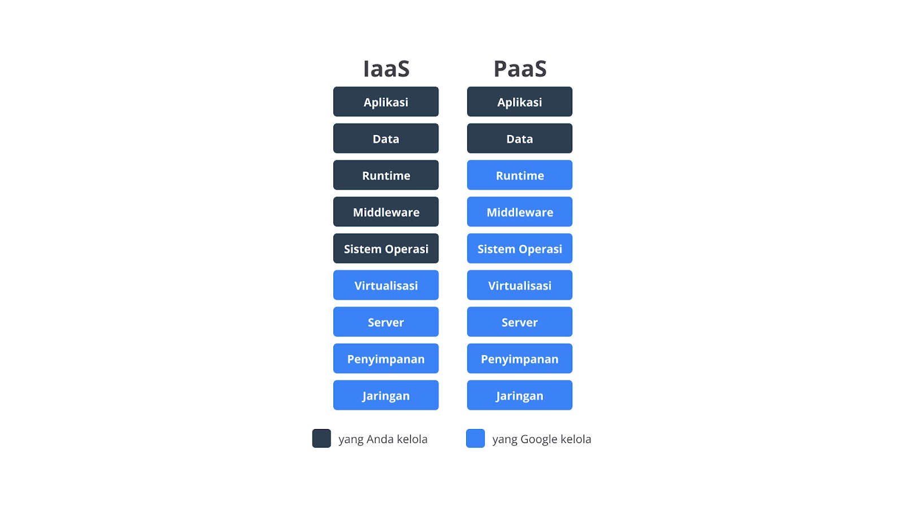

Nah, App Engine menawarkan dua lingkungan alias environment, yaitu standard environment dan flexible environment.

**Standard Environment**

Sesuai namanya, jenis environment ini adalah yang paling standar dan lebih sederhana. Ketika melakukan deployment di environment ini, App Engine akan memberlakukan pembatasan pada kode Anda dengan berjalan di atas sandbox. Sandbox merujuk pada lingkungan eksekusi yang aman dan terisolasi, tempat aplikasi Anda dijalankan.

Kapan jenis environment ini harus dipilih?

- Ketika aplikasi Anda ingin berjalan di atas sandbox.
- Aplikasi Anda membutuhkan rapid scaling.
- Aplikasi berjalan secara gratis atau low cost karena Anda hanya perlu membayar pay as you go. Ketika aplikasi memiliki nol lalu lintas, Anda bisa scale aplikasinya ke nol instances.
- Sebaliknya, Anda juga bisa menggunakan environment ini jika aplikasi membutuhkan immediate scaling, khususnya ketika aplikasi Anda tiba-tiba memiliki network traffic yang tinggi.

**Flexible Environment**

Jika standard environment berjalan di atas sandbox, flexible environment menggunakan container untuk menjalankan aplikasi Anda. Selain itu, Anda juga bisa mengatur custom runtime di luar Python, Java, Node.js, Go, Ruby, PHP, dan .NET.

Kapan flexible environmentharus dipilih?

- Aplikasi Anda ingin berjalan dalam Docker container di Compute Engine VM, termasuk jika menggunakan custom runtime atau source code.
- Aplikasi Anda memiliki traffic yang konstan.
- Aplikasi Anda bergantung pada sebuah framework yang memiliki native code.
- Anda memerlukan akses terhadap resource atau service dalam Compute Engine Network.

---

## Rangkuman Menyimpan Data dalam Google Cloud

Kita sudah berada di penghujung materi Menyimpan Data dalam Google Cloud. Saat ini, Anda diharapkan sudah memiliki pemahaman terkait cara menyimpan data menggunakan layanan Cloud Storage dan Firestore dalam Google Cloud.

Mari kita rangkum secara saksama.

### Layanan Storage

#### Object Storage

Penyimpanan berbasis objek atau dikenal juga sebagai object storage adalah arsitektur penyimpanan data pada komputer yang didesain khusus untuk menyimpan data tidak terstruktur dalam skala besar.

Sebagaimana namanya, arsitektur penyimpanan ini menyimpan suatu data sebagai objek dan dibungkus oleh metadata serta unique identifier. Setiap metadata dan identitas unik tersebut dapat digunakan untuk mencari setiap objeknya.

Dalam penyimpanan berbasis objek, metadata adalah pasangan key-value yang digunakan untuk mengidentifikasi properti objek dan cara suatu sistem bisa mengakses atau menangani objek tersebut, seperti rendering, load, dan decompress.

#### Google Cloud Storage

Google Cloud Storage adalah layanan penyimpanan data berbasis objek dari Google Cloud.  Satu hal penting yang perlu diketahui mengenai Cloud Storage adalah hierarkinya. Cloud Storage memiliki struktur hierarki yang terdiri dari bucket dan object.

Objek adalah satu unit data, seperti file audio, video, gambar, dataset, model machine learning, dan sebagainya. Bucket adalah wadah untuk menyimpan objek-objek data. Anda bisa umpamakan seperti keranjang yang mampu menyimpan banyak barang.

Setiap objek dalam Cloud Storage memiliki dua komponen, yaitu **object data** dan **object** **metadata**. Object data adalah data itu sendiri, sementara object metadata adalah metadata yang menggambarkan informasi objek (berupa key-value).

Dalam Cloud Storage, ada dua jenis metadata. Pertama adalah **fixed-key metadata**, ini sudah ditentukan oleh Google Cloud dan key-nya tidak bisa diubah, tetapi Anda bisa mengubah value-nya. Jenis kedua adalah custom metadata, yakni Anda dapat membuat key dan value sendiri.

Harga layanan cloud storage ditentukan oleh tiga hal, yakni berikut.

- Jumlah data yang disimpan (*data storage*).
- Jumlah pemrosesan data yang selesai (*data processing*).
- Jumlah data yang dibaca atau dipindahkan dari atau ke luar buckets (*network usage*).

### Layanan Basis Data

#### Firestore

Firestore adalah layanan untuk NoSQL dan basis data berorientasi document. Tidak seperti SQL, Firestore tidak memiliki tabel dan kolom. Layanan ini memiliki dua mode di dalamnya.

#### Firestore dalam mode Datastore

Firestore dalam mode Datastore adalah versi terbaru yang sudah dikembangkan dari layanan terdahulu, yakni Datastore.

Layanan Datastore adalah layanan NoSQL database dari Google Cloud yang mengutamakan kemampuan skalabilitas secara otomatis, performa tinggi, dan kemudahan berintegrasi dengan pengembangan aplikasi. Pada awalnya, layanan ini berdiri sendiri di atas Google Cloud sebelum akhirnya berevolusi dan bergabung dengan layanan Firestore.

Anda bisa mempertimbangkan mode ini jika memiliki kebutuhan aplikasi yang bergantung pada kebutuhan data dengan ketersediaan dan skalabilitas tinggi (*highly available structured data at scale*). Contohnya, katalog produk yang membutuhkan inventory secara *real-time*dan data transaksi yang mengutamakan atomicity, consistency, isolation, dan durability (ACID).

Firestore dalam mode Datastore memiliki konsep bahwa setiap data disimpan ke **Entity**dan setiap **Entity** disimpan ke **Kind**.

#### Firestore dalam mode Native

Firestore dalam mode Native menyimpan data ke **document** yang di dalamnya terdiri dari pasangan key-value. Setiap document tersebut harus disimpan ke **collections**, tetapi setiap document juga dapat menyimpan collections. Jika suatu document memiliki collections, collections itu disebut sebagai **subcollection**.

Ada tiga cara untuk menyimpan data pada Firestore.

- Data bersarang dalam document.
- Subcollections.
- Root-level collections.

**Data Bersarang dalam Document**

Cara pertama adalah menyimpan data bersarang ke document.

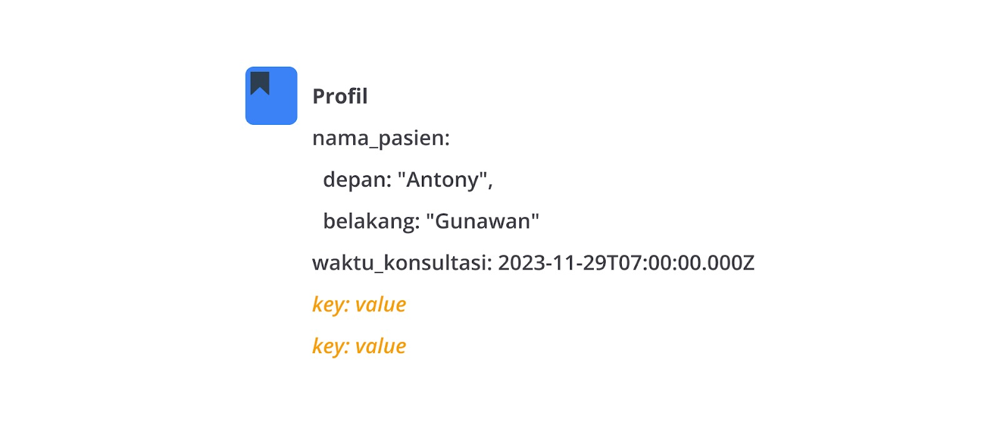

Cara pertama ini akan menguntungkan jika Anda memiliki data yang sederhana dan tetap di dalam document. Cara ini pun lebih mudah untuk diatur dan dilakukan streamlinestruktur data.

Kekurangannya, data ini kurang *scalable* jika dibandingkan dengan opsi yang lain, khususnya ketika data Anda berubah dari waktu ke waktu. Semakin besar data yang dimiliki akan menyebabkan document mengalami kelambatan saat diproses pada pengambilan data.

**Subcollections**

Cara kedua adalah dengan menambahkan subcollections.

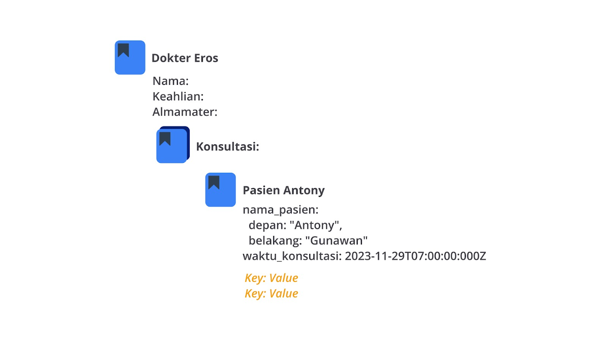

Cara ini memiliki kelebihan, yaitu walaupun data Anda bertambah banyak, ukuran atau jumlah document tidak akan berubah. Anda juga bisa melakukan full query terhadap subcollections tersebut, seperti [query dan filtering data](https://cloud.google.com/firestore/docs/query-data/queries). Kekurangannya, tidak mudah menghapus subcollections.

**Root-level Collections**

Cara ketiga adalah membuat collection pada root-level basis data.

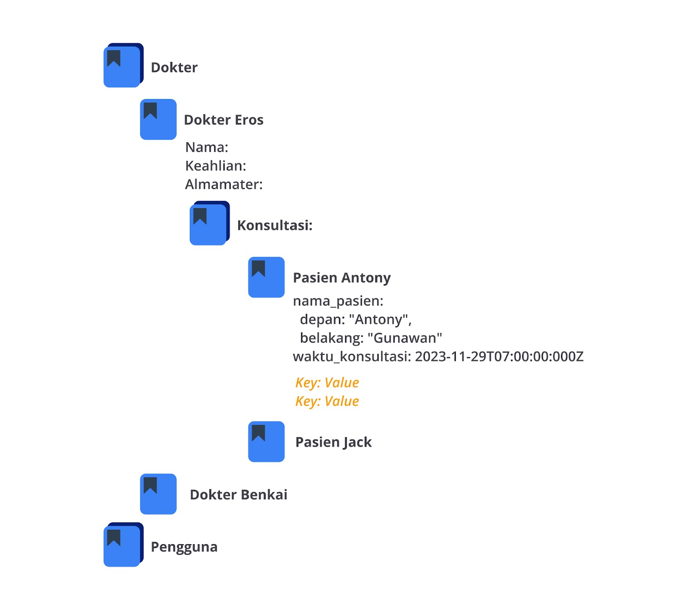

Jenis struktur data seperti ini akan bagus jika data yang dimiliki berupa *many-to-many relationship*. Selain itu, Anda dapat melakukan full query dengan struktur data seperti ini. Kekurangannya, semakin besar data maka semakin kompleks struktur basis data yang Anda miliki.

#### Mode Datastore vs Mode Native

Keputusan untuk memilih antara mode Datastore dan Native pada Firestore tentunya harus berdasarkan kebutuhan aplikasi Anda. Untuk gambaran, jika memiliki kebutuhan server baru, Anda bisa mempertimbangkan mode Datastore karena memiliki kemampuan skalabilitas proses *writing*datasecara otomatis hingga jutaan permintaan *write*data.

Namun, jika memiliki kebutuhan pengembangan aplikasi yang melibatkan perangkat lain, seperti Android atau iOS, Anda bisa mempertimbangkan mode Native karena memiliki dukungan client libraries Android, iOS, C++, hingga Unity.

Harga yang ditawarkan Firestore pun beragam, Anda bisa mengecek detailnya dari laman [ini](https://cloud.google.com/firestore/pricing). Harga-harga yang tertera pada laman tersebut ditentukan berdasarkan beberapa hal.

1. Banyaknya proses *read*, *write*, dan *delete*document;
2. Banyaknya index entries yang masuk kategori aggregation queries (seperti sum(), count(), avg());
3. Jumlah penyimpanan yang digunakan untuk database Anda, termasuk metadata dan indexes; serta
4. Jumlah penggunaan network bandwidth.

Saat Anda membuat proyek dan membuat database Firestore pertama, secara otomatis Google Cloud akan menyiapkan database dengan nama **(default)**. Anda bisa menggunakannya secara langsung jika tidak memiliki kebutuhan customization.

Basis data (default) ini memiliki keuntungan berupa kuota penyimpanan gratis untuk beberapa aktivitas, seperti berikut.

- Penyimpanan data: 1 GiB.
- Read: 50.000 document per hari.
- Write: 20.000 document per hari.
- Delete: 20.000 document per hari.
- Network egress: 10 GiB per bulan.

---

## Rangkuman Studi Kasus: Membangun Aplikasi Machine Learning dengan Google Cloud

### Menyimpan Model di Cloud Storage

Untuk menunjang skalabilitas, idealnya model machine learning tidak disimpan dalam aplikasi. Anda bisa menyimpan model machine learning dalam berbagai tempat penyimpanan, seperti membuat server khusus penyimpanan model, container, atau penyimpanan berbasis objek.

Selain skalabilitas, kelebihan utama jika model machine learning tidak disimpan dalam aplikasi adalah mengurangi beban memori server. Tidak bisa dimungkiri bahwa semakin kompleks model machine learning, semakin besar juga ukuran dari model tersebut.

Dengan memisahkan model dan aplikasi, Anda dapat meringankan beban kerja server. Namun, Anda harus paham bahwa memisahkan model dapat mengakibatkan terjadinya latensi ketika aplikasi melakukan load model.

Perhatikan machine learning pipeline berikut.


Pada dasarnya, Anda dapat menggunakan Cloud Storage dalam berbagai tahapan, seperti data ingestion untuk menyimpan data yang berhasil diambil; data preprocessing yang menyimpan data setelah melakukan preprocessing; model training untuk menyimpan model yang berhasil dilatih; model deployment untuk menyimpan model di lingkungan produksi; dan sebagainya.

### Membangun Web Service

Dalam membuat web service pada latihan kali ini, ada beberapa konsep menarik yang dapat diterapkan.

Extension onPreResponse adalah hal pertama yang menarik untuk digunakan dalam pengembangan aplikasi machine learning. Pada dasarnya, extension adalah fitur untuk menambahkan fungsionalitas tertentu.

onPreResponse adalah extension pada Hapi untuk melakukan manipulasi atau tindakan tertentu sebelum respons dikirimkan kembali ke klien. Berikut contoh kodenya.

```
    server.ext('onPreResponse', function (request, h) {
        const response = request.response;

        if (response instanceof InputError) {
            const newResponse = h.response({
                status: 'fail',
                message: `${response.message} Silakan gunakan foto lain.`
            })
            newResponse.code(response.statusCode)
            return newResponse;
        }

        if (response.isBoom) {
            const newResponse = h.response({
                status: 'fail',
                message: response.message
            })
            newResponse.code(response.statusCode)
            return newResponse;
        }

        return h.continue;
    });
```

server.ext() adalah fungsi untuk menangani extension dalam Hapi. Pada kode di atas, extension yang digunakan adalah onPreResponse. **server.ext()**disimpan setelah server.route().

Ini artinya, server akan menjalankan seluruh routes terlebih dahulu. Setelah routes, extension akan memeriksa response yang dihasilkan. Jika tidak terjadi kesalahan, extension ini akan menerima informasi tersebut. server.ext()menerima dua parameter yang wajib dipenuhi, yaitu **event** dan **method**.

Pada kode di atas, parameter **event** yang diberikan adalah onPreResponse. Event ini sebenarnya memiliki beberapa method di bawahnya, salah satu yang penting adalah .isBoom. Method ini akan menghasilkan boolean **true** jika terjadi error pada response dan akan menghasilkan **false**jika tidak terjadi.

Parameter kedua adalah **method**, yaitu fungsi yang menangani permintaan server dengan menerima dua parameter, yakni **request** dan **h**. Di sini peran penting dimulai, kita menyimpan segala response dari setiap permintaan (request) pengguna ke variabel response.

Maksudnya seperti ini, extension ini datang setelah server memberikan response. Jadi, jika mencoba melihat isi request, Anda akan melihat banyak properti di dalamnya. Salah satunya adalah response yang berisi segala response server.

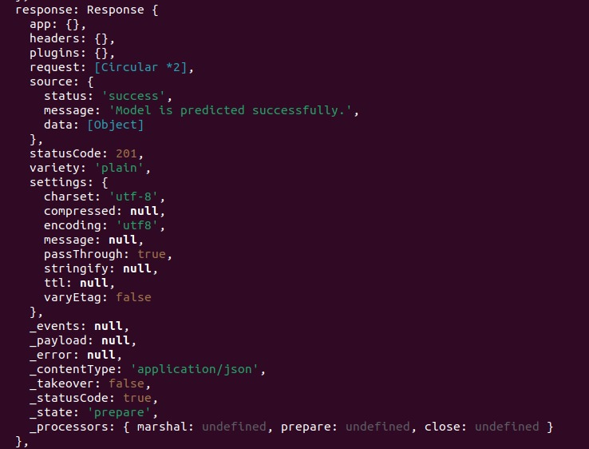

Hal kedua adalah **.loadGraphModel()**untuk melakukan load model dengan format SavedModel dalam TensorFlow.

SavedModel adalah format pada TensorFlow yang menyimpan TensorFlow program secara utuh, termasuk parameter, seperti tf.Variable, arsitektur model, dan sebagainya. Anda bisa simpulkan bahwa SavedModel menyimpan TensorFlow graf.

SavedModel sebenarnya termasuk format aman jika kita ingin melakukan sharing dan deployment menggunakan TFLite, TensorFlow.js, TensorFlow Serving, atau TensorFlow Hub. Hal ini karena dia tidak membutuhkan orisinil model untuk dijalankan.

Seringkali beberapa kesalahan muncul karena beberapa API TensorFlow Python tidak tersedia pada TensorFlow lainnya, seperti TFLite atau TensorFlow.js. Jadi, SavedModel bisa digunakan sebagai salah satu solusi untuk menangani ini.

### Deploy Web Service Menggunakan Compute Engine

Saat bekerja di lingkungan produksi, seringkali terjadi beberapa error. Salah satunya adalah**“permission denied”**karena mencoba mengakses layanan Google Cloud di luar lingkup yang diizinkan.

“Permission denied” terjadi karena VM mencoba mengakses Firestore yang notabene belum memiliki izin untuk mengaksesnya.

Sebenarnya, setiap aplikasi, baik di lingkungan lokal maupun production, mengharuskan kita untuk melakukan autentikasi. Application Default Credentials (ADC) adalah strategi yang digunakan oleh Google authentication libraries untuk secara otomatis menemukan kredensial.

Authentication libraries membuat kredensial tersedia untuk Cloud Client Libraries sehingga Anda bisa menggunakan berbagai client libraries, baik di lingkungan produksi maupun development.

Perintah **gcloud auth application-default login** yang Anda jalankan di lokal komputer, pada dasarnya akan membuat file JSON secara otomatis dan di dalamnya terdapat kredensial akun yang diberikan.

Masih ingat dengan tahapan ketika Anda akan diarahkan ke browser setelah menjalankan perintah di atas? Secara otomatis, file JSON akan berisi kredensial akun berdasarkan akun yang Anda pilih tersebut.

Lokasi file JSON akan disimpan bergantung pada sistem operasi Anda.

- Linux, macOS: $HOME/.config/gcloud/application_default_credentials.json
- Windows: %APPDATA%\gcloud\application_default_credentials.json

Perintah gcloud CLI tersebut bukan satu-satunya cara untuk bisa melakukan Application Default Credentials (ADC). ADC akan mencari kredensial berdasarkan tiga lokasi.

1. Environment variable **GOOGLE_APPLICATION_CREDENTIALS**.
2. User credentials set up menggunakan gcloud CLI.
3. Melampirkan (attach) service account.

Untuk opsi pertama, pada dasarnya Anda perlu membuat environment variable **GOOGLE_APPLICATION_CREDENTIALS**dengan value-nya adalah key, seperti service account key atau file konfigurasi kredensial untuk workload identity federation.

```
GOOGLE_APPLICATION_CREDENTIALS=<SERVICE_ACCOUNT_KEY>
```

Pada sintaks di atas, kita mendefinisikan environment variable GOOGLE_APPLICATION_CREDENTIALS dengan value service account key.

Namun, cara ini memiliki risiko yang cukup tinggi karena key kita dapat diakses dengan mudah oleh siapa pun.

Untuk opsi kedua, ini adalah cara yang sebelumnya Anda gunakan. Cukup jalankan satu perintah, semuanya telah disiapkan oleh gcloud CLI. Namun, ini bukan cara yang baik jika kita lakukan di lingkungan production.

Opsi ketiga adalah pilihan terbaik untuk melakukan ADC di lingkungan produksi. Mengapa? Banyak layanan Google Cloud (seperti Compute Engine) yang mengizinkan Anda untuk melampirkan (attach) service account sehingga dapat digunakan untuk berinteraksi dengan Google Cloud APIs.

Singkatnya, Anda akan membuat service account yang hanya ditujukan untuk role tertentu saja. Setelah itu, service account tersebut akan dilampirkan (attach) dalam layanan yang spesifik. Apakah dapat dilihat sisi positifnya? Segala kebutuhan kita dibuat spesifik dengan menggunakan opsi ketiga ini.

### Deploy Front-End Website Menggunakan App Engine

Kunci dalam melakukan deployment adalah mengatur handling terhadap static files. App Engine memiliki beragam [handling parameter](https://cloud.google.com/appengine/docs/standard/reference/app-yaml?tab=node.js#handlers_element). Beberapa di antaranya sebagai berikut.

- Static_files: Ini untuk menangani static file dengan pola tertentu. Pola dari static_file dapat berupa regular expression.
- Static_dir: Ini untuk menangani static folder atau directory dengan pola tertentu. Pola dari static_dir dapat berupa regular expression.
- Script: Ini untuk menangani permintaan spesifik secara otomatis oleh App Engine. Nilai dari properti script harus berupa “auto” jika ingin digunakan.
- Secure: Ini untuk membuat URL dapat menangani HTTP atau HTTPS. Anda bisa menetapkan nilai antara **never**, **always**, dan **optional**. Secara default, nilai secure adalah optional.

---

## Rangkuman Vertex AI

### Vertex AI sebagai Alat para Developer

Vertex AI adalah layanan machine learning dari Google Cloud yang dapat membantu penggunanya untuk mengembangkan dan melakukan deployment machine learning model atau aplikasi AI.

Vertex AI menyediakan beberapa tools untuk bisa berkomunikasi dengannya. Beberapa diantaranya berikut.

- Google Cloud Console.
- gcloud CLI.
- Terraform.
- Python.
- Client Libraries.
- REST API.

Sebenarnya, Vertex AI juga menyediakan software development kit (SDK) yang dapat developer gunakan untuk berinteraksi dan mengembangkan AI menggunakan layanan Vertex AI.

#### Vertex AI SDK

Vertex AI SDK adalah sekumpulan alat dan libraries yang disediakan oleh Google Cloud untuk bisa membuat serta mengembangkan model machine learning atau aplikasi AI dengan layanan Vertex AI.

Vertex AI SDK tersedia dalam beberapa bahasa pemrograman, di antaranya adalah Node.js, Java, Go, dan Python. Namun, Vertex AI SDK memiliki dukungan penuh terhadap bahasa pemrograman Python. Ketika melakukan instalasi Vertex AI SDK, Vertex AI Client Libraries akan ikut terinstal.

Perbedaannya terletak pada abstraksi kontrol di antara keduanya. Vertex AI SDK memiliki fleksibilitas atau kontrol terhadap layanan dengan abstraksi yang tinggi. Berkebalikan dengan Vertex AI Client Libraries yang memiliki *lower-level functionality*.

Untuk menginstal Vertex AI SDK menggunakan Python atau Node.js, Anda bisa menjalankan perintah berikut.

| Python |
| --- |
| pip install --upgrade google-cloud-aiplatform |
| Node.js |
| npm install @google-cloud/vertexai |

Untuk mengimpor library ke source code, Anda bisa menggunakan sintaks berikut.

| Python |
| --- |
| from google.cloud import aiplatform |
| Node.js |
| const { VertexAI = require('@google-cloud/vertexai'); |

#### Vertex AI Notebooks

Selain melalui SDK dan client libraries, Vertex AI juga memiliki tools yang dapat membantu pengembangan dan penelitian data science supaya lebih mudah. Alat tersebut adalah Vertex AI Notebooks.

Vertex AI Notebooks adalah tools dari Vertex AI yang menyediakan notebook environment untuk mengembangkan dan melakukan penelitian machine learning.

Saat menggunakan Vertex AI Notebooks, Anda bisa menggunakan infrastruktur dengan kualitas tinggi, seperti Deep Learning VM, Cloud TPU, atau GPUs.

Deep Learning VM bisa dikatakan sebagai Virtual Machine yang dikhususkan untuk pengembangan machine learning, deep learning, AI, ataupun data science. Virtual Machine ini memiliki machine learning framework dan tools yang sudah diinstal sebelumnya.

Saat menggunakan Deep Learning VM, Anda bisa memanfaatkan GPU dengan tenaga komputasi yang tinggi karena mendukung NVIDIA GPU libraries, seperti CUDA, CuDNN, NCCL, dan Intel(R) libraries (MKL-DNN).

Saat ini, Deep Learning VM mendukung bahasa pemrograman Python 3.7 dan 3.10 di atas Debian 10 atau Debian 11. Framework yang disediakan di antaranya adalah TensorFlow 2.12, TensorFlow 2.11, TensorFlow 2.10, TensorFlow Enterprise 2.8.3, TensorFlow Enterprise 2.6.5, TensorFlow Enterprise 2.3.4, PyTorch 2.0, PyTorch 2.0, PyTorch 1.13, PyTorch 1.12, dan bahasa pemrograman R.

Vertex AI Notebooks terbagi menjadi dua tools di dalamnya, yakni Colab Enterprise dan Vertex AI Workbench.

#### Colab Enterprise

Colab Enterprise adalah notebook environment yang dibekali kapabilitas di atas infrastruktur Google Cloud. Colab Enterprise memiliki kemampuan untuk bisa kolaboratif, karena pada dasarnya, Colab Enterprise adalah bagian dari [Google Colab](https://research.google.com/colaboratory/). Namun, ia memiliki integrasi khusus dengan layanan Google Cloud, seperti BigQuery dan Vertex AI.

Colab Enterprise memiliki perbedaan dengan Colab pada umumnya. Beberapa yang menjadi perbedaan adalah pada bagian penyimpanan, akses kontrol, keamanan dan jaringan, serta supporting systemnya.

| **Komponen** | **Colab Enterprise** | **Colab** |
| --- | --- | --- |
| **Penyimpanan** | Dataform dengan Regional storage. | Google Drive storage. |
| **Kontrol akses** | Dikelola oleh IAM | Dikelola melalui Google Drive. |
| **Keamanan dan jaringan** | Google Cloud security dan fungsionalitas jaringan. | Google Drive-based security dengan internet yang selalu tersedia. |
| **Supporting System** | Google Cloud support | *Feedback* atau *bug report*. |

Colab Enterprise memiliki tiga komponen.

- Notebooks.
- Runtimes.
- Runtime Templates.

Runtime templates adalah konfigurasi VM yang ingin Anda gunakan, seperti spesifikasi tipe mesin, ukuran persistent disk, akses publik, dan idle shutdown. Idle shutdown merujuk pada mesin akan secara otomatis shutdown ketika tidak ada aktivitas tertentu selama kurun waktu tertentu.

Hal ini bertujuan untuk mengatur CPU dan GPUs dari VM. Sebab, ketika Anda mengaktifkan idle shutdown, penggunaan CPU dan GPU tidak akan dikenakan biaya saat notebook-nya sudah shutdown (kecuali disk).

Runtime adalah turunan dari runtime templates yang memungkinkan Anda untuk menjalankan notebook Colab. Sederhananya, Anda perlu membuat runtime templates terlebih dahulu, setelah itu membuat runtime berdasarkan template yang sudah dibuat, dan membuat notebook.

#### Vertex AI Workbench

Selain Colab Enterprise, Vertex AI juga memiliki Workbench yang termasuk Jupyter Notebook-based environment dengan kemampuan berjalan di atas Virtual Machine (VM) instances.

Jika tidak memiliki prioritas terhadap kontrol dan customizability, layanan ini cocok untuk Anda.

Vertex AI Workbench memiliki tiga komponen.

- Vertex AI Workbench instances.
- Vertex AI Workbench user-managed notebooks.
- Vertex AI Workbench managed notebooks.

Vertex AI Workbench instances adalah komponen yang bisa dijadikan pilihan ketika Anda membutuhkan integrasi terhadap seluruh alur kerja data science.

Selanjutnya, Vertex AI Workbench user-managed notebooks. Komponen ini bisa dikatakan memberikan fleksibilitas tinggi terhadap notebook Anda. Anda bisa mengatur sistem operasi, environment deep learning, hingga sistem back up yang terintegrasi dengan Cloud Storage. Bahkan, Anda bisa memilih untuk menggunakan Deep Learning VM pada jenis komponen ini.

Terakhir, Vertex AI Workbench managed notebooks. Komponen ini memberikan Anda kemudahan karena tidak perlu mengatur banyak infrastruktur dan environment.

### Mengembangkan dan menggunakan model di Vertex AI

#### AutoML

AutoML adalah machine learning model yang disediakan oleh Google Cloud sehingga Anda dapat menggunakannya secara langsung tanpa perlu melakukan tahapan pengembangan model.

AutoML memiliki berbagai jenis model, bergantung pada kebutuhannya.

| Data Type | Supported Objectives |
| --- | --- |
| Gambar | Klasifikasi, deteksi objek. |
| Video | Action recognition, klasifikasi, object tracking. |
| Teks | Klasifikasi, entity extraction, sentimen analis. |
| Tabular | Klasifikasi/regresi, forecasting. |

Secara keseluruhan Anda tetap harus melalui berbagai alur kerja machine learning.

1. Menyiapkan training data.
2. Membuat dataset.
3. Training model.
4. Evaluasi dan iterasi model.
5. Melakukan prediksi dari model.
6. Interpretasi hasil prediksi.

Saat ini, jika ingin melakukan prediksi AutoML, Anda harus menyiapkan datasets terlebih dahulu.

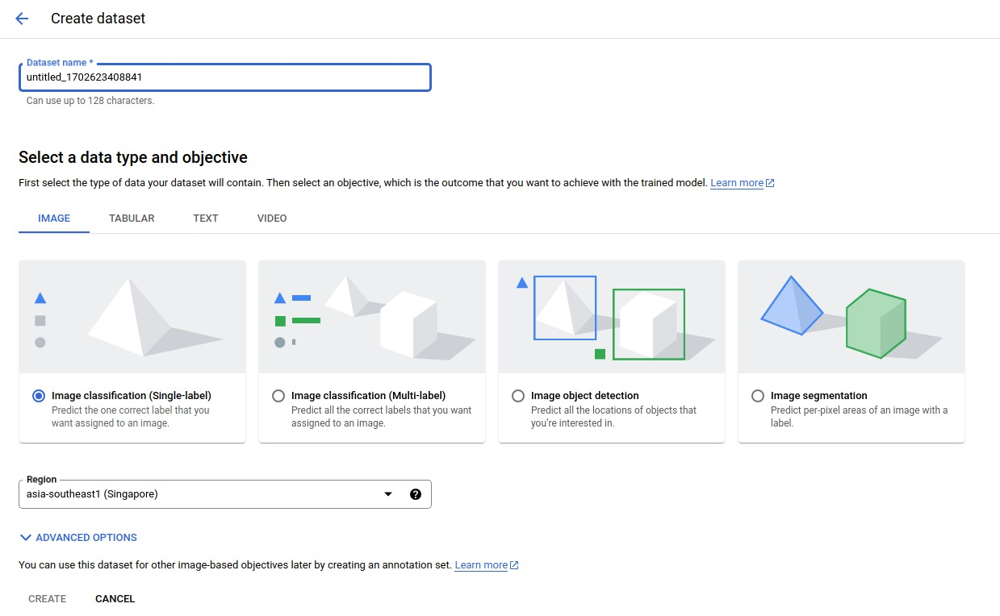

Pada dasarnya, ini adalah layanan untuk Anda menyiapkan seluruh dataset yang digunakan oleh model machine learning. Di dalamnya, Anda akan mengategorikan seluruh dataset menjadi beberapa kategori, seperti kategori gambar, tabular, teks, dan video. Setiap kategori memiliki jenis di dalamnya sesuai dengan yang dijelaskan pada tabel sebelumnya.

#### Custom Model

Vertex AI menyediakan layanan pelatihan yang memungkinkan Anda untuk mengoperasikan model dengan bantuan ML framework di atas infrastruktur Google. Vertex AI mendukung beberapa framework populer, seperti berikut.

- PyTorch.
- TensorFlow.
- scikit-learn.
- XGBoost.

Pada dasarnya, berikut adalah alur kerja untuk melakukan custom model training dengan Vertex AI.

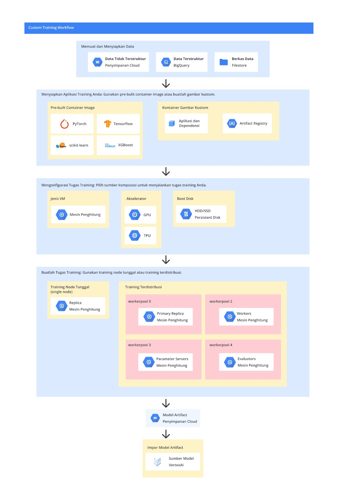

Hal pertama yang harus dilakukan adalah menyiapkan data. Untuk penyimpanannya, Anda dapat menggunakan Cloud Storage jika memiliki data tidak terstruktur, BigQuery untuk data terstruktur, dan Filestore untuk menyimpan data berupa file.

Setelah data disimpan, pastikan kode Anda disimpan sebagai container image. Hal ini mengharuskan Anda untuk memastikan model dapat dilatih dengan baik sebelum akhirnya dibangun menjadi container image.

Setiap training application–atau sederhananya aplikasi yang akan melatih model Anda–berjalan di atas Virtual Machine, seperti Compute Engine dengan akseleratornya berupa GPU atau TPU.

Setelah container image dibuat, Anda perlu mengatur spesifikasi VM, akselerator, dan bootdisk. Setelah ditentukan, barulah Anda dapat menjalankan **training job**dan menyimpan hasil model ke **Vertex AI Model Registry**.

Untuk bisa menyimpan hasil model ke Vertex AI Model Registry, Anda harus membuat bucket dalam Cloud Storage terlebih dahulu. Baru memilih bucket tersebut untuk menyimpan model.

### Vertex AI untuk Machine Learning Operations (MLOps)

Selanjutnya, Vertex AI dapat digunakan untuk membantu machine learning operations (MLOps).

Bagi Anda yang belum familiar dengan MLOps, ini adalah kombinasi dari filosofi kultur serta praktik dalam mengelola dan melakukan standardisasi terhadap keseluruhan proses  pengembangan sistem machine learning beserta pengoperasiannya pada sistem produksi.

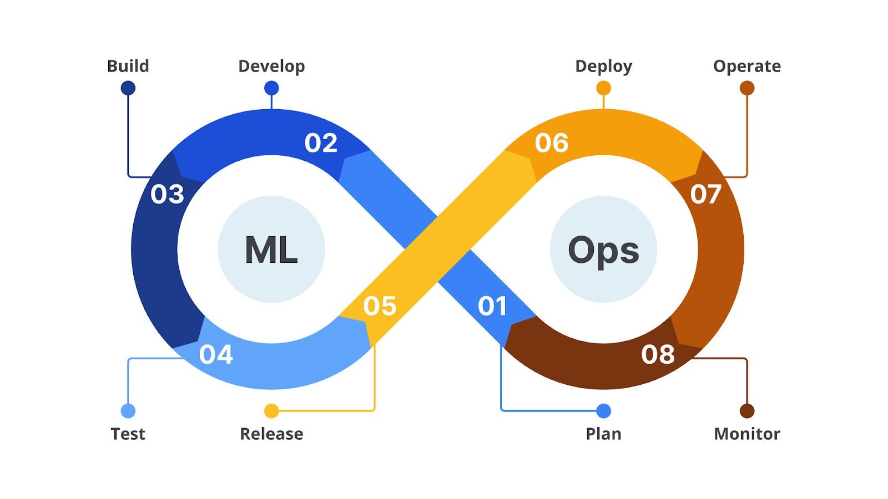

Keseluruhan proses ini meliputi otomatisasi dan monitoring dalam semua tahapan konstruksi sistem machine learning, termasuk integrasi, pengujian, deployment, dan manajemen infrastruktur.

Sebenarnya, jika Anda sudah mengenal teknik DevOps (development operations), MLOps adalah bentuk penerapan dari prinsip DevOps, tetapi bukan dalam ranah pengembangan aplikasi, melainkan sistem machine learning.

Apa yang membedakan? Pada DevOps, ada dua pilar utama yang disebut dengan CI/CD atau continuous integration(CI) dan continuous delivery(CD). CI adalah proses yang secara kontinu melakukan pengujian untuk menjaga kualitas kode pada proyek pengembangan perangkat lunak. CD adalah proses yang secara otomatis men-deploy software ke *staging*ataupun production environment tanpa intervensi manusia.

Dalam MLOps, ada beberapa perbedaan yang bisa kita klasifikasikan.

- Pada MLOps, CI tidak hanya mencakup proses pengujian kode, tetapi juga mencakup validasi data, pengujian model, dan validasi model.
- CD pada MLOps adalah proses deployment machine learning pipeline sehingga dapat digunakan untuk membuat layanan prediksi.
- MLOps juga menuntut sistem machine learning untuk mampu beradaptasi dengan perubahan data yang mungkin terjadi. Jadi, MLOps membutuhkan skema continuous monitoring dan continuous training untuk model agar mampu melakukan retraining model dengan data baru.

#### Vertex AI Pipeline

Vertex AI Pipeline adalah komponen dari Vertex AI yang memungkinkan Anda untuk melakukan otomatisasi, monitoring, dan mengatur seluruh sistem machine learning dalam arsitektur serverless. Ini menggunakan machine learning pipeline untuk melakukan orkestrasi alur kerja machine learning.

Orkestrasi atau *orchestration* merujuk pada pengaturan berbagai tugas agar dapat bekerja bersama secara teratur dan terkoordinasi. Dalam konteks Vertex AI Pipeline, komponen ini akan menggunakan machine learning pipeline untuk mengatur berbagai tugas agar dapat bekerja secara teratur dan terkoordinasi.

#### Vertex AI Experiments

Vertex AI Experiments adalah alat atau komponen yang dapat membantu Anda untuk melacak dan menganalisis arsitektur, hyperparameter, dan training environment model machine learning.

Dengan Vertex AI Experiments, Anda dapat mengevaluasi performa model machine learning melalui agregasi terhadap data tes dan selama proses pelatihan atau training model berjalan.

#### Vertex ML Metadata

Bagian paling penting dalam penelitian adalah merekam seluruh hasil observasi dan parameter eksperimen. Dalam data science, sangat penting juga untuk melacak parameter, artefak, dan metrik yang digunakan dalam eksperimen machine learning.

Vertex ML Metadata membantu Anda untuk melakukan beberapa hal sebagai berikut.

- Menganalisis sistem machine learning yang berjalan dengan memahami perubahan terhadap setiap kualitas di lingkungan produksi.
- Analisis eksperimen machine learning dengan membandingkan efektivitas antar hyperparameter.
- Melacak hierarki artefak machine learning, seperti dataset dan model untuk memahami data yang berkontribusi terhadap pembuatan model atau memahami suatu model yang memengaruhi pembuatan model lainnya.
- Menjalankan ulang alur kerja machine learning dengan artefak dan parameter yang sama.
- Melacak penggunaan sumber daya untuk suatu artefak machine learning.

Artefak dalam machine learning adalah hasil atau keluaran dari berbagai tahapan dalam siklus pengembangan model machine learning. Hal ini mencakup model, data, metrik evaluasi, serta berbagai dokumen yang dihasilkan selama pengembangan dan pelatihan model.

#### Vertex AI Feature Store

Feature adalah atribut dalam data atau entitas Anda yang dapat digunakan untuk melatih dan membuat prediksi model machine learning. Dalam suatu dataset, feature disebut juga sebagai kolom.

Feature adalah hal penting dalam machine learning sehingga beberapa perusahaan bahkan memiliki pekerjaan khusus untuk menangani hal ini, yakni feature engineering.

Feature management adalah proses membuat, menjaga, membagikan, dan melakukan serving fitur machine learning. Hasil akhir dari manajemen fitur adalah menyimpannya ke satu tempat terpusat.

Vertex AI Feature store adalah produk atau komponen yang menyediakan tempat terpusat untuk menyimpan seluruh fitur machine learning. Komponen ini juga memiliki pendekatan berbeda dalam manajemen fitur dengan cara menggunakan BigQuery sebagai sumber data untuk menjaga dan melakukan serving fitur machine learning.

#### Vertex AI Model Registry

Layanan Vertex AI Model Registry merujuk pada penyimpanan model terpusat tempat Anda dapat mengatur alur kerja model machine learning.

Salah satu kelebihan dari komponen ini adalah dapat melatih model versi terbaru. Ini artinya, Anda dapat membuat model menggunakan arsitektur yang sama, tetapi dengan versi terbaru karena tuning model.

Vertex AI Model Registry dapat menyimpan custom model atau AutoML dengan berbagai tipe data, seperti teks, tabular, gambar, dan video. Tak hanya itu, Anda pun dapat menyimpan model [BigQuery ML](https://cloud.google.com/bigquery/docs/bqml-introduction) dalam komponen ini.

Secara umum, tahapan untuk menyimpan model di Vertex AI Model Registry sebagai berikut.

1. Import model ke [Model Registry](https://console.cloud.google.com/vertex-ai/models?_ga=2.245486983.2099372699.1702260463-883021801.1698805308&_gac=1.128557566.1702375512.CjwKCAiAgeeqBhBAEiwAoDDhn8_L4-sj9yM71FPVufnvtNZ26Z5OTllMnDnnJU44EXkzojO0WI2WyhoCwBwQAvD_BwE).
2. Membuat model baru atau versi model baru.
3. Menambahkan label atau alias untuk manajemen model machine learning.
4. Deploy model ke endpoint.
5. Menjalankan batch prediction atau pipeline evaluasi model.
6. Melihat model detail untuk mendapatkan informasi performa model machine learning berdasarkan metrik.

#### Vertex AI Model Monitoring

Setiap model yang berhasil di-deploy ke tingkat produksi memiliki performa terbaik ketika input data memiliki kemiripan dengan data pelatihan. Jika data yang dimasukkan memiliki perbedaan atau dikatakan menyimpang dari data pelatihan, performa model dapat menurun.

Vertex AI Model Monitoring melakukan monitoring prediksi terhadap input data untuk training-serving skewdan prediction drift.

- Training-serving skew adalah kesalahan dalam serving model. Hal ini terjadi ketika distribusi fitur data pada tingkat produksi memiliki perbedaan dengan distribusi fitur data dalam pelatihan.
- Prediction drift adalah penurunan kinerja model selama penerimaan prediksi. Hal ini terjadi ketika distribusi fitur data dalam tingkat produksi memiliki perubahan yang signifikan.

Vertex AI Model Monitoring dapat mendeteksi fitur yang bersifat kategorik dan numerik.
