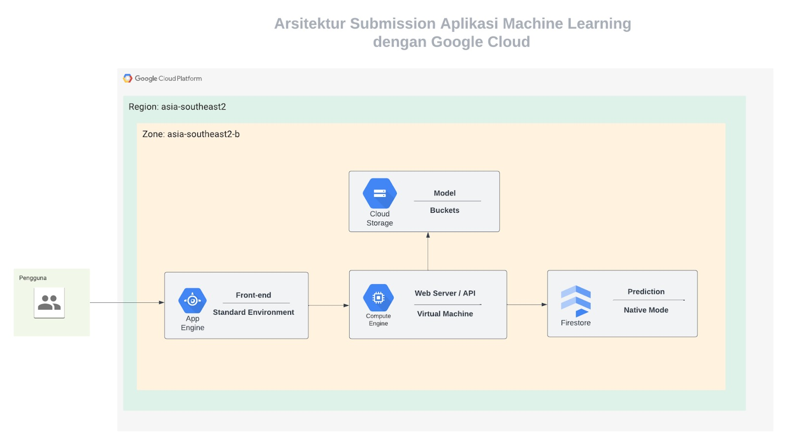
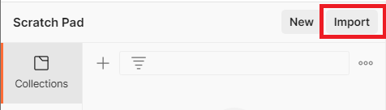
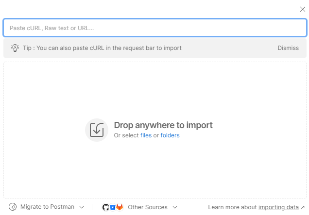
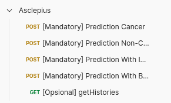
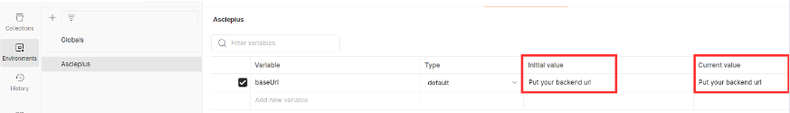
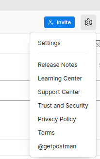
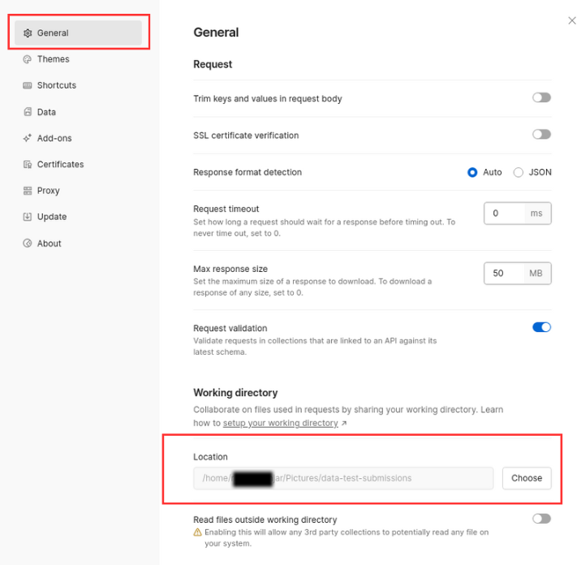

# Proyek Akhir Kriteria Submission

## Pengantar

Selamat! Akhirnya Anda telah mencapai penghujung pembelajaran. Sejauh ini, Anda telah mempelajari berbagai topik mengenai machine learning dan penerapannya dengan Google Cloud mulai dari TensorFlow, menjalankan training model melalui Virtual Machine, melakukan deployment model sebagai web server di Compute Engine, dan menyimpan data di Cloud Storage dan Firestore.

Tak hanya itu, Anda sudah belajar cara membangun aplikasi machine learning dalam studi kasus perusahaan bernama Serta Mulia.

Untuk mengasah sekaligus memvalidasi kemampuan, Anda harus mengerjakan tugas akhir yakni Membangun Aplikasi Machine Learning dengan Google Cloud sesuai kriteria yang akan disampaikan nanti. Kemudian, Tim Reviewer akan memeriksa pekerjaan Anda serta memberikan review pada proyek yang Anda buat.

### Skenario

Anda sedang mengikuti program bootcamp yang melibatkan dua alur belajar yakni Cloud Computing dan Machine Learning. Pada akhir masa belajar, siswa diharapkan membentuk tim yang terdiri dari dua alur belajar tersebut. Setiap tim berisi dua anggota di mana satu anggota berasal dari alur belajar Cloud Computing dan satu anggota berasal dari alur belajar Machine Learning.

Setiap tim harus membuat aplikasi machine learning yang dapat menyelesaikan permasalahan di dunia nyata.

Anda adalah siswa dari alur belajar Cloud Computing dan membentuk satu tim dengan orang bernama Melly yang merupakan siswa dari alur belajar Machine Learning. Nama tim Anda adalah **Asclepius** yang terinspirasi dari nama dewa penyembuhan Yunani.

Dengan nama tim tersebut, permasalahan yang ingin tim Anda selesaikan adalah mendeteksi penyakit kanker kulit. Hasil yang diharapkan adalah terdapat aplikasi machine learning yang mampu mendeteksi gambar kulit dan mengklasifikasikannya menjadi dua kelas, yakni **Cancer** dan **Non-cancer**.

Secara detail, berikut adalah tugas tim Anda.

- Melly:
  - Mengumpulkan dan membersihkan dataset.
  - Melakukan analisis data terkait kebutuhan model.
  - Mencari algoritma machine learning yang sesuai dengan kebutuhan model.
  - Membangun model machine learning untuk mendeteksi penyakit kanker kulit.
- Anda:
  - Membangun aplikasi backend dan mengintegrasikannya dengan frontend dan model machine learning.
  - Aplikasi back-end adalah web server yang dapat menangani inferensi model machine learning yang telah dibuat oleh Melly dan di-deploy ke Compute Engine.
  - Aplikasi front-end adalah antarmuka aplikasi machine learning dan di-deploy ke App Engine.
  - Menggunakan Cloud Storage sebagai tempat menyimpan model.
  - Menggunakan Firestore sebagai basis data untuk menyimpan data hasil prediksi.

Seluruh aplikasi tersebut harus di-deploy menggunakan layanan dari Google Cloud dengan arsitekturnya adalah sebagai berikut.

Melly akan bertanggung jawab terhadap pembuatan model machine learning. Sedangkan, Anda bertanggung jawab terhadap pembuatan aplikasi dan deployment aplikasi ke Google Cloud.

> **Catatan**:Kode aplikasi front-end akan disediakan oleh tim Dicoding, sehingga Anda hanya akan berfokus pada pembuatan web server dan deployment seluruh aplikasi ke Google Cloud.

## Kriteria

Terdapat tujuh kriteria utama yang harus Anda penuhi untuk membangun aplikasi machine learning dengan Google Cloud.

### Kriteria 1: Membuat Google Cloud Project

Guna menghindari lingkungan kerja antara personal project dengan submission, Anda perlu membuat Google Cloud project baru dengan ketentuan format **project ID** atau **project name**seperti berikut **submissionmlgc-namapeserta**.

### Kriteria 2: Memberi Hak Akses ke Auditor Eksternal

Setelah proses deployment aplikasi usai, Anda harus memberikan hak akses yang sesuai kepada auditor eksternal. Sehingga, ia bisa memeriksa arsitektur cloud yang telah Anda buat dengan saksama.

Silakan berikan hak akses kepada **reviewer_googlecloud@dicoding.com**ke dalam project Anda.

### Kriteria 3: Membuat API dan melakukan deployment aplikasi backend menggunakan Compute Engine

Sebagaimana disebutkan sebelumnya, Anda perlu membuat web server yang dapat menangani inferensi model machine learning.

API yang dibuat harus memiliki detail seperti berikut.

| Prediksi:URL Endpoint: /predictMethod: POSTContent-Type: multipart/form-dataRequest body:image as file, harus berukuran maksimal 1MB (1000000 byte) |
| --- |

- Jika pengguna mengirimkan gambar yang **terindikasi penyakit kanker**, respon API harus memiliki struktur berikut.{ "status": "success", "message": "Model is predicted successfully", "data": { "id": "77bd90fc-c126-4ceb-828d-f048dddff746", "result": "Cancer", "suggestion": "Segera periksa ke dokter!", "createdAt": "2023-12-22T08:26:41.834Z" } }
- Jika pengguna mengirimkan gambar yang **TIDAK terindikasi penyakit kanker**, respon API harus memiliki struktur berikut. { "status": "success", "message": "Model is predicted successfully", "data": { "id": "77bd90fc-c126-4ceb-828d-f048dddff746", "result": "Non-cancer", "suggestion": "Penyakit kanker tidak terdeteksi.", "createdAt": "2023-12-22T08:26:41.834Z" } }
- Jika pengguna **mengirimkan gambar lebih dari 1MB (1000000 byte)**, API akan merespons error dengan detail seperti berikut.**Status Code**: 413 **Body Response**: { "status": "fail", "message": "Payload content length greater than maximum allowed: 1000000" }
- Jika prediksi **mengalami error seperti format dan shape gambar yang tidak sesuai atau merujuk pada kesalahan ketika melakukan prediksi baik dari sisi model atau pun pengguna**. API akan merespons error dengan detail seperti berikut.**Status Code**: 400 **Body Response**: { "status": "fail", "message": "Terjadi kesalahan dalam melakukan prediksi" }

Saat membangun aplikasi backend, Anda dapat menggunakan framework selain Hapi tetapi **wajib mengikuti seluruh ketentuan di atas**.

Aplikasi Web Server yang Anda buat harus di-deploy menggunakan Compute Engine sebagaimana arsitektur yang diberikan. Pastikan untuk memperhatikan source dan billing ya!

> **Catatan:**Jika Anda menggunakan Hapi, kasus **mengirimkan gambar lebih dari 1MB (1000000 byte)** dapat merujuk pada dokumentasi Hapi tentang API [payload](https://hapi.dev/api/?v=21.3.3#-routeoptionspayload) dan membaca ulang submodul "Membangun Web Service" pada modul 4 untuk kustomisasi pesan kesalahan. Namun, jika menggunakan framework lain, Anda dapat mencari tahu caranya melalui dokumentasi framework masing-masing.

### Kriteria 4: Melakukan deployment aplikasi frontend menggunakan App Engine.

Tak hanya back-end, Anda pun harus melakukan deployment aplikasi front-end menggunakan App Engine standard environment.

Seluruh kode aplikasi front-end telah disediakan oleh tim Dicoding dan tidak diperbolehkan menggunakan kode lainnya. Anda hanya perlu memasukan base url backend pada berkas **src -> scripts -> api.js**. Perhatikan kode yang diberikan komentar **//TODO**.

Kode aplikasi front-end dapat Anda unduh melalui link [berikut](https://github.com/dicodingacademy/asclepius).

### Kriteria 5: Menggunakan Cloud Storage untuk menyimpan model machine learning.

Singkat cerita, Melly telah berhasil melakukan pengembangan model machine learning dan disimpan dalam SavedModel format, lalu mengubahnya menjadi TensorFlow.js web format. Anda dapat mengunduhnya pada laman [berikut](https://github.com/dicodingacademy/a658-machine-learning-googlecloud/releases/download/submissions/submissions-model.zip).

Model yang Melly bangun adalah *binary classification* dengan input shape model, yakni:

1. Lebar (width) berukuran 224 pixel,
2. Tinggi (height) berukuran 224 pixel, dan
3. Warna (color kernel) adalah RGB dengan 3 warna.

Perlu diingat, binary classification adalah jenis klasifikasi machine learning di mana hasil yang didapat berupa dua kelas. Dalam hal ini, model machine learning hanya mengembalikan **Cancer** dan **Non-cancer**.

Oh iya, Melly memiliki catatan untuk Anda:

“Saat ini, TensorFlow js sering mengalami kendala instalasi di Windows. Jika ingin mengembangkan aplikasi, Anda bisa menggunakan WSL dan menginstal library **@tensorflow/tfjs-node**dengan versi **3.21.1.**Oh iya, pastikan menggunakan node js dengan versi minimalnya adalah 18.16.”

Model akan mengembalikan array dengan rentang nilai 0 hingga 1. Di mana jika rentang nilainya di atas 50% diklasifikasikan sebagai **Cancer**, jika di bawah atau sama dengan 50% diklasifikasikan sebagai **Non-cancer**.

Tugas Anda adalah menyimpan model yang Melly buat di Cloud Storage bucket dan aplikasi Anda perlu melakukan load model dari object tersebut.

### Kriteria 6: Menggunakan Firestore sebagai basis data dalam menyimpan hasil prediksi.

Seluruh data dari response API **harus disimpan ke Firestore dengan** **native mode**. Struktur data di dalam Firestore adalah root-level collection.

Sesuai dengan visualisasi di atas, database Anda harus memiliki kriteria berikut.

1. Collection bernama **predictions**.
2. Nama setiap dokumen harus merupakan **id response**.
3. Data pada setiap dokumen harus mengandung field **id**, **result**, **suggestion**, dan **createdAt**.

Untuk memudahkan pemeriksaan data, **PASTIKAN**dalam project submission Anda, hanya memiliki 1 database dan 1 collection bernama "**predictions**".

> Disarankan menggunakan database "**(****default)**"untuk memanfaatkan free quota dan jika Anda sudah memiliki database **"(default)"** dengan mode Datastore, selama data tersebut masih kosong Anda bisa mengubahnya dengan mengikuti dokumen [berikut](https://cloud.google.com/datastore/docs/firestore-or-datastore#changing_between_native_mode_and_datastore_mode).

### Kriteria 7: Web Server menggunakan Static External IP

Terakhir, eksternal IP untuk web server Anda harus merupakan **static IP** agar web server dapat bekerja secara optimal dan konsisten dalam menangani setiap request yang masuk melalui front-end.

## Penilaian

Proyek Anda akan dinilai oleh Reviewer guna menentukan kebenaran submission yang dikerjakan. Supaya bisa lulus dari kelas ini, proyek Anda harus memenuhi seluruh kriteria yang ada. Apabila ada ketentuan dalam kriteria yang belum terpenuhi, proyek Anda akan kami tolak.

Submission Anda akan dinilai oleh Reviewer dengan **penilaian bintang berskala 1-5**. Untuk mendapatkan nilai tinggi, Anda bisa menerapkan beberapa saran berikut:

1. Dalam memberikan hak akses ke auditor eksternal, Anda harus menerapkan ***principle of least privilege**.*
2. Melakukan **deployment**aplikasi backend menggunakan layanan **Cloud Run**. Perlu diingat, jika Anda menerapkan saran ini, kriteria utama poin 3 tentang deployment Compute Engine dan poin 7 tentang penggunaan static IP akan otomatis terpenuhi. Sehingga Anda tidak perlu mengerjakannya.
3. Menambahkan endpoint baru yang bertujuan sebagai riwayat prediksi dengan cara mengambil seluruh data yang telah Anda simpan di Firestore. Berikut detail ketentuannya.
  1. Method: **GET**
  2. Path: **/predict/histories**
  3. **Response body**yang harus ditampilkan adalah sebagai berikut.{ "status": "success", "data": [ { "id": "13e907b3-4213-42ad-b12b-b9b7e12eb90e", "history": { "result": "Cancer", "createdAt": "2023-12-22T10:04:40.341Z", "suggestion": "Segera periksa ke dokter!", "id": "13e907b3-4213-42ad-b12b-b9b7e12eb90e" } }, { "id": "19555e44-9cc7-4bc4-98b9-732d69cac082", "history": { "result": "Non-cancer", "createdAt": "2023-12-22T10:06:50.783Z", "suggestion": "Anda sehat!", "id": "19555e44-9cc7-4bc4-98b9-732d69cac082" } } ] }

Berikut adalah detail penilaian submission:

Semua ketentuan wajib terpenuhi, tetapi terdapat indikasi kecurangan atau plagiasi dalam mengerjakan submission.

---

Semua ketentuan wajib terpenuhi, tetapi tidak menerapkan saran sama sekali.

---

Semua ketentuan wajib terpenuhi dan menerapkan minimal 1 saran di atas.

---

Semua ketentuan wajib terpenuhi dan menerapkan minimal 2 saran di atas.

---

Semua ketentuan wajib terpenuhi dan menerapkan semua saran di atas.

> **Catatan**: Jika **submission Anda ditolak** maka **tidak ada penilaian**. Kriteria penilaian bintang di atas hanya berlaku **jika submission Anda lulus**.

## Pengujian

Ketika membangun aplikasi machine learning, tentu Anda perlu menguji untuk memastikan API berjalan sesuai dengan kriteria yang ada. Kami sudah menyediakan berkas Postman Collection dan data testing yang dapat Anda gunakan untuk pengujian. Silakan unduh berkasnya pada tautan berikut:

- [Postman Asclepius API Test Collection](https://github.com/dicodingacademy/a658-machine-learning-googlecloud/releases/download/submission-v2/Asclepius.postman_collection.json)
- [Data Testing](https://github.com/dicodingacademy/a658-machine-learning-googlecloud/releases/download/submissions/data-test-submissions.zip)

Untuk Postman collection, Anda perlu meng-*import*-nya pada Postman untuk bisa digunakan. Caranya, unduh berkas test collection tersebut, kemudian pada aplikasi Postman, klik tombol **import**yang berada di atas panel kanan aplikasi.

Kemudian klik tombol **folders**untuk meng-import berkas JSON tersebut.

Setelah selesai, Anda akan melihat folder berisi beberapa request API.

Perhatikan bahwa tag **[Mandatory]**menandakan jika request tersebut harus berhasil dijalankan tanpa terjadi error. Jika terjadi error dan Anda melakukan submit submission, projek akan ditolak.

Sementara itu tag **[Opsional]**merupakan request yang ditujukan untuk poin saran. Jika Anda ingin menyelesaikan saran submission terkait riwayat prediksi, pastikan pengujian tersebut berhasil dijalankan dan tidak terjadi error.

Jika Anda melakukan submiit submission dengan memiliki kesalahan pada request ini, reviewer menganggap Anda tidak mengejakan poin saran tersebut.

Setelah collection berhasil di-import, sekarang buka tab**Environments**dan **pilih Asclepius.**Lalu, ganti initial value dan current value dengan backend url Anda.

Sebelum menjalankan setiap request, silakan tentukan lokasi directory postman Anda. Pilih icon pengaturan di pojok kanan dan klik**settings**.

Setelah itu, pilih **General > Location > Choose**dan pilih lokasi di mana data-test-submissions Anda simpan.

Postman siap!

Silakan lakukan pengujian dan pastikan seluruh request pada folder Asclepius Mandatory berhasil dijalankan tanpa ada kesalahan. Jika masih ada kesalahan dan Anda submit submission, projek akan ditolak.

## Tips dan Trik

Berikut adalah beberapa tips yang perlu Anda perhatikan.

1. Anda dapat merujuk pada kelas Menjadi Google Cloud Engineer untuk mempelajari cara melakukan deployment menggunakan Cloud Run.
2. Apabila Anda menemukan masalah, cobalah temukan solusinya di dokumentasi Google Cloud.
3. Jika menggunakan Hapi, Anda bisa memanfaatkan onPreResponse pada Hapi untuk menangani error pada seluruh endpoint.
4. Sebelum melakukan deployment ke tingkat production (Google Cloud), Anda harus memastikan semuanya berjalan baik di lokal komputer.
5. Tim reviewer akan memeriksa daftar layanan-layanan di bawah ini, Anda bisa mencari permissions atau role yang sesuai berdasarkan kebutuhan reviewer.
  1. App Engine.
  2. Compute Engine.
  3. Cloud Storage.
  4. VPC Network -> IP addresses (Pastikan API Compute Engine aktif).
  5. Firestore.
  6. Cloud Run (jika mengerjakan saran).
  7. Cloud Artifact Registry (jika mengerjakan saran).
6. Untuk pengguna Windows, pastikan menggunakan terminal ubuntu untuk menjalankan web service selama proses deployment. Anda bisa merujuk kembali ke materi di modul 2 tentang [Latihan Membangun Environment Machine Learning dengan Compute Engine](https://www.dicoding.com/academies/658/tutorials/36543).
7. Contoh response API untuk kriteria ke-6 dilampirkan pada Ketentuan Pengiriman Submissions.

## Lainnya

### Ketentuan Pengiriman Submissions

Beberapa poin yang perlu diperhatikan ketika mengirimkan submission antara lain:

- Anda harus mengirimkan file dengan ketentuan berikut.
  - Salin kode di bawah ini dan isi value JSON sesuai dengan yang dibutuhkan, setelah itu simpan ke dalam file json bernama **requirements.json**.{ "backend-service-url": "isi dengan url backend Anda", "frontend-service-url": "isi dengan url frontend Anda", "project-id": "isi dengan project ID Google Cloud Project Anda", "bucket-name": "isi dengan nama bucket yang menyimpan model Anda" }
- Ketentuan di atas harus sama persis, baik nama file atau pun nilai yang berada pada file **requirements.json**.
- Berkas submission yang dikirimkan merupakan folder yang berisi kumpulan berkas yang diminta dalam bentuk **ZIP**. Pastikan Anda tidak melakukan ZIP dalam ZIP.

### Submission Anda akan Ditolak bila

- Aplikasi backend mengalami kesalahan ketika menjalankan request pada folder "Asclepius Mandatory" Postman.
- Aplikasi frontend tidak berjalan dengan baik, ditandai dengan aplikasi tidak bisa melakukan prediksi, aplikasi front end gagal memuat CSS dan/atau Javascript, serta base url pada **src -> scripts -> api.js** berbeda dengan backend url pada requirements.json yang Anda berikan.
- Kriteria wajib tidak terpenuhi.
- Ketentuan berkas submission tidak terpenuhi.
- Berkas yang diminta tidak bisa dibuka, error, atau isinya benar-benar berantakan.
- Melakukan kecurangan seperti tindakan plagiarisme.

### Forum Diskusi

Jika mengalami kesulitan, Anda bisa menanyakan langsung ke forum diskusi [https://www.dicoding.com/academies/658/discussions](https://www.dicoding.com/academies/658/discussions).

### Ketentuan Proses Review

Beberapa hal yang perlu Anda ketahui mengenai proses review:

- Tim Reviewer akan mengulas submission Anda dalam waktu **selambatnya 3 (tiga) hari kerja** (*tidak termasuk Sabtu, Minggu, dan hari libur nasional*).
- Tidak disarankan untuk melakukan *submit berkali-kali* karena akan memperlama proses penilaian.
- Anda akan mendapatkan notifikasi hasil review submission via email. Status submission juga bisa dilihat dengan mengecek di halaman [submission](https://www.dicoding.com/academysubmissions/my).
