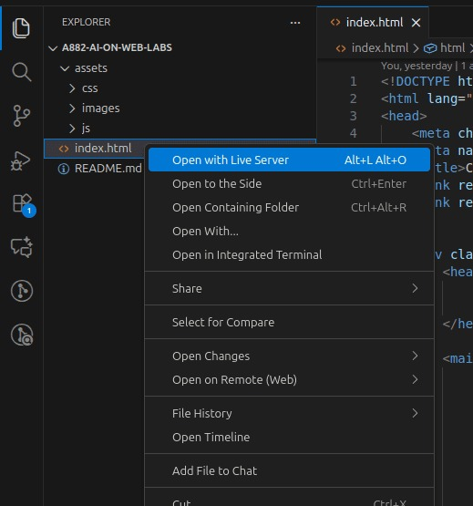
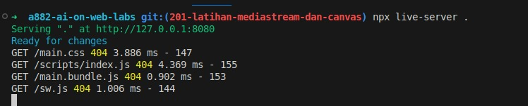
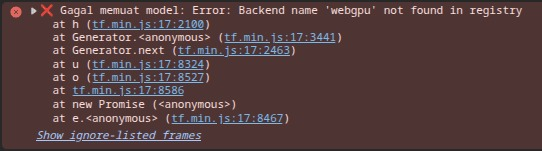
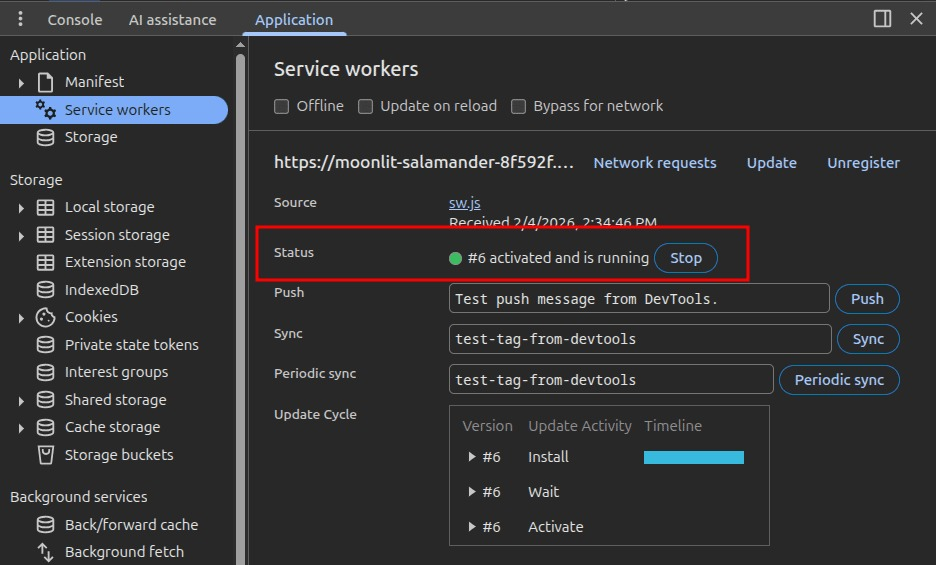
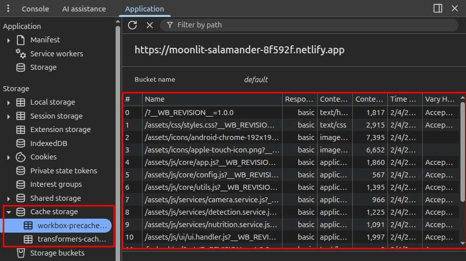

# Proyek Akhir

## Pengantar

**Selamat!** Akhirnya Anda telah sampai di penghujung pembelajaran. Seluruh bekal kemampuan untuk membangun aplikasi yang interaktif sudah Anda kuasai. Kami sangat mengapresiasi usaha dan dedikasi yang telah dilakukan.

Dalam perjalanan belajar, Anda telah mempelajari berbagai hal terkait penerapan AI di aplikasi web, di antaranya.

- Mengetahui contoh dan [kegunaan AI pada *platform browser*](https://www.dicoding.com/academies/882/tutorials/46844?from=47225).
- Mengenal [konsep, mekanisme kerja, dan jenis-jenis Computer Vision untuk *platform browser*](https://www.dicoding.com/academies/882/tutorials/46874?from=46844)*.*
- Memberikan nilai tambah pada aplikasi menggunakan [Generative AI](https://www.dicoding.com/academies/882/tutorials/47165?from=47363) .
- Membangun aplikasi yang memanfaatkan kemampuan *hardware* pengguna untuk memproses AI secara lokal.

Dengan menyelesaikan submission ini, Anda akan mampu:

1. Mengintegrasikan model dengan **TensorFlow.js** untuk membangun sebuah aplikasi yang dapat mengenali objek yang sudah dilatih.
2. Mengintegrasikan model *open source* dengan bantuan **Transformers.js** untuk menambahkan kemampuan *Generative AI* pada aplikasi.
3. Mengintegrasikan model *Computer Vision* dan *Generative AI* untuk menambah nilai pada suatu aplikasi.

Kini, saatnya membuktikan kemampuan tersebut dengan membangun Root Fact App.

### Apa itu Root Fact App?

Root Fact App adalah aplikasi asisten berbasis web yang dirancang untuk menambah nilai interaktivitas pada pengalaman pengguna melalui kemampuan mengenali jenis sayuran dan menyajikan informasi unik secara otomatis. Aplikasi ini menggabungkan dua fungsionalitas utama.

1. **Si Mata (Computer Vision):** Menggunakan kamera untuk mengenali berbagai jenis sayuran.
2. **Si Otak (Generative AI):** Setelah sayuran dikenali, ia akan menceritakan fakta menarik (*fun fact*) yang unik tentang sayuran tersebut.

### Mengenal Model yang Digunakan

Untuk membantu "Si Mata" bekerja, kami telah menyediakan sebuah *pre-trained model* khusus sayuran. Penting untuk diketahui bahwa model ini dilatih menggunakan metode yang sama dengan yang telah Anda pelajari pada modul sebelumnya. Model ini sudah memiliki kemampuan dasar untuk mengenali label sayuran seperti yang tertera pada berkas metadata.json.

### Apa yang Akan Anda Kerjakan?

Misi utama Anda pada submission ini adalah menyempurnakan starter project yang telah kami sediakan agar menjadi aplikasi yang memberikan nilai tambah bagi penggunanya.

Kami telah menyiapkan sebuah **TODO** list sebagai bantuan agar Anda tetap fokus pada sasaran utama pembelajaran. Namun, Anda tidak harus terpaku sepenuhnya pada instruksi TODO tersebut. Kami sangat mendukung Anda untuk berkreasi dan menggunakan pendekatan atau logika berbeda sesuai pemahaman Anda, selama tujuan utama integrasi AI berhasil dicapai dengan baik. Fokus pengerjaan Anda meliputi.

- **Mengintegrasikan Model:** Melengkapi logika penglihatan (TensorFlow.js) agar aplikasi mampu mengenali sayuran secara langsung melalui kamera.
- **Membangun Jembatan Logika:** Menghubungkan hasil deteksi sayuran ke model bahasa (Transformers.js) untuk menciptakan konten fun fact yang menarik.
- **Menjamin Ketangguhan:** Memastikan aplikasi tetap dapat memberikan informasi meskipun perangkat sedang tidak memiliki koneksi internet (*Offline-First*) melalui fitur instalasi aplikasi (PWA).

Selamat mengerjakan. Kami tunggu karya terbaik Anda!

## Starter Project

Catatan:

| Model dilatih menggunakan data sederhana sehingga hasil deteksinya mungkin tidak selalu tepat. Pastikan menguji aplikasi di tempat **terang** dengan latar belakang yang **bebas dari objek lain** agar deteksi lebih stabil. Jangan khawatir jika AI salah menebak karena fokus penilaian adalah pada alur kode |
| --- |

Kami memahami bahwa setiap pengembang memiliki latar belakang dan tingkat keahlian yang berbeda-beda. Oleh karena itu, kami menyediakan tiga jalur pengerjaan yang dapat Anda pilih sesuai dengan tujuan belajar Anda.

- **Jalur Standar (Basic):** Ditujukan bagi Anda yang ingin fokus sepenuhnya pada integrasi AI menggunakan JavaScript murni (Vanilla JS). Jika memilih jalur ini, nilai maksimal yang bisa Anda capai adalah Bintang 4.
- **Jalur Arsitektur (MVP atau React):** Ditujukan bagi Anda yang ingin menguji kemampuan manajemen kode tingkat lanjut menggunakan pola arsitektur *Model-View-Presenter* (MVP) atau pustaka React. Jalur ini merupakan syarat wajib untuk memenuhi kriteria pengerjaan tingkat lanjut demi mendapatkan nilai maksimal Bintang 5.

Silakan unduh berkas pendukung sesuai dengan jalur yang Anda pilih:

- **Starter Project (Basic):**[starter-project-basic.zip](https://raw.githubusercontent.com/dicodingacademy/a882-ai-on-web-labs/refs/heads/099-shared-files/03-submissions/root-facts-starter.zip)
- **Starter Project (MVP):**[starter-project-mvp.zip](https://raw.githubusercontent.com/dicodingacademy/a882-ai-on-web-labs/refs/heads/099-shared-files/03-submissions/root-facts-mvp-starter.zip)
- **Starter Project (React):**[starter-project-react.zip](https://raw.githubusercontent.com/dicodingacademy/a882-ai-on-web-labs/refs/heads/099-shared-files/03-submissions/root-facts-react-starter.zip)

**Penting:** Untuk mengerjakan kriteria pengerjaan tingkat lanjut (Advanced), Anda diharuskan menggunakan starter project versi **MVP** atau **React**.

### Cara Menjalankan Starter Project

1. **Ekstrak berkas ZIP** yang telah diunduh ke folder proyek Anda.
2. **Bukalah proyek** tersebut pada teks editor pilihan Anda.
3. **Jalankan**menggunakan dua opsi berikut:
  - Menggunakan Extension VS Code: **Live Server** 
  - Menggunakan **Node.js Live Server** 
  - (Opsional) Jika menggunakan MVP atau React Install dependencies yang diperlukan.npm installJalankan development server.npm run start-dev // Untuk MVP npm run dev // Untuk React

1. Buka browser dan akses aplikasi di http://localhost:<port> (port bisa berbeda tergantung konfigurasi).

Pada berkas starter project, kami telah menyediakan beberapa potongan kode yang dapat membantu Anda dalam pengerjaan submission ini. Silakan buka dan pelajari terlebih dahulu sebelum mulai mengerjakan.

## Kriteria

Dalam mengerjakan proyek ini, ada beberapa kriteria yang perlu Anda penuhi. Kriteria-kriteria tersebut diperlukan agar Anda dapat lulus dari tugas ini.

Setiap kriteria dapat bernilai 0 sampai 4 points (pts). Untuk lulus dari submission ini, Anda harus mendapatkan minimal 2 points dari setiap kriteria. Submission akan ditolak jika masih terdapat kriteria dengan 0 points.

Berikut adalah daftar kriteria yang harus Anda penuhi.

### Kriteria 1: Mengembangkan Fitur Deteksi Sayuran (Computer Vision)

Memastikan aplikasi berhasil melihat dan memprediksi sayuran menggunakan TensorFlow.js.

- **Rejected (0):**
  - Aplikasi gagal meminta atau mengakses izin kamera (*MediaStream API*).
  - Model **TensorFlow.js** tidak berhasil dimuat (terjadi *error* pada *console*).
  - Aplikasi tidak menampilkan label hasil prediksi sama sekali pada antarmuka pengguna (UI).
- **Basic (2):**
  - Fitur *streaming* kamera aktif dan model TensorFlow.js berhasil dimuat.
  - Aplikasi dapat menampilkan label nama sayuran secara otomatis saat objek dideteksi.
- **Skilled (3):**
  - Memenuhi kriteria **Basic**.
  - Menerapkan fitur **FPS Limit** yang dapat dikonfigurasi melalui UI atau kode.
  - Menampilkan indikator *loading* atau status seperti "**Menunggu Model...**" disertai **persentase** saat inisialisasi awal.
- **Advanced (4):**
  - Memenuhi kriteria **Skilled**.
  - Menerapkan **Backend Adaptif**: Kode mampu melakukan pengecekan `navigator.gpu` untuk menggunakan WebGPU dengan *fallback* otomatis ke WebGL.
  - **Manajemen Memori:** Secara disiplin menggunakan `tf.tidy()` atau `.dispose()` pada setiap siklus prediksi agar aplikasi tetap ringan di peramban pengguna.
  - Menggunakan arsitektur **MVP** atau library **React**.

### Kriteria 2: Mengintegrasikan Generative AI untuk Konten Fun Fact

Memastikan aplikasi dapat memproses label prediksi menjadi teks kreatif menggunakan Transformers.js.

- **Rejected (0):**
  - Konten *Fun Fact* bersifat statis (teks yang sama muncul untuk semua jenis sayuran).
  - Aplikasi tidak menggunakan pustaka *Generative AI* lokal (Transformers.js) sesuai materi modul.
  - Teks hasil generasi **tidak muncul** di UI setelah objek berhasil dideteksi.
- **Basic (2):**
  - Aplikasi berhasil mengirimkan hasil deteksi (label) ke dalam *prompt* AI secara dinamis.
  - Berhasil menampilkan teks *Fun Fact* unik yang relevan dengan jenis sayuran yang dideteksi.
- **Skilled (3):**
  - Memenuhi kriteria **Basic**.
  - Menerapkan fitur Salin ke Papan Klip (*Copy to Clipboard*) untuk teks hasil AI.
  - Mengatur parameter `temperature`, `max_new_tokens`, `top_p`, dan `do_sample` untuk menjaga performa.
- **Advanced (4):**
  - Memenuhi kriteria **Skilled**.
  - **Fitur Persona Dinamis:** Menyediakan pilihan gaya bahasa (contoh: Gaya "Lucu" atau "Sejarah") melalui elemen *dropdown/radio* button yang secara otomatis mengubah gaya penulisan AI.
  - Menerapkan **Backend Adaptif**: Kode mampu melakukan pengecekan `navigator.gpu` untuk menggunakan WebGPU dengan *fallback* otomatis ke WebGL.

### Kriteria 3: Menerapkan Offline Capability dan Deployment

Memastikan aplikasi dapat diakses menggunakan URL publik dan berjalan secara luring (*offline*).

- **Rejected (0):**
  - Aplikasi tidak dapat diakses melalui URL *production* (Netlify).
  - Berkas *Web App Manifest* tidak valid atau tidak terdeteksi oleh peramban (ikon dan nama tidak muncul di *DevTools Manifest*).
  - Aplikasi langsung *blank* atau error *404* saat koneksi internet dimatikan (sebelum data masuk *cache*).
  - Tidak melampirkan URL hasil deployment dalam **STUDENT.txt**
- **Basic (2):**
  - Aplikasi berhasil di-*deploy* ke Netlify.
  - Berhasil mengonfigurasi **Web App Manifest** dan **Service Worker** menggunakan **Workbox**.
  - Menerapkan Precaching pada aset inti (HTML, CSS, dan JS) agar aplikasi tetap dapat terbuka meski tanpa internet.
  - Melampirkan URL hasil deployment dalam **STUDENT.txt**
- **Skilled (3):**
  - Memenuhi kriteria **Basic**.
  - **Implementasi Linter:** Menyertakan konfigurasi linter (seperti **ESLint**) di dalam proyek untuk menjaga konsistensi gaya penulisan kode di seluruh berkas.
  - **Aplikasi Dapat Diinstal:** Berhasil mengonfigurasi *Web App Manifest* secara lengkap dan meregistrasikan *Service Worker* dengan benar sehingga aplikasi dikenali oleh browser sebagai aplikasi yang dapat diinstal (muncul tombol "*Install*" di *address bar* atau perintah "*Add to Home Screen*").
- **Advanced (4):**
  - Memenuhi kriteria **Skilled**.
  - **Offline AI Model:** Berhasil melakukan *Precaching* pada berkas model AI (file `.json` dan `.bin`) di `sw.js` sehingga proses deteksi tetap berfungsi meski dalam mode pesawat/tanpa internet.

## Tips & Trik

### Kriteria 1: Mengembangkan Fitur Deteksi Sayuran (Computer Vision)

- Gunakan library TensorFlow.js yang sama dengan versi latihan. Jika terdapat pembaruan gunakan versi yang spesifik seperti berikut. https://cdn.jsdelivr.net/npm/@tensorflow/tfjs**@4.22.0**/dist/tf.min.js
- Ketika menerapkan strategi Backend Adaptif, Anda akan menemukan error berikut jika belum menyertakan pemanggilan library `tfjs-backend-webgpu`. 

### Kriteria 2: Mengintegrasikan Generative AI untuk Konten Fun Fact

- Karena keterbatasan konteks bahasa, berikan prompt menggunakan **bahasa Inggris**.
- Gunakan pengaturan `max_new_tokens` maksimal **150 token**agar proses generasi teks tetap responsif dan tidak menyebabkan browser pengguna menjadi macet atau 'freeze' karena beban komputasi lokal yang terlalu berat.
- Untuk mengerjakan tugas sederhana, Anda dapat menggunakan konfigurasi `{ dtype: “q4” }` agar library Transformers.js tidak mengunduh versi full dari model yang sedang digunakan.
- Gunakan `await navigator.clipboard.writeText(<generative-text>);` untuk membuat fitur *copy to clipboard*.

### Kriteria 3: Menerapkan Offline Capability dan Deployment

- Pastikan berkas *service worker*sudah aktif melalui *Developers Tools* berikut. 
- Sebelum mengirimkan submission, pastikan berkas cache dapat ditemukan pada *Cache Storage.* **

## Resource

Untuk memberikan Anda gambaran yang jelas akan hasil akhir yang akan dikerjakan, kami menyediakan beberapa contoh aplikasi sebagai referensi. Melalui contoh ini, Anda dapat memahami standar fungsionalitas interaksi yang diharapkan pada setiap tingkatan.

- **Basic:**[Root Facts Apps - Basic](https://root-facts-basic.netlify.app/)
- **Skilled:**[Root Facts - Skilled](https://root-facts-skilled.netlify.app/)
- **Advanced:**[Root Facts Apps - Advanced](https://root-facts-advance.netlify.app/)

## Ketentuan Penilaian

**Perhitungan Nilai**

Nilai akhir yang Anda dapatkan diperoleh melalui perhitungan formula berikut.

| Nilai Akhir = Total Points / Jumlah Kriteria |
| --- |

**Catatan**:
Perhitungan nilai akhir di atas digunakan apabila setiap kriteria mendapatkan nilai 2 pts atau tidak ada kriteria yang ditolak.

**Tabel Penilaian:**
Adapun untuk penilaian submission dapat dilihat pada tabel berikut.

| **Ketentuan Penilaian** |
| --- |
| **Nilai Akhir** | **Nilai Dicoding** | **Nilai Huruf** | **Level of Mastery** | **Makna Nilai** | **Keterangan** |
| < 1 | Rejected | E | - | Tidak Lulus | Anda sudah mencoba, tetapi belum memenuhi kompetensi minimal. |
| 1 - < 2 | Bintang 2 | D | Bellow Basic | Kurang | Anda sudah memenuhi semua kompetensi minimal, tetapi terdapat area yang masih bisa ditingkatkan. |
| 2 - < 3 | Bintang 3 | C | Basic | Cukup | Anda sudah memenuhi semua kompetensi minimal dari learning objective. |
| 3 - < 4 | Bintang 4 | B | Skilled | Mahir | Anda sudah memenuhi semua kompetensi dengan baik atau mahir. |
| 4 | Bintang 5 | A | Advanced | Tingkat Lanjut | Anda sudah memenuhi semua kompetensi dengan sangat baik atau tingkat lanjut. |

## Lainnya

### Ketentuan Berkas Submission

- Berkas submission yang dikirim merupakan folder proyek dari Fun Fact App dalam bentuk ZIP.
- Jika menggunakan MVP dan React, pastikan Anda menghapus folder *node_modules* sebelum membuat berkas ZIP.
- Anda boleh menambahkan berkas aset seperti gambar selama aset tersebut digunakan pada proyek Anda.

### Submission Anda akan Ditolak Bila

- Kriteria utama tidak terpenuhi.
- Ketentuan berkas submission tidak terpenuhi.
- Menggunakan kode yang tidak bersumber dari starter project.
- Mengirimkan kode JavaScript yang telah di-*minify.*
- Melakukan kecurangan seperti tindakan plagiasi.
- Menggunakan library selain TensorFlow.js dan Transformers.js.
- Menggunakan pre-*trained**model* yang berbeda.
