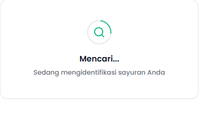
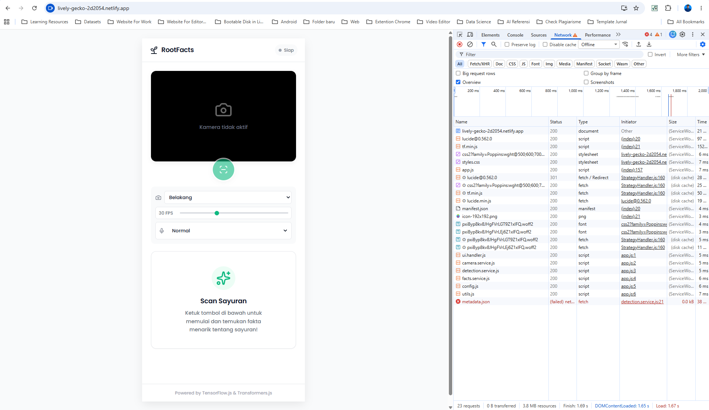

Hai nazhif_setyaf0tp! Terima kasih telah mengirimkan tugas submission sebagai syarat untuk melanjutkan pembelajaran. Project aplikasi yang kamu kirimkan sayangnya belum memenuhi seluruh kriteria yang ada. Masih terdapat beberapa catatan yang harus terpenuhi untuk menyelesaikan tugas submission. Yaitu: 

[ + ] Selalu menampilkan indikator "Mencari..." tetapi hasil inferensi model baik transformers.js ataupun tensorflow.js tidak muncul sama sekali.

Cobalah lakukan loggin terlebih dahulu pastikan hasilnya berhasil ditangkap. Untuk logging itu sendiri letaknya cek dikomentar kode review ya.

Menerapkan Offline Capability dan Deployment

[ + ] Mode offline masih belum didukung pada website yang dibuat. Masih ada beberapa berkas yang belum kamu daftarkan kedalam service worker, silahkan daftarkan berkas tersebut agar mode offline bisa berfungsi normal sebagaimana mode online berlangsung sesuai dengan fungsionalitasnya. Terakhir jangan lupa gunakan strategy caching yang tepat agar fitur yang kamu buat berjalan normal tanpa ada kendala bug.

Kamu dapat mengikuti beberapa saran di atas agar submission berikutnya dapat diterima dengan baik. 

Berikut referensi modul berdasarkan saran di atas:

1. https://www.dicoding.com/academies/882/tutorials/47180
2. https://www.dicoding.com/academies/882/tutorials/47321?hl=Caching+Strategy
3. https://www.dicoding.com/academies/882/tutorials/47327?hl=Latihan%3A+Caching+Strategy+Menggunakan+Workbox

Tetap semangat ya! Jika kamu ada pertanyaan atau kendala dalam menerapkan beberapa saran di atas. Silakan tanyakan di forum diskusi kelas. Kami akan dengan senang hati membantu menjawabnya.