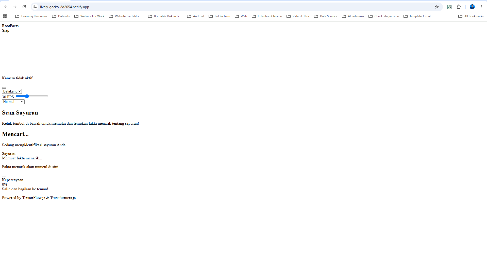
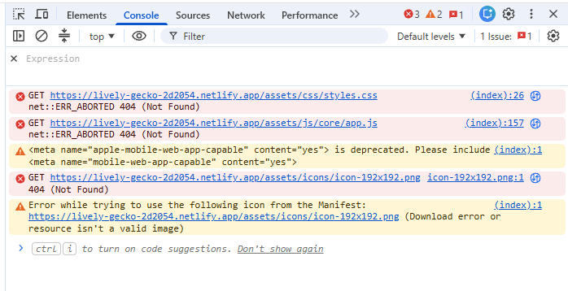

Hai nazhif_setyaf0tp! Terima kasih telah mengirimkan tugas submission sebagai syarat untuk melanjutkan pembelajaran. Project aplikasi yang kamu kirimkan sayangnya belum memenuhi seluruh kriteria yang ada. Masih terdapat beberapa catatan yang harus terpenuhi untuk menyelesaikan tugas submission. Yaitu: 

Beberapa komponen seperti tombol, webcam tidak tampil dengan baik.

Hal ini disebabkan karena lokasi CSS yang kamu panggil tidak ada sama sekali. Silahkan cek kembali log yang menyebabkan gagalnya terender komponen seperti berkas styles.css, app.js serta ikon-ikon lain. Pastikan berkas-berkas tersebut ada dalam proyekmu ya. Terakhir lakukan deploy ulang agar apa saja yang baru saja dirubah ikut berubah dari sisi server deploynya.

