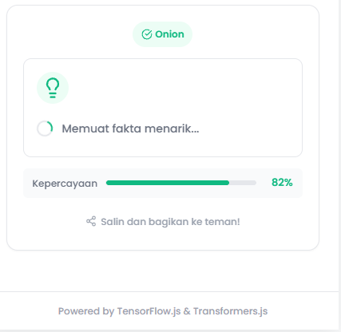

Hai dafina_meira_rizkl6s! Terima kasih telah mengirimkan tugas submission sebagai syarat untuk melanjutkan pembelajaran. Project aplikasi yang kamu kirimkan sayangnya belum memenuhi seluruh kriteria yang ada. Masih terdapat beberapa catatan yang harus terpenuhi untuk menyelesaikan tugas submission. Yaitu: 

Mengintegrasikan Generative AI untuk Konten Fun Fact

[ + ] Hasil deskripsi tidak muncul dan selalu tampil "Memuat fakta menarik..."

sewaktu kami cek di log tidak ada informasi loading/error apapun. Namun, sebetulnya proses pengunduhan model transformers.js sedang berjalan di background.

Cara yang benar alurnya, terlebih dahulu sebelum tampil mode "Siap", lakukan proses "Memuat Model..." (sembari menampilkan progress pengunduhan model berlangsung dalam persen) agar pengguna tahu sudah sampaimana proses pengunduhan model sudah berlangsung, dan ketika proses pengunduhan model selesai (100%) baru berubah dari mode "Memuat Model...." menjadi mode "Siap" yang akan dijalankan oleh pengguna dan langsung menampilkan deskripsi tanpa menunggu lama karena harus melakukan pengunduhan (seperti cara sekarang). Untuk lebih jelasnya kamu bisa cek demo berikut:

Basic: Root Facts Apps - Basic
Skilled: Root Facts - Skilled
Advanced: Root Facts Apps - Advanced                                              
Kamu dapat mengikuti beberapa saran di atas agar submission berikutnya dapat diterima dengan baik. 

Berikut referensi modul berdasarkan saran di atas:

Latihan: Integrasi Pre-trained Model
Kemampuan Generative Konten Secara Lokal

Tetap semangat ya! Jika kamu ada pertanyaan atau kendala dalam menerapkan beberapa saran di atas. Silakan tanyakan di forum diskusi kelas. Kami akan dengan senang hati membantu menjawabnya.