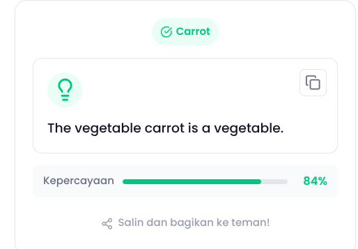
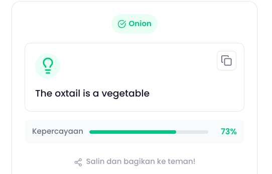
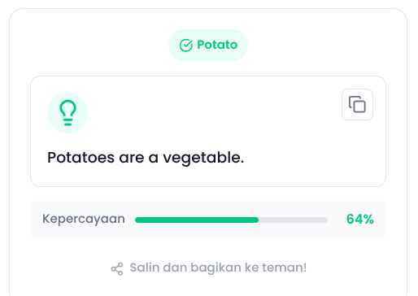

Catatan dari Reviewer

Hai dafina_meira_rizkl6s! Terima kasih telah mengirimkan tugas submission sebagai syarat untuk melanjutkan pembelajaran. Project aplikasi yang kamu kirimkan sayangnya belum memenuhi seluruh kriteria yang ada. Masih terdapat beberapa catatan yang harus terpenuhi untuk menyelesaikan tugas submission. Yaitu: 

Kriteria 2: Mengintegrasikan Generative AI untuk Konten Fun Fact

Aplikasi yang kamu bangun sudah mampu berjalan secara realtime dan ini merupakan pencapaian yang baik. Namun, kondisi tersebut membuat pengguna kesulitan membaca fun fact karena informasi sering berubah atau hilang saat objek bergerak.
Pertimbangkan untuk menghentikan kamera secara otomatis setelah proses deteksi berhasil. Dengan demikian, hasil deteksi dan fun fact dapat ditampilkan secara stabil sehingga lebih mudah dibaca dan user memiliki kesempatan untuk menyalin fun fact (jika menerapkan level yang lebih tinggi). Selain meningkatkan kenyamanan pengguna, pendekatan ini juga membantu mengoptimalkan penggunaan sumber daya perangkat dan mencegah proses deteksi berjalan berulang tanpa kebutuhan.
Implementasi Generative AI pada fitur Fun Fact masih belum memenuhi tujuan yang diharapkan. Berdasarkan hasil pengujian, konten yang dihasilkan belum benar-benar menyampaikan fakta menarik mengenai objek yang berhasil dideteksi. Sebagian besar respons masih bersifat umum, terlalu singkat, serta cenderung menyerupai deskripsi sederhana dibandingkan sebuah fun fact yang informatif dan menarik bagi pengguna.

Selain itu, panjang respons yang dihasilkan juga masih terbatas sehingga informasi yang diberikan kurang kaya dan kurang memberikan nilai tambah setelah proses deteksi objek dilakukan.
Saran perbaikan:
Susun kembali prompt agar model secara eksplisit diminta menghasilkan fakta unik, menarik, dan relevan dengan objek yang terdeteksi, bukan sekadar mendeskripsikan objek tersebut.
Tingkatkan nilai max_new_tokens agar model memiliki ruang yang lebih besar untuk menghasilkan respons yang lebih lengkap dan informatif. Pastikan nilainya tetap disesuaikan dengan kemampuan perangkat agar tidak menurunkan performa aplikasi secara signifikan.
Lakukan beberapa kali pengujian dan penyempurnaan prompt (prompt engineering) untuk memperoleh kualitas Fun Fact yang lebih konsisten dan menarik.

Referensi:
https://www.dicoding.com/academies/882/tutorials/47180