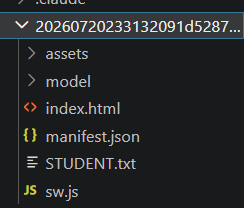
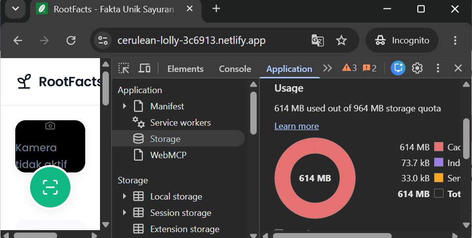
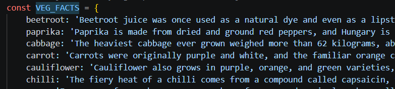

Hai dafina_meira_rizkl6s! Terima kasih telah mengirimkan tugas submission sebagai syarat untuk melanjutkan pembelajaran. Project aplikasi yang kamu kirimkan sayangnya belum memenuhi seluruh kriteria yang ada. Masih terdapat beberapa catatan yang harus terpenuhi untuk menyelesaikan tugas submission. Yaitu: 

Berkas Submission
Di dalam proyek yang kamu kirimkan tidak ditemukan berkas package.json. Berkas ini wajib disertakan di root proyek submission, baik untuk pendekatan vanilla JS maupun yang berbasis library MVP/React, karena menjadi acuan bagi reviewer untuk memeriksa dependency yang kamu gunakan.

Untuk memperbaikinya:
Jalankan npm init pada proyek kamu untuk menghasilkan berkas package.json, lalu sertakan berkas tersebut saat mengirimkan ulang submission ini.

Kriteria 2: Mengintegrasikan Generative AI untuk Konten Fun Fact
Pada facts.service.js, fun fact dihasilkan memakai model Xenova/flan-t5-base dengan dtype q8. Model ini jauh lebih besar dibanding model kecil yang disarankan modul, sehingga total berkas encoder dan decoder yang diunduh ke peramban membengkak hingga sekitar 600 MB pada Cache Storage saat kami uji, jauh di atas ukuran wajar untuk fitur Generative AI lokal di browser dan membuat pengguna menunggu sangat lama serta menghabiskan ruang penyimpanan perangkat yang besar sebelum fitur ini bisa dipakai.

Untuk memperbaikinya:
Ganti MODEL_ID pada facts.service.js dengan model yang jauh lebih ringan seperti Xenova/LaMini-Flan-T5-77M atau Xenova/flan-t5-small, yang tetap dapat menghasilkan fun fact dengan kualitas relevan namun ukuran unduhannya jauh lebih kecil.

Selain itu, setiap sayuran pada VEG_FACTS sudah memiliki satu kalimat fun fact utuh yang ditulis langsung di kode, dan model hanya diminta memparafrasenya. Kode ini lalu mengganti hasil parafrase dengan kalimat VEG_FACTS aslinya secara utuh begitu keluaran model dianggap menyimpang (terlalu pendek atau tidak memuat nama sayuran). Saat kami uji, fun fact yang tampil di aplikasi terbaca sama persis dengan kalimat yang sudah ditulis di VEG_FACTS untuk sayuran yang sama, sehingga fun fact yang dilihat pengguna sebetulnya adalah teks yang sudah disiapkan sebelumnya, bukan keluaran Generative AI yang sesungguhnya.

Untuk memperbaikinya:
Jadikan VEG_FACTS sebagai konteks singkat di dalam prompt, bukan kalimat utuh yang tinggal disalin ulang oleh model.
Hapus atau longgarkan mekanisme penggantian otomatis ke kalimat VEG_FACTS asli, sehingga fun fact yang tampil ke pengguna benar-benar berasal dari keluaran model, bukan salinan teks yang sudah ditulis sebelumnya.