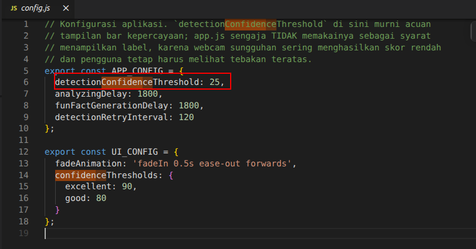
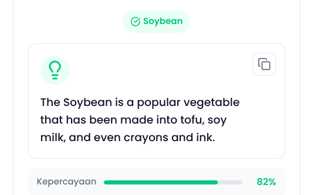
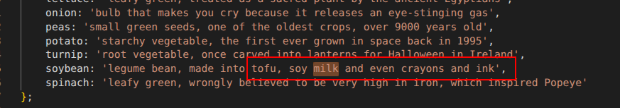

Catatan dari Reviewer

Hai dafina_meira_rizkl6s! Terima kasih telah mengirimkan tugas submission sebagai syarat untuk melanjutkan pembelajaran. Project aplikasi yang kamu kirimkan sayangnya belum memenuhi seluruh kriteria yang ada. Masih terdapat beberapa catatan yang harus terpenuhi untuk menyelesaikan tugas submission. Yaitu: 

Kriteria: Mengembangkan Fitur Deteksi Sayuran (Computer Vision)

Berdasarkan hasil pengujian, fitur camera stream belum berfungsi dengan baik. Kamera hanya menyala sesaat kemudian berhenti, namun aplikasi tetap menampilkan hasil prediksi meskipun kamera belum sempat melakukan proses pemindaian (scanning) terhadap objek yang akan dideteksi.

Kamu perlu menaikkan confidence threshold agar sistem hanya menampilkan hasil prediksi ketika tingkat keyakinan model cukup tinggi dan objek benar-benar terdeteksi. Pastikan juga proses prediksi hanya dilakukan berdasarkan frame yang berhasil ditangkap oleh kamera. Dengan demikian, hasil klasifikasi benar-benar berasal dari citra yang dipindai secara langsung.

Kriteria 2: Mengintegrasikan Generative AI untuk Konten Fun Fact

Aplikasi saat ini belum mampu menghasilkan fun fact secara otomatis melalui integrasi dengan model Generative AI. Terlihat bahwa konten fun fact yang ditampilkan masih berasal dari fallback statis, bukan hasil dari proses generasi berbasis prompt dan output model.

Hal ini terlihat ketika melakukan prediksi terhadap objek yang sama secara berulang, fun fact yang ditampilkan selalu sama dan tidak menunjukkan adanya variasi hasil dari model Generative AI.
