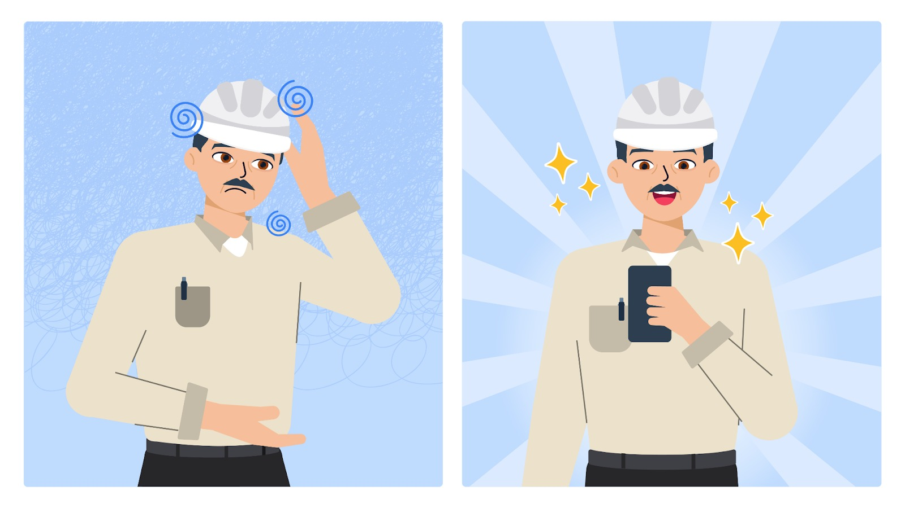
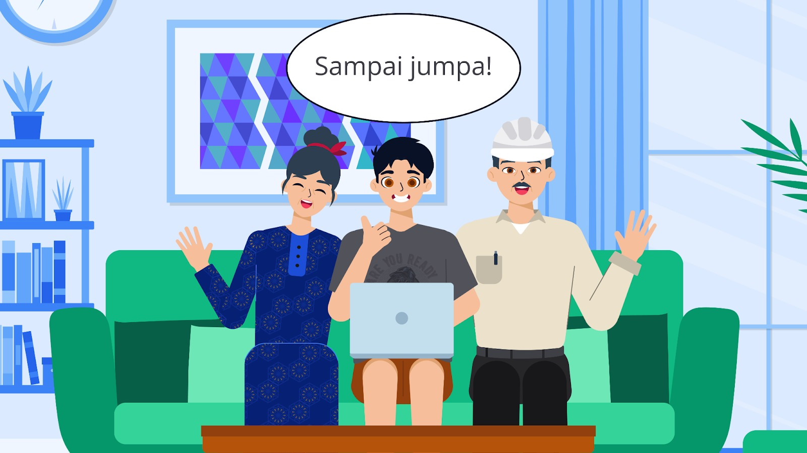

## Story Bima: Flutter Developer Berhadapan dengan Dunia Kerja

Setelah melalui perjalanan panjang mendalami penerapan machine learning pada Flutter, Bima akhirnya menyadari betapa berartinya ilmu yang telah dipelajari. Dia bukan hanya memahami teori, tetapi juga telah menerapkannya dalam berbagai aplikasi yang benar-benar bermanfaat bagi banyak orang, terutama kedua orang tuanya.

Bapaknya, Bapak Fajar, kini bisa dengan mudah memperkirakan harga rumah menggunakan aplikasi prediksi harga yang dibuat Bima. Meeting dengan klien pun menjadi lebih efisien berkat aplikasi transkripsi otomatis yang membantu mencatat setiap diskusi penting.

Sementara itu, ibunya, Ibu Fika, sangat terbantu dengan aplikasi pengenalan teks yang memudahkannya membaca dokumen. Bahkan, aplikasi pendeteksian wajah yang Bima buat juga memberikan manfaat dalam mengetahui kehadiran konsumen yang ingin memesan catering.

Meskipun dia menikmati proses belajar dan membangun aplikasi, Bima juga memiliki tujuan lain—menjadi seorang **Flutter developer profesional.** Dia pun mulai berbagi pengalaman dan proyek-proyeknya di LinkedIn, menunjukkan bahwa AI bisa diintegrasikan dalam aplikasi mobile. Dengan setiap *postingan*, ia semakin dikenal, dan portofolionya pun semakin kaya.

Suatu hari, sebuah instansi menghubunginya dengan tawaran menarik. Mereka ingin mengembangkan **aplikasi cerdas dalam bidang kuliner**. Aplikasi tersebut mampu mengidentifikasi nama makanan hanya dengan menggunakan kamera dan menampilkan informasi terkait makanan tersebut.

Bima langsung tertarik. Ini bukan sekadar proyek biasa. Ini adalah kesempatan untuk menerapkan machine learning dalam dunia kuliner, sebuah bidang yang luas dan penuh inovasi. Selain itu, proyek ini juga bisa menjadi tambahan portofolio yang kuat, sekaligus membuka peluang kerja lebih besar di masa depan.

Tanpa ragu, Bima menerima tantangan tersebut. Dengan semangat sama seperti saat pertama kali belajar AI, ia mulai merancang aplikasi yang mampu mengenali makanan. Ini bukan hanya tentang membangun aplikasi, tetapi juga tentang membuktikan bahwa ia siap terjun ke industri dan membawa teknologi AI dalam kehidupan sehari-hari.

Di tengah kesibukannya menyelesaikan proyek, Bima merenung sejenak. Ia merasa bangga telah berani mengambil langkah pertama dalam dunia teknologi AI. Namun, yang lebih penting, ia bersyukur atas dukungan dari keluarga serta ilmu yang telah ia pelajari selama ini.

**Terima kasih telah mengikuti perjalanan Bima hingga titik ini.** Semoga kisahnya bisa menjadi inspirasi bagi Anda untuk terus belajar, menghadapi tantangan, dan meraih impian yang lebih besar.

Sampai jumpa di petualangan berikutnya!

