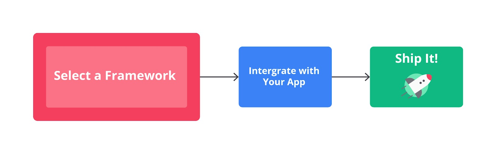
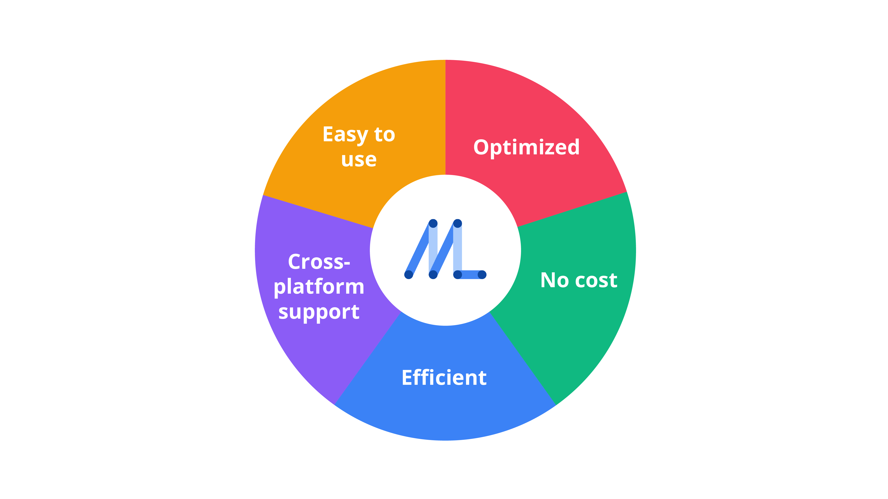
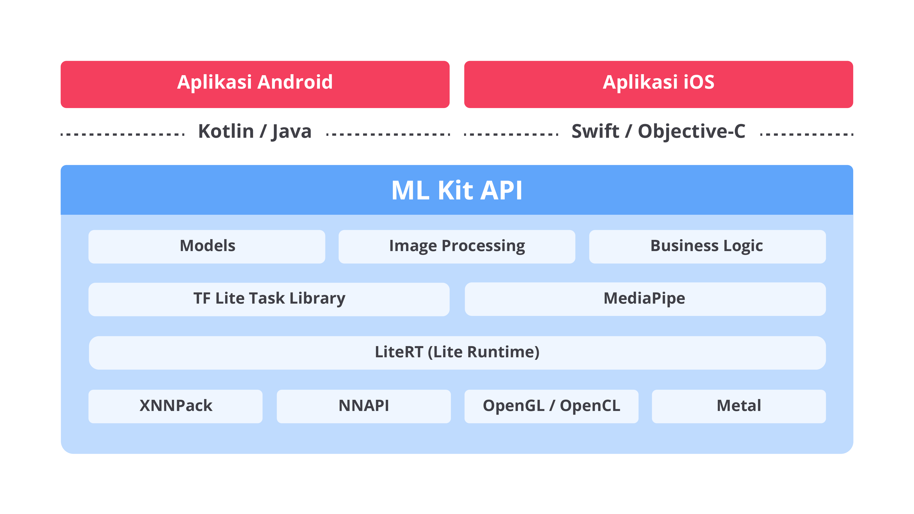
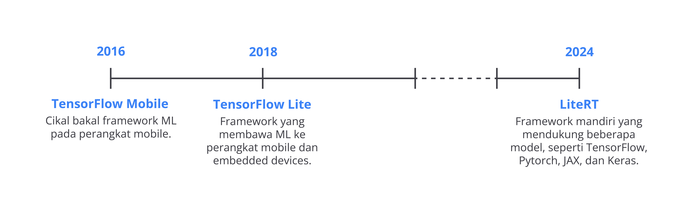
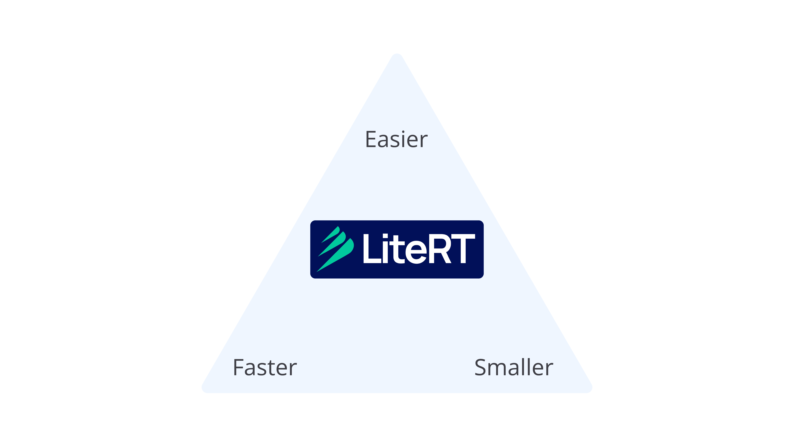
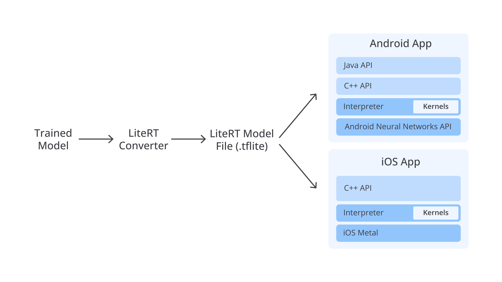
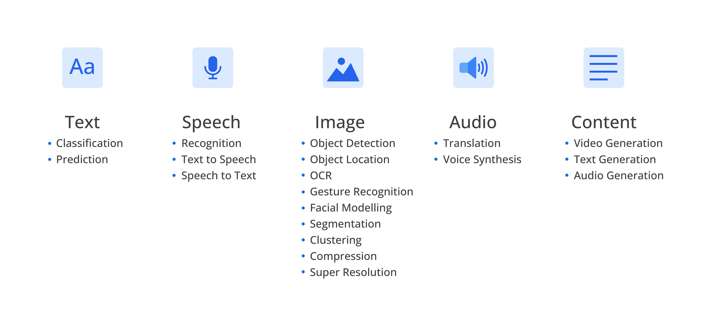
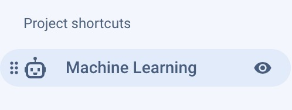
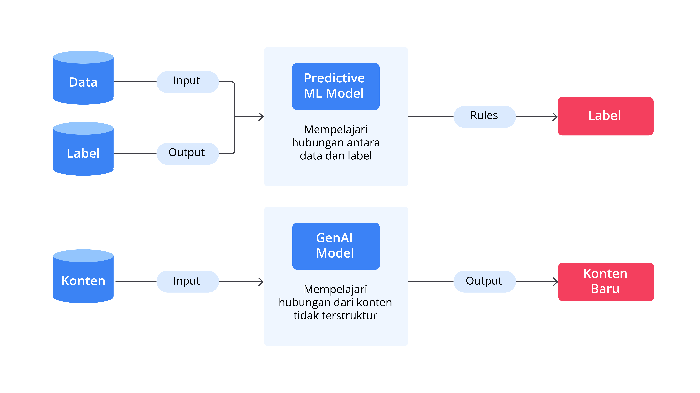
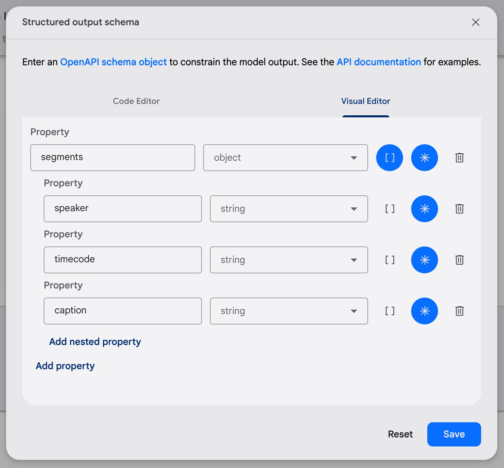

## Rangkuman Kelas

Selamat! Anda sudah sampai dipenghujung kelas. Banyak sekali pembahasan yang sudah Anda pelajari, mulai dari konsep machine learning, fitur pendukung aplikasi cerdas, teknologi ML Kit, LiteRT, dan generative AI. Berikut rangkuman kelas dari pembahasan tersebut.

## Rangkuman Machine Learning

- **AI**atau**kecerdasan buatan** adalah ilmu tentang mengajarkan mesin untuk belajar, bertindak, dan berpikir layaknya manusia.
- **ML**atau**machine learning**adalah salah satu cabang keilmuan dari AI yang berfokus pada pengembangan algoritma dan trained model yang memungkinkan komputer untuk belajar dari data, mengenali pola, serta membuat prediksi tanpa diprogram secara eksplisit.
- Teknologi ML menjadi hal krusial bagi para perusahaan dalam memberikan solusi terbaik. Pengguna akan menuntut pengalaman aplikasi yang cerdas dan cepat. Alhasil, para developer, baik dari perusahaan maupun individu, perlu bergegas untuk menghadirkan solusi yang sesuai dengan kebutuhan pengguna.
- Machine learning dibagi menjadi tiga jenis, yaitu supervised learning, unsupervised learning, dan reinforcement learning.
  - **Supervised learning**adalah konsep machine learning yang memerlukan data dan label agar komputer mesin belajar memahami antara keduanya.
  - **Unsupervised learning**adalah konsep machine learning yang mampu mempelajari pola dan struktur berdasarkan hubungan atau keterkaitan antar variabel pada data tanpa diberi label.
  - **Reinforcement learning**adalah konsep machine learning yang mirip dengan cara kita belajar sebagai manusia. Ia mampu mengeksplorasi situasi baru dan memanfaatkannya untuk membuat keputusan yang lebih baik.
- Ada beragam fitur ML yang dibagi berdasarkan jenis datanya.
  - **Vision**: image classification, object detection, face detection, dll.
  - **Natural Language Processing (NLP)**: language detection, translation, entity extraction, dll.
  - **Audio**: speech recognition dan audio classification.
- Ada dua cara untuk mengakses model ML dalam aplikasi, yaitu secara **cloud-based**dan**on-device**.
- Ketika menerapkan konsep **on-device ML**, Anda cukup memilih framework atau teknologi ML, mengintegrasikannya, dan mempublikasikannya. 
- Ada tiga cara saat Anda ingin menerapkan konsep on-device ML.
  - **Fixed model**: menggunakan framework bawaan untuk menjalankan fitur ML tanpa perlu memodifikasi trained model.
  - **Custom model**: menggunakan framework yang memerlukan trained model tambahan dan tersimpan dalam project Flutter.
  - **Dynamic custom model**: menggunakan framework untuk mengunduh model dari server apabila dibutuhkan dan disimpan pada aplikasi atau perangkat.
- Berikut adalah perbedaan pendekatan cloud-based atau on-device ML.**Fitur****Cloud-based****On-device****Lokasi**Model tersimpan pada cloud.Model tersimpan pada perangkat.**Keamanan**Data rentan diakses oleh penyadap.Data tetap pada perangkat.**Privasi**Privasi pengguna rentan disalahgunakan.Privasi pengguna lebih terjaga.**Kinerja**Pemrosesan relatif lambat.Pemrosesan relatif cepat.**Biaya**Biaya yang dikeluarkan relatif mahal.Biaya yang dikeluarkan lebih murah.**Tingkat Akurasi**Tingkat akurasi fitur ML relatif akurat.Tingkat akurasi lebih rendah daripada cloud-based.
- Ada beberapa framework yang dapat digunakan untuk penerapan machine learning dalam Flutter, yaitu **ML Kit**, **LiteRT**, dan **Generative AI**.
- Berikut adalah perbedaan antara teknologi ML dalam Flutter.**Fitur****ML Kit****LiteRT****Generative AI****Tujuan**Menyediakan model ML dan API siap pakai.Membuat model ML yang efisien untuk perangkat bersumber daya terbatas.Menyediakan akses ke model multimodal melalui API untuk menghasilkan konten generatif.**Kebutuhan Ilmu ML**Tidak perlu pengetahuan tentang ML.Opsional, perlu jika ingin memproses data lebih optimal dan efisien.Diperlukan ketika ingin menggunakan fitur lanjutan dan kustomisasi.**Fitur ML**Visual dan natural language.Visual, audio, dan natural language.Visual, audio, natural language, bahkan kode.**Penyimpanan Model ML**On-device.On-device.Cloud-based atau on-device.**Kompleksitas Fitur ML**Relatif mudah digunakan.Relatif kompleks.Relatif mudah digunakan.**Kompatibilitas**Dapat berjalan pada platform Android dan iOS.Dapat berjalan pada platform Android, iOS, dan perangkat IoT berbasis Linux.Dapat diakses melalui API dari berbagai platform, termasuk mobile, web, dan backend.

---

## Rangkuman Fundamen Cerdas

- Ada empat konsep dasar Flutter untuk machine learning yang perlu Anda pelajari.
  - Cara menggambar sebuah object.
  - Cara menyimpan suara dan memutarnya.
  - Cara menggunakan kamera dan galeri untuk mendapatkan berkas gambar.
  - Cara mengunggah file ke sebuah server.
- **Custom Painter** adalah kelas (*class*) untuk membuat kustomisasi widget. Anda dapat membuat objek 2D dalam layar aplikasi. Layaknya melukis, Anda dapat membuat bentuk apa pun melalui kanvas kosong.
- Flutter memiliki beberapa kelas widget yang mendukung pembuatan kustomisasi widget, antara lain berikut.
  - **CustomPaint**: sebuah wadah atau widget yang dapat diisi dengan CustomPainter.
  - **CustomPainter**: sebuah wadah untuk membuat custom widget pada sebuah kanvas.
  - **Canvas**: sebuah kelas untuk melukis objek 2D pada kanvas.
- Ada dua method yang harus Anda perhatikan ketika menerapkan Custom Painter.
  - **paint()**: method yang memberikan Canvas untuk menggambar objek 2D.
  - **shouldRepaint()**: method untuk membangun ulang seluruh objek Custom Painter apabila mengembalikan nilai true.
- Berikut adalah beberapa objek yang dapat kita gambar dengan memanfaatkan Canvas.
  - **Paint**: untuk mewarnai objek 2D ataupun kanvas.
  - **Rect**: untuk menggambar objek segi empat.
  - **RRect**: untuk menggambar objek segi empat dengan lengkungan pada setiap ujungnya.
  - **Circle**: untuk menggambar objek lingkaran.
  - **Lines**: untuk menggambar garis.
  - **Paragraph**: untuk menulis teks sebagai objek.
- Ada dua package yang perlu dipelajari dalam konsep menyimpan suara serta memutarnya, yaitu **audioplayers** dan **flutter_sound**.
  - Package **audioplayers** merupakan library pemutar audio. Ia dapat berjalan pada seluruh platform, mulai dari mobile, web, hingga desktop. Library ini dapat memutar berkas audio melalui beberapa sumber, seperti aset proyek, tautan URL, dan penyimpanan perangkat.
  - Package **flutter_sound** adalah salah satu package untuk merekam, memutar, dan mengolah audio pada aplikasi Flutter. Dengan fitur-fiturnya, Anda dapat merekam audio menggunakan mikrofon perangkat, bahkan dapat memutar file audio dari sumber lokal atau URL.
- Ada dua package yang perlu Anda pelajari dalam mengambil berkas gambar melalui galeri atau kamera, yaitu **image_picker**dan**camera**.
  - Package **image_picker** adalah salah satu library yang dibangun oleh tim Flutter untuk memilih gambar dengan mudah, baik melalui kamera bawaan maupun galeri. Library ini menyediakan fitur yang beragam.
    - Menangkap gambar dan merekam video melalui kamera bawaan.
    - Memilih gambar dan video melalui galeri.
    - Memilih banyak gambar (*multiple image*) dari galeri.
  - Package **camera** merupakan library besutan tim Flutter untuk mendukung fungsionalitas kamera dalam aplikasi. Alih-alih menggunakan kamera bawaan, Anda dapat mengustomisasi halaman kamera sesuai dengan keinginan. Package camera menyediakan berbagai layanan sebagai berikut.
    - Pengambilan gambar atau video.
    - Perbesar dan perkecil level *zoom*.
    - Penggunaan kamera depan dan belakang.
    - Pengaturan kualitas tangkapan gambar.
    - Pemilihan mode *flash*.
    - Pengaturan mode video (*start*, *resume*, *stop*).
- Untuk membuat aplikasi cerdas dengan konsep cloud-based machine learning, kita perlu belajar tentang cara komunikasi dengan Web API, salah satunya dengan memanfaatkan package **http**.
- Multipart bekerja untuk mengirimkan sekumpulan pasangan key-value ke server. Bedanya, ia mendukung lebih dari satu kumpulan data yang digabungkan dalam satu body. Hal ini memungkinkan Anda mengirim berkas dan informasi dari berkas tersebut dalam sekali request.
- Berikut adalah komponen yang harus diisi ketika mengunggah berkas menggunakan library http.
  - **fields**: kumpulan key-value yang diisi dengan nilai form.
  - **files**: kumpulan berkas yang ingin diunggah.
  - **headers**: kumpulan informasi tambahan pada header request.
- **Postman** merupakan salah satu tool yang sangat berguna untuk menguji sebuah API. Di dalamnya memiliki fungsionalitas yang lengkap dalam melakukan HTTP Request. Selain itu, aplikasi ini tersedia secara gratis dan dapat berjalan pada sistem operasi Windows, Linux, ataupun macOS.

---

## Rangkuman ML Kit

- **ML Kit** merupakan SDK (Software Development Kit) machine learning khusus dari Google untuk Android dan iOS yang dikenalkan pada acara Google I/O 2018.
- **ML Kit**adalah cara yang paling mudah untuk menambahkan fitur machine learning ke aplikasi mobile Anda. Cocok untuk Anda yang baru mulai terjun di dunia machine learning dengan latar belakang mobile developer dan tak mau pusing menyiapkan model machine learning.
- Ada manfaat yang bisa diperoleh ketika menerapkan ML Kit. 
  - **Easy to use**: ML Kit menyediakan API siap pakai yang dapat digunakan oleh para developer.
  - **Optimized**: ML Kit mendukung model on-device ML yang memungkinkan proses machine learning bekerja secara *offline* pada perangkat.
  - **Cross-platform support**: ML Kit ini dapat digunakan pada platform Android dan iOS.
  - **Efficient**: para developer tidak perlu menghabiskan waktu untuk melatih model ML sendiri atau mengalokasikan sumber daya untuk infrastruktur cloud (server).
  - **No cost**: developer tidak perlu membayar biaya tambahan untuk menggunakan fitur bawaan ML Kit.
- ML Kit memiliki arsitektur seperti berikut.  ML Kit merupakan abstraksi dari TensorFlow Lite Task library dan MediaPipe, tetapi dengan tambahan model yang siap pakai; kode untuk image *pre/post processing*; serta pipeline untuk *business logic* sehingga membuat baris kode yang dibutuhkan menjadi lebih sedikit.
- ML Kit menyediakan berbagai macam API siap pakai dengan jenis vision dan natural language processing (NLP).VisionNLPBarcode scanningFace detectionFace mesh detectionText recognitionImage labellingObject detection and trackingDigital ink recognitionPose detectionSelfie segmentationSubject segmentationDocument scannerLanguage identificationTranslationSmart replyEntity extraction
- Berikut adalah beberapa fitur yang unik dan hanya tersedia pada ML Kit.
  - **Barcode scanning**: berfungsi untuk scan dan membaca data dari *barcode* maupun QR code tanpa perlu koneksi internet.
  - **Digital ink recognition**: digunakan untuk mengenali tulisan tangan pada *touch screen* baik berupa teks maupun gambar.
  - **Selfie segmentation**: berguna untuk memisahkan *background* dengan orang yang di depannya.
  - **Entity extraction**: mendeteksi dan mengekstrak suatu teks yang bermakna (misal alamat, tanggal, nomor telepon, dll).
- Package [google_ml_kit](https://pub.dev/packages/google_ml_kit) adalah library “master” untuk menerapkan ML Kit pada Flutter.
- Package google_ml_kit disebut sebagai library “master” karena menyediakan beragam fitur ML Kit. Pastikan tidak menggunakan package ini pada fase *production* atau rilis aplikasi.
- Berikut adalah package-package dalam google_ml_kit beserta *checklist*dukungan pada platform.**Fitur ML****Package****Android****iOS****Vision APIs**Barcode Scanning[google_mlkit_barcode_scanning](https://pub.dev/packages/google_mlkit_barcode_scanning) ✅✅Face Detection[google_mlkit_face_detection](https://pub.dev/packages/google_mlkit_face_detection) ✅✅Face Mesh Detection[google_mlkit_face_mesh_detection](https://pub.dev/packages/google_mlkit_face_mesh_detection) ✅❌Text Recognition V2[google_mlkit_text_recognition](https://pub.dev/packages/google_mlkit_text_recognition) ✅✅Image Labeling[google_mlkit_image_labeling](https://pub.dev/packages/google_mlkit_image_labeling) ✅✅Object Detection and Tracking[google_mlkit_object_detection](https://pub.dev/packages/google_mlkit_object_detection) ✅✅Digital Ink Recognition[google_mlkit_digital_ink_recognition](https://pub.dev/packages/google_mlkit_digital_ink_recognition) ✅✅Pose Detection[google_mlkit_pose_detection](https://pub.dev/packages/google_mlkit_pose_detection) ✅✅Selfie Segmentation[google_mlkit_selfie_segmentation](https://pub.dev/packages/google_mlkit_selfie_segmentation) ✅✅Subject Segmentation[google_mlkit_subject_segemtation](https://pub.dev/packages/google_mlkit_subject_segemtation) ❌❌Document Scanner[google_mlkit_document_scanner](https://pub.dev/packages/google_mlkit_document_scanner) ✅❌**Natural Language APIs**Language Identification[google_mlkit_language_id](https://pub.dev/packages/google_mlkit_language_id) ✅✅On-Device Translation[google_mlkit_translation](https://pub.dev/packages/google_mlkit_translation) ✅✅Smart Reply[google_mlkit_smart_reply](https://pub.dev/packages/google_mlkit_smart_reply) ✅✅Entity Extraction[google_mlkit_entity_extraction](https://pub.dev/packages/google_mlkit_entity_extraction) ✅✅
- Berikut adalah alur umum dalam menggunakan ML Kit API.
  - Inisialisasi dan mengatur opsi fitur.
  - Menyiapkan sumber data, baik gambar maupun teks.
  - Melakukan proses ML (*inference*).
  - Menampilkan hasil data.
- **Text Recognition API** berfungsi untuk mengekstrak teks dari suatu gambar.
- Text recognition pada ML Kit **mendukung aksara**berikut.
  - Latin
  - Cina
  - Devanagari (India)
  - Jepang
  - Korea
- **InputImage** adalah sebuah kelas dalam ML Kit untuk mewakili gambar yang akan diproses oleh model machine learning.
- Ada beberapa cara untuk mengonversi gambar ke InputImage.
  - **fromFile**: membuat InputImage dari objek File. Biasanya diperoleh dari library dart:io.
  - **fromFilePath**: membuat InputImage dari file gambar yang diidentifikasi dengan path file.
  - **fromBytes**: membuat InputImage dari data bytes. Biasanya bisa bertipe data Uint8List atau List<int> yang didapatkan dari File atau kamera.
- Berikut adalah beberapa bagian yang bisa kita dapatkan dari text recognition.
  - **Block**: bagian satu blok paragraf.
  - **Line**: bagian untuk setiap baris.
  - **Element**: bagian untuk untuk setiap kata.
  - **Symbol**: setiap karakter atau simbol pada suatu kata.
- **Face Detection API**berfungsi untuk mendeteksi wajah dari suatu gambar.
- Face detection pada ML Kit mendukung beberapa fitur lainnya.
  - Mengidentifikasi **landmark** atau titik penting pada wajah.
  - Mengidentifikasi **contour** (kontur) atau garis tepi wajah.
  - **Mengklasifikasikan** wajah sedang tersenyum atau membuka mata.
  - **Melacak** pergerakan wajah pada suatu *frame* ke *frame*.
- Area bounding box hasil dari face detection tidak bisa dipakai secara mentah-mentah. Kita perlu mengonversi area bounding box sesuai dengan rasio tampilan layar.
- **Entity Extraction API** berfungsi untuk mengekstraksi entitas penting pada suatu teks.
- Entity extraction mampu mengidentifikasi entitas penting. Berikut adalah daftar entitas yang dapat diidentifikasi.
  - Address
  - Date-time
  - Email Address
  - Flight Number (kode penerbangan)
  - IBAN (international bank account number)
  - ISBN (international standard book number)
  - Payment/Credit Cards
  - Phone Number
  - Tracking Number (standardized international formats)
  - URL
  - Money/Currency
- Entity extraction mendukung **15 bahasa**, tetapi bahasa Indonesia tidak termasuk.
- Ada tiga jenis cara untuk mendapatkan model ML Kit pada aplikasi.
  - **Unbundled**: model diunduh secara dinamis melalui Google Play Service.
  - **Bundled**: model sudah ada sejak awal ketika build time.
  - **Dynamically Downloaded**: model diunduh secara on demand hanya ketika aplikasi membutuhkannya.

---

## Rangkuman LiteRT

- **LiteRT** (kependekan dari Lite Runtime) adalah versi ringan dan efisien dari *framework* TensorFlow yang sering digunakan ML developer untuk mengembangkan serta men-deploy model.
- LiteRT dirancang untuk menjalankan trained model dengan efisien dan ringan pada perangkat dengan sumber daya terbatas.
- LiteRT, dikenal sebagai TensorFlow Lite dan sebelum itu sebagai TensorFlow Mobile, adalah teknologi untuk menjalankan model machine learning pada perangkat dengan keterbatasan sumber daya.
- Saat ini, LiteRT fokus menjadi framework mandiri yang mendukung beberapa model, seperti TensorFlow, PyTorch, JAX, dan Keras. 
- Ada manfaat yang bisa diperoleh ketika menerapkan LiteRT. 
  - **Smaller**: ia memiliki ukuran yang kecil sekitar 75 KB untuk kebutuhan Interpreter.
  - **Faster**: komputasinya lebih cepat karena menggunakan eksekusi statis yang tidak memerlukan banyak sumber daya.
  - **Easier**: ia menyediakan API yang berorientasi pada inferensi. Cukup menjalankan satu fungsi inferensi, kita bisa mendapatkan hasil prediksi.
- LiteRT membuka berbagai kemungkinan untuk menerapkan fitur ML pada beragam platform aplikasi, seperti mobiledan IoT.
- LiteRT memiliki arsitektur seperti berikut.  Dimulai dengan melatih model machine learning. Biasanya, model dibuat dengan beragam framework, seperti TensorFlow, PyTorch, JAX, atau Keras. Kemudian, ia dikonversi menjadi LiteRT model berekstensi **.tflite** menggunakan LiteRT Converter. Setelah itu, LiteRT disematkan ke aplikasi mobileuntuk melakukan proses inferensi.
- Beragam **fitur ML** yang dapat dikerjakan oleh LiteRT mulai dari data teks, berbicara, gambar, audio, hingga pembuatan konten. 
- LiteRT dapat dikategorikan menjadi dua bagian, yaitu Task Library dan Interpreter API.
  - **Task Library** menyediakan berbagai solusi machine learning dengan beragam jenis data, seperti vision, audio, dan natural language processing (NLP).
  - **Interpreter API** adalah interface dasar guna menjalankan inferensi pada LiteRT yang digunakan untuk tugas-tugas umum.
- Untuk mencari model LiteRT yang sudah siap pakai, Anda dapat menggunakan website [Kaggle Models](https://www.kaggle.com/models?framework=tfLite).
- Beberapa contoh **aplikasi** yang menggunakan LiteRT adalah Gboard, Google Assistant, Uber, dan AirBnB. Bahkan ML Kit juga menggunakan LiteRT sebagai basisnya.
- Package [tflite_flutter](https://pub.dev/packages/tflite_flutter) adalah library yang digunakan untuk menjalankan LiteRT model langsung pada aplikasi, baik platform Android maupun iOS.
- Package tflite_flutter memanfaatkan **Interpreter API** untuk memberikan fleksibilitas lebih besar dalam mengelola fitur ML pada LiteRT.
- Pada platform Android, kita bisa menjalankan Android Neural Network API (NNAPI) dengan mengaktifkan konfigurasi **useNnApiForAndroid**, sedangkan platform iOS mengaktifkan konfigurasi **useMetalDelegateForIOS**untuk menjalankan Metal API.final options = InterpreterOptions() ..useNnApiForAndroid = true ..useMetalDelegateForIOS = true;
- Interpreter pada tflite_flutter dapat memuat model dengan dua cara, yaitu dari aset project menggunakan method **fromAsset** atau berkas file perangkat menggunakan method **fromFile**.// Load model from assets _interpreter = await Interpreter.**fromAsset**(_modelPath, options: options); // Load model from assets _interpreter = await Interpreter.**fromFile**(modelFile, options: options);
- Sebelum melakukan inferensi, kita perlu mengetahui ukuran (*shape*) input dan output dari mode yang dipakai. Dengan begitu, kita dapat memberikan data secara tepat dan menghasilkan keluaran yang sesuai._interpreter = await Interpreter.fromAsset(_modelPath, options: options);**_inputTensor = _interpreter.getInputTensors().first; _outputTensor = _interpreter.getOutputTensors().first;**
- Ada hal yang perlu dilakukan ketika menerapkan fitur ML dengan data gambar, yaitu menjalankan inferensi pada **Isolate**.
- **Firebase ML**adalah tools untuk menyediakan serangkaian API dan layanan machine learning yang terintegrasi dengan Firebase.
- Firebase ML memiliki beberapa fitur utama.
  - Ia menyediakan fitur **custom model** untuk mengustomisasi trained model yang akan dipakai dalam proses inferensi.
  - Ia menggunakan **dynamic model downloads** untuk mengunduh model secara dinamis.
  - Ia menyediakan fitur ML yang dapat bekerja secara cloud-based ML, seperti text recognition, labelling images, dan landmark identification.
- Berikut adalah beberapa keunggulan dari**dynamic model downloads**pada Firebase ML.
  - Memungkinkan aplikasi bersinggungan dengan fitur ML, tetapi tidak menyimpan model pada perangkat secara langsung.
  - Mampu mengurangi ruang penyimpanan pada perangkat saat aplikasi terinstal pertama kali.
  - Fleksibilitas penggantian model dalam layanan Firebase yang memungkinkan aplikasi tidak perlu melakukan pembaruan secara terus-menerus.
- Untuk menggunakan Firebase ML, kita perlu mengaktifkan layanan **Machine Learning melalui Firebase console**. 
- Package [firebase_ml_model_downloader](https://pub.dev/packages/firebase_ml_model_downloader) adalah library yang digunakan untuk menerapkan Firebase ML pada Flutter.
- Cukup memanggil method **getModel()**untuk mendapatkan model dari penyimpanan Firebase ML.class FirebaseMlService { Future<File> loadModel() async { final instance = FirebaseModelDownloader.instance; **final model = await instance.getModel( "House-Price-Predictor", FirebaseModelDownloadType.localModel, FirebaseModelDownloadConditions( iosAllowsCellularAccess: true, iosAllowsBackgroundDownloading: false, androidChargingRequired: false, androidWifiRequired: false, androidDeviceIdleRequired: false, ), );** return model.file; } }
- Method getModel() memiliki tiga parameter yang bisa diatur.
  - **modelName**: nama model yang tercatat pada Firebase ML.
  - **downloadType**: menentukan mode download yang akan dikembalikan ke aplikasi.
  - **conditions**: kondisi perangkat saat mengunduh model.
- Nilai **modelName** adalah nama model yang kita isi saat menambahkan model pada Firebase ML.
- Nilai **downloadType**adalah tipe atau cara aplikasi mengunduh model dari Firebase ML. Ada tiga cara yang bisa dilakukan.
  - **FirebaseModelDownloadType.localModel**: aplikasi akan mengunduh model apabila tidak tersedia pada perangkat.
  - **FirebaseModelDownloadType.localModelUpdateInBackground**: aplikasi akan mengunduh model secara berkala.
  - **FirebaseModelDownloadType.latestModel**: aplikasi akan mengunduh model apabila ada model yang baru.
- Nilai **conditions** adalah kondisi aplikasi dapat mengunduh model dari Firebase. Berikut kondisinya.
  - **iosAllowsCellularAccess**: perangkat iOS mengizinkan mengunduh model menggunakan data seluler. Jika bernilai false, proses mengunduh bergantung dengan konektivitas wifi.
  - **iosAllowsBackgroundDownloading**: perangkat iOS mengizinkan mengunduh model ketika aplikasi berada di balik layar (*background*) atau tidak aktif pada layar.
  - **androidChargingRequired**: perangkat Android perlu dalam keadaan dicas saat mengunduh.
  - **androidWifiRequired**: perangkat Android membutuhkan konektivitas WiFi untuk mengunduh.
  - **androidDeviceIdleRequired**: perangkat Android harus dalam keadaan *idle* atau menyala dan tidak digunakan selama proses mengunduh.

---

---

## Rangkuman Generative AI

- **Generative AI** adalah teknologi yang bisa “menciptakan” suatu hal baru, seperti gambar, cerita, atau lagu, berdasarkan contoh yang pernah ia pelajari sebelumnya.
- Generative AI ini seperti teman cerdas yang bisa membantu menyelesaikan tugas tertentu.
- Model generative AI bekerja dengan mempelajari pola dari **konten**, seperti teks, gambar, atau audio. Ia akan mencoba mencari pola dari data tersebut sehingga **menghasilkan konten baru** serupa dengan data yang telah dipelajari sebelumnya. 
- Berikut adalah beberapa kategori konten yang dihasilkan oleh generative AI beserta penerapannya dalam berbagai industri.
  - Teks dan tulisan.
  - Gambar dan desain.
  - Musik dan audio.
  - Video dan animasi.
  - Kode pemrograman.
  - Interaksi virtual.
- **Gemini** adalah salah satu produk generative AI yang dikembangkan oleh Google serta dirancang untuk menjadi model yang sangat fleksibel dan multimodal.
- Definisi **multimodal** di sini mampu memahami dan memproses berbagai jenis data yang berbeda, seperti teks, gambar, video, audio, bahkan kode pemrograman.
- Gemini menyediakan **variasi model** yang dapat disesuaikan dengan kebutuhan dan kasus penggunaan yang berbeda.
- Generative AI tidak memiliki pemahaman kontekstual secara mendalam seperti manusia. Meskipun ia mampu menyusun teks yang terdengar meyakinkan, generative AI tidak bisa membedakan antara opini dan fakta dengan sempurna.
- Generative AI memudahkan kita dalam pembuatan konten baru, tetapi juga memiliki potensi untuk menyampaikan informasi yang salah.
- **Responsible AI** harus hadir pada setiap penggunaan generative AI. Ia adalah konsep dalam pengembangan kecerdasan buatan yang menekankan pada penggunaan AI secara etis, adil, dan transparan.
- Responsible AI ini mencakup berbagai **aspek**, seperti keamanan, privasi, keadilan, serta keterbukaan dalam cara AI membuat keputusan.
- [Google AI Studio](https://aistudio.google.com/) adalah platform yang dirancang untuk membantu developer dalam membangun, menguji, dan mengintegrasikan model Gemini pada aplikasi mereka.
- **Google AI Studio** memungkinkan pengguna untuk berinteraksi dengan model Gemini, menyesuaikan parameter, serta mengimplementasikannya secara mudah tanpa seorang ahli dalam bidang machine learning.
- Ada perbedaan antara Google AI Studio dan Gemini.

| Fitur | Google AI Studio | Gemini (Umum) |
| --- | --- | --- |
| **Tujuan Utama** | Platform untuk mengembangkan dan mengintegrasikan model AI pada aplikasi. | Chatbot AI yang digunakan untuk tugas sehari-hari. |
| **Target Pengguna** | Developer, engineer, dan perusahaan yang ingin membangun aplikasi cerdas. | Pengguna umum yang membutuhkan asisten AI untuk produktivitas dan kreativitas. |
| **Kemampuan Utama** | Menguji, menyesuaikan, dan mengintegrasikan model AI melalui API. | Memahami dan menghasilkan konteks teks dan gambar, serta membantu tugas sehari-hari. |
| **Personalisasi** | Dapat menyesuaikan model AI dengan kebutuhan aplikasi. | Tidak dapat dikustomisasi secara detail oleh pengguna. |
| **Aksesibilitas** | Digunakan melalui platform Web dan Web API untuk integrasi pada aplikasi. | Bisa diakses langsung melalui web atau aplikasi mobile. |
| **Integrasi** | Bisa diintegrasikan pada aplikasi atau layanan lain melalui Web API. | Tidak bisa diintegrasikan langsung pada aplikasi, hanya untuk interaksi pengguna. |

- **Prompt** itu ibarat perintah yang kita beri kepada sistem AI untuk menghasilkan respons sesuai dengan keinginan kita.
- **Prompt bisa berisi****pertanyaan****atau****instruksi****. Semakin jelas dan spesifik berbicara dengannya, semakin baik respons yang diberikan. Semakin terarah perintah yang diberikan, semakin relevan dan akurat hasilnya.**
- Prompt dapat dibagi menjadi tiga bagian.
  - **Input** (wajib): menjelaskan instruksi atau pertanyaan yang ingin diberikan ke model.
  - **Konteks** (opsional): informasi atau latar belakang tambahan yang bisa membantu memahami maksud prompt lebih baik.
  - **Contoh** (opsional): sampel atau referensi yang menunjukkan format atau gaya output yang diharapkan dari model.
- Ada beberapa tips yang bisa Anda terapkan ketika menyusun prompt.
  - Gunakan bahasa yang jelas dan spesifik.
  - Gunakan kata kunci penting.
  - Pertimbangkan persona.
  - Tentukan panjang dan gaya penulisan.
  - Eksperimen dan iterasi.
- Package [google_generative_ai](https://pub.dev/packages/google_generative_ai) adalah library yang dikelola oleh tim Google untuk memudahkan para developer dalam menggunakan model-model Gemini.
- Integrasi package google_generative_ai dengan kode Dart sangat mudah. Definisikan konfigurasi model, isi prompt-nya, dan jalankan inferensi.

```
import 'package:google_generative_ai/google_generative_ai.dart';
 
void main() async {
 final apiKey = "YOUR_GEMINI_API_KEY";
 
 final model = GenerativeModel(
   model: 'gemini-2.0-flash',
   apiKey: apiKey,
   systemInstruction: Content.system('Jelaskan dengan singkat saja'),
 );
 
 final prompt = 'Berikan 10 wisata terbaik di Indonesia!';
 
 final content = [Content.text(prompt)];
 
 final response = await model.generateContent(content);
 
 print(response.text);
}
```

- Ada hal yang paling krusial dalam proses integrasi model Gemini dengan aplikasi, yaitu penggunaan **API key**. Tidak memiliki API key maka kita tidak memiliki akses untuk menggunakan model Gemini dalam aplikasi.
- Ada dua jenis inferensi pada model Gemini.
  - **Generate content** akan menghasilkan konten baru tanpa menyimpan history atau sejarah prompt sebelumnya. Setiap kali menggunakan fungsi berjenis ini, ia akan memulai dari awal seolah-olah Anda baru saja berinteraksi dengan model untuk pertama kalinya.
  - **Chat** memungkinkan model untuk mengingat interaksi sebelumnya dalam percakapan. Model mampu menyimpan histori prompt dan respons sehingga Anda dapat melanjutkan percakapan dengan memberikan prompt lebih singkat atau mengacu pada konten yang telah dihasilkan sebelumnya.
- Gemini API memiliki fitur untuk menghasilkan konten berformat JSON. Cara menyusun respons dengan format JSON adalah cukup memanfaatkan fitur **Structured output**. 
- Ada hal yang perlu diperhatikan untuk menentukan nama “property” pada Structured output.
  - Sesuai dengan konteks data.
  - Menggunakan konvensi penamaan yang sesuai.
  - Menghindari nama yang terlalu umum.
  - Mengacu pada skema JSON standar.
