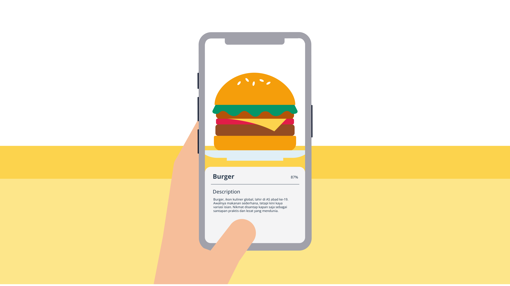
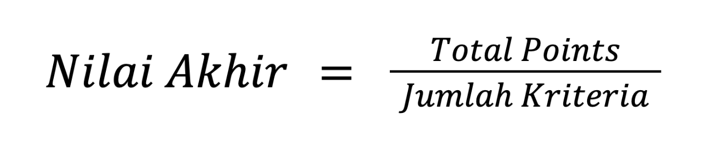
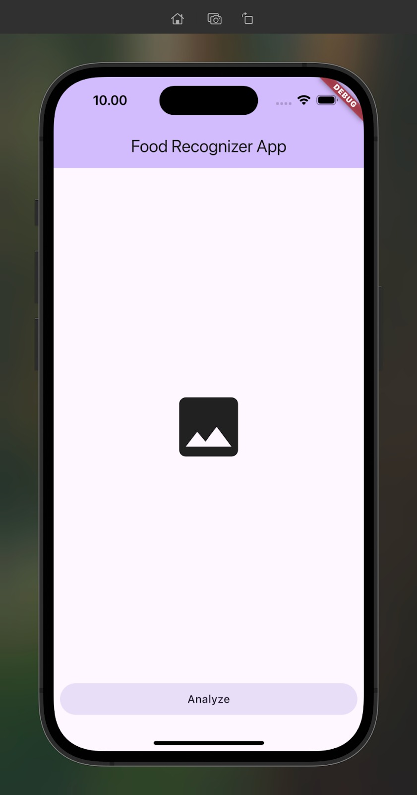
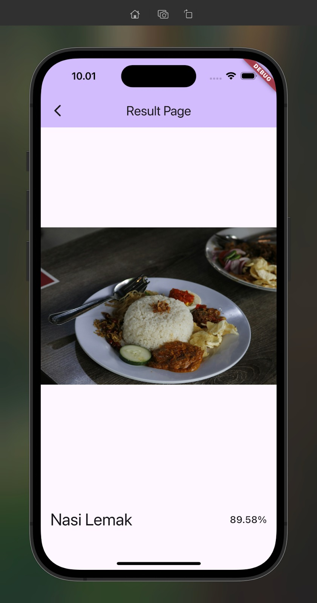
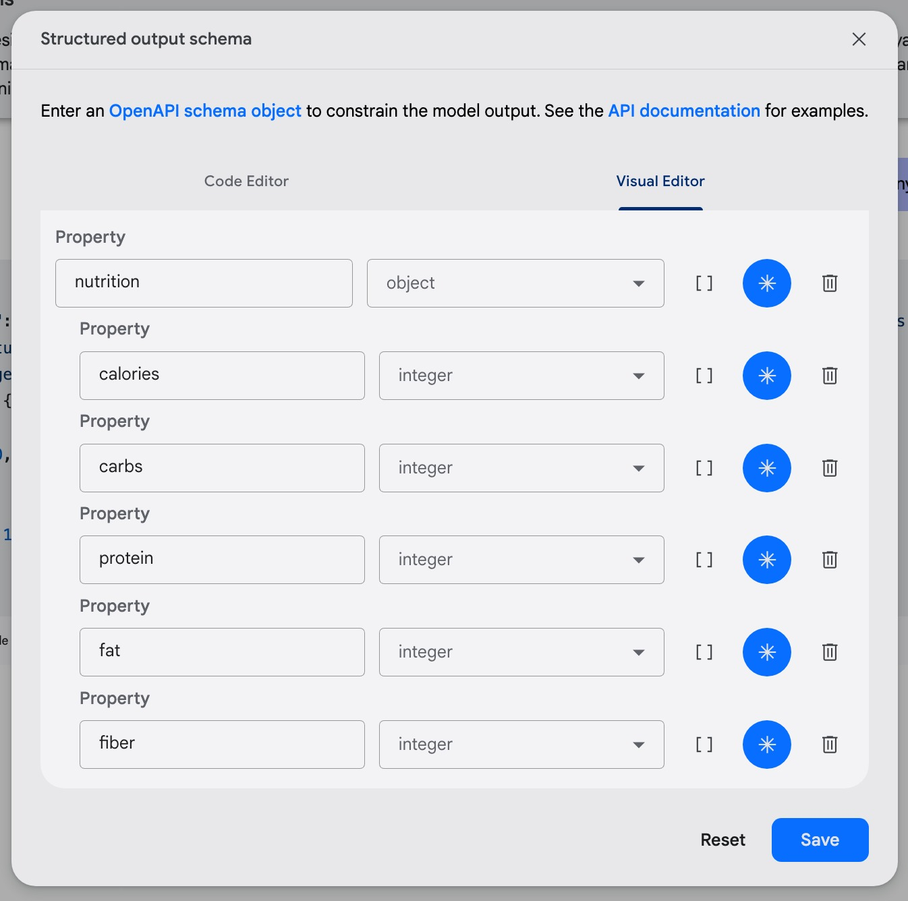
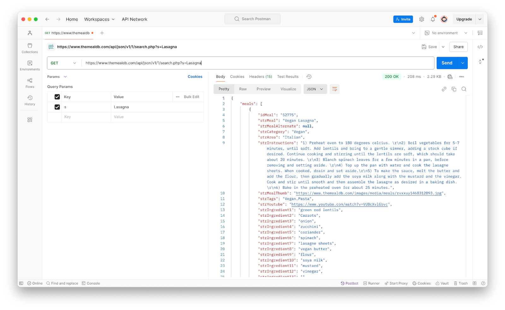
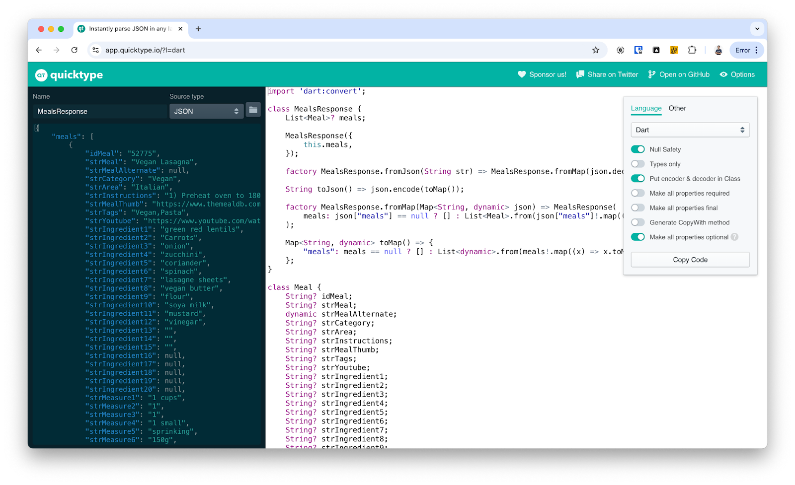

# Submission Food Recognizer App

## Pengantar

Selamat!

Anda telah menyelesaikan seluruh materi kelas Belajar Penerapan Machine Learning untuk Flutter. Pencapaian ini adalah hasil dari dedikasi dan usaha keras Anda. Sampai tahap ini, Anda telah menyelesaikan beberapa materi.

- [Machine Learning](https://www.dicoding.com/academies/758/tutorials/41347)
- [Fundamen Cerdas](https://www.dicoding.com/academies/758/tutorials/42302)
- [ML Kit](https://www.dicoding.com/academies/758/tutorials/42537)
- [LiteRT](https://www.dicoding.com/academies/758/tutorials/42577)
- [Generative AI](https://www.dicoding.com/academies/758/tutorials/42622)

Untuk mengasah sekaligus memvalidasi kemampuan, ada asesmen berupa proyek yang harus Anda kerjakan. Asesmen ini menjadi hal penting bagi Anda untuk menguji seberapa paham terhadap materi yang sudah dipelajari. Dalam hal ini, Anda perlu membangun suatu aplikasi Flutter yang terintegrasi dengan machine learning. Nantinya, reviewer kami akan memeriksa pekerjaan Anda dan memberikan hasil reviu pada proyek yang dibuat.

### Story: Bima dan Project Pertamanya

Bima baru saja meraih kesempatan emas pertamanya. Sebuah proyek ambisius menanti, yaitu membangun aplikasi Food Recognizer yang memanfaatkan kecanggihan kecerdasan buatan. Dengan berbekal pengetahuan tentang machine learning pada aplikasi, seperti ML Kit, LiteRT, dan bahkan Generative AI dengan Gemini, Bima yakin mampu menaklukkan tantangan ini.

Konsep aplikasi Food Recognizer sangatlah menarik. Bayangkan saja, cukup dengan sekali jepret, aplikasi ini mampu menebak jenis makanan yang terlihat pada kamera ponsel. Sungguh sebuah terobosan yang akan memudahkan siapa saja.



Saat mendapatkan project ini, Bima teringat akan hobi *traveling*-nya. Selama berkeliling ke beberapa kota di Indonesia, ia selalu penasaran dengan beragam kuliner khas daerah yang dia kunjungi. Dengan Food Recognizer, Bima berharap dapat dengan mudah mendapatkan informasi makanan tersebut dan membagikannya kepada teman-temannya.


Namun, sebelum membangun aplikasi ini, Bima menghadapi beberapa tantangan. Salah satu kendalanya adalah mencari model ML yang dapat mengenali makanan dengan tingkat akurasi tinggi. Sebagai Flutter developer, Bima akan kesulitan untuk membuat model tersebut karena butuh ribuan hingga jutaan foto makanan yang harus dikumpulkan olehnya. Belum lagi untuk mengumpulkan makanan di seluruh penjuru dunia.

Dengan berbekal materi tentang ML pada aplikasi mobile, Bima tidak perlu lagi memikirkan cara membuat model ML baru. Dia cukup mencari platform penyedia kumpulan model yang cocok sesuai dengan kebutuhan Bima. Alhasil, ia menemukan [model](https://www.kaggle.com/models/google/aiy/tfLite/vision-classifier-food-v1) dari Kaggle yang mampu mengklasifikasikan makanan.

### Tujuan

Tugas Anda adalah membantu Bima menyelesaikan project pertamanya. Anda cukup membuat aplikasi Flutter dengan model ML untuk mengenali suatu makanan. Melalui pemberian gambar, aplikasi mampu mengidentifikasi jenis makanan tersebut dengan akurasi yang tinggi.

Berikut adalah gambaran aplikasi yang akan Anda buat.


## Kriteria

Setiap kriteria dapat bernilai 0 sampai 4 points (pts). Untuk lulus dari submission ini, setidaknya Anda harus mendapatkan 2 points pada setiap kriteria. Submission akan ditolak jika masih terdapat kriteria dengan nilai 0 point.

Ada tiga kriteria yang harus Anda penuhi untuk membangun aplikasi Flutter dengan machine learning.

### Kriteria 1: Penerapan Fitur Pengambilan Gambar

Anda diminta untuk membuat project yang memiliki fitur mengambil gambar. Tujuannya agar aplikasi dapat memproses gambar tersebut dan mampu mengidentifikasi makanan yang tertera pada gambar. Adapun kompetensi yang dicapai dari pengerjaan kriteria ini sebagai berikut.

- Implementasi library image_picker untuk mengambil gambar dari galeri atau kamera.
- Implementasi library camera untuk mengambil gambar dari custom camera.

Berdasarkan kompetensi tersebut, inilah ketentuan pada kriteria penilaian yang harus dipenuhi dalam submission ini. Berikut adalah ketentuan kriteria 1.

- **Reject (0 pts)**
  - Tidak menyediakan fitur pengambilan gambar sama sekali.
  - Aplikasi gagal meminta izin yang diperlukan untuk mengakses kamera atau galeri.
  - Terjadi error saat mencoba menginisialisasi kamera atau membuka galeri.
  - Gambar yang diambil/dipilih mengalami *corrupt* atau tidak valid sehingga tidak dapat ditampilkan.
- **Basic (2 pts)**
  - Memanfaatkan fitur pengambilan gambar dari kamera melalui library [image_picker](https://pub.dev/packages/image_picker).
  - Gambar yang terpilih oleh pengguna muncul di halaman aplikasi.
- **Skilled (3 pts)**
  - Memenuhi ketentuan nilai sebelumnya.
  - Menambahkan fitur *crop* untuk memotong bagian penting pada gambar melalui package [image_cropper](https://pub.dev/packages/image_cropper).
- **Advanced (4 pts)**
  - Memenuhi ketentuan nilai sebelumnya.
  - Menambahkan fitur identifikasi gambar dengan camera stream atau camera feed dengan library [camera](https://pub.dev/packages/camera).

### Kriteria 2: Penerapan Fitur Machine Learning

Sebagaimana cerita Bima sebelumnya, Anda tidak perlu membuat model ML untuk mengintegrasikannya dengan aplikasi Flutter. Terkait model ML, Anda dapat mengunduhnya melalui laman tautan berikut.

- [Model Food Classification](https://www.kaggle.com/models/google/aiy/tfLite/vision-classifier-food-v1)
- [Sampel Gambar Makanan](https://github.com/dicodingacademy/assets/raw/refs/heads/main/flutter_ml/assets/assets.zip)

Kami berpesan agar Anda menguji modelnya terlebih dahulu sebelum menerapkannya pada aplikasi Flutter. Gunakanlah beberapa contoh gambar atau sampel yang telah disediakan di atas untuk memastikan aplikasi dapat memproses gambar dengan baik.

Adapun kompetensi yang dicapai dari pengerjaan kriteria ini sebagai berikut.

- Menerapkan framework TensorFlow Lite untuk mengidentifikasi suatu makanan.
- Memanfaatkan teknologi Firebase ML untuk menyimpan model pada cloud.

Berdasarkan kompetensi tersebut, inilah ketentuan pada kriteria penilaian yang harus dipenuhi dalam submission ini. Berikut adalah ketentuan kriteria 2.

- **Reject (0 pts)**
  - Tidak menggunakan model food classifier yang telah disediakan.
  - Aplikasi *crash* atau mengalami error fatal saat mencoba melakukan inferensi.
  - Tidak menyematkan berkas berikut apabila Anda menerapkan Firebase ML, seperti GoogleService-Info.plist, google-services.json, atau firebase_options.dart.
- **Basic (2 pts)**
  - Memanfaatkan model food classifier yang telah disediakan.
  - Menggunakan framework **LiteRT** untuk mengintegrasikan model dengan aplikasi Flutter.
  - Proses inferensi dapat dilakukan setelah gambar diambil atau secara *real-time* (menggunakan *camera feed*).
- **Skilled (3 pts)**
  - Memenuhi ketentuan nilai sebelumnya.
  - Menggunakan **Isolate** untuk menjalankan proses inferensi dalam *background thread*. Penggunaan ini dilakukan agar UI tidak *freeze* saat inferensi dilakukan.
- **Advanced (4 pts)**
  - Memenuhi ketentuan nilai sebelumnya.
  - Menerapkan **Firebase ML** untuk menyimpan model pada cloud.
  - Aplikasi dapat mengunduh model dari Firebase ML secara dinamis.

### Kriteria 3: Menyediakan Halaman Prediksi

Anda diminta untuk membuat halaman prediksi yang menampilkan informasi terkait hasil deteksi makanan. Halaman ini akan memberikan informasi tambahan kepada pengguna setelah makanan berhasil diidentifikasi. Adapun kompetensi yang dicapai dari pengerjaan kriteria ini sebagai berikut.

- Memberikan informasi yang relevan kepada pengguna terkait suatu makanan melalui Web API eksternal.
- Menerapkan framework Generative AI dengan Gemini API untuk mendeskripsikan makanan.

Berdasarkan kompetensi tersebut, inilah ketentuan pada kriteria penilaian yang harus dipenuhi dalam submission ini. Berikut adalah ketentuan kriteria 3.

- **Reject (0 pts)**
  - Tidak menyediakan halaman informasi detail sama sekali.
  - Halaman informasi detail ada, tetapi kosong atau tidak menampilkan informasi yang relevan dengan hasil deteksi makanan.
- **Basic (2 pts)**
  - Menyediakan halaman informasi detail yang diakses setelah proses deteksi makanan.
  - Halaman ini menampilkan **informasi dasar**terkait hasil deteksi, meliputi
    - foto/gambar makanan yang diidentifikasi (gambar yang diambil pengguna),
    - nama makanan hasil inferensi/prediksi dari model ML, dan
    - confidence score dari hasil inferensi (dalam bentuk persentase atau format lain yang mudah dipahami).
  - Tata letak informasi di halaman detail sederhana dan mudah dibaca.
- **Skilled (3 pts)**
  - Memenuhi ketentuan nilai sebelumnya.
  - Menambahkan informasi **referensi** dari **MealDB API** berdasarkan nama makanan hasil inferensi. Misalnya, makanan hasil inferensi adalah “Burger”. Anda perlu mencari makanan yang *related* atau berhubungan dengan hasil inferensi tersebut melalui endpoint [Search](https://www.themealdb.com/api.php#:~:text=in%20the%20URL-,Search%20meal%20by%20name,-www.themealdb.com).
  - Informasi yang ditampilkan dari API ini minimal mencakup hal berikut.
    - Nama makanan (strMeal).
    - Foto makanan (strMealThumb).
    - Bahan makanan (strIngredientX dan strMeasureX).
    - Langkah-langkah pembuatan makanan (strInstructions).
- **Advanced (4 pts)**
  - Memenuhi ketentuan nilai sebelumnya.
  - Menambahkan informasi **nutrisi** berdasarkan nama makanan hasil inferensi dari **Gemini API**.
  - Informasi yang ditampilkan dari API ini minimal mencakup hal berikut.
    - Kalori.
    - Karbohidrat.
    - Lemak.
    - Serat.
    - Protein.
  - Tidak harus menyematkan API Key pada project.

## Ketentuan Penilaian

Proyek Anda akan dinilai oleh Reviewer guna menentukan kebenaran submission yang dikerjakan. Supaya bisa lulus dari kelas ini, proyek Anda harus memenuhi standar kriteria yang ada. Apabila ada ketentuan dalam standar kriteria yang belum terpenuhi, proyek Anda akan kami tolak.

### Perhitungan Nilai

Nilai akhir yang Anda dapatkan diperoleh melalui perhitungan formula berikut.



> **Catatan:**Perhitungan nilai akhir di atas ditetapkan apabila setiap kriteria setidaknya mendapatkan nilai 2 points atau tidak ada kriteria yang ditolak.

### Tabel Penilaian

Adapun untuk penilaian submission dapat dilihat dalam tabel berikut.

| Nilai Akhir | Nilai Dicoding | Nilai Huruf | Level of Mastery | Makna Nilai | Keterangan |
| --- | --- | --- | --- | --- | --- |
| <1 | Rejected | E | - | Tidak Lulus | Anda sudah mencoba tetapi belum memenuhi kompetensi minimal |
| 1 - <2 | Bintang 2 | D | Below Basic | Kurang | Anda sudah memenuhi semua kompetensi minimal tetapi terdapat area yang masih bisa ditingkatkan |
| 2 - <3 | Bintang 3 | C | Basic | Cukup | Anda sudah memenuhi semua kompetensi minimal dari learning objective |
| 3 - <4 | Bintang 4 | B | Skilled | Mahir | Anda sudah memenuhi semua kompetensi dengan baik atau mahir |
| 4 | Bintang 5 | A | Advanced | Tingkat Lanjut | Anda sudah memenuhi semua kompetensi dengan sangat baik atau tingkat lanjut |

### Submission yang Tidak Sesuai Kriteria

Submission akan ditolak apabila tidak sesuai kriteria. Berikut poin-poin yang harus diperhatikan.

- Mengirim berkas selain proyek Flutter.
- Mengirimkan project yang bukan karya sendiri.
- Project tidak berhasil di-build dengan benar, baik karena error ataupun tidak menggunakan Flutter versi terbaru.
- Aplikasi mengalami error seperti overflow error.

## Lainnya

### Resources

Ada beberapa hal yang dapat membantu Anda menyelesaikan submission. Berikut adalah beberapa tautan yang bisa Anda gunakan ketika sedang mengerjakan submission.

- [Starter Project Submission](https://github.com/dicodingacademy/a758-machine-learning-flutter/tree/submission)
- [Model Food Prediction](https://www.kaggle.com/models/google/aiy/tfLite/vision-classifier-food-v1)
- [Sampel Gambar Makanan](https://github.com/dicodingacademy/assets/raw/refs/heads/main/flutter_ml/assets/assets.zip)
- [TheMealDB.com - Free Recipe API](https://www.themealdb.com/api.php#:~:text=in%20the%20URL-,Search%20meal%20by%20name,-www.themealdb.com)
- [Referensi Pengembangan Aplikasi dengan Gemini API](https://www.youtube.com/watch?v=B1RKFL6ASts)

### Ketentuan Berkas Submission

Berikut adalah beberapa poin yang perlu diperhatikan ketika mengirimkan berkas submission.

- Menggunakan bahasa pemrograman Dart dan framework Flutter.
- Mengirimkan pekerjaan Anda dalam bentuk folder Proyek Android Studio yang telah diarsipkan (**ZIP**).

Sebelum mengirimkan proyek, pastikan Anda sudah melakukan clean project Flutter.

- Pastikan menggunakan aset dengan ukuran file tidak melebihi 5 MB.
- Hapus folder **build** pada project Flutter.
- Jalankan perintah “flutter clean” pada terminal IDE Anda.
- Lakukan kompresi project menjadi berkas ZIP. Pastikan untuk tidak menjalankan aplikasi atau melakukan build lagi setelah proses cleaning.
- Cek kembali penggunaan **aset** dan folder **build** dalam zip agar berkas **ZIP tidak melebihi 25 MB**.
- Silakan submit berkas **ZIP** tersebut menggunakan platform Dicoding.

### Forum Diskusi

Jika mengalami kesulitan, Anda bisa menanyakan langsung ke forum diskusi [https://www.dicoding.com/academies/758/discussions](https://www.dicoding.com/academies/758/discussions).

### Ketentuan Proses Review

Berikut adalah beberapa hal yang perlu Anda ketahui mengenai proses review.

- Tim Reviewer akan mengulas submission Anda dalam waktu **selambatnya 3 (tiga) hari kerja** (tidak termasuk Sabtu, Minggu, dan hari libur nasional).
- **Tidak disarankan** untuk melakukan **submit berkali-kali** karena akan memperlama proses penilaian.
- Anda akan mendapatkan notifikasi hasil review submission via email. Status submission juga bisa dilihat dengan mengecek di halaman [submission](https://www.dicoding.com/academysubmissions/my).

## Tips dan Trik

Ketika mengerjakan submission, mungkin Anda mengalami kendala. Oleh karena itu, kami mengumpulkan beberapa kendala yang sering ditemui siswa-siswa lain. Agar kendala tersebut tidak terulang kepada Anda, kami telah mengumpulkan tips untuk menanggulanginya.

Berikut adalah beberapa tips yang dapat Anda gunakan dalam pembuatan submission.

### Penggunaan Starter Project

Tatkala menggunakan starter project, Anda akan menemukan tampilan aplikasi seperti berikut.

|  |  |
| --- | --- |

Anda dapat memanfaatkan latihan yang ada dalam membangun aplikasi untuk submission ini. Berikut referensinya.

- [Latihan Image Classification dengan Konsep Cloud-based ML](https://www.dicoding.com/academies/758/tutorials/42332)
- [Latihan Membuat Image Classification App dengan LiteRT](https://www.dicoding.com/academies/758/tutorials/42592)
- [Latihan Firebase ML untuk Custom Model Deployment](https://www.dicoding.com/academies/758/tutorials/42607)

Setelah kembali ke materi tersebut, Anda mampu menyusun fitur aplikasi berdasarkan kriteria submission.

### Persiapan Model ML

Sebagaimana penjelasan sebelumnya, Anda perlu menggunakan model ML yang sudah disediakan. Model ini dibuat untuk mengidentifikasi nama makanan dari gambar. Ada beberapa spesifikasi yang perlu Anda ketahui.

- Input model berupa gambar berukuran 224 × 224 RGB.
- Output model berupa probabilitas sebanyak 2023 nama makanan.
- Model tidak dapat dipakai untuk menentukan makanan dapat dimakan atau tidak.
- Model tidak cocok untuk memperkirakan bahan-bahan makanan.
- Model tidak mampu memperkirakan nutrisi pada makanan.
- Model tidak bisa mengidentifikasi gambar non-makanan.

Informasi di atas menjadi landasan dalam mengerjakan submission. Jadi, pastikan Anda memegang teguh informasi di atas ketika menggunakan model ini.

### Persiapan Image Preprocessing

Untuk melakukan klasifikasi dengan sumber berupa gambar statis (bukan *camera feed*), ada tahapan yang perlu diperhatikan, yaitu mengonversi gambar ke objek Image. Ketika memanfaatkan camera feed, kita cukup mengonversi instance CameraImage menjadi Image menggunakan utilitas **ImageUtils.convertCameraImage(cameraImage)**.

Ketika menggunakan sumber dari gambar statis, Anda pasti mendapatkan **path** dari gambar. Setelah itu, kita dapat mengonversinya menjadi objek Image menggunakan method decodeImageFile() seperti berikut.

```
import 'package:image/image.dart' as image_lib;

…
final img = await image_lib.decodeImageFile(imagePath);
```

Kini, barulah Anda bisa melakukan image preprocessing.

### Penggunaan MealDB API dan Gemini API

Apabila ingin menyelesaikan submission dengan nilai terbaik, ada fitur yang harus dikerjakan, yaitu menambahkan informasi dari MealDB API dan Gemini API. Ada beberapa penjelasan agar Anda tidak kehilangan arah dalam mengerjakan fitur ini.

Pertama, kita fokus pada pengembangan fitur yang berhubungan dengan MealDB API. Ada dua *endpoint* yang bisa digunakan.

- **Search Meal By Name**: tugasnya mencari beberapa resep berdasarkan nama makanan.
- **Lookup Full Meal Details by ID**: tugasnya menemukan resep berdasarkan id makanan.

Kedua API tersebut bersifat gratis tanpa API Key dan bisa dimanfaatkan untuk mendapatkan resep makanan. Anda dapat menampilkan informasi resep ini dalam satu halaman saja atau dua halaman terpisah. Jadi, pengguna dapat lebih fokus untuk melihat informasi resep dari makanan tersebut.

Beranjak ke fitur berikutnya, yaitu mendapatkan informasi dari Gemini API. Berikut adalah contoh konfigurasi Gemini API yang bisa digunakan.

| **System Instructions** | Saya adalah suatu mesin yang mampu mengidentifikasi nutrisi atau kandungan gizi pada makanan layaknya uji laboratorium makanan. Hal yang bisa diidentifikasi adalah kalori, karbohidrat, lemak, serat, dan protein pada makanan. Satuan dari indikator tersebut berupa gram. |
| --- | --- |
| **Prompt** | Nama makanannya adalah **$foodName**. |
| **Structured output** |  |

Konfigurasi di atas adalah contoh yang bisa Anda gunakan. Jadi, *output* yang dihasilkan oleh Gemini API akan sesuai dengan kriteria submission.

### Mengelola Respons Web API

Berbicara dengan Web API, pastinya Anda akan berinteraksi dengan respons dari API. Ada tips yang menarik yang bisa Anda gunakan. Silakan gunakan aplikasi [Postman](https://www.postman.com/) untuk menguji, mengirim, dan menganalisis permintaan API dengan lebih mudah. Postman memungkinkan Anda mengirim request HTTP, melihat respons dalam berbagai format, serta mengelola koleksi *endpoint* untuk mempermudah selama pengembangan aplikasi.



Lalu, ada hal lain yang perlu Anda lakukan ketika berinteraksi dengan Web API, yaitu **JSON Serialization**. Ia adalah proses mengonversi data dalam format JSON menjadi objek yang dapat digunakan pada kode program, serta sebaliknya, mengubah objek menjadi format JSON untuk dikirim ke server.

Ada trik lainnya yang bisa Anda manfaatkan untuk melakukan JSON Serialization, yaitu menggunakan aplikasi [Quicktype](https://app.quicktype.io/?l=dart). Ia adalah sebuah website untuk melakukan proses generate kelas model yang bersumber dari data JSON, schema, dan GraphQL. Ini bisa menjadi solusi termudah untuk mengonversi data JSON ke objek kelas Dart.


