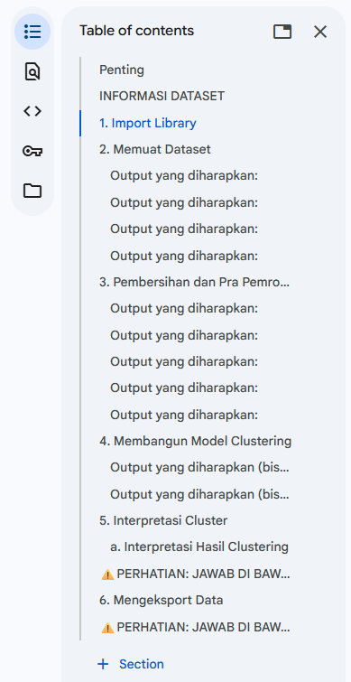
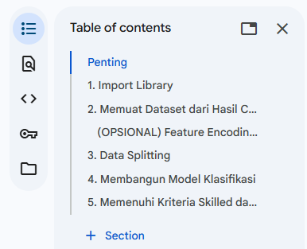

Pada proyek ini, Anda akan membangun model machine learning dengan pendekatan supervised dan unsupervised learning. Anda dapat memilih dari beberapa dataset tanpa label yang kami sediakan atau mencarinya sendiri sesuai dengan preferensi masing-masing.
Langkah pertama adalah menerapkan teknik unsupervised learning, khususnya clustering, untuk menghasilkan label atau kelas pada dataset tersebut. Setelah mendapatkan label atau kelas dari proses clustering, Anda akan menggabungkan informasi ini dengan dataset asli.
Dengan dataset yang telah dilengkapi dengan label atau kelas, Anda akan menerapkan metode supervised learning, yaitu klasifikasi, untuk mengembangkan model yang mampu memprediksi kelas berdasarkan fitur yang ada. Proyek ini dirancang untuk menilai kemampuan Anda dalam mengintegrasikan kedua metode tersebut dan memecahkan masalah yang relevan dengan teknik machine learning yang telah dipelajari.

Panduan Dataset untuk Submission Kelas
Untuk memastikan pengerjaan proyek clustering berjalan terstruktur dan sesuai standar evaluasi, peserta diwajibkan mengikuti template yang telah disediakan. Setiap langkah harus dilakukan secara sistematis dan mematuhi instruksi yang diberikan dalam template proyek. Berikut ini hal-hal yang perlu diperhatikan sebelum memulai pengerjaan projek:

Eksekusi Notebook dengan Dataset yang Disediakan. Adapun dataset yang dimaksud bisa dilihat di Tab Berkas Submission.
Notebook harus dijalankan tanpa error sebelum dikirimkan untuk memastikan seluruh proses berjalan dengan baik.
Dataset yang digunakan dalam notebook clustering untuk projek kali ini yaitu:
/Users/nazhifnugroho/Documents/Kalachakra-dev/Everest/docs/hackaton_PIDI/Membangun_Proyek_Machine_Learning/Dataset
Dataset ini ada hasil modifikasi dari dataset Kaggle “Bank Transaction Dataset for Fraud Detection” untuk mencapai capaian penilaian kriteria. Silahkan download versi yang google drive, jangan yang dari Kaggle karena akan ada perbedaan analisis nantinya.

Memastikan memenuhi standar Basic submission, baru lanjut ke Skilled dan Advanced
Mengikuti template (Fill in the Blanks) dalam notebook proyek sesuai struktur yang diberikan. Adapun template notebook yang dimaksud bisa dilihat di Tab Berkas Submission.
Pada tahap import dependencies (library, fungsi, dan sebagainya), TIDAK perlu menambahkan apa pun lagi dan cukup jalankan cell code yang sudah disediakan.
1. Import Library

Pada tahap ini, Anda perlu mengimpor beberapa pustaka (library) Python yang dibutuhkan untuk analisis data dan pembangunan model machine learning.

import pandas as pd
from sklearn.model_selection import train_test_split
from sklearn.tree import DecisionTreeClassifier
from sklearn.ensemble import RandomForestClassifier
from sklearn.metrics import accuracy_score, precision_score, recall_score, f1_score
from sklearn.model_selection import GridSearchCV, RandomizedSearchCV
from sklearn.metrics import classification_report
import joblib

Fig 1. Cell Import Library

Terdapat markdown tambahan di luar markdown default notebook untuk memberikan konteks pada setiap bagian proyek. Silahkan lakukan penamaan markdown tambahan menjadi “Penilaian (Opsional)”
Table of contents

Fig 2. Struktur Markdown Clustering

Table of contents

Fig 3. Struktur Markdown Klasifikasi

Untuk meningkatkan kualitas dokumentasi dan memberikan pemahaman yang lebih baik terhadap proyek yang dikerjakan, peserta disarankan menambahkan penjelasan rinci pada setiap analisis dengan format berikut:
Metode yang digunakan → Teknik atau algoritma yang diterapkan dalam tahap tersebut.
Alasan penggunaan → Mengapa metode tersebut dipilih dan bagaimana relevansinya dengan proyek.
Hasil yang didapat → Interpretasi hasil setelah metode diterapkan.