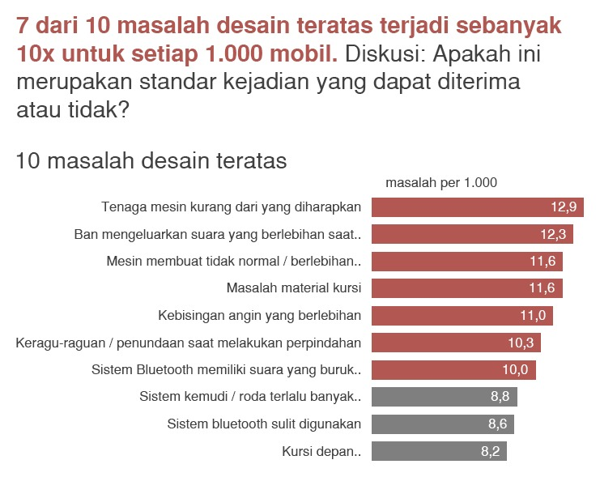
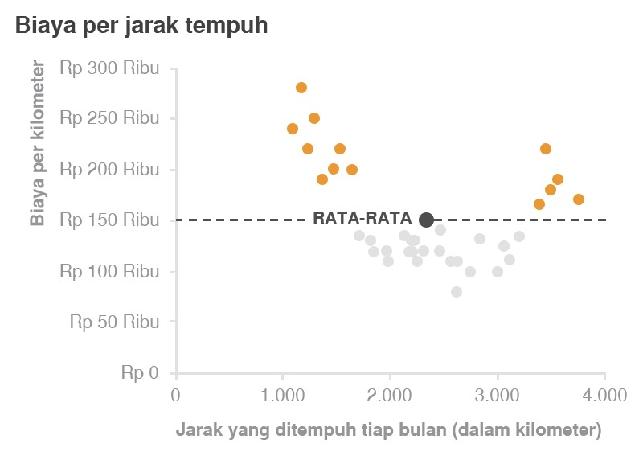
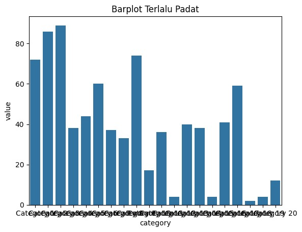
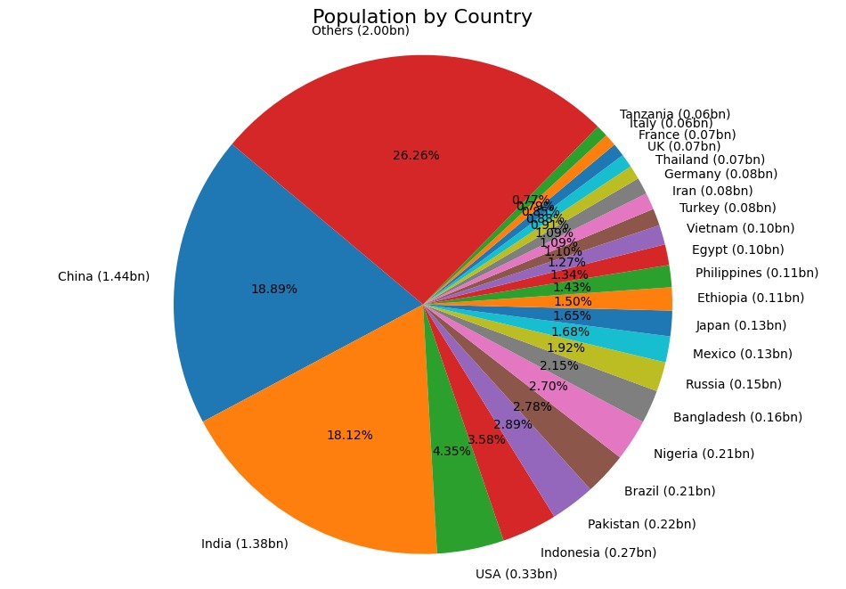
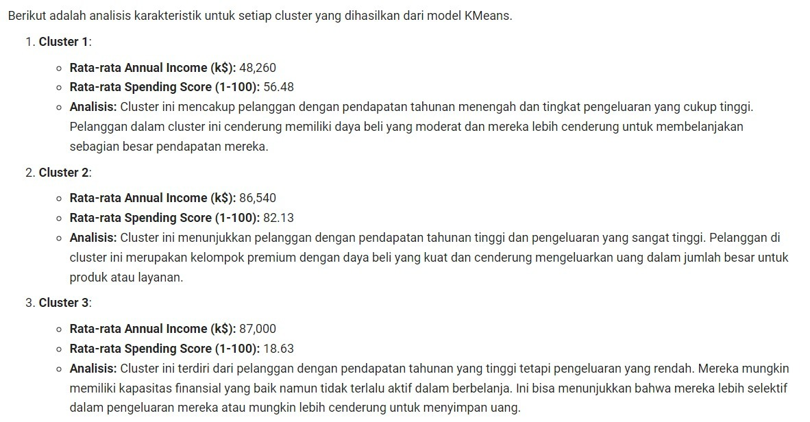

Submission ini mencakup dua tahap utama, yaitu Clustering dan Klasifikasi, dengan kriteria serta urutan kerja sebagai berikut.

Disarankan menggunakan scikit-learn versi 1.7.0 agar tidak terjadi conflict ketika pemeriksaan.

Kriteria 1: Memuat Dataset dan Melakukan Exploratory Data Analysis (EDA)
Menampilkan dataset menggunakan function head().
Menampilkan informasi dataset dengan info().
Menampilkan statistik deskriptif dataset dengan menjalankan describe() untuk mendapatkan ringkasan data.
Reject (0 pts)

Tidak menampilkan dataset menggunakan function head().
Tidak menampilkan informasi dataset dengan info().
Tidak menampilkan statistik deskriptif dataset dengan menjalankan describe() untuk mendapatkan ringkasan data.
Cell code tidak memiliki output pada kode yang seharusnya menampilkan output atau mengalami error.
Basic (2 pts)

Menampilkan dataset menggunakan function head().
Menampilkan informasi dataset dengan info().
Menampilkan statistik deskriptif dataset dengan menjalankan describe() untuk mendapatkan ringkasan data.
Skilled (3 pts)

Semua ketentuan pada Basic terpenuhi.
Menampilkan matriks korelasi.
Menampilkan histogram untuk semua kolom dalam dataset, baik itu bertipe numerik maupun kategorikal.
Advanced (4 pts)

Semua ketentuan pada Skilled terpenuhi.
Visualisasi yang dilakukan tidak memiliki label yang overlap.
Berikut contoh visualisasi yang perlu Anda perhatikan.

Fig 3. Visualisasi yang Baik dan Informatif 1

Fig 4. Visualisasi yang Baik dan Informatif 2

Fig 5. Visualisasi yang Tidak Baik dimana Label saling tumpang tindih

Fig 6. Visualisasi yang Kurang Informatif

Kriteria 2: Pembersihan dan Pra Pemrosesan Data
Mengecek dataset menggunakan isnull().sum() dan duplicated().sum().
Menangani data yang hilang menggunakan dropna().
Menghapus data duplikat menggunakan drop_duplicates().
Melakukan drop pada kolom yang memiliki keterangan ID, Address, dan Date seperti TransactionID, AccountID, DeviceID,  IPAddress, MerchantID, dan TransactionDate.
Melakukan feature encoding menggunakan LabelEncoder() untuk fitur kategorikal.
Reject (0 pts)

Tidak mengecek dataset menggunakan isnull().sum() dan duplicated().sum().
Tidak menangani data yang hilang menggunakan dropna().
Tidak menghapus data duplikat menggunakan drop_duplicates().
Melakukan drop pada kolom yang memiliki keterangan ID, Address, dan Date.
Tidak melakukan feature encoding menggunakan LabelEncoder() untuk fitur kategorikal.
Basic (2 pts)

Mengecek dataset menggunakan isnull().sum() dan duplicated().sum().
Menangani data yang hilang menggunakan dropna().
Menghapus data duplikat menggunakan drop_duplicates().
Melakukan drop pada kolom yang memiliki keterangan ID, Address, dan Date seperti TransactionID, AccountID, DeviceID,  IPAddress, MerchantID, dan TransactionDate.
Melakukan feature encoding menggunakan LabelEncoder() untuk fitur kategorikal.
Skilled (3 pts)

Semua ketentuan pada kategori Basic terpenuhi.
Melakukan Handling Outlier menggunakan metode drop.
Melakukan feature scaling menggunakan StandardScaler() untuk fitur numerik.
Advanced (4 pts)

Semua ketentuan pada kategori Skilled terpenuhi.
Melakukan binning data berdasarkan kondisi rentang nilai pada fitur numerik, lakukan pada satu sampai dua fitur numerik. Silahkan lakukan encode hasil binning tersebut menggunakan LabelEncoder.
 

Kriteria 3: Membangun Model Clustering
Menggunakan dataset yang sudah dilakukan preprocessing.
Melakukan visualisasi Elbow Method untuk menentukan jumlah cluster terbaik menggunakan KElbowVisualizer().
Menggunakan algoritma K-Means Clustering dengan sklearn.cluster.KMeans().
Menjalankan cell code joblib.dump() dengan nama model_clustering agar reviewer dapat secara otomatis menilai evaluasi model anda.
Reject (0 pts)

Tidak menggunakan dataset yang sudah dilakukan preprocessing.
Tidak melakukan visualisasi Elbow Method menggunakan KElbowVisualizer().
Tidak menggunakan algoritma K-Means Clustering.
Tidak menjalankan cell code joblib.dump() dengan nama model_clustering.
Basic (2 pts)

Melakukan visualisasi Elbow Method menggunakan KElbowVisualizer().
Menggunakan algoritma K-Means Clustering
Menjalankan cell code joblib.dump() dengan nama model_clustering.
Skilled (3 pts)

Semua ketentuan pada kategori Basic terpenuhi.
Menghitung dan menampilkan nilai Silhouette Score.
Membuat visualisasi hasil clustering
Advanced (4 pts)

Semua ketentuan pada kategori Skilled terpenuhi.
Membangun model menggunakan PCA.
Simpan model PCA sebagai perbandingan dengan menjalankan cell code ini joblib.dump(model,"PCA_model_clustering.h5").
Kriteria 4: Interpretasi Hasil Clustering
Menampilkan dan menuliskan analisis deskriptif minimal mean, min, atau max (sangat direkomendasikan menuliskan semuanya) untuk fitur numerik.
Menjelaskan karakteristik tiap cluster berdasarkan hasil proses agregasi.
Mengekspor data training dari proses preprocessing beserta data hasil clustering dan berikan nama untuk kolom tersebut yaitu Target.

Reject (0 pts)

Tidak menjelaskan karakteristik tiap cluster berdasarkan rentangnya.
Tidak mengekspor data training dari proses preprocessing beserta data hasil clustering dan tidak mengatur nama untuk kolom tersebut yaitu Target.
Basic (2 pts)

Menampilkan dan menuliskan analisis deskriptif minimal mean, min, atau max (sangat direkomendasikan menuliskan semuanya) untuk fitur numerik.
Menjelaskan karakteristik tiap cluster berdasarkan hasil proses agregasi.
Mengekspor data training dari proses preprocessing beserta data hasil clustering dan berikan nama untuk kolom tersebut yaitu Target.
Skilled (3 pts)

Semua ketentuan pada kategori Basic terpenuhi.
Mengembalikan data yang telah di encode dan scale dengan menggunakan metode inverse_transform().
Menampilkan dan menuliskan analisis deskriptif pada kedua jenis fitur
Numerik: minimal mean, min, atau max (sangat direkomendasikan menuliskan semuanya).
Kategorikal: minimal salah satu (sangat direkomendasikan menuliskan semuanya).
Menjelaskan karakteristik tiap cluster berdasarkan hasil proses agregasi.
Advanced (4 pts)

Semua ketentuan pada kategori Skilled terpenuhi. 
Mengintegrasikan kembali data yang telah di-inverse dengan hasil cluster(kolom target).
Menyimpan data hasil inverse dan kolom Target kedalam file data_clustering_inverse.csv
Kriteria 5: Membangun Model Klasifikasi
Menggunakan train_test_split() untuk melakukan pembagian dataset.
Membangun model dengan algoritma Decision Tree.
Menjalankan cell code joblib.dump() dengan nama decision_tree_model.h5 agar reviewer dapat secara otomatis menilai evaluasi model anda.
Rejected (0 pts)

Tidak menggunakan penamaan terformat pada target dari dataset yaitu Target.
Tidak menggunakan train_test_split() untuk melakukan pembagian dataset.
Tidak membangun model dengan algoritma Decision Tree.
Tidak menjalankan cell code joblib.dump() dengan nama decision_tree_model.h5.
Basic (2 pts)

Menggunakan penamaan terformat pada target dari dataset hasil clustering yaitu Target.
Apabila menerapkan kriteria advanced di kriteria 4, gunakan data_clustering_inverse.csv
Menggunakan train_test_split() untuk melakukan pembagian dataset.
Membangun model dengan algoritma Decision Tree.
Menjalankan cell code joblib.dump() dengan nama decision_tree_model.h5
Skilled (3 pts)

Semua ketentuan pada kategori Basic terpenuhi.
Mencoba setidaknya satu algoritma klasifikasi selain Decision Tree.
Menampilkan hasil evaluasi akurasi, presisi, recall, dan F1-Score pada seluruh algoritma yang sudah dibuat.
Menjalankan cell code joblib.dump() dengan nama explore_<Nama Algoritma>_classification.
Advanced (4 Poin)

Semua ketentuan pada kategori Skilled terpenuhi.
Melakukan hyperparameter tuning pada salah satu model klasifikasi yang dibuat.
Menjalankan cell code joblib.dump() dengan nama tuning_classification.
