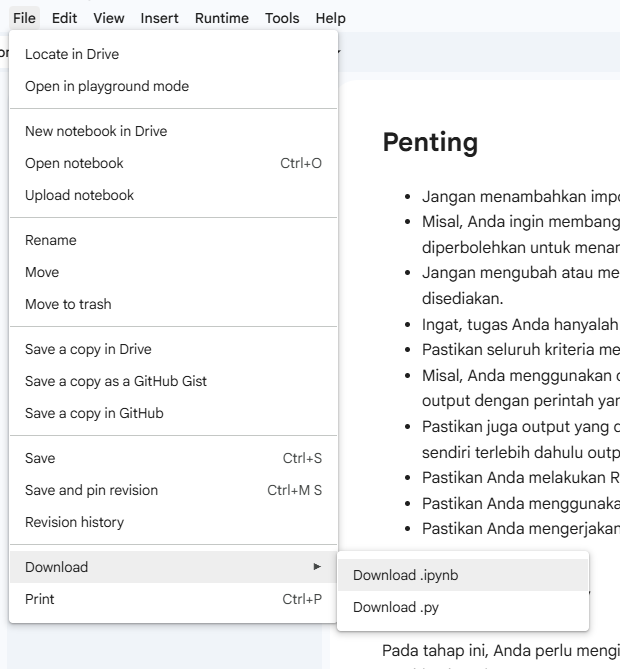

Beberapa poin ini perlu diperhatikan ketika mengirimkan berkas submission salah satunya menggunakan bahasa pemrograman Python. Lalu dokumen yang dikumpulkan adalah:

- Notebook clustering dengan format .ipynb.
Template Clustering: /Users/nazhifnugroho/Documents/Kalachakra-dev/Everest/docs/hackaton_PIDI/Membangun_Proyek_Machine_Learning/artifact/Template_Clustering

- Notebook klasifikasi dengan format .ipynb.
Template Klasifikasi: /Users/nazhifnugroho/Documents/Kalachakra-dev/Everest/docs/hackaton_PIDI/Membangun_Proyek_Machine_Learning/artifact/Template_Klasifikasi

- Tiga model machine learning berformat .h5, sebuah filet hasil clustering dengan dua model sebagai dokumen model mandatory, yaitu model_clustering dan decision_tree_model. Kemudian satu model machine learning dengan nama best_model_classification sebagai opsional.
- Mengirimkan pekerjaan Anda dalam 1 folder yang telah di-zip.
- File .ipynb yang dikirim telah dijalankan terlebih dahulu sehingga output ada tanpa reviewer perlu menjalankan ulang notebook.

BMLP_Nama-siswa.zip
├── [Clustering]_Submission_Akhir_BMLP_Your_Name.ipynb
├── [Klasifikasi]_Submission_Akhir_BMLP_Your_Name.ipynb
├── model_clustering.h5
├── PCA_model_clustering.h5 (Opsional)
├── decision_tree_model.h5
├── explore_<Nama Algoritma>_classification.h5 (Opsional)
├── tuning_classification.h5 (Opsional)
├── data_clustering.csv
├── data_clustering_inverse.csv (Opsional)

Struktur atau urutan Code Cell Intruksi Wajib di setiap Notebook.

- Notebook Clustering
# Import library
# Load data
# Tampilkan 5 baris pertama dengan function head.
# Tinjau jumlah baris kolom dan jenis data dalam dataset dengan info.
# Menampilkan statistik deskriptif dataset dengan menjalankan describe
# Menampilkan korelasi antar fitur (Opsional Skilled 1)
# Menampilkan histogram untuk semua kolom numerik (Opsional Skilled 1)
# Visualisasi yang lebih informatif (Opsional Advanced 1)
# Mengecek dataset menggunakan isnull().sum()
# Mengecek dataset menggunakan duplicated().sum()
# Menangani data yang hilang.
# Menghapus data duplikat.
# Melakukan drop pada kolom yang memiliki keterangan Date, id, dan IP Address
# Melakukan feature encoding menggunakan LabelEncoder() untuk fitur kategorikal.
# Last checking gunakan columns.tolist() untuk checking seluruh fitur yang ada.
# Melakukan Handling Outlier Data menggunakan metode drop.
# Melakukan feature scaling menggunakan StandardScaler() untuk fitur numerik.
# Melakukan binning data berdasarkan kondisi rentang nilai pada fitur numerik,
# Gunakan describe untuk memastikan proses clustering menggunakan dataset hasil preprocessing
# Melakukan visualisasi Elbow Method menggunakan KElbowVisualizer()
# Menggunakan algoritma K-Means Clustering
# Menyimpan model menggunakan joblib
# Menghitung dan menampilkan nilai Silhouette Score.
# Membuat visualisasi hasil clustering
# Membangun model menggunakan PCA.
# Simpan model PCA sebagai perbandingan dengan menjalankan cell code ini joblib.dump(model,"PCA_model_clustering.h5")
# Menampilkan analisis deskriptif minimal mean, min dan max untuk fitur numerik.
# Pastikan nama kolom clustering sudah diubah menjadi Target
# Simpan Data
# inverse dataset ke rentang normal untuk numerikal
# inverse dataset yang sudah diencode ke kategori aslinya.
# Lakukan analisis deskriptif minimal mean, min dan max untuk fitur numerik dan mode untuk kategorikal seperti pada basic tetapi menggunakan data yang sudah diinverse.
# Periksa kembali data yang telah di-inverse.
# Simpan Data Inverse

- Notebook Klasifikasi
# Import library
# Gunakan dataset hasil clustering yang memiliki fitur Target
# Tampilkan 5 baris pertama dengan function head
### MULAI CODE OPSIONAL ###
# Menggunakan train_test_split() untuk melakukan pembagian dataset.
# Buatlah model klasifikasi menggunakan Decision Tree
# Menyimpan Model
# Melatih model menggunakan algoritma klasifikasi scikit-learn selain Decision Tree. (Contoh: RandomForestClassifier)
# Menampilkan hasil evaluasi akurasi, presisi, recall, dan F1-Score pada seluruh algoritma yang sudah dibuat.
# Menyimpan Model Selain Decision Tree
# Lakukan Hyperparameter Tuning dan Latih ulang.
# Menampilkan hasil evaluasi akurasi, presisi, recall, dan F1-Score pada algoritma yang sudah dituning.
# Menyimpan Model hasil tuning

Submission yang Tidak Sesuai Kriteria
Jika tidak sesuai dengan kriteria, submission Anda akan ditolak oleh reviewer. Berikut poin-poinnya.

1. Tidak melampirkan file yang diminta pada ketentuan berkas submission.
2. Tidak menggunakan template yang disediakan.
3. Menambahkan line code atau cell code yang tidak diperlukan atau diperintahkan.
4. Tidak memberikan penjelasan mengenai hasil clustering.
5. Tidak menggunakan dataset dan label dari hasil clustering.
6. Model klasifikasi tidak menampilkan akurasi dan F1-Score pada testing set.
7. Tidak diperbolehkan menggunakan platform atau metode AutoML, seperti berikut.
    - PyCaret
    - Auto-sklearn
    - Google Cloud AutoML 
    - H2O Driverless AI (dari H2O.ai)
    - Microsoft Azure Automated Machine Learning
    - TPOT (Tree-based Pipeline Optimization Tool)
    - DataRobot
    - RapidMiner Auto Model
    - Amazon SageMaker Autopilot
    - IBM Watson AutoAI

Tips
Untuk export project yang Anda kerjakan di Colaboratory sebagai berkas ipynb. Lalu, klik tombol file yang berada di pojok kiri atas Colaboratory dan pilih download .ipynb serta download .py.

Ketentuan Proses Review
Beberapa hal yang perlu Anda ketahui mengenai proses review.

Tim penilai akan mengulas submission Anda dalam waktu selambatnya 3 hari kerja, tidak termasuk hari Sabtu, Minggu, dan libur nasional.
Tidak disarankan untuk melakukan submit berkali-kali karena akan memperlama proses penilaian yang dilakukan tim penilai.
Anda akan mendapat notifikasi hasil pengumpulan submission via email atau dapat mengecek status submission pada akun Dicoding.