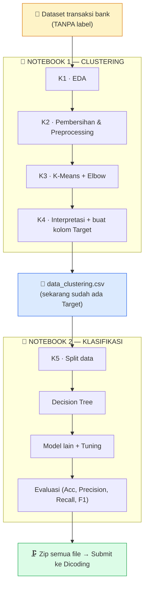

# 📋 Checklist Pengerjaan — Proyek Machine Learning (BMLP)

### Clustering + Klasifikasi · Dataset Transaksi Bank

DICODING · BMLP
Target Lulus: ⭐⭐⭐
Target Maks: ⭐⭐⭐⭐⭐

_Centang `- [ ]` → `- [x]` tiap item selesai. Buka pakai **Markdown Preview Enhanced**._

---

## 📑 Daftar Isi

[TOC]

---

## 🧭 Cara Pakai Checklist Ini

> 💡 **Baca dulu sebelum mulai:**
> 1. Kerjakan **berurutan dari atas ke bawah**. Tiap notebook punya urutan cell yang nggak boleh diacak.
> 2. Tiap kriteria bertingkat: **🟢 Basic → 🔵 Skilled → 🟣 Advanced**. Level atas WAJIB menyelesaikan level di bawahnya dulu.
> 3. **Selesaikan SEMUA 🟢 Basic dulu** (target aman ⭐⭐⭐), baru naik ke Skilled/Advanced.
> 4. Tiap cell yang harusnya keluar output → **wajib ada outputnya**. Output kosong = dianggap belum selesai.

### 🏷️ Arti Badge Level

| Badge | Level | Poin | Efek ke nilai |
| :---: | :--- | :---: | :--- |
| 🟢 | BASIC | **2 pts** | Wajib. Kunci kelulusan (⭐⭐⭐) |
| 🔵 | SKILLED | **3 pts** | Naikin ke ⭐⭐⭐⭐ |
| 🟣 | ADVANCED | **4 pts** | Target sempurna ⭐⭐⭐⭐⭐ |

---

## 🎯 Pilih Target Nilai Kamu

> Tentukan dulu mau ngejar nilai berapa, biar tahu harus berhenti di level mana tiap kriteria.

- [ ] 🟢 **Target AMAN** — semua kriteria minimal Basic → nilai **2.0** → ⭐⭐⭐ (Lulus / C)
- [ ] 🔵 **Target MAHIR** — semua kriteria minimal Skilled → nilai **3.0** → ⭐⭐⭐⭐ (B)
- [x] 🟣 **Target SEMPURNA** — semua kriteria Advanced → nilai **4.0** → ⭐⭐⭐⭐⭐ (A) ✅ _← dipilih_

> 📐 **Rumus nilai:** `Nilai Akhir = Total Poin ÷ 5 kriteria`
> ⚠️ Kalau **1 kriteria saja kena Reject (0 pts)**, rata-rata anjlok & bisa GAGAL. Jadi pastikan tidak ada yang nol.

---

## 🗺️ Peta Alur Proyek

---

## 📊 Dashboard Progres

> Ganti ⬜ jadi ✅ tiap kriteria tembus level tertentu. Lihat sekilas kamu di mana.

| # | Kriteria | Notebook | 🟢 Basic | 🔵 Skilled | 🟣 Advanced |
| :-: | :--- | :--- | :-: | :-: | :-: |
| 1 | Exploratory Data Analysis (EDA) | 📘 Clustering | ✅ | ✅ | ✅ |
| 2 | Pembersihan & Pra-pemrosesan | 📘 Clustering | ✅ | ✅ | ✅ |
| 3 | Membangun Model Clustering | 📘 Clustering | ✅ | ✅ | ✅ |
| 4 | Interpretasi Hasil Clustering | 📘 Clustering | ✅ | ✅ | ✅ |
| 5 | Membangun Model Klasifikasi | 📗 Klasifikasi | ✅ | ✅ | ✅ |

---

## ✅ FASE 0 — Persiapan

<progress value="7" max="7"></progress>

- [x] 📥 Dataset sudah ada di [`artifact/Dataset/bank_transactions_data_edited.csv`](../artifact/Dataset/bank_transactions_data_edited.csv). _(Ingat: ini versi Google Drive yang benar, bukan dari Kaggle.)_
- [x] 📓 Template sudah disalin & di-rename ke [`submission/`](../submission/): `[Clustering]_..._Nazhif_Setya_Nugroho.ipynb` & `[Klasifikasi]_..._Nazhif_Setya_Nugroho.ipynb`.
- [x] 🐍 Environment **lokal** siap: pyenv `3.10.20` → venv `.venv` → **scikit-learn 1.7.0** + yellowbrick + jupyter. ✅ _Smoke test lulus: `KElbowVisualizer` + `KMeans` + `silhouette_score` jalan._
- [x] 📖 Pahami **aturan main template** (sudah dipahami & akan dipatuhi ketat):
  - [x] Jangan tambah `import` library / function baru.
  - [x] Jangan ubah / hapus cell teks (markdown) bawaan.
  - [x] Pakai variabel `df` dari awal sampai akhir — **jangan ganti nama**.
  - [x] Isi **hanya** bagian bertanda `________` di antara `### MULAI CODE ###` dan `### SELESAI CODE ###`.

---

# 📘 NOTEBOOK 1 — CLUSTERING

> Tujuan: dari data mentah tanpa label → hasilkan kelompok (cluster) → simpan jadi kolom **`Target`**.

---

## 1️⃣ Kriteria 1 — Exploratory Data Analysis (EDA)

<progress value="7" max="7"></progress> ✅ **SELESAI & terverifikasi**

> _Kenalan sama datanya dulu sebelum diapa-apain._

### 🟢 BASIC (2 pts)

- [x] Load dataset ke variabel `df` (`pd.read_csv(url)`). _(cell 7 — load dari URL Google Sheets, shape 2537×16)_
- [x] Tampilkan 5 baris pertama → `df.head()` _(cell 8)_
- [x] Tampilkan info tipe data & jumlah baris/kolom → `df.info()` _(cell 10)_
- [x] Tampilkan statistik deskriptif → `df.describe()` _(cell 12)_

### 🔵 SKILLED (3 pts)

- [x] Tampilkan **matriks korelasi** (heatmap antar fitur numerik). _(cell 14 — `df[numerical_cols].corr()` + `sns.heatmap`)_
- [x] Tampilkan **histogram** semua kolom numerik. _(cell 17 — `sns.histplot` di grid 2×3; template hanya sediakan histogram numerik)_

### 🟣 ADVANCED (4 pts)

- [x] Buat visualisasi yang **informatif & rapi** — **label tidak overlap**. _(cell 21 — boxplot `TransactionAmount` per `CustomerOccupation`, `plt.xticks(rotation=45)`; dicek visual ✓)_

💡 Hint visualisasi rapi

- Atur ukuran figure: `plt.figure(figsize=(12,6))`
- Putar label sumbu-x kalau berdesakan: `plt.xticks(rotation=45)`
- Selalu kasih judul + label sumbu: `plt.title(...)`, `plt.xlabel(...)`, `plt.ylabel(...)`
- Rapikan layout: `plt.tight_layout()`

---

## 2️⃣ Kriteria 2 — Pembersihan & Pra-pemrosesan Data

<progress value="10" max="10"></progress> ✅ **SELESAI & terverifikasi**

> _Bersihin & siapin data biar siap masuk model._

### 🟢 BASIC (2 pts)

- [x] Cek data hilang → `df.isnull().sum()` _(cell 23 — 403 null)_
- [x] Cek data duplikat → `df.duplicated().sum()` _(cell 26 — 21 duplikat)_
- [x] Tangani data hilang → `df.dropna(inplace=True)` _(cell 28 — 2537→2156)_
- [x] Hapus duplikat → `df.drop_duplicates(inplace=True)` _(cell 31 — 2156→2135)_
- [x] **Drop kolom** ID/IP/Date (otomatis via list comprehension `'id'/'ip'/'date' in nama kolom`) → buang **7 kolom** (`TransactionID, AccountID, PreviousTransactionDate, DeviceID, IP Address, MerchantID, TransactionDate`), sisa **9 kolom** _(cell 33)_
- [x] Feature encoding fitur kategorikal → `LabelEncoder()` _(cell 36 — 4 kolom: TransactionType, Location, Channel, CustomerOccupation)_
- [x] Last check semua fitur → `df.columns.tolist()` _(cell 39 — blank-nya `____`, 4 underscore)_

### 🔵 SKILLED (3 pts)

- [x] Handling **outlier** dengan metode **drop** (IQR 1.5×) → 2135→**1945** baris _(cell 43)_
- [x] Feature scaling fitur numerik → `StandardScaler()` _(cell 46 — mean numerik ≈0)_

### 🟣 ADVANCED (4 pts)

- [x] **Binning** `CustomerAge` → kolom `AgeGroup` (`pd.qcut` 3 grup: Muda/Dewasa/Tua) + encode `LabelEncoder` _(cell 50 — final dataset **1945×10**)_

> ⚠️ Setelah preprocessing, jalankan `df.describe()` lagi untuk **memastikan model clustering nanti pakai data hasil preprocessing**, bukan data mentah.

---

## 3️⃣ Kriteria 3 — Membangun Model Clustering

<progress value="8" max="8"></progress> ✅ **SELESAI & terverifikasi (k=2, silhouette 0.572)**

> _Cari jumlah cluster terbaik, jalankan K-Means, simpan modelnya._

### 🟢 BASIC (2 pts)

- [x] Pakai dataset hasil **preprocessing** → `df_used = df.copy()` + `describe()` _(cell 52)_
- [x] Visualisasi **Elbow Method** → `KElbowVisualizer(model, k=(2,10), metric='silhouette')` → pilih **k=2** _(cell 53)_
- [x] Jalankan **K-Means** → `KMeans(n_clusters=2, random_state=42)` _(cell 56)_
- [x] Simpan model → `joblib.dump(model, "model_clustering.h5")` ✅ file ter-generate (9 KB) _(cell 58)_

### 🔵 SKILLED (3 pts)

- [x] **Silhouette Score** → `silhouette_score(df, labels)` = **0.572** (struktur cluster kuat) _(cell 60)_
- [x] **Visualisasi hasil clustering** → PCA 2D + `sns.scatterplot(hue='Cluster')` + centroid _(cell 61)_

### 🟣 ADVANCED (4 pts)

- [x] Bangun model **PCA** → `PCA(n_components=2)` + `KMeans` baru di ruang PCA _(cell 65)_
- [x] Simpan model PCA → `joblib.dump(kmeans_pca, "PCA_model_clustering.h5")` ✅ (8.8 KB) _(cell 66)_

> ⚠️ Cell `joblib.dump(...)` **wajib dijalankan**, kalau tidak reviewer gak bisa nilai model kamu otomatis.

---

## 4️⃣ Kriteria 4 — Interpretasi Hasil Clustering

<progress value="9" max="9"></progress> ✅ **SELESAI & terverifikasi**

> _Jelaskan tiap cluster itu artinya apa, lalu export jadi CSV dengan kolom `Target`._

### 🟢 BASIC (2 pts)

- [x] Analisis deskriptif per cluster → `df_used.groupby('Cluster')[numerical_cols].agg(['mean','min','max'])` _(cell 69)_
- [x] **Narasi** karakteristik cluster (scaled) — pembeda utama = kategorikal (Location/occupation/age) _(cell 70)_
- [x] Beri nama kolom hasil cluster jadi **`Target`** → `df_used.rename(columns={"Cluster":"Target"})` _(cell 72)_
- [x] Export → **`data_clustering.csv`** (`df_used.to_csv`) _(cell 73)_

### 🔵 SKILLED (3 pts)

- [x] Inverse ke nilai asli → `scaler.inverse_transform()` (numerik) + `encoder.inverse_transform()` (kategorikal) _(cell 75, 76)_
- [x] Analisis deskriptif data inverse: numerik (mean/min/max) + kategorikal (mode) _(cell 77)_
- [x] **Narasi** karakteristik cluster setelah inverse (nilai asli + rekomendasi) _(cell 78)_ · periksa data inverse `df_inverse.head()` _(cell 80)_

### 🟣 ADVANCED (4 pts)

- [x] Data inverse + kolom `Target` digabung → simpan **`data_clustering_inverse.csv`** (`df_inverse.to_csv`) _(cell 81)_

---

> ## 🎉 NOTEBOOK 1 (CLUSTERING) — **SELESAI 100%** · Full Run All terverifikasi tanpa error · 2 model `.h5` + 2 CSV ter-generate

> 🔑 **PENTING:** Kolom `Target` ini adalah "jembatan" ke Notebook 2. Tanpa ini, klasifikasi gak bisa jalan.

---

# 📗 NOTEBOOK 2 — KLASIFIKASI

> Tujuan: pakai data ber-`Target` dari Notebook 1 → latih model untuk menebak `Target`.

---

## 5️⃣ Kriteria 5 — Membangun Model Klasifikasi

<progress value="11" max="11"></progress> ✅ **SELESAI & terverifikasi (semua model Acc/F1 = 1.00)**

### 🟢 BASIC (2 pts)

- [x] Load **`data_clustering_inverse.csv`** → `df = pd.read_csv(...)` _(cell 4)_ + `df.head()` _(cell 5)_
- [x] **One Hot Encoding** (wajib krn pakai data inverse) → `pd.get_dummies(df, columns=categorical_cols, drop_first=True)` → 56 fitur _(cell 7)_
- [x] Split data → `train_test_split(X, y, test_size=0.2, random_state=42, stratify=y)` (X=drop Target, y=Target) _(cell 9)_
- [x] Bangun **Decision Tree** `DecisionTreeClassifier(random_state=42)` + `.fit` _(cell 11)_
- [x] Simpan → `joblib.dump(decision_tree_model, 'decision_tree_model.h5')` _(cell 12)_

### 🔵 SKILLED (3 pts)

- [x] Algoritma kedua → **`RandomForestClassifier(random_state=42)`** + `.fit` _(cell 15)_
- [x] Evaluasi **Acc/Precision/Recall/F1** kedua model → `classification_report` (semua 1.00) _(cell 16)_
- [x] Simpan → `joblib.dump(new_model, 'explore_RandomForest_classification.h5')` _(cell 17)_

### 🟣 ADVANCED (4 pts)

- [x] **Hyperparameter tuning** → `GridSearchCV(RandomForestClassifier, param_grid, cv=5, scoring='accuracy')` _(cell 19)_
- [x] Evaluasi model tuned → `classification_report` _(cell 20)_
- [x] Simpan → `joblib.dump(new_model_tuned, 'tuning_classification.h5')` _(cell 21)_

---

> ## 🎉 NOTEBOOK 2 (KLASIFIKASI) — **SELESAI 100%** · Full Run All terverifikasi · 3 model `.h5` ter-generate · Acc & F1 = 1.00

> ⚠️ Model klasifikasi **WAJIB** menampilkan **Accuracy & F1-Score** pada **testing set**. Kalau tidak → otomatis ditolak.

---

# 🏁 FASE AKHIR — Finalisasi & Submit

<progress value="7" max="9"></progress> 🟢 **hampir selesai — tinggal upload**

### 🔍 Review Mandiri

- [x] **Run All** Notebook Clustering → tanpa error, semua cell ada output ✅
- [x] **Run All** Notebook Klasifikasi → tanpa error, semua cell ada output ✅
- [ ] Cek ulang semua checklist resmi di halaman submission Dicoding sudah tercentang. ⬅️ _(kamu, sebelum upload)_

### 📦 Packaging

- [x] Kedua notebook sudah ber-nama format: `[Clustering]_..._Nazhif_Setya_Nugroho.ipynb` & `[Klasifikasi]_...`
- [x] File wajib lengkap: `2 notebook + model_clustering.h5 + decision_tree_model.h5 + data_clustering.csv`
- [x] File opsional lengkap: `PCA_model_clustering.h5 + explore_RandomForest_classification.h5 + tuning_classification.h5 + data_clustering_inverse.csv`
- [x] Sudah di-zip **flat (9 file)** → **`BMLP_Nazhif_Setya_Nugroho.zip`** ✅

### 📤 Submit

- [ ] Upload zip ke Dicoding. ⬅️ _(kamu)_
- [ ] **Jangan submit berkali-kali** — bikin antrian review makin lama (review ±3 hari kerja).

---

## 🚫 Larangan Keras (Auto-Reject Kalau Dilanggar)

> ❌ Hindari semua ini — langsung ditolak reviewer:

- [ ] ✋ File submission **tidak lengkap**.
- [ ] ✋ **Tidak pakai template** yang disediakan.
- [ ] ✋ Menambah **line/cell code yang tidak diperintahkan**.
- [ ] ✋ **Tidak menjelaskan** hasil clustering.
- [ ] ✋ Klasifikasi **tidak pakai** label `Target` hasil clustering.
- [ ] ✋ Model klasifikasi **tidak menampilkan** Accuracy & F1-Score.
- [ ] ✋ Pakai **AutoML** (PyCaret, Auto-sklearn, TPOT, H2O, DataRobot, SageMaker Autopilot, Azure AutoML, Google Cloud AutoML, IBM Watson AutoAI, RapidMiner).

> 💡 Checklist larangan ini **dicentang artinya kamu sudah PASTIKAN tidak melanggarnya**.

---

### 🎉 Kalau semua tercentang → siap submit!

_Tabel nilai: ⭐⭐⭐ (2.0/Basic, Lulus) · ⭐⭐⭐⭐ (3.0/Skilled) · ⭐⭐⭐⭐⭐ (4.0/Advanced)_

