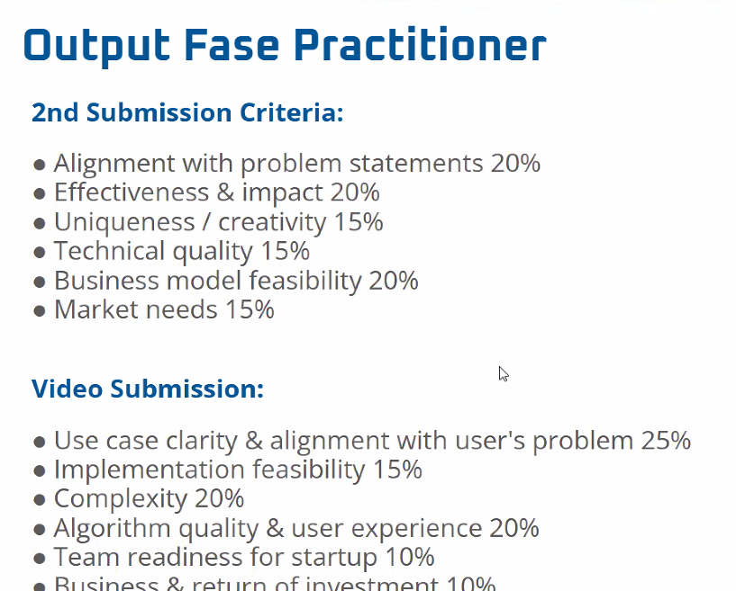
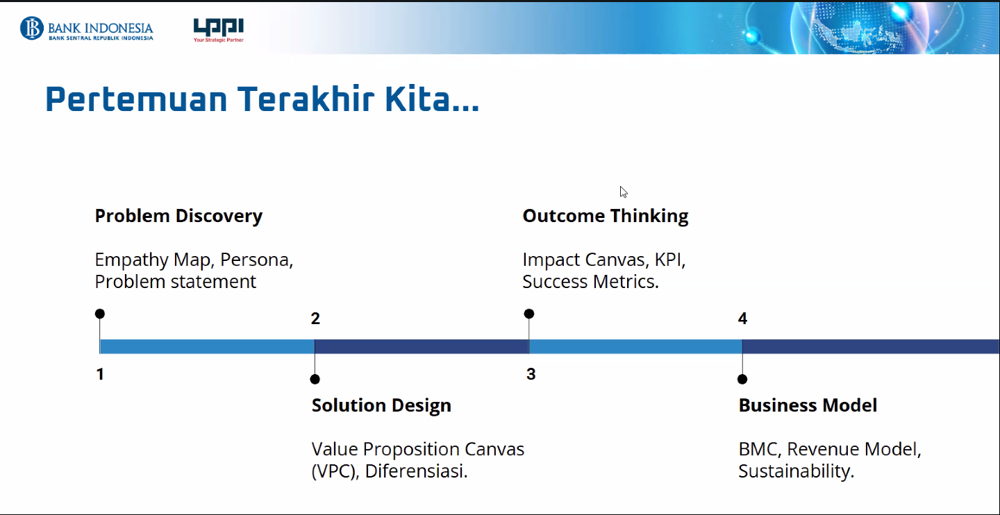
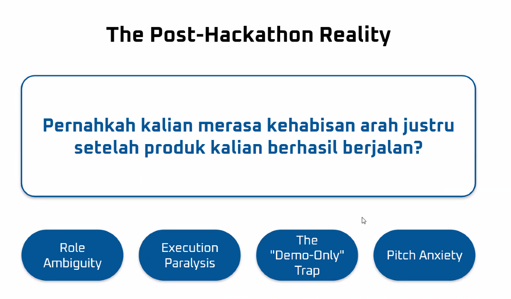
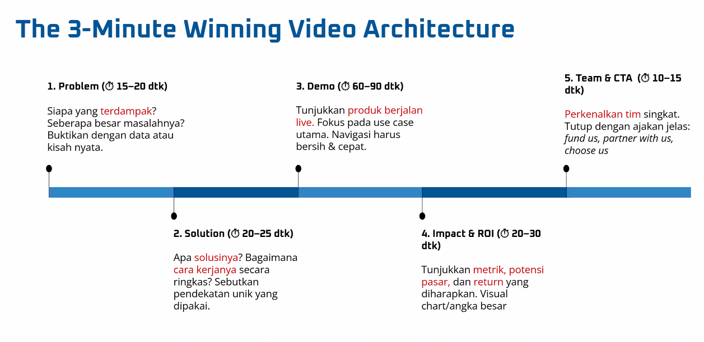
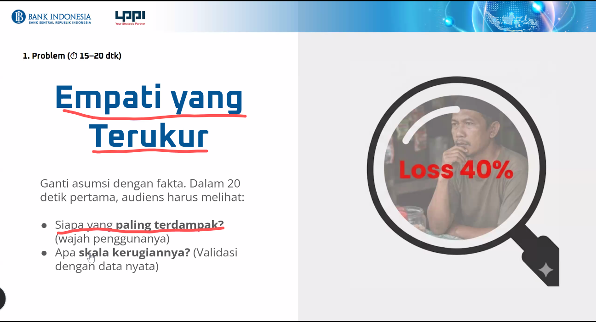
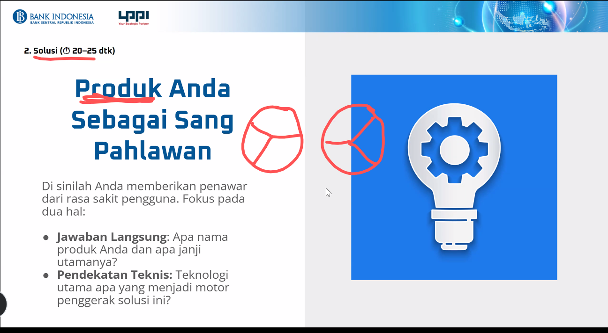
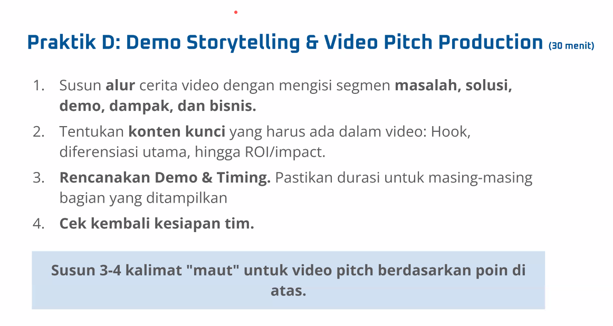
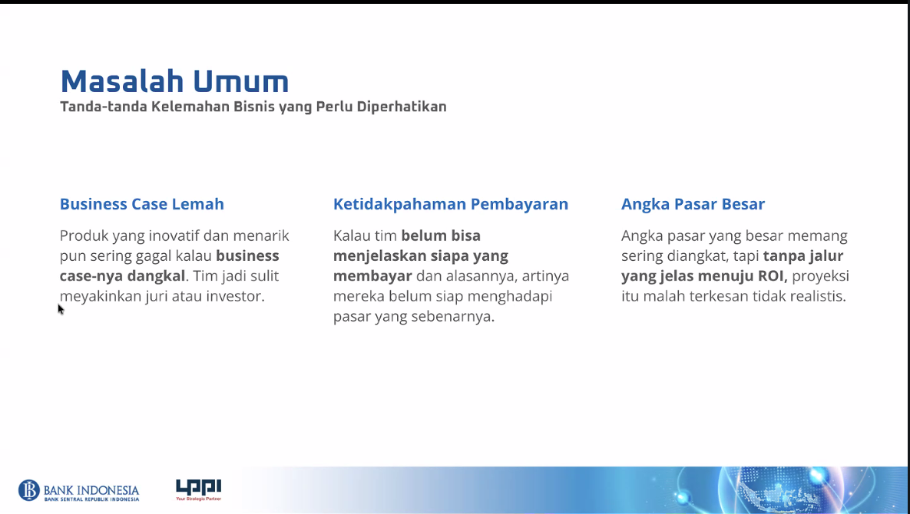
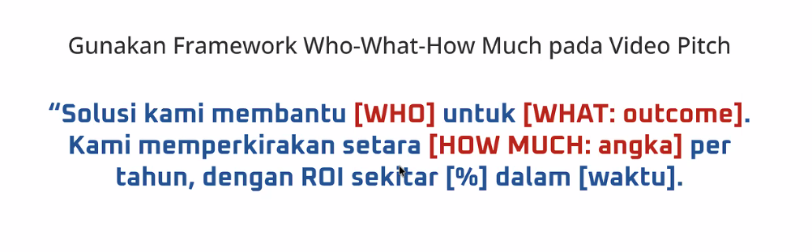

Semangat pagi, SobatPIDI 🚀🚀🚀
Berikut informasi kegiatan yang akan kita jalani pada hari ini.
Link Zoom : https://lppi.info/PIDI-ILT-StartupBusinessDevelopment-Batch-6F
Don't Be Late and See You at Zoom Meeting, SobatPIDI
🔥🔥🔥

kriterica submission:

Materi:

---

## Role Definition — Tech / AI Lead

**Nama:** Nazhif

**Keahlian utama:** Software Engineer (AI/ML Engineering, Backend, Data Pipeline)

### Tanggung jawab

- **Arsitektur teknis end-to-end** — merancang stack teknologi (model AI, backend, data pipeline, deployment) yang sesuai dengan problem statement dan realistis untuk timeline hackathon.
- **Pengembangan MVP / prototipe** — memimpin implementasi fitur inti (data ingestion, preprocessing, model training/inference, API, integrasi UI) supaya demo dapat berjalan reliable saat pitching.
- **Kualitas model AI** — memastikan pemilihan algoritma, proses training, evaluasi (akurasi, F1, RMSE, dsb.), dan iterasi tuning selaras dengan kriteria "Algorithm quality & user experience 20%" dan "Technical quality 15%".
- **Kesiapan produksi** — menyiapkan deployment (Streamlit / API / cloud), monitoring dasar, dan skenario fallback agar produk siap dipakai di luar konteks demo (menghindari *"Demo-Only" Trap*).
- **Kolaborasi lintas peran** — menerjemahkan kebutuhan Product/UX Lead (Fareynaldi) menjadi spesifikasi teknis, dan memvalidasi asumsi domain dari Business/Domain Lead (Bimo) ke dalam desain data & model.
- **Code hygiene & dokumentasi** — repository terstruktur, README + reproducibility (requirements.txt / notebook runnable), agar reviewer PIDI dapat menilai *implementation feasibility 15%* secara objektif.
- **Manajemen risiko teknis** — mengidentifikasi bottleneck (data availability, latency, biaya inferensi) dan menyiapkan mitigasi sebelum submission.

### Deliverable

- **Working prototype** (Streamlit app / web demo / API endpoint) yang dapat diakses juri dan mendemonstrasikan alur end-to-end use case.
- **Model AI/ML terlatih** beserta artefak (weights, notebook training, script inference) dan metrik evaluasi yang terdokumentasi.
- **Source code repository** (GitHub) — bersih, terstruktur, ada README, instruksi setup, dan lisensi.
- **Arsitektur diagram** singkat (data flow, komponen sistem, integrasi model) untuk mendukung deck pitching.
- **Technical section pitch deck** — slide yang menjelaskan pendekatan teknis, keunggulan algoritma, dan roadmap scaling (mendukung *complexity 20%* & *team readiness 10%*).
- **Model card & evaluation report** — dokumentasi formal model: dataset yang dipakai, metrik lengkap (precision/recall/F1/latency), limitations, potensi bias, dan skenario uji (memperkuat *algorithm quality 20%* & *technical quality 15%*).
- **Deployment blueprint & infrastructure setup** — konfigurasi hosting (Streamlit Cloud / container / cloud provider), environment variables, dan pipeline reproducibility sehingga produk dapat dijalankan ulang oleh juri maupun tim lanjutan (mendukung *implementation feasibility 15%* & sustainability pasca-hackathon).

---

## Praktik A — Use Canvas untuk Everest (30 menit)

### 1. Pengguna Spesifik

**Ibu Rina, Compliance Officer di PT Solusi Adikarya Wisesa (SAW).**
- Usia 32, latar belakang akuntansi, 3 tahun handle onboarding karyawan & vendor.
- Setiap Senin menerima daftar 20–40 kandidat baru (calon karyawan tetap, vendor, agent, trader) yang wajib di-*Employee Background Check* ke CLIK sebelum kontrak ditandatangani.
- Bukan tech-savvy — familiar dengan spreadsheet dan portal web, tidak paham API/JSON/schema.
- KPI-nya: 100% kandidat ter-cek maksimal 3 hari kerja setelah dokumen masuk. Terlambat = onboarding batal / kandidat lari ke kompetitor.

### 2. Problem Statement

> **Ibu Rina, Compliance Officer di Non-Financing Institution, kesulitan menyelesaikan EBC 20–40 kandidat per minggu tepat waktu karena portal CLIK manual memakan 10 menit per kandidat dan satu typo dapat mencemari record kandidat di database Bank Indonesia secara permanen.**

### 3. Solusi & Validasi

**Solusi:** Everest — layer integrasi CLIK JSON A2A dengan satu form + satu klik untuk EBC, dilengkapi *pre-flight validation layer* yang menolak request cacat sebelum menyentuh CLIK (menjamin *zero dirty footprint*).

**Bukti nyata masalahnya:**
- **Data resmi CLIK (spec):** Dokumen mandatory field CLIK NAE menyebutkan 13 field wajib yang jika kurang/invalid akan menghasilkan error `10-133 FIELD ... IS NOT CORRECT FOR THE SELECTED INSTITUTE` — sudah pernah dialami tim Everest saat UAT (`purposeCode=07` ditolak, harus `21`).
- **Sample credit report Angel Kartika:** Menunjukkan bahwa panggilan sebelumnya dari Standard Chartered (`P99/RQ/IDR 1`) terekam permanen di record subjek — bukti empiris bahwa *footprint tidak bisa dihapus*.
- **Kickoff meeting Everest × CLIK (2026):** CLIK secara resmi mengonfirmasi setiap NAE call menulis `notGrantedCredit` contract entry + footPrint (lihat `meeting_notes_consolidated.md §11.1`).
- **Preliminary interview compliance ops PT SAW:** Konfirmasi pain point durasi 5–10 menit/kandidat via portal manual, dengan 2–3 kasus retry/minggu karena typo NIK atau format alamat.

### 4. Lingkup MVP (fitur untuk demo — versi terkecil)

**MASUK MVP:**
- Form input 1 kandidat (nama, NIK, tanggal lahir, alamat, kontak, gender).
- *Pre-flight validation* 13 mandatory fields di sisi client.
- Auto-generate: `providerApplicationNo` (≥10 char), `referenceID`, EBC defaults (`purposeCode=21`, `contractTypeCode=P99`, `contractPhase=RQ`, `currency=IDR`, `link.role=B`).
- Kirim NAE request ke CLIK UAT (basic auth).
- Parse response → tampilkan dalam 4 tab: **Identitas**, **Riwayat Kredit**, **Riwayat Pengecekan**, **Kontrak Aktif**.
- Log audit entry otomatis (reference ID, timestamp, operator, kandidat, status).

**DILUAR MVP (fase berikutnya):**
- Batch upload CSV.
- Integrasi HRIS internal SAW.
- Dashboard analitik EBC lintas periode.
- Multi-tenant + role-based access control.
- Monitoring Enquiry (ME) untuk periodic re-check.

### 5. Alur Demo — 5 Langkah

| # | Kolom | Isi |
|---|---|---|
| **1** | **Entry Point / Trigger** | Ibu Rina menerima notifikasi (email/spreadsheet) berisi daftar 20 kandidat baru untuk onboarding minggu ini. Ia membuka aplikasi Everest di browser — tidak perlu login portal Bank Indonesia. |
| **2** | **Aksi Utama Pengguna** | Buka form *"Cek Profil Kredit"*, isi 6 field identitas kandidat pertama (nama, NIK, tanggal lahir, alamat, kontak, gender), klik tombol **"Cek Profil Kredit"**. |
| **3** | **Proses / Logika Sistem** | Di belakang layar, Everest bertindak sebagai asisten kompliance untuk Ibu Rina: (a) mengecek kelengkapan data kandidat sebelum apa pun dikirim keluar — kalau ada yang kurang, langsung dikembalikan dengan peringatan jelas; (b) melengkapi informasi administratif yang biasanya harus diisi manual di portal Bank Indonesia dan memastikan aktivitas ini tercatat dengan kategori yang benar sebagai *screening onboarding*, bukan pengajuan kredit; (c) meneruskan permintaan cek profil kredit ke Bank Indonesia; (d) menerima jawaban dan menyusunnya menjadi laporan yang langsung bisa dibaca tanpa training tambahan; (e) mencatat seluruh aktivitas di buku audit internal — tanpa intervensi manual dari Ibu Rina. |
| **4** | **Output / Hasil untuk User** | Dalam <30 detik: laporan kredit tampil rapi per tab (Identitas, Riwayat Kredit, Riwayat Pengecekan, Kontrak Aktif) — siap dibaca dan dijadikan dasar keputusan onboarding. Nomor referensi unik terpampang di header. Audit log entry otomatis tercatat di dashboard log. |
| **5** | **Impact / Value Delivered** | **Bagi Ibu Rina:** 20 kandidat selesai dalam waktu yang biasanya cuma cukup untuk 2 orang — tidak perlu lembur lagi, KPI *on-time* terjaga, dan pekerjaan repetitif berubah menjadi aktivitas review keputusan yang lebih bernilai. **Bagi kandidat:** onboarding jauh lebih cepat, kontrak tidak lagi tertunda berhari-hari, dan reputasi mereka di Bank Indonesia tetap bersih dari kesalahan input. **Bagi PT SAW:** kandidat berkualitas tidak lari ke kompetitor karena menunggu terlalu lama, dan perusahaan terbebas dari risiko sengketa legal maupun biaya kompensasi akibat data yang cacat. **Bagi auditor & regulator:** bukti kepatuhan tersedia lengkap dan siap disodorkan kapan pun — tanpa drama rekonsiliasi manual di akhir kuartal. |

### 6. Tech Stack / Platform

Prinsip pemilihan: **cepat dibangun, mudah didemo, dan realistis untuk skalabilitas produksi** — bukan tumpukan teknologi yang keren tapi rapuh.

| Layer | Pilihan | Alasan |
|---|---|---|
| **Frontend (UI operator)** | Streamlit (Python) | Form-heavy UI cepat dibangun (<1 hari), live demo friendly, cocok untuk audiens non-tech seperti Ibu Rina. Alternatif produksi: Next.js + React (sudah dipakai `backoffice-service` internal). |
| **Backend / Integration** | Python + FastAPI + `httpx` | FastAPI ringan dan async-ready untuk paralel batch di fase berikutnya. `httpx` menangani basic auth + retry ke endpoint CLIK JSON A2A. |
| **Validation Layer** | Pydantic (schema 13 mandatory fields) | Model deklaratif → error message otomatis, tidak perlu menulis if-else berlapis. Cegah *dirty footprint* sebelum request keluar. |
| **AI / ML Layer** | (a) Address normalization: BPS free-text → CLIK RegionDomain via lookup + fuzzy match (RapidFuzz); (b) LLM Executive Summary (Claude Haiku via Anthropic API) — merangkum laporan kredit multi-tab jadi 3-baris ringkasan risiko untuk Ibu Rina | (a) Address adalah field mandatory paling rawan typo (contoh: "CILEDUG" harus jadi kode `0292`); AI mapping menghilangkan 80% error input. (b) LLM summary bikin laporan langsung dipahami HR non-analyst — nilai jual utama produk. |
| **Data / Storage** | SQLite (MVP) → PostgreSQL (produksi) | SQLite cukup untuk audit log demo (<10k entries). Migrasi ke Postgres trivial saat scale. |
| **Integration Target** | CLIK JSON A2A UAT (`https://uat-csh.cbclik.com/.../nae/invoke`) | Endpoint resmi Everest UAT, kredensial per-institusi (PT SAW). |
| **Deployment** | Docker container → Streamlit Cloud (demo) atau Railway/Render (staging) | Zero-config publish untuk demo hackathon; container siap dipindah ke cloud enterprise (AWS/Azure) tanpa refactor. |
| **Dev Tools** | Git + GitHub, Hoppscotch (uji request CLIK sebelum wiring ke UI), `.env` untuk kredensial | Sudah tersedia di team workflow — tidak ada onboarding tool baru. |
| **Observability (minimal)** | Structured logging (JSON) + audit-log table + Sentry (opsional) | Setiap request punya `referenceID` yang men-trace log aplikasi ↔ audit table ↔ response CLIK. |

**Yang sengaja TIDAK dipakai:**
- ❌ **SOAP / XML stack** (dipakai Bipura, project sibling) — legacy, verbose, dan tidak sejalan dengan roadmap CLIK yang mendorong JSON A2A.
- ❌ **Microservices dari awal** — MVP monolith cukup, overhead orkestrasi tidak sepadan untuk 10-slide demo.
- ❌ **AI overkill** (custom LLM fine-tuning, vector DB) — pakai model managed (Claude) via API; fokus pada value, bukan infra ML.

**Estimasi biaya infra bulanan (MVP → 50 kandidat/hari):** <$30/bulan (hosting Streamlit Cloud gratis, DB Postgres kecil, Claude API pay-per-use ~$5–15).

---

## Praktik D — Video Pitch (3 menit) untuk Everest

**Konteks produk:** Everest = layer integrasi CLIK JSON A2A untuk *Employee Background Check* (EBC) di institusi non-finansial (PT SAW dan sejenisnya). Menggantikan pengecekan manual via portal CLIK dengan satu API call otomatis, plus validation layer yang mencegah *dirty footprint* pada record subjek di Bank Indonesia.

> **Naskah slideshow lengkap (10 slide, siap produksi):** [everest_video_slideshow.md](everest_video_slideshow.md)

### 1. Problem (15–20 dtk) — *Empati yang Terukur*

- **Siapa terdampak:** Tim HR & Compliance di institusi non-finansial (vendor, agent, trader, partner onboarding) yang wajib cek profil kredit CLIK sebelum meng-onboard kandidat.
- **Skala masalah:** Pengecekan manual di portal CLIK memakan 5–10 menit per kandidat, rawan typo NIK / alamat, dan tidak skalabel saat batch onboarding 100+ kandidat.
- **Fakta yang menyakitkan:** Setiap panggilan NAE meninggalkan *footprint permanen* di record subjek CLIK. Salah kirim field (`contractTypeCode`, `purposeCode`) = record calon karyawan/vendor tercemar seumur hidup di database Bank Indonesia — bukan sekadar "coba lagi".

### 2. Solution (20–25 dtk) — *Produk Anda Sebagai Sang Pahlawan*

- **Jawaban langsung:** *Everest — one-click EBC integration for CLIK, zero dirty footprint.*
- **Pendekatan teknis:** JSON A2A protocol (bukan SOAP legacy Bipura), defaults EBC yang aman terkunci (`purposeCode=21`, `contractTypeCode=P99`, `contractPhase=RQ`), dan pre-flight validation layer yang menolak request cacat sebelum menyentuh CLIK.

### 3. Demo (60–90 dtk) — *Live & Fokus*

Alur demo end-to-end dari sudut pandang HR / Compliance Officer, satu use case saja:
1. Tim HR membuka Everest, mengisi identitas kandidat (nama, NIK, tanggal lahir, alamat) — sama persis seperti mengisi form onboarding biasa.
2. Setiap pengecekan langsung mendapat nomor referensi unik dan tercatat rapi lengkap dengan waktu, nama operator, dan tujuan pengecekan — ketika auditor internal atau regulator meminta bukti, HR tinggal mengunduh log, tidak ada lagi rekonsiliasi manual.
3. Dalam hitungan detik, laporan kredit kandidat tampil rapi per kategori (Identitas, Riwayat Kredit, Riwayat Pengecekan, Kontrak Aktif) — siap dibaca dan dijadikan dasar keputusan onboarding.
4. Skenario proteksi: kalau data kandidat tidak lengkap atau keliru, Everest menahannya di depan dan memberi peringatan — reputasi kandidat di database Bank Indonesia tetap bersih, tidak ada catatan cacat yang tertinggal.

Pengalaman keseluruhan: satu form, satu klik, hasil siap dipakai dalam kurang dari 30 detik — tanpa perlu login portal Bank Indonesia, tanpa pelatihan teknis.

### 4. Impact & ROI (20–30 dtk) — *Metrik & Angka Besar*

- **Efisiensi waktu:** 5–10 menit/kandidat → **<30 detik** (>90% reduction).
- **Pencegahan risiko:** 100% request tervalidasi sebelum kirim → **0 dirty footprint** pada record subjek.
- **Audit trail:** setiap request punya `referenceID` + `providerApplicationNo` unik → compliance-ready.
- **Skala:** siap batch processing 100+ subjek/jam tanpa penambahan headcount HR.
- **Pasar:** seluruh Non-Financing Institution wajib EBC yang terdaftar sebagai CLIK member — TAM langsung ratusan institusi di Indonesia.

### 5. Team & CTA (10–15 dtk)

- **Tim:** Nazhif (Tech/AI Lead — SWE), Fareynaldi (Product/UX Lead), Bimo (Business/Domain Lead).
- **CTA:** *"Partner with Everest — ubah compliance check dari bottleneck onboarding menjadi keunggulan operasional."*

---

### Alokasi Waktu (Total target: 3 menit / 180 detik)

| # | Segmen | Durasi | Konten Inti |
|---|---|---|---|
| 1 | **Masalah** | 20 detik | Pain point HR/Compliance — pengecekan manual 10 menit/kandidat + risiko footprint tercemar seumur hidup di database Bank Indonesia. |
| 2 | **Solusi** | 25 detik | Everest = one-click EBC integration untuk CLIK, dengan proteksi *zero dirty footprint*. |
| 3 | **Demo** | 90 detik | Alur end-to-end 4 langkah: isi form → audit trail otomatis → laporan kredit tampil per kategori → skenario proteksi input keliru. |
| 4 | **Dampak & Bisnis** | 30 detik | Efisiensi >90% (10 menit → <30 detik), 0 dirty footprint, audit-ready, TAM ratusan Non-Financing Institution di Indonesia. |
| 5 | **Team & CTA** | 15 detik | Perkenalan 3 anggota tim (Nazhif, Fareynaldi, Bimo) + ajakan "Partner with Everest". |
| | **TOTAL** | **180 detik** | |

**Prinsip pembagian waktu:**
- **Demo dapat porsi terbesar (50%)** — sesuai panduan *"tunjukkan produk berjalan live, jangan cuma cerita"*. Ini yang paling meyakinkan juri PIDI (kriteria *use case clarity 25%* + *algorithm quality 20%*).
- **Masalah singkat tapi berdampak (11%)** — cukup 1 pain point + 1 fakta menyakitkan. Jangan overexplain, langsung ke solusi.
- **Solusi & Dampak seimbang (~15% each)** — solusi jual *diferensiasi* (zero dirty footprint), dampak jual *angka besar* (>90%, 0, ratusan).
- **Team & CTA harus punctual (8%)** — brief tapi confident. Ini penutup, bukan filler.

---

### 3–4 Kalimat "Maut" untuk Video Pitch

1. **Hook masalah:** Setiap kali institusi non-finansial meng-onboard karyawan atau vendor, tim HR harus mengetik ulang data kandidat di portal CLIK Bank Indonesia — 10 menit per orang, dan satu typo dapat mencemari record kandidat itu selamanya.
2. **Solusi + diferensiasi:** Everest adalah layer integrasi JSON A2A satu-klik yang meng-*automate* Employee Background Check, dengan validation layer yang menjamin *zero dirty footprint* — sesuatu yang tidak bisa dijamin oleh proses manual maupun integrasi SOAP legacy.
3. **Bukti impact:** Dalam demo Anda akan lihat waktu pengecekan turun dari 10 menit menjadi di bawah 30 detik, siap dipakai untuk batch onboarding ratusan kandidat per jam.
4. **CTA:** Partner bersama kami — dan jadikan compliance CLIK bukan lagi biaya, tapi keunggulan kompetitif institusi Anda.